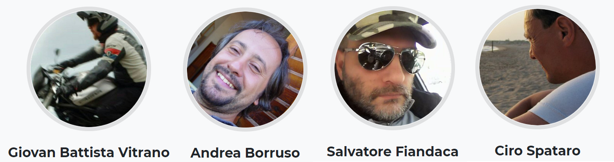

  

### Il presente repository è consultabile - con maggior facilità - [qui](http://bit.ly/hfcqgis): sito realizzato, in Read the Docs, dalla comunità [OpenDataSicilia](http://opendatasicilia.it/) di cui faccio parte e ringrazio.

## Licenze

Se non specificato diversamente, tutti i contenuti sono soggetti alla licenza: [Creative Commons Attribution-ShareAlike 4.0 licence (CC BY-SA)](https://creativecommons.org/licenses/by-sa/4.0/) - per maggiori info, fare riferimento alla [Licenza](./docs/LICENSE_my.md) presente nella sezione **About**.

## Donate

💶 [HfcQGIS](https://www.paypal.me/pigrecoinfinito) 💶 💳

## ©️ Autore `HfcQGIS`

* [Salvatore Fiandaca](https://twitter.com/totofiandaca?lang=it) (aka _Totò_)

## HfcQGIS Vesione 2.0 [realizzata con Material for MkDocs](https://squidfunk.github.io/mkdocs-material/)
La versione in formato [Read the Docs](https://readthedocs.org/) del lavoro di Salvatore FIANDACA, è stata realizzata dalla comunità [OpenDataSicilia](https://hfcqgis-md.readthedocs.io/), in particolare da: [Andrea Borruso](https://twitter.com/aborruso), [Totò Fiandaca](https://twitter.com/totofiandaca) e [Giovan Battista Vitrano](https://twitter.com/gbvitrano).

---

## [gh-pages](https://opendatasicilia.github.io/HfcQGIS-md/): [opendatasicilia.github.io/HfcQGIS-md](https://opendatasicilia.github.io/HfcQGIS-md/)
