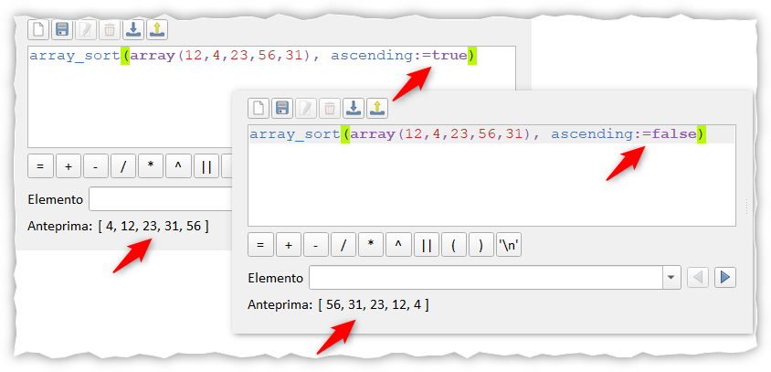

# Array nel field calc

## Introduzione

Il gruppo **Array** è stato introdotto in QGIS nella [prima versione di QGIS 3.0 Girona](https://changelog.qgis.org/en/qgis/version/3.0.0/#category-50) nel lontano 2018, nella descrizione leggiamo:

!!! Abstract "GRUPPO ARRAY"
    **Nuovo gruppo che contiene funzioni di espressione per la creazione e la manipolazione di array (noti anche come strutture di dati di elenco). L'ordine dei valori all'interno dell'array è importante, contrariamente alla struttura dei dati "mappa", dove l'ordine delle coppie chiave-valore è irrilevante e i valori sono identificati dalle rispettive chiavi.**

<!-- more -->

<!-- TOC -->

- [Array nel field calc](#array-nel-field-calc)
  - [Introduzione](#introduzione)
  - [Cosa sono gli Array](#cosa-sono-gli-array)
  - [Caratteristiche degli Array in QGIS](#caratteristiche-degli-array-in-qgis)
  - [Tabella degli attributi](#tabella-degli-attributi)
  - [Gruppo Array nel Field Calc](#gruppo-array-nel-field-calc)
  - [Esempi](#esempi)
    - [crea un array](#crea-un-array)
    - [creare array con tre valori di testo](#creare-array-con-tre-valori-di-testo)
    - [Calcolare il valore max](#calcolare-il-valore-max)
    - [Ordinare l'array dell'esempio precendete](#ordinare-larray-dellesempio-precendete)
    - [Supponiamo di avere un vettore](#supponiamo-di-avere-un-vettore)
    - [Creare un array contenente una sequenza di numeri](#creare-un-array-contenente-una-sequenza-di-numeri)
    - [Lunghezza di un array](#lunghezza-di-un-array)
    - [aggiungerò altri esempi, tornate spesso per leggerli!!!](#aggiungerò-altri-esempi-tornate-spesso-per-leggerli)

<!-- /TOC -->

[](./img_01.png)

## Cosa sono gli Array

Un array (detto anche vettore o matrice) in informatica, indica una struttura dati complessa, statica/dinamica e omogenea.
Gli array, presenti praticamente in tutti i linguaggi di programmazione o di scripting, sono ispirati alla nozione matematica di vettore (quando monodimensionali) o di matrice (nel caso di array bidimensionali). 
L' array è in genere classificato come un _costruttore di tipo_: in altre parole, esso consente di definire nuovi tipi di dati a partire da tipi preesistenti, attraverso l'aggregazione di diversi oggetti tutti di uno stesso tipo.
Ciascun oggetto componente è individuato attraverso un indice intero, nel caso monodimensionale, o attraverso D indici interi nel caso D-dimensionale.
Noi vedremo solo il caso monodimensionale.

[](./img_02.png)

Si può immaginare un array come una sorta di contenitore, le cui caselle sono dette celle (o elementi) dell'array stesso. 
Ciascuna delle celle si comporta come una variabile tradizionale; tutte le celle sono variabili di uno stesso tipo preesistente, detto tipo base dell'array. 
Si parlerà perciò di tipi come "array di interi", "array di stringhe", "array di caratteri" e così via.

Ciascuna delle celle dell'array è identificata da un valore di indice. 
L'indice è generalmente numerico e i valori che gli indici possono assumere sono numeri interi contigui che partono da 0 o da 1 o, più raramente, da un valore arbitrario. 
La possibilità di accedere agli elementi attraverso un indice è la principale caratteristica di un array. È possibile accedere singolarmente ad una sua generica posizione ("accesso casuale", come per la memoria), oltre a scorrerlo sequenzialmente in entrambe le direzioni tramite un ciclo iterativo in tutti i suoi elementi o a partire da alcuni di essi.

[](./img_03.png)

[WikiPedia](https://it.wikipedia.org/wiki/Array)


## Caratteristiche degli Array in QGIS

* È un vettore unidimensionale;
* Si accede agli elementi tramite indice;
* Il primo elemento è 0 e l'ultimo è -1;
* l'indice viene indicato tra parentesi quadre [0] , [-2] (feature introdotta nella 3.6 Noosa);
* è possibile scorrere sequenzialmente utilizzando particolari funzioni e variabili;
* è possibile cambiare l'ordine interno degli elementi, modificarli, aggiungerli, eliminarli, splittarli ecc…;

## Tabella degli attributi

* La tabella degli attributi visualizza informazioni sugli oggetti di un layer selezionato;
* Ogni riga nella tabella rappresenta un oggetto (con geometria o meno) e ogni colonna contiene una particolare informazione sull’oggetto;
* Gli oggetti nella tabella possono essere cercati, selezionati, spostati o anche modificati;
* QGIS ti consente di caricare layers spaziali e non spaziali. Attualmente sono incluse tabelle supportate da OGR e a testo delimitato, nonché sorgenti PostgreSQL, MSSQL, SpatiaLite, DB2 e Oracle. 

Ogni tabella degli attributi può essere vista come un insieme di array, uno per ogni colonna; quindi array _data_, array _sigla_provincia_, array _totale_casi_

[](./img_04.png)

## Gruppo Array nel Field Calc

* Gli array sono stati introdotti in QGIS (nel field calc) a partire dalla versione 3 tramite un nuovo gruppo Array;
* Questo gruppo contiene funzioni per la creazione e la manipolazione di array; 
* L’ordine dei valori all’interno dell’array è importante, al contrario della struttura dati “a mappa” (gruppo Maps), in cui l’ordine delle coppie chiave-valore è irrilevante e i valori vengono identificati dalle loro chiavi (ne parlero in altro post);
* L'indice parte sempre da 0, il primo elemento ha indice 0, l'ultimo -1.

L'indice parte sempre da 0, il primo elemento ha indice 0, l'ultimo -1 (Stile Python).
Nella 3.6 Noosa, Nyall abilita l'uso delle parentesi quadre [], quindi:

- `array_first(array('a','b','c')) = array('a','b','c')[0]`
- `array_last(array('a','b','c')) = array('a','b','c')[-1]`

questo è utile per due motivi:
1. semplifica;
2. dentro le parentesi quadre possiamo mettere altre espressioni e/o variabili `(array(1,2,3,4,5,6)[array_length(array(1,2,3,4,5,6))/2])`


## Esempi

### crea un array

[array](../../../gr_funzioni/array/array_unico.md#array) con i valori numerici 1,2 e 3

```
array (1,2,3)
```

[](./es_01.png)


### creare array con tre valori di testo

Andrea, Gianni e Toto

```
array ('Andrea', 'Gianni', 'Totò')
```
[](./es_02.png)

Come estrarre un valore?

_**ricorda che l'indice degli array parte da 0**_

```
- array (1,2,3)[1] ---> 2
- array ('Andrea', 'Gianni', 'Totò')[-2] ---> 'Gianni'
- array (1,2,3)[-1] ---> 3
- array (1,2,3)[2] ---> 3
- array ('Andrea', 'Gianni', 'Totò')[0] ---> 'Andrea'
- array ('Andrea', 'Gianni', 'Totò')[1] ---> 'Gianni'
- array ('Andrea', 'Gianni', 'Totò')[2] ---> 'Totò'
- array ('Andrea', 'Gianni', 'Totò')[-1] ---> 'Totò'
```


### Calcolare il valore max

massimo, minimo e medio di questa serie di numeri: 12,4,23,56,31

```
- array_max (array(12,4,23,56,31)) ---> 56
- array_min (array(12,4,23,56,31)) ---> 4
- array_mean (array(12,4,23,56,31)) ---> 25.2
```
[](./es_03.png)


### Ordinare l'array dell'esempio precendete

```
- array_sort(array(12,4,23,56,31), ascending:=true) ---> [ 4, 12, 23, 31, 56 ]
- array_sort(array(12,4,23,56,31), ascending:=false) ---> [ 56, 31, 23, 12, 4 ]
```
[](./es_04.png)

### Supponiamo di avere un vettore

o una tabella attributi qualsiasi, sotto un esempio:

id | valori | descrizione
---|-------:|-----------
1  |   1234 | QGIS
2  |     25 | GDAL
3  |    234 | Mapshaper
4  |    123 | GRASS
5  |   1000 | SAGA
6  |      0 | VisiData
7  |    -50 | Miller

[qui file csv](./esempio01.csv)

[](./es_051.png)

Creare gli array usando le colonne `valore` e `descrizione`:

array `valori`

```
array_agg ("valori") 
```

array `descrizione`

```
array_agg ("descrizione") 
```

[](./es_052.png)


### Creare un array contenente una sequenza di numeri

```
generate_series(1,10,2)
```

[](./es_06.png)


### Lunghezza di un array

è possibile calcolare la lunghezza di un array, ovvero, quanti vaolori contiene:

```
- array_length(generate_series(1,100,3)) ---> 34
- array_length(array_agg ("descrizione")) ---> 7
```

### aggiungerò altri esempi, tornate spesso per leggerli!!!

