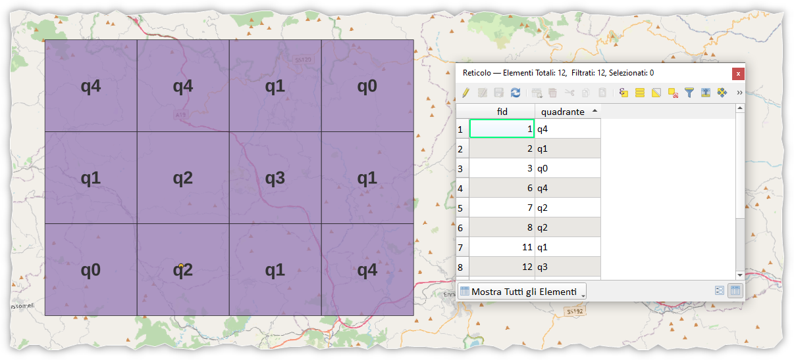
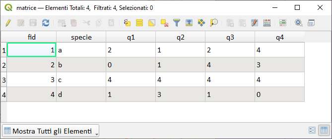
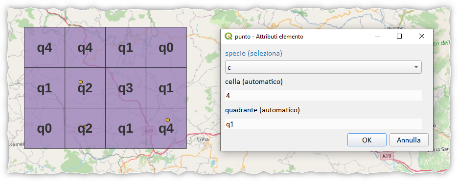
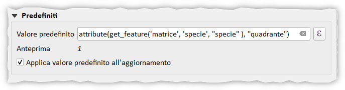
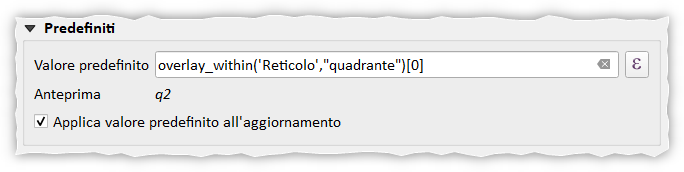
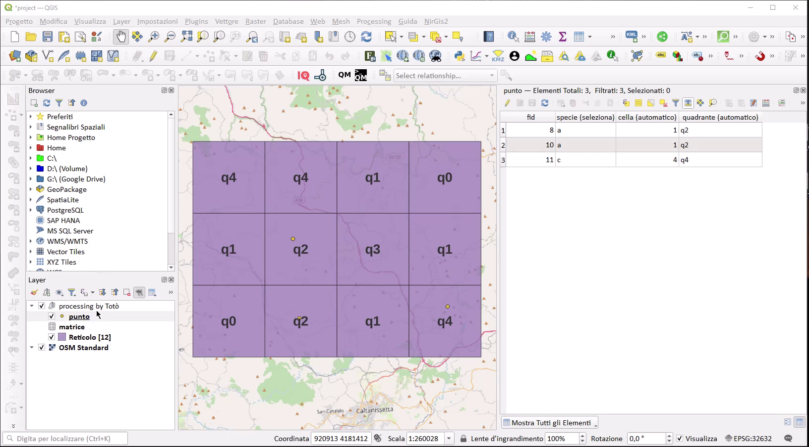

# Come cercare un valore in funzione di un altro

## Introduzione

Alcune volte nasce l'esigenza di cercare un valore in una tabella in funzione di un altro valore presente nella stessa tabella, un po' come fa la funzione `cerca verticale` di Excel, e utilizzarlo in un altro layer.

!!! Abstract "Funzione"
    **La funzione che permette di fare questa magia è la funzione [get_feature](../../../gr_funzioni/record_e_attributi/record_e_attributi_unico.md#get_feature)**

<!-- more -->

Per capire meglio come usare la funzione, facciamo un esempio pratico derivante da un caso congreto che mi è stato chiesto di risolvere qualche settimana fa, per ovvi motivi, generalizzero il problema.

Supponiamo di avere una griglia regolare:

[](./img_01.png)

nella tabella degli attributi il campo `quadrante` indica il nome del quadrato.

Un file `matrice.csv` rappresenta una matrice di valori che legano l'attributo `specie` con un valore per ogni `quadrante`.

[](./img_02.png)

Tracciando un punto all'interno del reticolo e selezionando la `specie`, popolare automaticamente l'attributo `cella` presente nello shapefile puntuale e l'attributo `quadrante`:

[](./img_03.png)

- per polopare automaticamente la `specie` è stata usata la seguente espressione nelle proprietà del layer, in particolare nel widget `Predefiniti`:

```
attribute(get_feature('matrice', 'specie', "specie" ), "quadrante")
```

[](./img_04.png)

- per popolare automaticamente il `quadrante` è stata utilizzata la seguente espressione nelle proprietà del layer puntuale, in particolarenel widget `Predefiniti`:

```
overlay_within('Reticolo',"quadrante")[0]
```

[](./img_05.png)

## Demo

[](./demo.gif)

## RIFERIMENTI

- [dati e progetto di esempio](./cerca_valore.zip)

