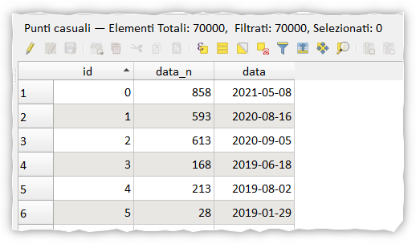

# Crea date da una successione numerica

## Introduzione

Data una data iniziale e una serie di numeri da 0 a 999, popolare un attributo _data_ che segue il seguente pattern:
a 0 corrisponde la data 01/01/2019, a 1 corrisponde la data 02/01/2019 e così via fino a 999, ovvero 26/09/2021.

!!! Abstract "make_date & make_interval"
    **Queste due funzioni permettono di risolvere il quesito esposto sopra, vediamo come**

<!-- more -->

In **QGIS** creo un layer puntuale con enne righe (maggiore di 999) e aggiungo un attributo `data_n` e lo popolo con la funzione `rand(0,999)`, ovvero genero dei numeri casuali da 0 a 999.

Successivamente creo l'attributo `data` di tipo `date` e la popolo con l'espressione:

```
make_date(2019,1,1) + make_interval( days:="data_n")
```
questa espressione genera le date per come richiesto.

Nel linguaggio umano:

- creo la data di partenza: `make_date(2019,1,1)`;
- per aggiunger un giorno basterebbe sommare `make_interval( days:=1)`
- nel mio caso i giorni da sommare si trovano nell'attributo `data_n`) `make_interval( days:="data_n")`

[](./img_01.png)

--- 

Quesito postomi da Giuseppe Maldera in Planetek
