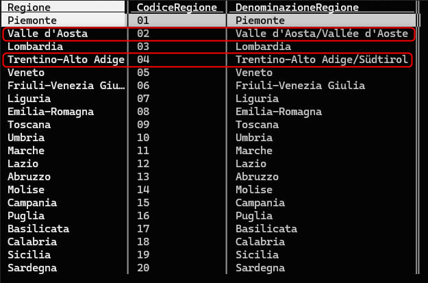
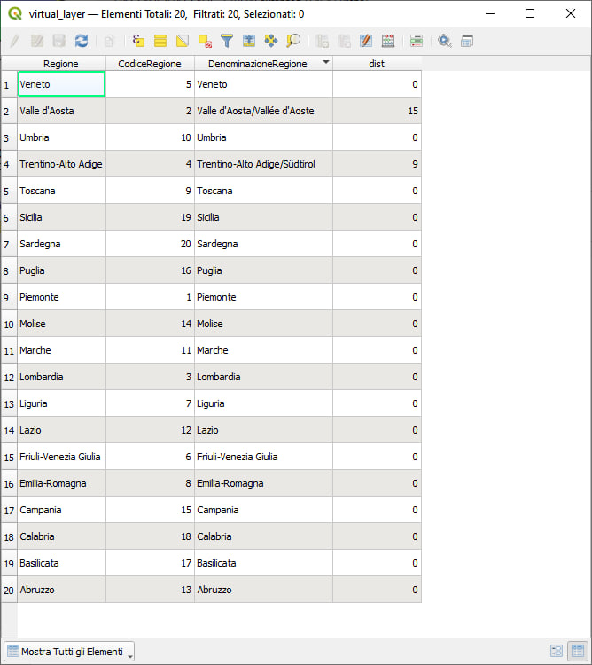
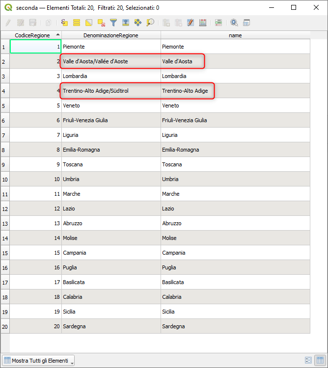

# Un uso intelligente della distanza di LEVENSHTEIN

## Introduzione

"Quando i maledetti "pubblicatori" di dati, scrivono i nomi delle Regioni errati e/o senza codici regionali, il valore minimo della distanza Levenshtein può essere una salvezza" (cit. [Andrea Borruso](https://twitter.com/aborruso))

!!! Abstract "LEVENSHTEIN"
    **Restituisce la distanza di Levenshtein tra due stringhe. Questa equivale al minimo numero di modifiche di carattere (inserimenti, cancellazioni o sostituzione) richieste per cambiare una stringa in un'altra. La distanza di Levenshtein è una misura della similarità tra due stringhe. Distanze più piccole corrispondono a stringhe più simili, e distanze più grandi corrispondono a stringhe più differenti. La distanza è sensibile alle lettere maiuscole.**

<!-- more -->

Ho due tabelle, di cui devo fare una join tabellare tramite nome regione d'Italia, ma _Valle d'Aosta_ e _Trentino_ sono scritte sbagliate e codici non ce ne è, allora calcolo la "distanza" tra le colonne delle due tabelle: per "Piemonte" e "Piemonte" è = 0, ma per Valle d'Aosta e Valle d'Aosta/Vallée d'Aoste c'è una certa distanza.

Faccio un join in cui misuro le distanze di tutte le combinazioni (prodotto cartesiano tra le due tabelle), e poi estraggo quella con il valore minimo per valore di regione distinto, e ottengo codici e nome corretto per la tabella di merda sbagliata.

[](./img_01.png)

```sql
WITH a AS (
  SELECT
    *,
    LEVENSHTEIN(t1.Regione, t2.DenominazioneRegione) distanza
  FROM
    prima t1
    JOIN seconda t2 ON LEVENSHTEIN(t1.Regione, t2.DenominazioneRegione) < 40
)
SELECT
  Regione,
  CodiceRegione,
  DenominazioneRegione,
  MIN(distanza) AS dist
FROM
  a
GROUP BY
  DenominazioneRegione
```
in output:

[](./img_2.jpg)


questa la tabella `prima`:

| Regione               |
| --------------------- |
| Abruzzo               |
| Basilicata            |
| Calabria              |
| Campania              |
| Emilia-Romagna        |
| Friuli-Venezia Giulia |
| Lazio                 |
| Liguria               |
| Lombardia             |
| Marche                |
| Molise                |
| Piemonte              |
| Puglia                |
| Sardegna              |
| Sicilia               |
| Toscana               |
| Trentino-Alto Adige   |
| Umbria                |
| Valle d'Aosta         |
| Veneto                |

questa la tabella `seconda`

| CodiceRegione | DenominazioneRegione         |
| ------------- | ---------------------------- |
| 01            | Piemonte                     |
| 02            | Valle d'Aosta/Vallée d'Aoste |
| 03            | Lombardia                    |
| 04            | Trentino-Alto Adige/Südtirol |
| 05            | Veneto                       |
| 06            | Friuli-Venezia Giulia        |
| 07            | Liguria                      |
| 08            | Emilia-Romagna               |
| 09            | Toscana                      |
| 10            | Umbria                       |
| 11            | Marche                       |
| 12            | Lazio                        |
| 13            | Abruzzo                      |
| 14            | Molise                       |
| 15            | Campania                     |
| 16            | Puglia                       |
| 17            | Basilicata                   |
| 18            | Calabria                     |
| 19            | Sicilia                      |
| 20            | Sardegna                     |

## Espressioni di QGIS

La prima cosa che ho dovuto risolvere è stato come creare il [prodotto cartesiamo](https://it.wikipedia.org/wiki/Join_(SQL)#Cross_join) tra due tabelle, in SQL è una cosa banale e veloce, ma il _field calc di QGIS_ non è nato per fare queste operazione.

Un modo per incociare i dati di due tabelle è quello di usare contemporaneamente le espresioni _ARRAY_ e _get_feature_by_id_, nel seguente modo:

```
array_foreach(
  array_agg("Regione"),
  LEVENSHTEIN(
    attribute(
      get_feature_by_id('seconda', @id), 
                        'DenominazioneRegione' ),
                        @element)
              )
```

questo mi restituisce, per ogni riga della tabella `prima`, un array di valori, questi valori sono le `distanze` di LEVENSHTEIN: `[ 8, 8, 8, 7, 12, 19, 7, 7, 9, 7, 6, 0, 7, 8, 7, 7, 15, 8, 10, 6 ]`, il valore `0` indica che le due stringhe sono identiche, altrimenti occorre calcolare il valore minimo della distanza, ovvero `array_min`.

Per ottenere il nome corrispondente al valore minimo della distanza occorre estrarre la posizione (attributo `pos`) dell'elemento dentro l'array:

```py
array_find(
    array_foreach(
      array_agg("Regione"),
      LEVENSHTEIN(
        attribute(get_feature_by_id('seconda', @id), 'DenominazioneRegione' ),@element)),
array_min(
    array_foreach(array_agg("Regione"),
      LEVENSHTEIN(
        attribute(get_feature_by_id('seconda', @id), 'DenominazioneRegione' ),@element))))
```

per fare la join tabellare e quindi aggiungere alla tabella `seconda` l'attributo `name`, occorre usare la seguente espressione:

```py
aggregate(
    layer:='prima',
    aggregate:='array_agg',
    expression:="Regione")[attribute(get_feature_by_id('prima',@id-1),'pos')]
```
[](./img_02.png)

## Conclusioni

Le espressioni di QGIS, per risolvere questo tipo di problema, non sono molto adatte a causa della struttura stessa del problema, infatti il motore delle espressioni fatica parecchio per restituire il risultato, ovvero impiega parecchio tempo nonostante le tabelle abbiamo solo 20 righe; questo è un tipico problema facilmente risolvibile con query SQL.

## Ringraziamenti

[Andrea Borruso](https://twitter.com/aborruso), per l'idea!
