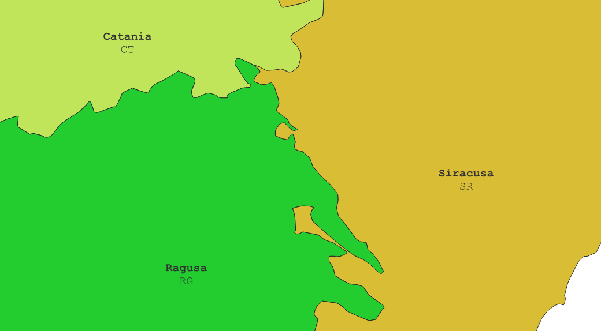
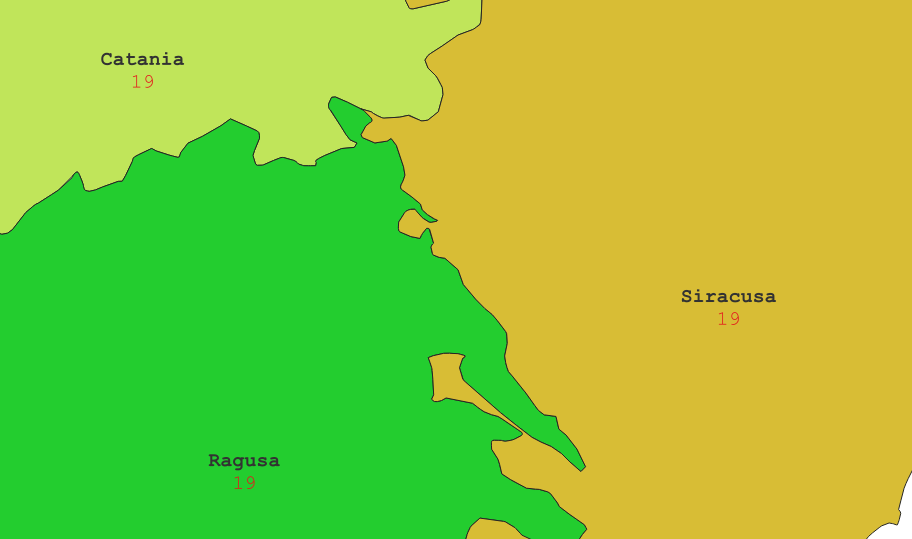
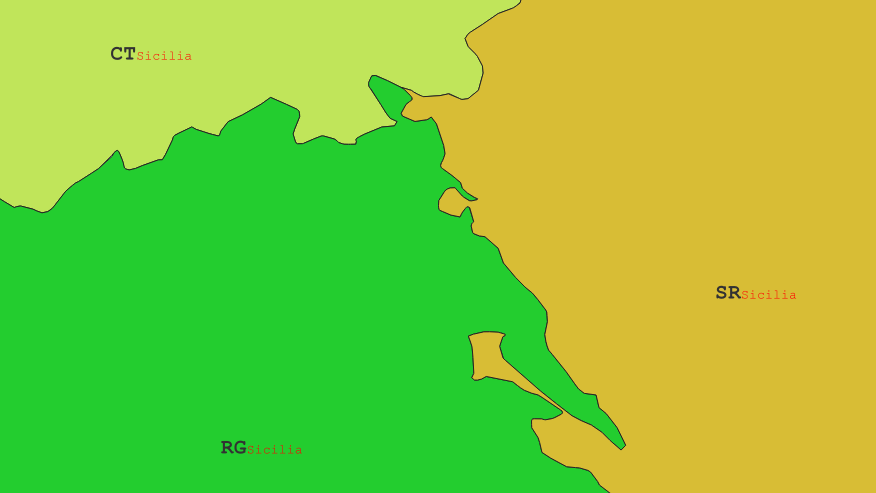
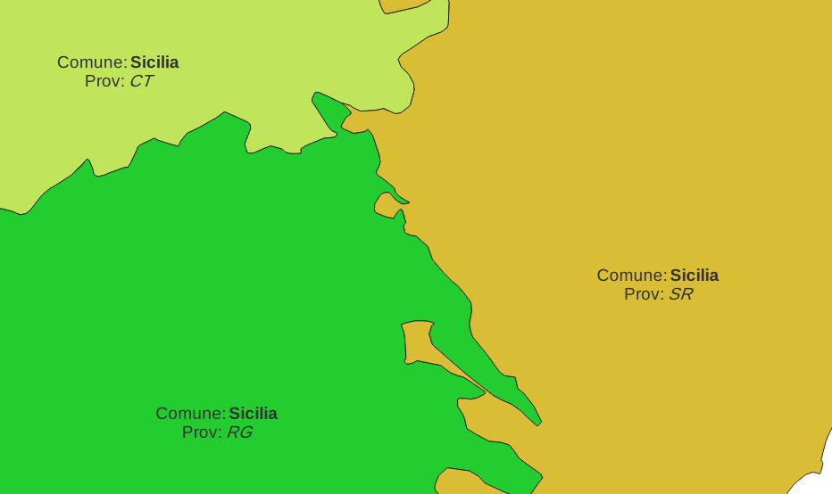
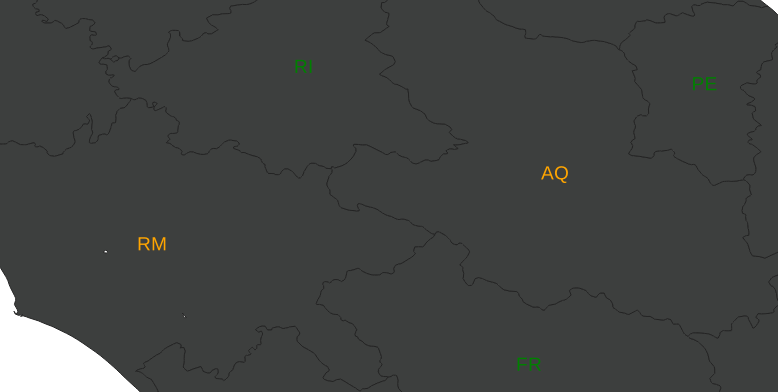
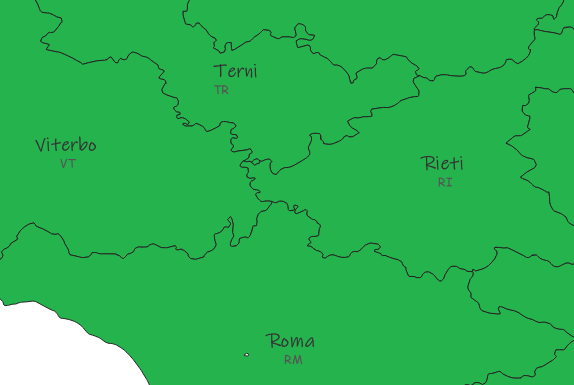
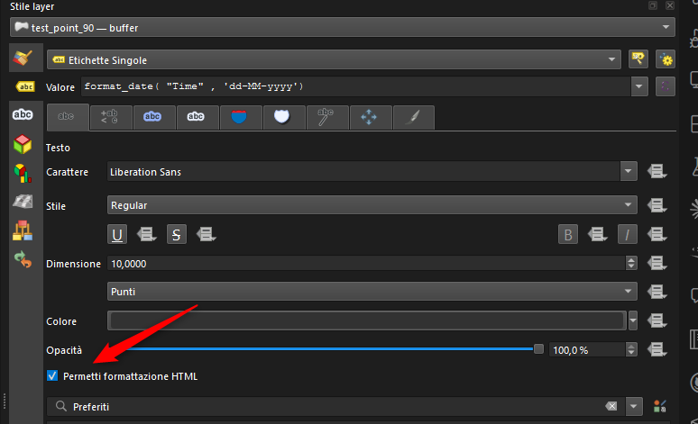

# Etichette miste con tag HTML in QGIS

## Introduzione

A partire da **QGIS 3.28 Firenze**, grazie al finanziamento del gruppo degli utenti svizzeri e all'implementazione di Nyall Dawson (North Road), è possibile creare **etichette miste** direttamente tramite espressioni usando tag HTML e CSS inline.

Questo apre nuove possibilità: cambiare carattere, stile, colore e dimensione del testo all'interno della stessa etichetta, senza dover ricorrere a layer multipli o soluzioni alternative.

!!! Abstract "Etichette miste con tag HTML"
    **Usando i tag HTML nelle espressioni del field calculator o nelle etichette di QGIS è possibile mescolare stili diversi in una singola etichetta.**

<!-- more -->

## Il problema precedente

Prima di QGIS 3.28, le etichette create tramite espressioni che combinavano più campi venivano visualizzate con una formattazione uniforme: era impossibile dare uno stile diverso a parti diverse dello stesso testo senza ricorrere a layer multipli o workaround complessi.

## Tag HTML supportati

Ecco i tag HTML utilizzabili nelle etichette di QGIS:

| Tag | Descrizione | Esempio |
|-----|-------------|---------|
| `<b>…</b>` | **Grassetto** | `'<b>testo</b>'` |
| `<i>…</i>` | *Corsivo* | `'<i>testo</i>'` |
| `<u>…</u>` | Sottolineato | `'<u>testo</u>'` |
| `<s>…</s>` | Barrato | `'<s>testo</s>'` |
| `<p>` | Nuova riga (accapo) | `'riga1<p>riga2'` |
| `<br>` | Interruzione di riga | `'riga1<br>riga2'` |
| `<span style="…">…</span>` | Stile personalizzato | vedi sotto |

## Attributi CSS con `<span>`

Il tag `<span>` è il più versatile: consente di applicare stili CSS inline al testo. Si possono combinare più proprietà separandole con `;`.

**Proprietà CSS utilizzabili:**

| Proprietà | Descrizione | Esempio |
|-----------|-------------|---------|
| `color` | Colore del testo | `color: #e31a1c` oppure `color: red` |
| `font-size` | Dimensione del testo | `font-size: 14pt` |
| `font-family` | Tipo di carattere | `font-family: Comic Sans MS` |
| `font-weight` | Spessore carattere | `font-weight: bold` |
| `font-style` | Stile carattere | `font-style: italic` |
| `text-decoration` | Decorazione testo | `text-decoration: underline` / `line-through` / `overline` |
| `background-color` | Colore sfondo | `background-color: yellow` |

!!! tip "Combinare più proprietà"
    È possibile combinare più proprietà CSS nello stesso `<span>`:
    ```
    '<span style="font-size: 10pt; color: #e31a1c; font-weight: bold">testo</span>'
    ```

## Esempi pratici

### Esempio 1 — Nome province in grassetto + sigla della provincia

```
'<b>' || "den_uts" || '</b><p><span style="font-size: 15pt">' || "sigla" || '</span>'
```

Risultato:
1. Il nome della provincia in **grassetto** (dimensione principale)
2. Una nuova riga (`<p>`)
3. la sigla in corpo 10pt

[](./img_01.png)

### Esempio 2 — Nome provincia in grassetto + codice colorato

```
'<b>' ||  "den_uts"  || '</b><p><span style="font-size:15pt;color:#e31a1c">' || "COD_REG" || '</span>'
```

Questo produce un'etichetta con:

1. Il nome della provincia in **grassetto**
2. Un'interruzione di riga (`<p>`)
3. Il codice della regione in rosso (`#e31a1c`) e corpo 10pt

[](./img_02.png)

### Esempio 3 — Titolo grande + dettaglio piccolo

```
'<span style="font-size:16pt;font-weight:bold">' ||   "sigla"   || '</span>' ||
'<br><span style="font-size:10pt;color:red">' ||  "den_reg"  || '</span>'
```

[](./img_03.png)

### Esempio 4 — Testo misto grassetto e corsivo

```
'Comune: <b>' ||  "den_reg"  || '</b><p>Prov: <i>' || "SIGLA" || '</i>'
```

[](./img_04.png)

### Esempio 5 — Colori diversi per valori diversi

```
CASE
  WHEN  "shape_area"/10e7  > 100 THEN '<span style="color:red;font-weight:bold">' ||  "sigla"  || '</span>'
  WHEN "shape_area"/10e7 > 50  THEN '<span style="color:orange">' || "sigla" || '</span>'
  ELSE '<span style="color:green">' || "sigla" || '</span>'
END
```

[](./img_05.png)

### Esempio 6 — Font diversi per parti dell'etichetta

```
'<span style="font-family: INK FREE; font-weight: bold">' ||  "den_uts"  || '</span>' ||
'<p><span style="font-family: Comic Sans MS; font-size: 9pt; color: #555555">' ||  "sigla"  || '</span>'
```

[](./img_06.png)

## Come abilitare le etichette HTML in QGIS

Per usare i tag HTML nelle etichette è necessario:

1. Aprire le **Proprietà del layer** → scheda **Etichette**
2. Nella sezione **Testo**, abilitare l'opzione **"Abilita la formattazione HTML"** (_Allow HTML formatting_)
3. Inserire l'espressione con i tag HTML nel campo del testo dell'etichetta



!!! Warning "Attenzione"
    L'opzione **"Abilita la formattazione HTML"** deve essere attiva, altrimenti i tag vengono visualizzati come testo letterale nell'etichetta.

!!! Note "Compatibilità con etichette curve"
    La formattazione HTML funziona anche con le etichette lungo linee curve, ampliando ulteriormente le possibilità cartografiche senza dover ricorrere a posizionamenti manuali.

## Riferimenti

- [Blog post di North Road — Mixed Format Labels in QGIS](https://north-road.com/2022/09/09/mixed-format-labels-in-qgis-coming-soon/)
- Funzionalità disponibile da **QGIS 3.28 Firenze**

