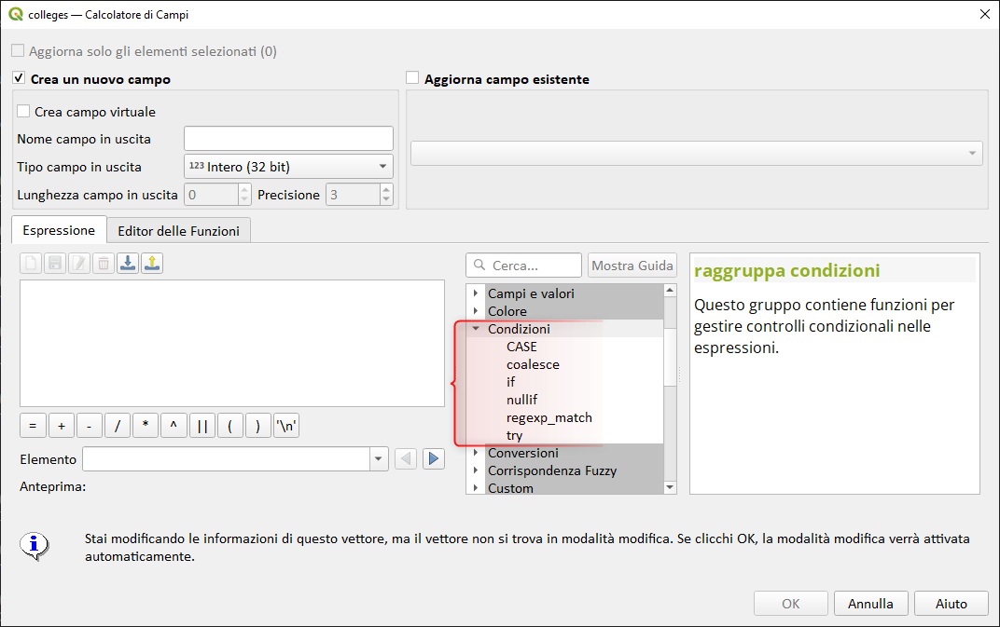
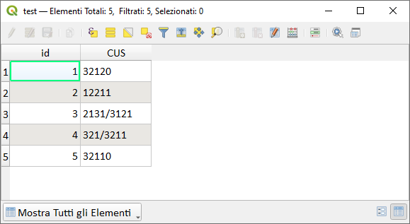

# Le condizioni in QGIS

## Introduzione

Il motore di espressioni di QGIS ha a disposizione anche funzioni per gestire controlli condizionali nelle espressioni, il relativo gruppo funzioni si chiama _**Condizioni**_ e troviamo: if, CASE, coalesce, nullif, try e regex_match.

!!! Abstract "Funzione"
    **Questo gruppo contiene funzioni per gestire controlli condizionali nelle espressioni**

<!-- more -->


[](./img_01.png)

I controlli condizionali sono importanti in qualsiasi linguagio di programmazione, permettono di pilotare l'esito di un processo o di una espressione.

In questi giorni avevo la necessità di individuare, in un attributo CUS (string) di una tabella, quali fossero convertibili in numeri e quali no, sotto un esempio:

| id  | CUS       |
| --: | --------- |
| 1   | 32120     |
| 2   | 12211     |
| 3   | 2131/3121 |
| 4   | 321/3211  |
| 5   | 32110     |

[](./img_02.png)

è abbastanza ovvio che 2131/3121 non sia conveertibile in numero, mentre 32120 sì.

Per popolare un'altro attributo CUSN (numerico) solo per le righe che contengono numeri basterebbe utilizzare la seguente espressione:

```
try (to_int("CUS"),NULL)
```
queste restituira il valore numerico per le righe 1,2,e,5; mentre _NULL_ per le righe 3 e 4.


