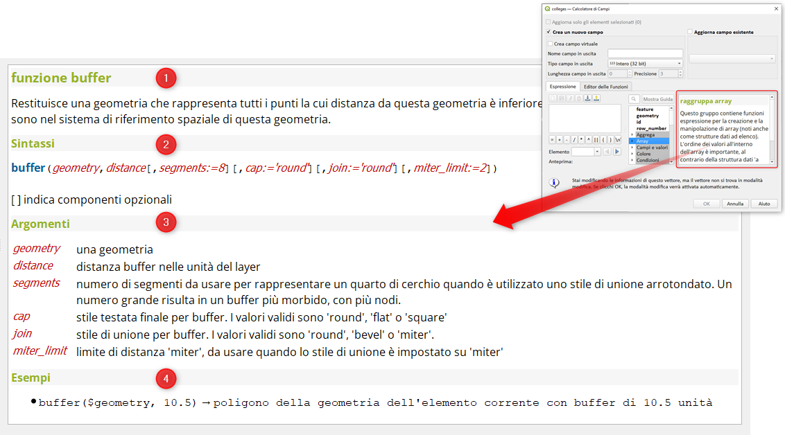

# Help in linea

## Introduzione

L'help in linea del motore di espressioni di QGIS è utile e va consultato sempre. In questo post vediamo alcuni aspetti importanti.

!!! Abstract "Help in linea Field Calc"
    **L'help in linea del Field calc è indispensabile per un uso corretto delle espressioni, contiene la definizione della funzione/espressione, la sintassi, spiegazione degli argomenti ed esempi**

<!-- more -->

[](./img_01.png)

## Struttura

Come è ben visibile dallo screenshot, l' help in linea è caratterizzato da quattro parti fondamentali:

1. definizione della funzione:
    1. la definizione è indispensabile perché fa capire cosa fa e cosa non fa la funzione in oggetto;
    2. alcune volte ha, nel testo, dei rimandi che spiegano ulteriormente l'uso della funzione;

2. sintassi: 
    1. spiega come usare la funzione stessa tramite gli argomenti il cui ordine è findamentale;
    2. i parametri denominati permettono di alterare l'ordine degli argomenti e rendere più leggibile le espressioni;
    3. indica gli argometi obligatori e quelli opzionali;
   
3. argomenti:
    1. alcune funzioni non hanno argomenti, come per esempio quelle funzioni geometriche che iniziono per $;
    2. altre funzioni hanno molti argomenti, ma non tutti sono obligatori;
   
4. esempi:
    1. ci sono esempi che spiegano come va usata la funzione;
    2. spesso ci sono più di un esempio in cui vengono usate i vari argomenti.

Alcune funzioni (per esempio `length`) possono avere più definizioni, più sintassi, più argomenti ed esempi, ovvero possono avere delle varianti.

### Definizione

Consultare la definizione è di vitale importanza perché fa capire la differenza tra la funzione `$area` e `area`, tra `$length` e `length` e tra `$perimeter` e `perimeter`: la differenza è sostanziale e non conoscerla porterebbe a grossi e grossolani errori.

### Sintassi

In generale la sintassi è qualcosa che occorre conoscere per poter usare la funzione stessa, in pratica è la successione di argomenti da utilizzare e definisce quali sono obligatori e quali no.

La sintassi deve essere seguita alla lettera altrimenti la funzione restituirà sempre errore.

esempio:

- aggregate(*<span style="color:red;">layer</span>, <span style="color:red;">aggregate</span>,<span style="color:red;">expression</span>[,<span style="color:red;">filter</span>][, <span style="color:red;">concatenator=''</span>][,_<span style="color:red;">order_by</span>_*)

ha sei argomenti, i primi tre obbligatori, gli altri sono tra parentesi quadre, quindi sono opzionali.

i primi tre argomenti vanno scritti per come li leggiamo: prima va scritto il `layer`, poi l'`aggregate` ed infini l'`expression`, sotto un esempio:

- aggregate ('nomeLayer','count',"nomeAttributo")

È anche possibile utilizzare i `paramentri denominati`, questi hanno due vantaggi: rendono più leggibile l'espressione e permettono di non seguire rigorosamente l'ordine degli argomenti, sotto un esempio:

- aggregate (layer:='nomeLayer',aggregate:='count',expression:="nomeAttributo")

oppure, funzionerebbe modificando l'ordine degli argomenti:

- aggregate (aggregate:='count', layer:='nomeLayer',expression:="nomeAttributo")

oppure è possibile andare a capo:

```
aggregate (
  aggregate:='count',
  layer:='nomeLayer',
  expression:="nomeAttributo")
```
la nota importante è che occorre scrive il parametro denominato seguito da `:=`.

### Argomenti

Gli argomenti possono essere testo, numeri, nomi di layer, funzioni statistiche (count, min, max, ecc...), espressioni, variabili; gli argomenti possono fare da filtro, da raggruppamento o per ordinare.

Nell'help ogni argomento è ben descritto ed è suggerito di consultarlo.

### Esempi

In fondo, alla guida in linea, di ogni funzione è presente almeno un esempio, spesso più esempi che rendono ancora più chiaro l'utilizzo della funzione stessa.

### HfcQGIS

In questo stesso sito trovate ulteriore materiale utile legato al Field Calc: <https://hfcqgis.opendatasicilia.it/calcolatore_campi/field_calc/>
