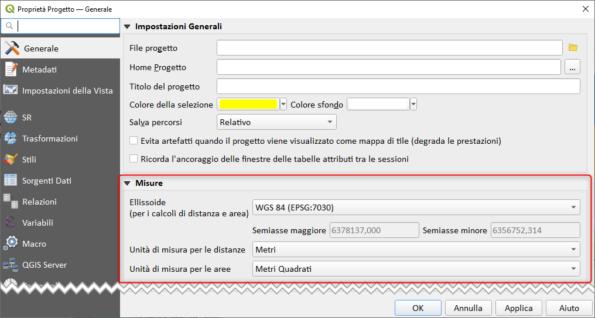
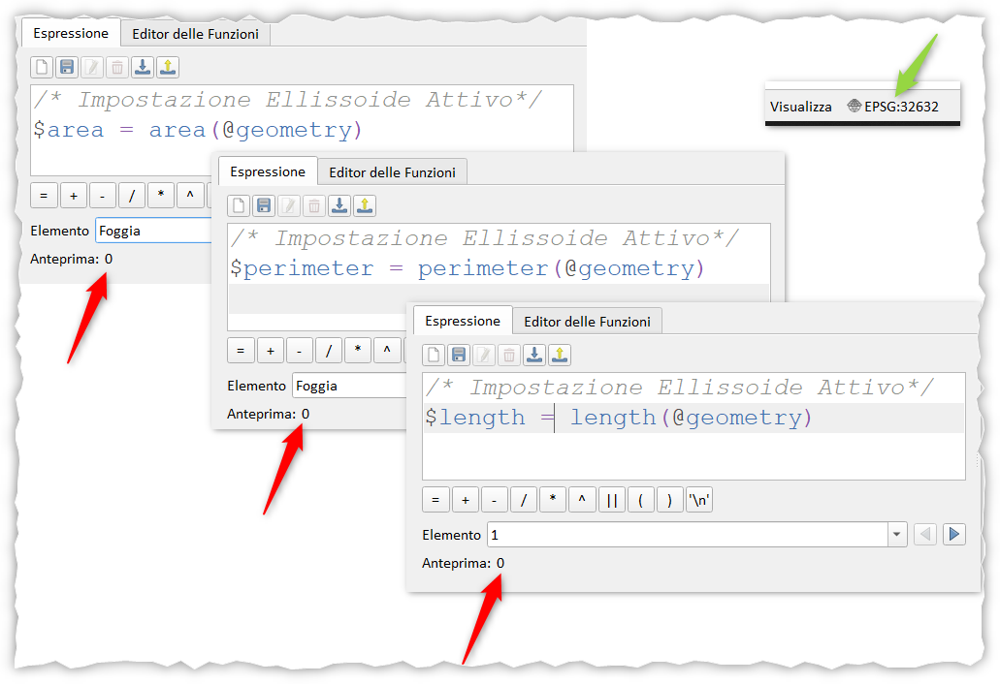
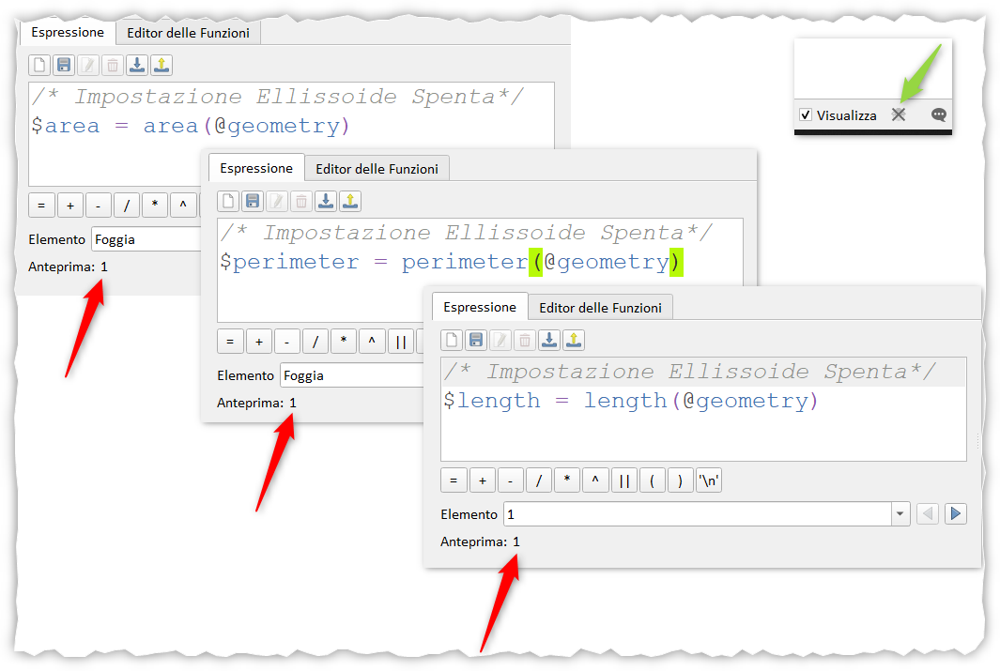

# Impostazioni di progetto influenzano alcune funzioni

## Introduzione

Alcune funzioni di **QGIS** dipendono dalle impostazioni di progetto, questo significa che le stesse funzioni in progetti diversi possono restituire valori diversi. In questo post vedremo le principali funzioni di **QGIS** da attenzionare.

!!! Abstract "esempio"
    **$area _<>_ area(@geometry)**

<!-- more -->

## Impostazioni dell'ellissoide di progetto

In realtà la schermata di sotto è raggiungibile dal menu _Progetto_ | _Proprietà_... (Ctrl + Shift + P) sezione _Generale_ | _Misure_

qui è possibile settare l'_Ellissoide_, le unità di misura per le distanze e per le aree.

Se l'_Ellissoide_ è attivo, i calcoli saranno fatti secondo la selezione, se invece è spento o c'è scritto `None / Planimetric`, tutte le funzioni che dipendevano da questa impostazione restituiranno un risultato compatibile alla scelta e quindi misure `planimetriche`: in questo caso $area _=_ area(@geometry).

## Lista funzioni

sotto una breve lista di funzioni che dipendono dalle impostazioni dell'ellissoide di progetto:

- [$area](../../../gr_funzioni/geometria/geometria_unico.md#area)
- [$perimeter](../../../gr_funzioni/geometria/geometria_unico.md#perimeter)
- [$length](../../../gr_funzioni/geometria/geometria_unico.md#length)

## Esempi

Impostazioni dell'Ellissoide di Progetto attivo:

- $area _<>_ area(@geometry)
- $perimeter _<>_ perimeter(@geometry)
- $length _<>_ length(@geometry)

Impostazioni dell'Ellissoide di Progetto spento:

- $area _=_ area(@geometry)
- $perimeter _=_ perimeter(@geometry)
- $length _=_ length(@geometry)

**NOTA BENE**: Anche le _**Unità di misura**_ influenzano il risultato, quindi occhio a come sono impostate: perché se fossero impostare in _chilomentri_ e _chilometri quadrati_, le relative funzioni restituirebbero valori con queste unità!.

## RIFERIMENTI

- [QGIS](https://www.qgis.org/it/site/)
- [DOCS QGIS](https://www.qgis.org/it/docs/index.html)
