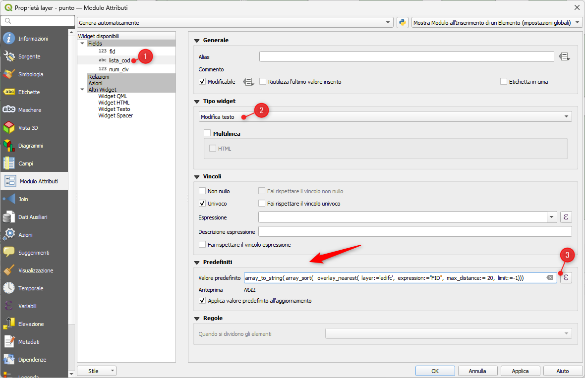
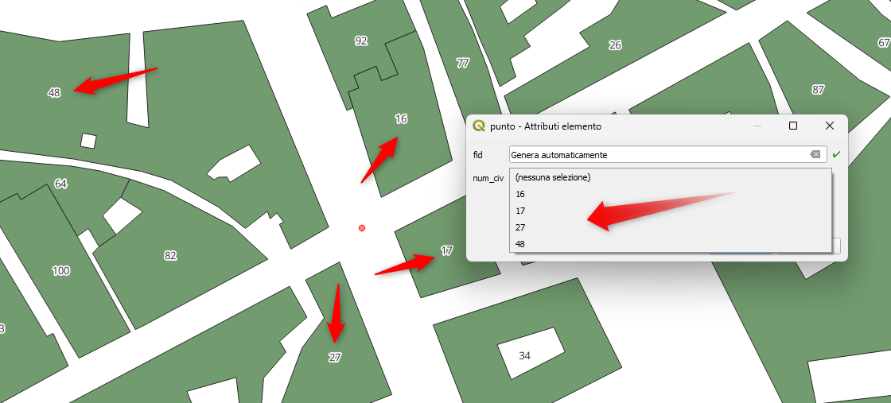
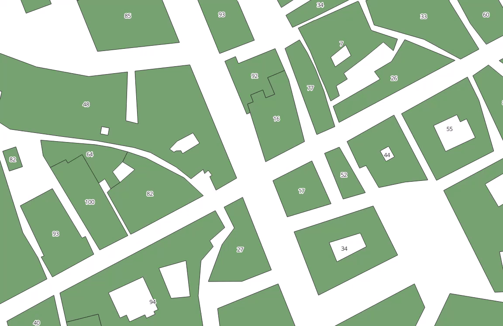

# Mappa valori generata al volo

## Introduzione

Come generare, in un form, un menu a tendina popolato con valori recuperati, al volo, da altro layer.

!!! Abstract "current_value"
    **all'interno di un form restituisce il valore corrente non salvato di un campo nel modulo o nella riga della tabella attualmente in fase di modifica. Questo differirà dai valori effettivo dell'attributo dell'elemento per gli elementi che sono attualmente in fase di modifica o che non sono ancora state aggiunte ad un layer.**

<!-- more -->

Due layer, uno poligonale con degli edifici e uno puntuale (che traccio al momento), come realizzare, in un form legato al punto, un menu a tendina che proponga i valori del campo "num_civ" degli edifici entro 20 metri dal punto.

## Soluzione

Le espressioni di QGIS ci danno una grossa mano.

- genero la lista dei FID degli edifici entro 20 metri dal punto:

```py
array_to_string( 
  array_sort( 
    overlay_nearest(
      layer:='edifc',
      expression:="FID",
      max_distance:= 20,
      limit:=-1))
    )
```
questa va usata nel widget _Predefiniti_ del Modulo Attributi nell'attributo _lista_cod_.

[](./img_01.png)

- aggiungo un FILTRO al widget _Relazione valore_ applicato all'attributo _num_civ_:

```py
 array_contains(
  string_to_array(current_value( 'lista_cod')),
  "FID" )
```
ed il gioco è fatto!!!

[](./img_03.png)

[](./img_04.gif)

[Download dati e progetto](./esempio.zip)
