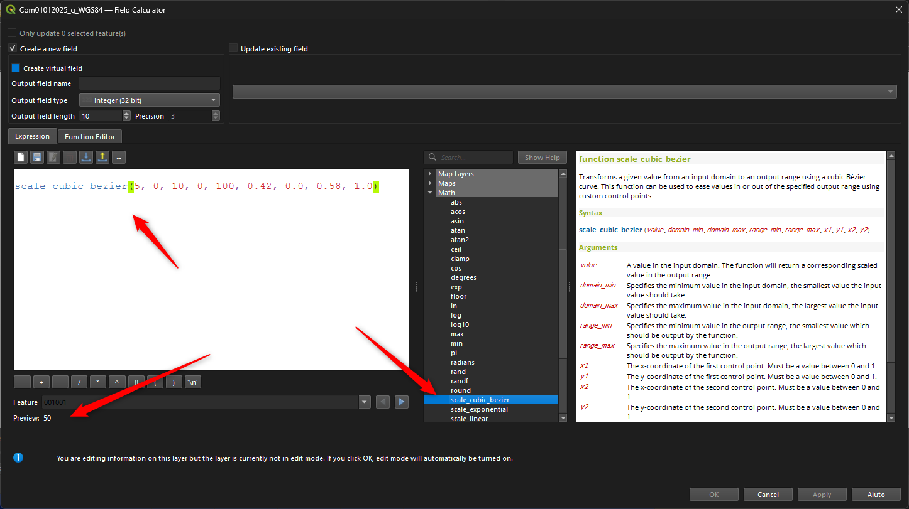
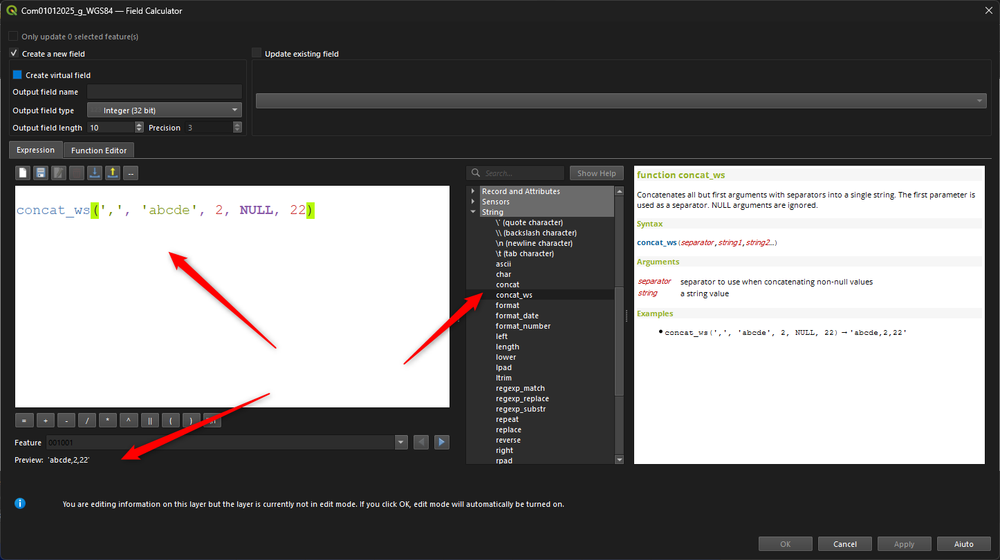

# QGIS 4.2: novità tra espressioni e tabella attributi

## Introduzione

[QGIS 4.2](https://changelog.qgis.org/en/qgis/version/4.2/) è una release con 59 nuove feature, distribuite su 17 categorie e realizzate da 24 sviluppatori diversi. Il grosso del lavoro si concentra su **3D** e **Symbology**, seguiti da correzioni notevoli e da novità su point cloud e processing:

| Categoria | Feature |
|---|--:|
| 3D Features | 12 |
| Symbology | 10 |
| Notable Fixes | 8 |
| Point Clouds | 6 |
| Processing | 5 |
| Print Layouts | 3 |
| Data Providers | 3 |
| Expressions | 2 |
| QGIS Server | 2 |
| Breaking Changes | 1 |
| User Interface | 1 |
| Data Management | 1 |
| Application and Project Options | 1 |
| Sensors | 1 |
| Profile Plots | 1 |
| Browser | 1 |
| Programmability | 1 |

Buona parte del lavoro porta la firma di Nyall Dawson (North Road), autore di quasi un terzo delle feature:

| # | Sviluppatore | Feature | Azienda |
|--:|---|--:|---|
| 1 | Nyall Dawson | 19 | North Road |
| 2 | Dominik Cindric | 9 | — |
| 3 | Jean Felder | 3 | Oslandia |
| 4 | Julien Cabieces | 3 | Oslandia |
| 5 | Martin Dobias | 3 | Lutra Consulting |
| 6 | Stefanos Natsis | 3 | Lutra Consulting |
| 7 | Mathieu Pellerin | 2 | OPENGIS.ch |

In questo panorama, le **espressioni** ricevono "solo" 2 nuove funzioni (categoria Expressions), ma sono entrambe di uso quotidiano nel Field Calc, e la **tabella attributi** guadagna una scorciatoia molto pratica verso la calcolatrice di campi (categoria Data Management). Sono proprio questi due ambiti il focus di questo post: vediamo nel dettaglio le novità, con particolare attenzione alle espressioni e alla tabella attributi.

!!! Abstract "In breve"
    **2 nuove funzioni**: `scale_cubic_bezier` (interpolazione con curva di Bézier cubica) e `concat_ws` (concatenazione con separatore). **Tabella attributi**: voce "Field Calculator" nel menu delle intestazioni di colonna. Inoltre alcuni fix rilevanti a `concat()`, all'operatore IN con `nodes()` e a crash della calcolatrice di campi.

<!-- more -->

## scale_cubic_bezier

Completa le funzioni `scale_linear` e `scale_exp` aggiungendo un metodo di interpolazione basato su curva di Bézier cubica (lo stesso usato per l'interpolazione "cubic-bezier" nella conversione degli stili MapBox). Trasforma un valore da un dominio in ingresso ad un intervallo in uscita, con la forma della curva determinata da due punti di controllo.

Sintassi:

```
scale_cubic_bezier(val, domain_min, domain_max, range_min, range_max, cp1x, cp1y, cp2x, cp2y)
```

- `val`: un valore nel dominio in ingresso;
- `domain_min` / `domain_max`: estremi del dominio in ingresso;
- `range_min` / `range_max`: estremi dell'intervallo in uscita;
- `cp1x, cp1y, cp2x, cp2y`: coordinate normalizzate (tra 0 e 1) dei due punti di controllo della curva, che ne determinano la forma.

Esempio:
```qgis
scale_cubic_bezier(5,0,10,0,100,0.25,0.1,0.25,1) → valore interpolato secondo la curva di Bézier definita dai punti di controllo
```

È utile ogni volta che `scale_linear` risulta troppo rigida e `scale_exp` non offre la forma di curva desiderata: ad esempio per regolare in modo fine dimensioni dei simboli, spessori o trasparenze in base a un attributo.

[](./scale_cubic_bezier.png)

## concat_ws

Concatena tutti gli argomenti tranne il primo, usando il primo argomento come separatore. Gli argomenti NULL vengono ignorati, quindi non producono un separatore doppio o vuoto: un vantaggio non da poco rispetto a comporre la stringa a mano con `concat` e controlli su NULL.

Sintassi:

```
concat_ws(separator, string1, string2, …)
```

Esempio:
```qgis
concat_ws('-', 'a', 'b', 'c') → 'a-b-c'
concat_ws(', ', 'Rossi', NULL, 'Mario') → 'Rossi, Mario'
```

Comoda nel Field Calc per costruire etichette o campi derivati (es. indirizzi, nominativi) a partire da più campi che possono essere parzialmente vuoti.

[](./concat_ws.png)

## Tabella attributi: Field Calculator dal menu delle intestazioni

Novità molto attesa: cliccando con il tasto destro sull'intestazione di una colonna nella tabella attributi compare ora la voce **"Field Calculator"**. Selezionandola si apre direttamente la calcolatrice di campi con l'opzione "Aggiorna campo esistente" già spuntata e il campo corrispondente già selezionato. La voce è disponibile solo sui campi modificabili.

Si tratta di una scorciatoia molto pratica: prima era necessario aprire la calcolatrice di campi dalla toolbar e selezionare manualmente campo e opzione di aggiornamento, ora bastano due clic direttamente dalla colonna che si vuole modificare.

[](./qgis_4_2_menu_tabella.gif)

## Correzioni rilevanti

Tra i fix di questa versione, alcuni riguardano direttamente espressioni e calcolatrice di campi:

- [`concat()`](../../../gr_funzioni/stringhe_di_testo/stringhe_di_testo_unico.md#concat) ora restituisce una stringa vuota invece di NULL quando tutti gli argomenti sono NULL ([#65808](https://github.com/qgis/QGIS/issues/65808), [PR #66618](https://github.com/qgis/QGIS/pull/66618))
- fix dell'operatore **IN** con `nodes()` ([#66313](https://github.com/qgis/QGIS/issues/66313), [PR #66485](https://github.com/qgis/QGIS/pull/66485))
- fix crash della calcolatrice di campi con l'operazione stringa \* float su campo di tipo stringa ([#66507](https://github.com/qgis/QGIS/issues/66507), [PR #66508](https://github.com/qgis/QGIS/pull/66508))
- fix crash della calcolatrice di campi calcolando un campo intero con `"id"=@row_number` in fase di salvataggio ([#66268](https://github.com/qgis/QGIS/issues/66268), [PR #66508](https://github.com/qgis/QGIS/pull/66508))

## Conclusioni

QGIS 4.2 è una versione mirata ma concreta per chi lavora ogni giorno con espressioni e tabella attributi: `scale_cubic_bezier` e `concat_ws` arricchiscono il Field Calc, mentre la voce "Field Calculator" nel menu delle intestazioni rende la calcolatrice di campi più veloce da raggiungere. A questo si aggiungono fix importanti che eliminano alcuni crash noti. Se vuoi un approfondimento con esempi sul campo, scrivimi o apri una discussione nella repo.

## Discussioni

Per commenti o domande: <https://github.com/opendatasicilia/HfcQGIS-md/discussions>

## Link utile

[Changelog QGIS 4.2](https://changelog.qgis.org/en/qgis/version/4.2/)
