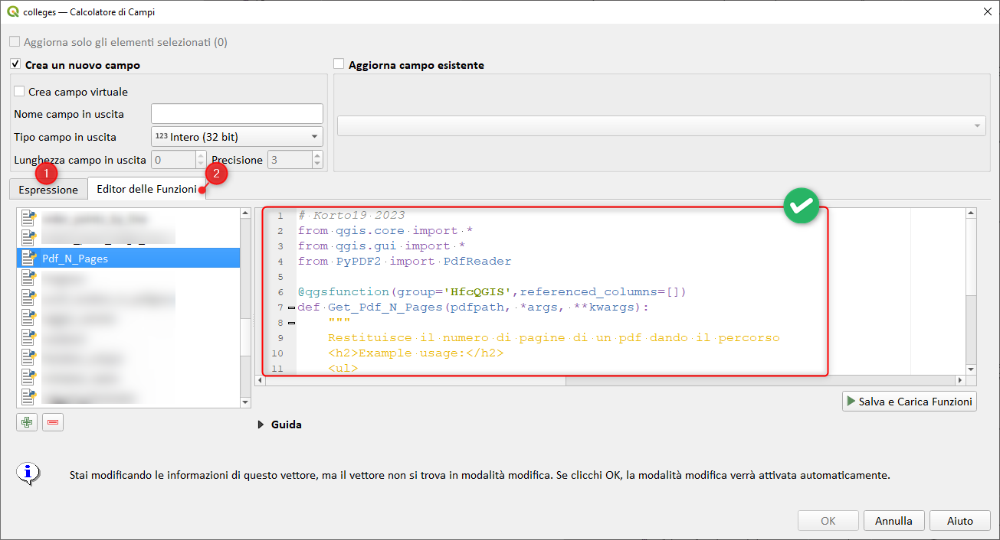
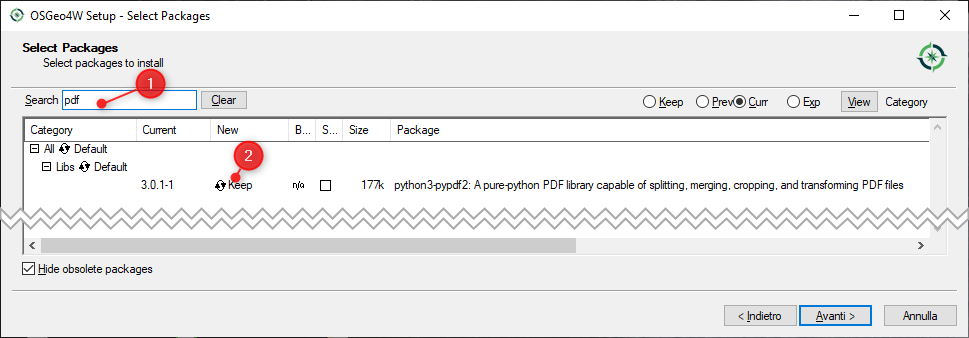
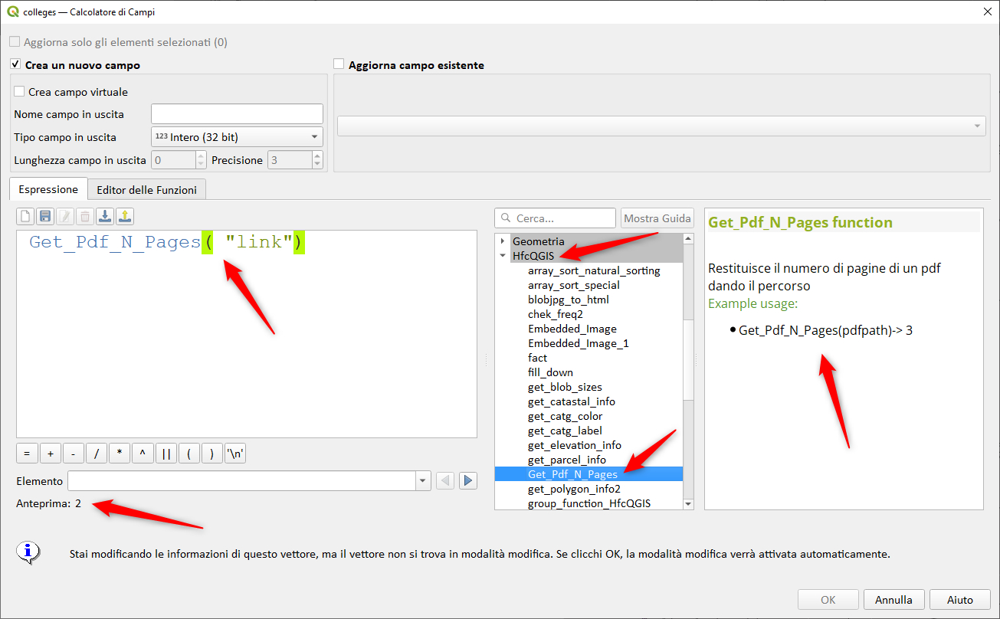
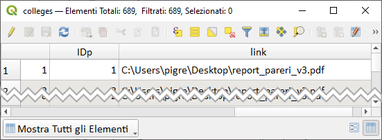
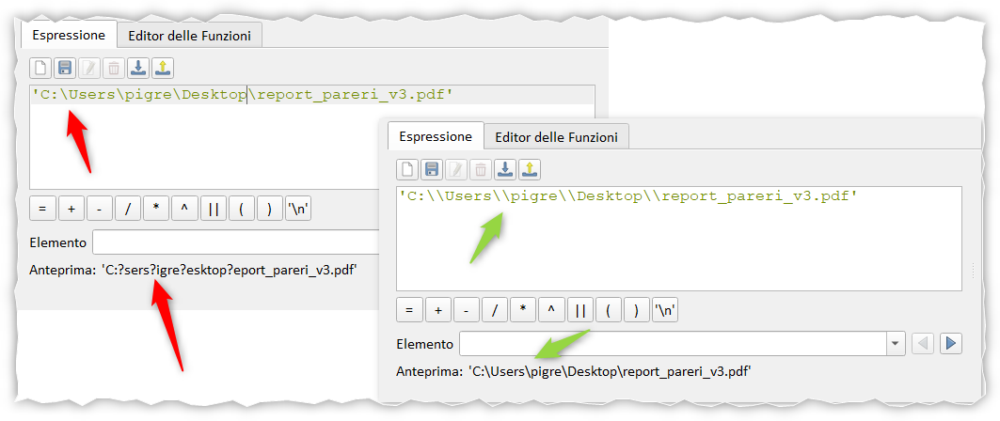

# Estrarre numero pagine da un PDF

## Introduzione

Un utente di **QGIS** mi contatta e mi chiede come estrarre il numero di pagine di un PDF usando le espressioni di QGIS.

!!! Abstract "Funzione personalizzata"
    **QGIS ha centinaia di espressioni, per quelle che mancano o per crearne di nuove è possibile aggiungere delle funzioni personalizzate usando PyQGIS**

<!-- more -->

[](./img_01.png)

## Installazione libreria

Con le librerie/moduli python è possibile fare quasi tutto, per il nostro scopo esiste una libreria dedicata che va installata perché non è tra le librerie standard usate in QGIS.

Per chi usasse l'installatore _**OSGeo4W Network installer**_, basta cercare `pdf` (1) comparirà la libreria e selezionarla (2):

[](./img_02.png)

## Funzione personalizzata

La funzione personalizzata è stata creata dall' amico (G. Fattori) che nel tempo linero soddisfa ogni mia richiesta (grazie mille).

```py
# Korto19 2023
from qgis.core import *
from qgis.gui import *
from PyPDF2 import PdfReader

@qgsfunction(group='HfcQGIS',referenced_columns=[])
def Get_Pdf_N_Pages(pdfpath, *args, **kwargs):
    """
    Restituisce il numero di pagine di un pdf dando il percorso
    <h2>Example usage:</h2>
    <ul>
      <li>Get_Pdf_N_Pages(pdfpath)-> 3</li>
    </ul>
    """

    reader = PdfReader(str(pdfpath))
    number_of_pages = len(reader.pages)

    return number_of_pages
```

per usare lo script:

1. salvarlo in *.py (oppure scaricalo da [qui](./Pdf_N_Pages.py));
2. spostare il file in `C:\Users\nomeUtente\AppData\Roaming\QGIS\QGIS3\profiles\default\python\expressions`
3. riavviare QGIS;
4. troverete la funzione nel field calc nel gruppo **HfcQGIS**, che verrà creato automaticamente dopo lo spostamente del file.

[](./img_03.png)

l'attributo `"link"` contiene i percorsi assoluti a dei PDF, sotto un esempio di tabella degli attributi:

[](./img_04.png)

**NB:** Quando popolate l'attributo `link`, sotto windows, occorre usare `\\` e non `\` altrimenti vi restituirà errore!!!

esempio:

[](./img_05.png)

## RIFERIMENTI

In questo stesso sito **#HfcQGIS** trovate decine di funzioni personalizzate nella sezione [Custom](https://hfcqgis.opendatasicilia.it/gr_funzioni/custom/custom_unico/)

Un **GROSSO** grazie a [Giulio Fattori](https://github.com/Korto19), un utente **QGIS** e autore di molti [plugin](https://plugins.qgis.org/search/?q=fattori) per **QGIS**

