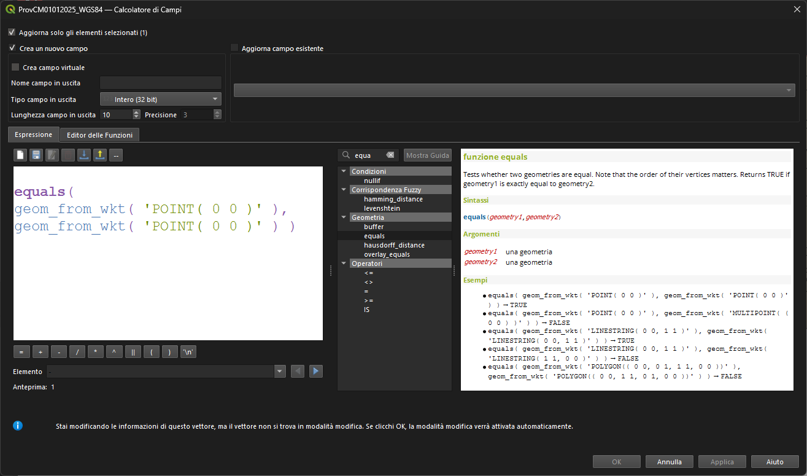

# QGIS 4.0: nuove funzioni del gruppo Espressioni

## Introduzione

Con QGIS 4.0 il gruppo **Espressioni** si arricchisce di nuove funzioni utili sia per la gestione di geometrie sia per la manipolazione di stringhe e tempi. In questo post le vediamo una per una, con un esempio rapido per capire subito quando usarle.

!!! Abstract "In breve"
    **15 nuove funzioni**: `equals`, 4 per i modelli magnetici, 3 per gradi/minuti/secondi, `unaccent`, `substr_count` e 5 funzioni legate ai fusi orari.

<!-- more -->

## `equals(geometry1, geometry2)`

Verifica l'uguaglianza tra due geometrie (coerente con `overlay_equals`). Utile quando serve un confronto rigoroso tra geometrie, ad esempio per controlli di qualità o deduplicazioni avanzate.

Esempio:
```qgis
equals($geometry, geometry(@parent))
```

[](./equals.png)

## Funzioni per modelli magnetici

Queste espressioni aiutano a calcolare la declinazione e l'inclinazione magnetica, e le rispettive variazioni annue. Sono ideali per layout cartografici o metadati che richiedono informazioni magnetiche aggiornate.

- `magnetic_declination`
- `magnetic_inclination`
- `magnetic_declination_rate_of_change`
- `magnetic_inclination_rate_of_change`

Esempio:
```qgis
magnetic_declination($x, $y, now())
```

[](./magnetic_models.png)

## `extract_degrees`, `extract_minutes`, `extract_seconds`

Tre funzioni per scomporre un valore in gradi decimali e formattare le annotazioni di griglia in modo fine. Perfette per layout con formati personalizzati.

Esempio:
```qgis
concat(
  extract_degrees($y), '° ',
  extract_minutes($y), "' ",
  round(extract_seconds($y), 2), '"'
)
```

[](./extract_dms.png)

## `unaccent`

Rimuove accenti e diacritici dalle stringhe (stile PostgreSQL `unaccent`). Utile per normalizzare testi e confrontare valori in modo robusto.

Esempio:
```qgis
unaccent("città")
```

[](./unaccent.png)

## `substr_count`

Conta quante volte una sottostringa compare in una stringa. Ottimo per controlli rapidi, pulizia testi o piccoli calcoli su stringhe.

Esempio:
```qgis
substr_count("A-B-C-D", "-")
```

[](./substr_count.png)

## Funzioni per i fusi orari

Nuove funzioni per creare e gestire timezone basate sugli ID IANA. Sono preziose quando si lavora con dati temporali multi-fuso o si vogliono normalizzare date e orari.

- `timezone_from_id`
- `timezone_id`
- `get_timezone`
- `convert_timezone`
- `set_timezone`

Esempio:
```qgis
convert_timezone(now(), timezone_from_id('Europe/Rome'))
```

[](./timezone.png)

## Conclusioni

Queste funzioni ampliano il gruppo Espressioni in modo concreto: geometrie, stringhe e tempi coprono tanti casi d'uso reali. Se vuoi un approfondimento con esempi sul campo, scrivimi o apri una discussione nella repo.

## Discussioni

Per commenti o domande: https://github.com/opendatasicilia/HfcQGIS-md/discussions

## Link utile

[Changelog QGIS 4.0](https://changelog.qgis.org/en/version/4.0/)
