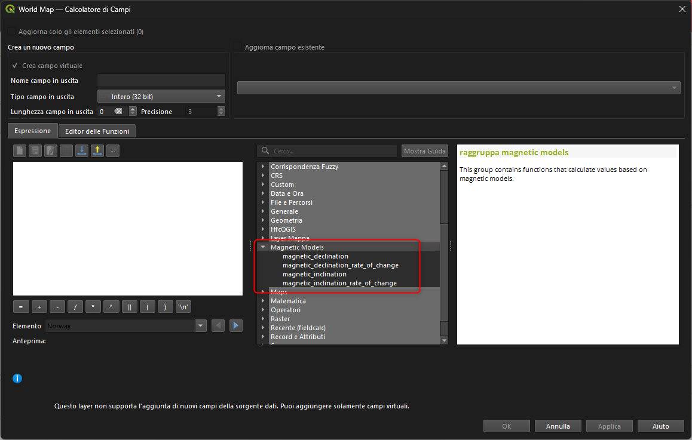

# QGIS 4.0: nuove funzioni nel Field Calc

## Introduzione

Con QGIS 4.0 il **Field Calc** si arricchisce di nuove funzioni utili sia per la gestione di geometrie sia per la manipolazione di stringhe e tempi. Migliora inoltre la **tabella attributi**, con il doppio clic per lo zoom rapido sulle feature e la possibilità di copiare i valori originali (raw) degli attributi. In questo post vediamo le novità una per una, con un esempio rapido per capire subito quando usarle.

!!! Abstract "In breve"
    **15 nuove funzioni**: nuovo predicato `equals`, 4 per i modelli magnetici, 3 per gradi/minuti/secondi, `unaccent`, `substr_count` e 5 funzioni legate ai fusi orari. **Tabella attributi**: doppio clic per zoom e copia valori raw.

<!-- more -->

## Predicato equals

Verifica l'uguaglianza tra due geometrie (coerente con `overlay_equals`). Utile quando serve un confronto rigoroso tra geometrie, ad esempio per controlli di qualità o deduplicazioni avanzate.

Esempio:
```qgis
equals($geometry1, geometry2)
```

## Funzioni per modelli magnetici

Queste espressioni aiutano a calcolare la declinazione e l'inclinazione magnetica, e le rispettive variazioni annue. Sono ideali per layout cartografici o metadati che richiedono informazioni magnetiche aggiornate. é stato aggiunto un nuovo gruppo nel Field Calc.

- `magnetic_declination`
- `magnetic_inclination`
- `magnetic_declination_rate_of_change`
- `magnetic_inclination_rate_of_change`

Esempio:
```qgis
magnetic_declination('wmm2025', make_datetime(2026,7,1,12,0,0), -35, 138, 0) → 7.873899
```

[](./magnetic_models.png)

[](./group_magnetic_models.png)

[NB:](https://github.com/qgis/QGIS/issues/65033#issuecomment-3940603146) I modelli non sono inclusi nel pacchetto QGIS: è necessario scaricarli manualmente (e quindi utilizzare il percorso completo del modello nella funzione di espressione o installarlo in C:/ProgramData/GeographicLib/magnetic).

## extract_*

`extract_degrees`, `extract_minutes`, `extract_seconds`

Tre funzioni per scomporre un valore in gradi decimali e formattare le annotazioni di griglia in modo fine. Perfette per layout con formati personalizzati.

Esempio:
```qgis
extract_minutes(145.75) --> 45
```

## unaccent

Rimuove accenti e diacritici dalle stringhe (stile PostgreSQL `unaccent`). Utile per normalizzare testi e confrontare valori in modo robusto.

Esempio:
```qgis
unaccent("città") --> citta
unaccent("Cefalù") --> Cefalu
```

## substr_count

Conta quante volte una sottostringa compare in una stringa. Ottimo per controlli rapidi, pulizia testi o piccoli calcoli su stringhe.

Esempio:
```qgis
substr_count("A-B-C-D", "-") --> 3
```

## Funzioni per i fusi orari

Nuove funzioni per creare e gestire timezone basate sugli ID IANA. Sono preziose quando si lavora con dati temporali multi-fuso o si vogliono normalizzare date e orari.

- `timezone_from_id`
- `timezone_id`
- `get_timezone`
- `convert_timezone`
- `set_timezone`

Esempio:
```qgis
convert_timezone(now(), timezone_from_id('Europe/Rome')) --> <datetime: 2026-02-21 21:14:56 (ora solare Europa occidentale)>
```

## Tabella attributi

### Doppio clic per zoom

Doppio clic su un elemento nella tabella attributi seleziona la feature e fa zoom ad essa.

[](./attribute_table_zoom.gif)

### Copia valori raw

Nuova opzione **"Copy Raw Cell Content"** nel menu contestuale per copiare i valori originali (non rappresentati) negli appunti. In precedenza venivano copiati solo i valori "rappresentati" (es. valori di chiavi esterne, formattazione locale).

[](./copy_raw_values.png)

## Conclusioni

QGIS 4.0 porta miglioramenti concreti su più fronti: le nuove espressioni coprono geometrie, modelli magnetici, stringhe e fusi orari, mentre la tabella attributi diventa più rapida da usare grazie allo zoom con doppio clic e alla copia dei valori raw. Se vuoi un approfondimento con esempi sul campo, scrivimi o apri una discussione nella repo.

## Discussioni

Per commenti o domande: <https://github.com/opendatasicilia/HfcQGIS-md/discussions>

## Link utile

[Changelog QGIS 4.0](https://changelog.qgis.org/en/version/4.0/)
