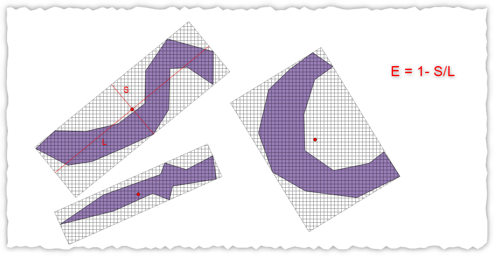
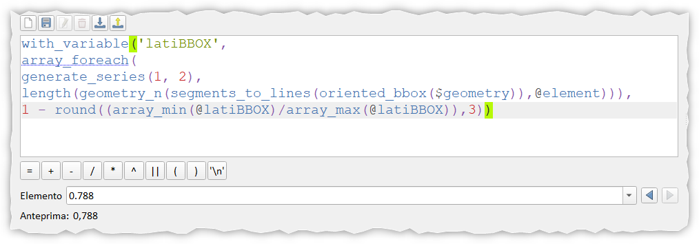

# Rapporto di allungamento

## Introduzione

Calcolare il rapporto di allungamento ([di Whitebox](https://jblindsay.github.io/ghrg/Whitebox/Help/ElongationRatio.html)) usando le espressioni di QGIS.

[](./img_01.png)

!!! Abstract "Elongation ratio"
    Il rapporto di allungamento (E) è:

    E = 1 - S / L

    Dove S è la lunghezza dell'asse corto e L è la lunghezza dell'asse lungo. Le lunghezze degli assi vengono determinate stimando il riquadro di delimitazione minimo.

<!-- more -->

Conoscendo l'espressione matematica con cui calcolare il rapporto di allungamento (E= 1-S/L) basta utilizzare le espressioni [oriented_bbox](https://hfcqgis.opendatasicilia.it/gr_funzioni/geometria/geometria_unico/#oriented_bbox) che crea il BBOX minimo orientato:

```
with_variable('latiBBOX',
    array_foreach(
      generate_series(1, 2),
        length(geometry_n(segments_to_lines(oriented_bbox($geometry)),@element))),
1 - round((array_min(@latiBBOX)/array_max(@latiBBOX)),3))
```

L'espressione di sopra descritta in termini umani:

Crea la variabile `latiBBOX` e mette dentro l'array con i due valori delle dimensioni del rettangolo minimo orientato che contiene la geometria, successivamente calcola la E (rapporto di allungamento), usando il valore minimo e massimo dei valori presenti nell'array.

[](./img_01.png)

## RIFERIMENTI

- Whitebox: <https://jblindsay.github.io/ghrg/Whitebox/Help/ElongationRatio.html>
- QGIS: <https://hfcqgis.opendatasicilia.it/gr_funzioni/geometria/geometria_unico/#oriented_bbox>
