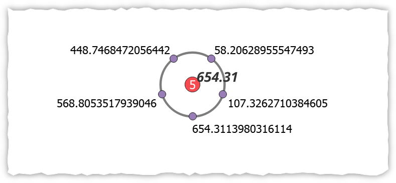
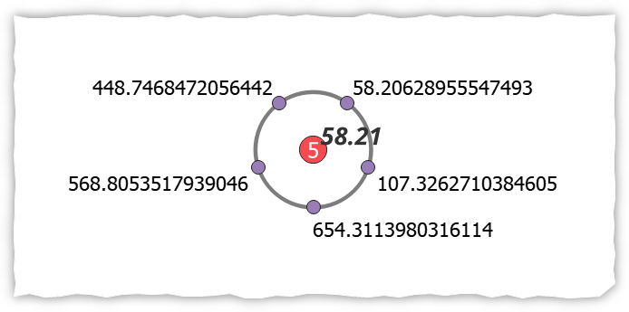
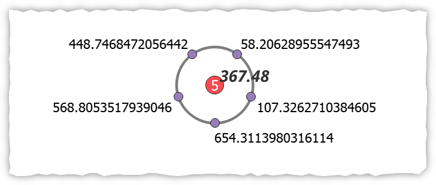

# Statistiche su punti sovrapposti

## Introduzione

Ho un file vettore di punti molti dei quali sono sovrapposti.
come creare una etichetta che mostri il valore massimo, minimo o medio di un campo, calcolandolo ovviamente solo per i punti sovrapposti.

!!! Abstract "Array_agg"
    **Restituisce un array di valori aggregati da un campo o espressione.**

<!-- more -->

## Espressione

l'espressione da usare è:

```
array_max(
        array_agg( 
            expression:= "E" ,
            group_by:=geom_to_wkt($geometry,2))
            )
```

- massimo [array_max](https://hfcqgis.opendatasicilia.it/gr_funzioni/array/array_unico/#array_max)

[](./img_01.png)

- minimo [array_min](https://hfcqgis.opendatasicilia.it/gr_funzioni/array/array_unico/#array_min)

[](./img_02.png)

- media [array_mean](https://hfcqgis.opendatasicilia.it/gr_funzioni/array/array_unico/#array_mean)

[](./img_03.png)

## Approfondimenti

La funzione [array_agg](https://hfcqgis.opendatasicilia.it/gr_funzioni/aggrega/aggrega_unico/#array_agg) aggrega valori dell’attributo E (che è un campo del vettore puntuale), con il `group_by` raggruppiamo per posizione usando `geom_to_wkt($geometry,2)`.
La funzione [◙geom_to_wkt](https://hfcqgis.opendatasicilia.it/gr_funzioni/geometria/geometria_unico/#geom_to_wkt) permette di inserire una precisione sulla posizione.

**NB:** l'espressione utilizzata presuppone l'uso di coordinate proiettate con unità in metri. Nei casi di coordinate espresse in CRS geografico occorre modificare `geom_to_wkt($geometry,2)` e usare `geom_to_wkt($geometry,6)`. (Grazie per l'osservazione di Andrea Giudiceandrea)

## Riferimento

[discourse](https://discourse.osgeo.org/t/uso-di-array-aggregate-e-dintorni/31003?u=pigreco)
