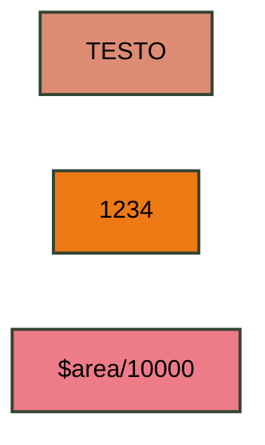
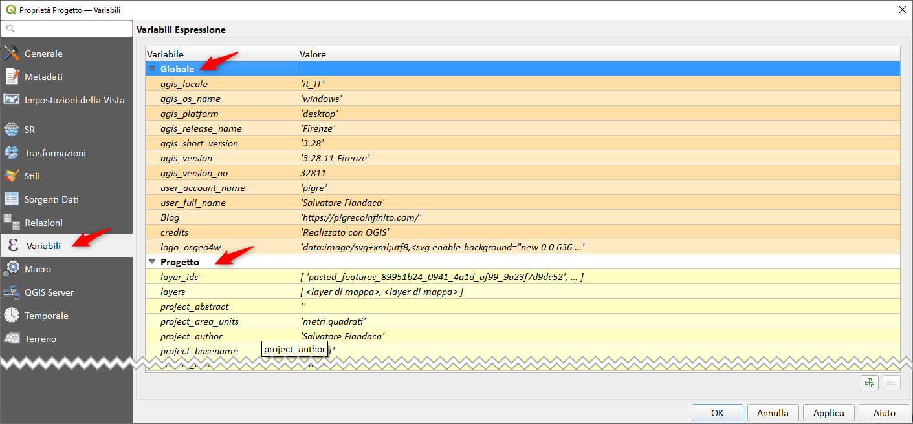
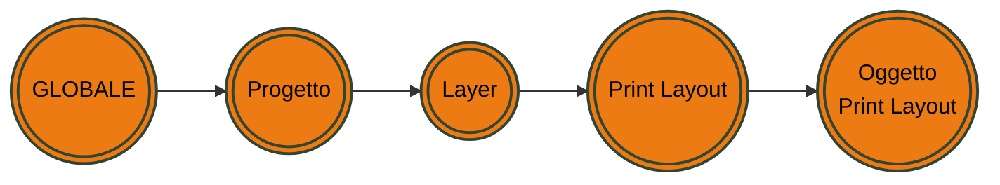
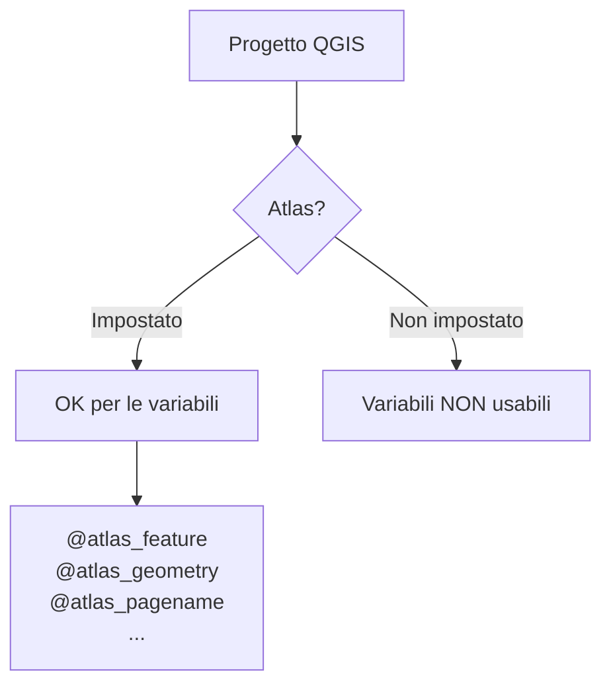

# Le variabili in QGIS

## Introduzione

Le variabili sono una nuova funzionalità introdotta in **QGIS 2.12 Lyon** (2015) che consente di creare valori preimpostati da utilizzare ovunque sia possibile utilizzare un'espressione. 

!!! Abstract "Variabili"
    **Rappresentano un nuovo concetto che dà la possibilità di impostare variabili personalizzate da utilizzare nel motore delle espressioni di **QGIS**

<!-- more -->

<!-- TOC -->

- [Le variabili in QGIS](#le-variabili-in-qgis)
  - [Introduzione](#introduzione)
  - [Cassetti](#cassetti)
    - [Esempio chiarificatore](#esempio-chiarificatore)
  - [Contesto](#contesto)
  - [Ambito](#ambito)
  - [Atlante](#atlante)
  - [Dinamiche contestuali](#dinamiche-contestuali)
  - [Creare variabile al volo](#creare-variabile-al-volo)
  - [Variabile speciale](#variabile-speciale)
- [RIFERIMENTI](#riferimenti)

<!-- /TOC -->

## Cassetti

Possiamo immaginare le variabili come dei cassetti all'interno dei quali possiamo immagazinnare _qualcosa_ da utilizzare quando necessario. Il contenuto dei cassetti può essere un _testo_, un _numero_, una _espressione_. Le variabili possono essere _statiche_, ovvero, il loro contenuto è sempre lo stesso, oppure _dinamico_, ovvero, cambia in funzione del contesto.

### Esempio chiarificatore

Ecco un primo esempio che far capire le potenzialità delle variabili: supponiamo che nel nostro progetto QGIS ci siano 5 layer vettoriali e per ognuno avessimo attivato e configurato le etichette. Supponiamo di voler cambiare la dimensione dell'etichette a tutte e 5 i layer, occorrerebbe aprire le proprietà del layer ben 5 volte, una per ogni layer. Ma se impostassimo, _a livello di progetto_, una variabile `altezza_etichetta` e mettessimo dentro il valore 15, basterebbe modificare una sola volta questa variabile per vedere le modifiche su tutti i layer in cui l'avessimo utilizzata.

## Contesto

Come detto prima, le variabili sono sensibili al **_contesto_**, quindi alcune variabili sono utilizzabili ovunque, altre no; per esempio la variabile  `@grid_axis` è utilizzabile solo nel compositore di stampe. Nel _gruppo_ delle funzioni, presente sia nel Field Calc che in ogni altro _Costruttore stringhe espressioni_, l'elenco delle variabile è molto variabile! perché, ripeto, dipende dal contesto.

## Ambito

Oltre al contesto, le variabili, dipendono anche dall'_**ambito**_, ovvero, esisitono 4 ambiti principali: _Globale_, _Progetto_, _Layer_, _Print Layout_, _Oggetto del print layout_, questi ambiti sono tutti impilati uno sopra l'altro in ordine dal meno specifico al più specifico. Gli ambiti più specifici _sovrascrivono_ eventuali variabili in conflitto esistenti da ambiti meno specifici: supponiamo di aver creato una variabile Globale `mio_nome` e successivamente altra variabile a livello di Progetto con stesso nome, la variabile globale verrebbe _sovrascritta_ da quella di progetto.

<https://mermaid-js.github.io/mermaid/#/flowchart>

## Atlante

Alcune variabili dipendono anche dalla creazione dell'**atlante**, ovvero, fin quanto non è stato creato un altlante, le relative variabili (@atlas_feature, @atla_geometry ecc...) non saranno né visibili né utilizzabili da nessuna parte, come è ovvio.

## Dinamiche contestuali

Alcune variabili dinamiche, come per esempio `@map_scale`, restituiscono valori diversi a seconda di dove viene utilizzata: _map canvas_, _mappe nuove_, _mappa print layout_; questo perché la variabile riconosce dove è stata richiamata.

## Creare variabile al volo

Infine, esiste una funzione `with_variable` che permette di creare, al volo, una variabile all'interno di una espressione complessa. Questo è molto utile quando, in espressioni lunghe e complesse, ci sono parti di espressioni che si ripetono più volte, per esempio `$area/10000`, potrei crearla come variabile e chiamrla `@areaEttari`, questo ha un duplice vantaggio: 1. rende l'espresione più leggibile; 2. rende l'espressione più veloce, perché quel valore verrebbe calcolato solo una volta e non enne volte.

**Osservazione**: tutte le variabili inizioano con `@`, quindi se volessi usare la variabile `row_number` dovrei necessariamente scrivere `@row_number`

## Variabile speciale

È stata introdotta, sempre da Nyall, una variabile speciale che viene utilizzata soprattutto nella _**sovrascrittura definita dai dati**_, ovvero, in tutti quei casi in cui è possibile _pilotare_ le caratterisitiche delle etichette o della simbologia tramite dati o espressioni. La variabile si chiama `@value`.

Questa variabile rientra tra le variabili dinamiche e contestuali perché può assumere vari valori a seconda della caratteristica utilizzata. In sostanza la variabile `@value` assume il valore corrente presente nelwidget di riferimento. (l'esempio che segue chiarirà il concetto).

# RIFERIMENTI

- [Changelog 2.12 - Le variabili](https://www.qgis.org/en/site/forusers/visualchangelog212/index.html?highlight=changelog#feature-variables-in-expressions)
- [Formattazione condizionale by Nathan Woodrow](https://woostuff.wordpress.com/2015/08/20/mixing-a-bit-of-excel-into-qgis-conditional-formatted-table-cells/)
- [DOC QGIS Variabili](https://docs.qgis.org/3.28/it/docs/user_manual/expressions/functions_list.html?highlight=variable#variables)
- [Variabile @value](https://www.youtube.com/live/h-mpUkwDdOQ?t=3104&si=7GxR8qlDUGDFzXcv)
- 