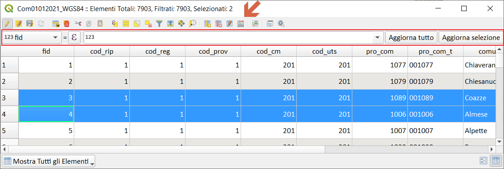

# Calcolatore di campi

Il pulsante  nella tabella degli attributi consente di eseguire calcoli sulla base di valori di attributo esistenti o funzioni definite, ad esempio, per calcolare la lunghezza o l'area delle caratteristiche geometriche. I risultati possono essere scritti in un nuovo campo di attributo, un campo virtuale, oppure possono essere utilizzati per aggiornare i valori in un campo esistente.

## Dove usarlo

Il calcolatore di campi è ora disponibile su qualsiasi livello che supporti la modifica. Il Calcolatore in realtà è solo una interfaccia che ci permette di accedere alle funzioni e ci da la possibilità di creare semplici o complesse espressioni. Le espressioni di QGIS vengono utilizzate ovunque, per esempio:

1. tabella degli attributi;
2. tematizzazione;
3. etichettatura;
4. sovrascrittura definita dai dati;
5. selezione;
6. compositore di stampe, atlas e report;
7. legenda;
8. strumenti di processing;
9. moduli inserimento dati e widget;
10. azioni;
11. modellatore grafico;
12. diagrammi;
13. filtri;
14. decorazioni;
15. proprietà layer: variabili;
16. statistiche;
17. suggerimenti mappa;
18. plugin;
19. ecc..

## Campo virtuale

Un campo virtuale è un campo basato su un'espressione calcolata al volo, il che significa che il suo valore viene automaticamente aggiornato non appena il parametro sottostante cambia. L'espressione è impostata una volta; non è più necessario calcolare nuovamente il campo se i valori sottostanti cambiano. Ad esempio, è possibile utilizzare un campo virtuale se è necessario calcolare i valori dell'area durante un processo di digitalizzazione (creazione, unione, divisione di feature) o calcolare una durata che deve essere aggiornata di volta in volta.

## Aggiorna geometria

Attraverso il calcolatore di campi è possibile aggiornare tutti gli attributi di un layer editabile, ma è possibile anche [aggiornare la gemetria](../esempi/agg_geom.md), per esempio diminuire il numero di vertici di una linea o di un poligono; spostare/traslare i punti ecc...

## Field Calc rapido

La barra di calcolo del campo rapido nella parte superiore della tabella degli attributi è visibile solo se il livello è modificabile:

