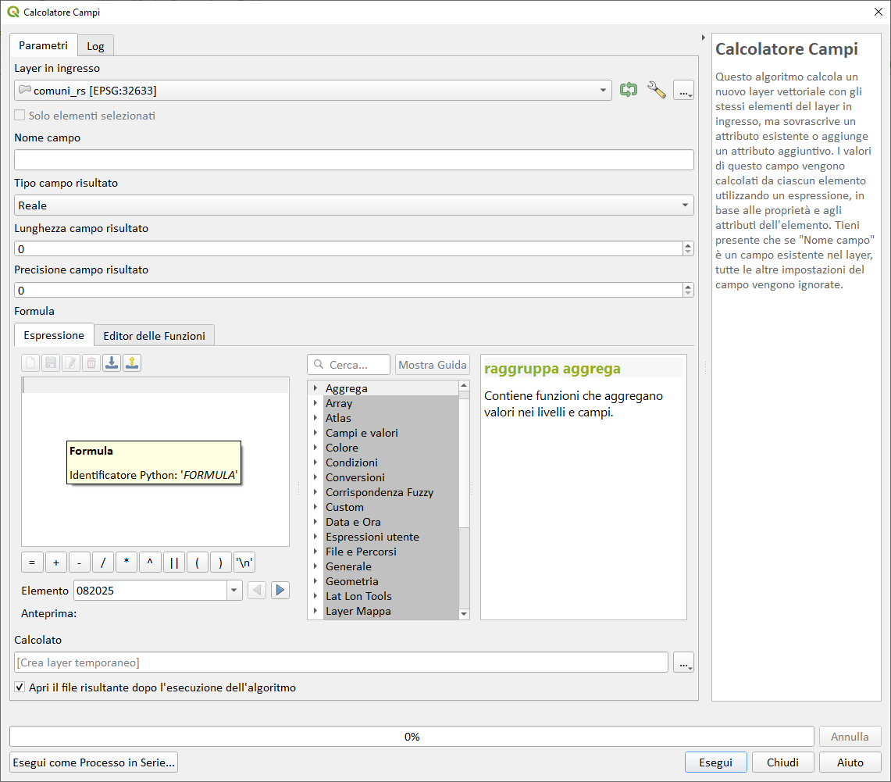

---
tags:
  - fieldCalc
  - propedeutico
  - processing
---

# Calcolatore Campi in Processing

## Introduzione

Questo algoritmo calcola un _**nuovo layer**_ vettoriale con gli stessi elementi del layer in ingresso, _**ma sovrascrive un attributo esistente**_ o aggiunge un attributo aggiuntivo. I valori di questo campo vengono calcolati da ciascun elemento utilizzando un espressione, in base alle proprietà e agli attributi dell'elemento. Se `Nome campo` è un campo esistente nel layer, tutte le altre impostazioni del campo vengono ignorate (OVVERO sovrascrive tutto, contenuto e tipo di dato).

## Perché

L'algoritmo è molto utile in quanto:

1. permette di utilizzare il calcolatore anche nel modellatore grafico;
2. permette di eseguire processi in serie;

## Utilizzo

Immaginate di avere centinaia di layer e di dover aggiornare (sovrascrive!!!) i valori di un campo (o vari campi); questo algoritmo, tramite il processo in serie, fa al caso nostro.
