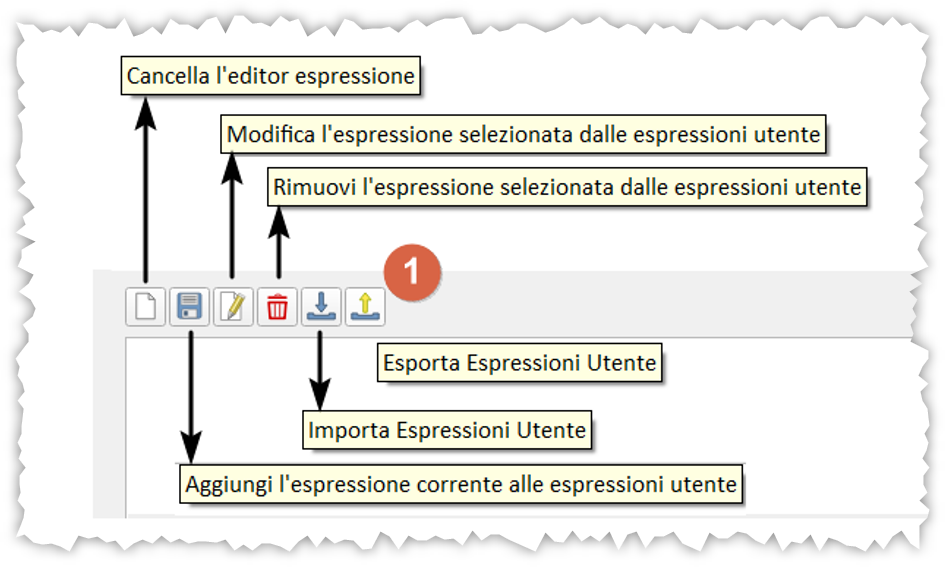
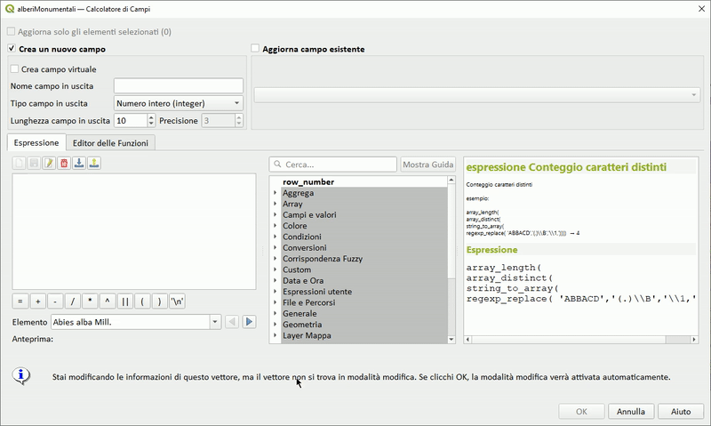
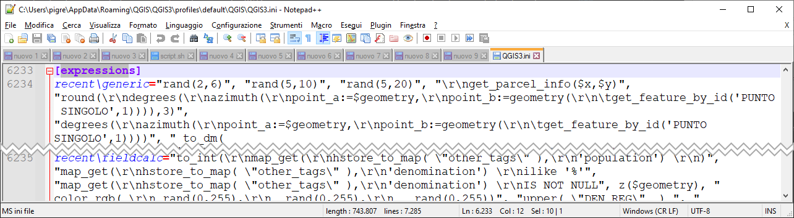

---
tags:
  - gruppo
  - funzioni
  - espressioni
---

# Espressioni utente

## Cosa sono

È un gruppo che contiene espressioni, realizzate dall'utente, memorizzate nel profilo utente.

[](../img/gruppo_expressioni_utente/img_001.png)

per definire/aprire un `profilo` : Impostazioni | Profilo Utente.

[](../img/gruppo_expressioni_utente/img_01.png)

Per salvare o modificare le espressioni utente, utilizzare le seguenti icone:



Tutto ciò che scriviamo nell'area dell'editor, che risultasse corretto sintatticamente, possiamo salvarlo per un futuro riutilizzo.

Per richiamare una Espressione utente salvata, espandere il gruppo `Espressioni utente`, selezionare l'espressione e aggiungerla tramite doppio clic.

[](../img/gruppo_expressioni_utente/output.gif)

Questa feature è stata aggiunta al core di QGIS grazie a una mia raccolta fondi documentata [qui](https://pigrecoinfinito.com/2019/12/14/field-calc-di-qgis-save-expressions-crowdfunding/)

## Dove vengono salvate

Come detto sopra, le espressioni sono salvate nel profilo utente, in particolare:

```
C:\Users\nomeUtente\AppData\Roaming\QGIS\QGIS3\profiles\default\QGIS
```

[](../img/gruppo_expressioni_utente/img_04.png)

Con un editor di testo potete aprire il file `QGIS3.ini` e cercare `expressions`

[](../img/gruppo_expressioni_utente/img_05.png)

qui tutte le espressioni utente memorizzate. (NB: attenzione a non modificare il file!!!)