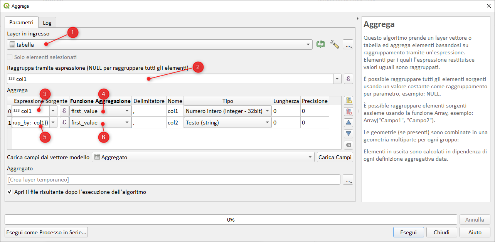

# Aggregare valori di una tabella

Data la `tabella` (semplice file csv) ottenere l'`output` come in figura:


per risolvere questi tipi di problemi occorre necessariamente usare l'algoritmo di Processing `Aggrega` e la seguente espressione (da mettere nel punto 5 - vedi screen):

```
array_to_string(array_agg(col2||':'||col3, group_by:=col1))
```



Idea presa da qui:
link: <https://gis.stackexchange.com/questions/282924/aggregating-strings-in-qgis>

## provaci tu, sotto la tabella

col1 | col2 | col3
-----|------|-----
1    | a    | c
1    | b    | c
2    | c    | c
2    | d    | b
2    | e    | z

---

Funzioni e variabili utilizzate:

* [array_agg](../gr_funzioni/array/array_unico.md#array_agg)
* [array_to_string](../gr_funzioni/array/array_unico.md#array_to_string)

