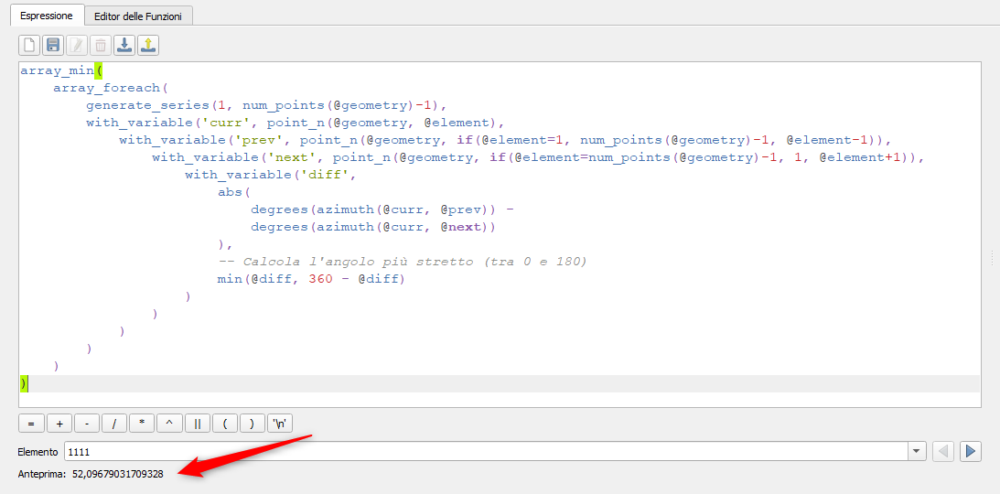

---
tags:
  - angolo
  - geometria
  - poligono
  - array
---

# Angolo interno minimo di un poligono

Come trovare l'angolo interno più piccolo (più stretto) di un poligono utilizzando il calcolatore di campi.

## Problema

Dato un poligono, si vuole calcolare quale sia l'angolo interno più piccolo formato dai suoi vertici. Questo può essere utile per:

- Identificare poligoni con angoli molto stretti
- Validare geometrie
- Analizzare la forma degli edifici
- Controllo qualità dei dati geometrici

[](../img/esempi/angolo_interno_minimo/angolo_min_01.png)

## Soluzione con espressione

### Espressione completa

```py
array_min(
    array_foreach(
        generate_series(1, num_points(@geometry)-1),
        with_variable('curr', point_n(@geometry, @element),
            with_variable('prev', point_n(@geometry, if(@element=1, num_points(@geometry)-1, @element-1)),
                with_variable('next', point_n(@geometry, if(@element=num_points(@geometry)-1, 1, @element+1)),
                    with_variable('diff', 
                        abs(
                            degrees(azimuth(@curr, @prev)) - 
                            degrees(azimuth(@curr, @next))
                        ),
                        -- Calcola l'angolo più stretto (tra 0 e 180)
                        min(@diff, 360 - @diff)
                    )
                )
            )
        )
    )
)
```

**Output**: Il valore dell'angolo interno minimo espresso in gradi (0-180°)

## Spiegazione dettagliata

### 1. Generazione della sequenza di vertici

```py
generate_series(1, num_points($geometry)-1)
```

**Cosa fa:**

- `num_points($geometry)` → Conta il numero totale di vertici del poligono
- `generate_series(1, n-1)` → Crea una sequenza da 1 a n-1 (esclude l'ultimo vertice perché nei poligoni il primo e l'ultimo coincidono)

**Esempio pratico:**

Per un poligono con 6 vertici, genera: `[1, 2, 3, 4, 5]`

### 2. Iterazione sui vertici con array_foreach

```py
array_foreach(
    generate_series(...),
    ...
)
```

**Cosa fa:**

- Itera su ogni numero della sequenza
- Per ogni iterazione, `@element` contiene il numero del vertice corrente
- Esegue il calcolo dell'angolo per ciascun vertice

### 3. Identificazione dei tre punti consecutivi

```py
with_variable('curr', point_n($geometry, @element),
  with_variable('prev', point_n($geometry, if(@element=1, num_points($geometry)-1, @element-1)),
    with_variable('next', point_n($geometry, if(@element=num_points($geometry)-1, 1, @element+1)),
      ...
    )
  )
)
```

**Cosa fa:**

- `@curr` → Vertice corrente (quello per cui calcoliamo l'angolo)
- `@prev` → Vertice precedente (gestisce il caso del primo vertice)
- `@next` → Vertice successivo (gestisce il caso dell'ultimo vertice)

**Gestione casi speciali:**

- Se `@element = 1` (primo vertice): `@prev` diventa l'ultimo vertice reale
- Se `@element = num_points-1` (ultimo vertice): `@next` diventa il primo vertice

### 4. Calcolo dell'angolo

```py
with_variable('diff', 
  abs(
    degrees(azimuth(@curr, @prev)) - 
    degrees(azimuth(@curr, @next))
  ),
  min(@diff, 360 - @diff)
)
```

**Cosa fa (passo per passo):**

1. **`azimuth(@curr, @prev)`** → Calcola l'azimut (direzione) dal vertice corrente a quello precedente (in radianti)
2. **`azimuth(@curr, @next)`** → Calcola l'azimut dal vertice corrente a quello successivo
3. **`degrees(...)`** → Converte da radianti a gradi
4. **Sottrazione** → Calcola la differenza tra i due angoli
5. **`abs(...)`** → Prende il valore assoluto (angolo sempre positivo)
6. **`min(@diff, 360 - @diff)`** → Normalizza l'angolo tra 0° e 180° (sceglie l'angolo più piccolo tra i due possibili)

**Esempio numerico:**

Se l'azimut verso `@prev` è 45° e verso `@next` è 135°:
- Differenza: |45° - 135°| = 90°
- min(90°, 360° - 90°) = min(90°, 270°) = **90°**

Se la differenza fosse 270°:
- min(270°, 360° - 270°) = min(270°, 90°) = **90°**

### 5. Selezione del minimo

```py
array_min(
  array_foreach(...)
)
```

**Cosa fa:**

- `array_foreach` crea un array con tutti gli angoli calcolati per ogni vertice
- `array_min` seleziona il valore minimo dall'array

**Esempio:**

Se gli angoli sono `[120°, 95°, 75°, 110°, 85°]`, restituisce **75°**

## Come utilizzare l'espressione

### Passaggi:

1. Aprire la **tabella degli attributi** del layer poligonale
2. Aprire il **Calcolatore di Campi** (icona dell'abaco o `Ctrl+I`)
3. Configurare il nuovo campo:
   - Crea un nuovo campo
   - Nome campo: `angolo_min` (o il nome che si preferisce)
   - Tipo di campo: **Numero decimale (double o real)**
   - Lunghezza: 10
   - Precisione: 2
4. Incollare l'espressione nell'editor
5. Cliccare **OK** per calcolare il campo

## Applicazioni pratiche

### 1. Selezione poligoni con angoli stretti

Selezionare tutti i poligoni con angoli interni minori di 30°:

```py
"angolo_min" < 30
```

### 2. Validazione geometrie

Identificare edifici con angoli troppo acuti (possibili errori di digitalizzazione):

```py
"angolo_min" < 15
```

### 3. Tematizzazione

Colorare i poligoni in base all'angolo minimo:

- Rosso: angoli < 30° (geometrie problematiche)
- Giallo: angoli tra 30° e 60°
- Verde: angoli > 60° (geometrie regolari)

## Varianti dell'espressione

### Trovare l'angolo massimo invece del minimo

Sostituire `array_min` con `array_max`:

```py
array_max(
  array_foreach(...)
)
```

### Calcolare la media degli angoli interni

Sostituire `array_min` con `array_mean`:

```py
array_mean(
  array_foreach(...)
)
```

### Contare quanti angoli sono sotto una soglia

```py
array_length(
  array_filter(
    array_foreach(...),
    @element < 30
  )
)
```

## Note importanti

### Tipo di geometria

L'espressione funziona con:

- ✅ Poligoni singoli (Polygon)
- ⚠️ Multi-poligoni (solo il primo anello del primo poligono)
- ❌ Linee e punti (non applicabile)

### Anelli interni (buchi)

L'espressione calcola solo l'anello esterno del poligono. Per analizzare anche i buchi interni, serve un'espressione più complessa.

### Performance

L'espressione è relativamente complessa. Su dataset molto grandi (migliaia di poligoni con molti vertici):

- Considerare di salvare il risultato in un campo fisico
- Valutare l'uso di Processing Python per performance migliori

### Unità di misura

Il risultato è sempre in **gradi** (0-180°), indipendentemente dal sistema di coordinate del layer.

## Risoluzione problemi

### Risultato NULL

**Causa:** Il poligono ha meno di 3 vertici (geometria invalida)

**Soluzione:** Verificare e correggere le geometrie con "Controlla validità"

### Risultato 0

**Causa:** 

Tre vertici consecutivi sono perfettamente allineati, formando un angolo di 180° (angolo piatto). Questo significa che:

- Il vertice intermedio giace esattamente sulla linea tra i due vertici adiacenti
- Non c'è realmente un "angolo" in quel punto
- La geometria potrebbe avere un vertice ridondante

**Esempi tipici:**

- Poligoni con vertici non necessari lungo un lato retto
- Errori di digitalizzazione
- Geometrie semplificate male

**Soluzione:** 

1. **Rimuovere vertici ridondanti**: Strumenti → Geometria → Semplifica geometria
2. **Verificare manualmente**: Usare lo strumento di modifica vertici per controllare
3. **Se intenzionale**: Il valore 0° è corretto per quella geometria

### Risultato 180

**Causa:** 

Angolo molto ampio (quasi piatto ma dall'altra parte)

**Soluzione:** 

Verificare la geometria, potrebbe essere corretta o indicare un errore di digitalizzazione

### Errore "point_n not found"

**Causa:** Versione di QGIS troppo vecchia

**Soluzione:** Aggiornare QGIS alla versione 3.0 o superiore

## Soluzioni alternative

### Virtual Layer (SQL con Spatialite)

Non esiste una funzione SQL standard equivalente. È necessario usare l'espressione QGIS o uno script Python.

### Processing Python

Per analisi più complesse o dataset molto grandi, considerare uno script Python che usa la libreria Shapely:

```python
from shapely.geometry import Point
import math

def calculate_min_angle(geom):
    coords = list(geom.exterior.coords)[:-1]  # Escludi ultimo punto
    angles = []
    
    for i in range(len(coords)):
        prev = coords[i-1]
        curr = coords[i]
        next_pt = coords[(i+1) % len(coords)]
        
        # Calcola angoli
        angle1 = math.atan2(prev[1]-curr[1], prev[0]-curr[0])
        angle2 = math.atan2(next_pt[1]-curr[1], next_pt[0]-curr[0])
        
        diff = abs(math.degrees(angle1 - angle2))
        angle = min(diff, 360 - diff)
        angles.append(angle)
    
    return min(angles)
```

---

Funzioni e variabili utilizzate:

* [array_min](../gr_funzioni/array/array_unico.md#array_min)
* [array_foreach](../gr_funzioni/array/array_unico.md#array_foreach)
* [generate_series](../gr_funzioni/array/array_unico.md#generate_series)
* [with_variable](../gr_funzioni/generale/generale_unico.md#with_variable)
* [point_n](../gr_funzioni/geometria/geometria_unico.md#point_n)
* [num_points](../gr_funzioni/geometria/geometria_unico.md#num_points)
* [$geometry](../gr_funzioni/geometria/geometria_unico.md#geometry)
* [azimuth](../gr_funzioni/geometria/geometria_unico.md#azimuth)
* [degrees](../gr_funzioni/matematica/matematica_unico.md#degrees)
* [abs](../gr_funzioni/matematica/matematica_unico.md#abs)
* [min](../gr_funzioni/matematica/matematica_unico.md#min)
* [if](../gr_funzioni/condizioni/condizioni_unico.md#if)
* [@element](../gr_funzioni/variabili/element.md)
