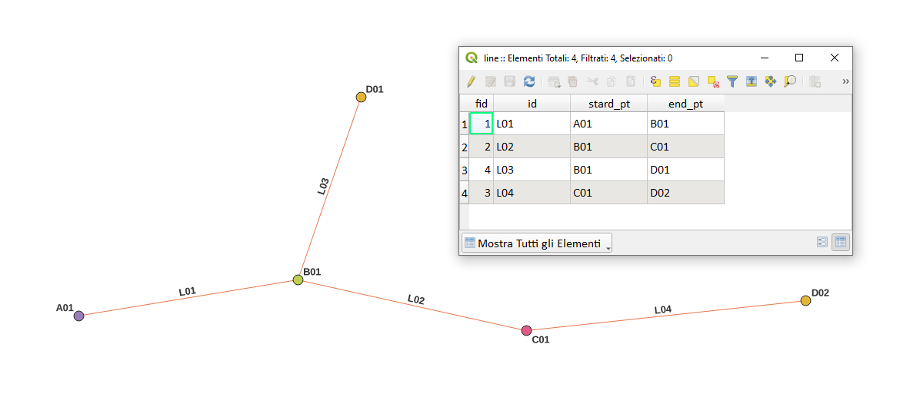

---
tags:
  - prossimità
  - attributi
  - tabella
  - layer
  - overlay
  - punti
---

# Prelevare attributi da layer più vicini

Livello di linea (MultiLineString) e 4 livelli di punti (MultiPoint).

Il mio livello di `linea` ha 2 campi di attributi `start_pt` e `end_pt`, ho bisogno che vengano compilati con un attributo identificativo (dati stringa popolati con valori come A01, B01, B02, C01, ecc. quindi non è il `$id` valore normale) da una qualsiasi delle potenziali caratteristiche dei 4 livelli punti che può essere agganciato alla feature di linea.

esempio sotto:



Espressioni utilizzate per QGIS >= 3.18:

campo `start_pt`:

```
overlay_nearest(layer:=
with_variable('in_layer',array('cat_A','cat_B','cat_C','cat_D'),
with_variable('in_dist',
        array_foreach(@in_layer,distance(overlay_nearest(@element,$geometry)[0], start_point($geometry))),
array_get(@in_layer, array_find(@in_dist, array_min(@in_dist)))))
,expression:= id )[0]
```

campo `end_pt`:

```
overlay_nearest(layer:=
with_variable('in_layer',array('cat_A','cat_B','cat_C','cat_D'),
with_variable('in_dist',
        array_foreach(@in_layer,distance(overlay_nearest(@element,$geometry)[0], end_point($geometry))),
array_get(@in_layer, array_find(@in_dist, array_min(@in_dist)))))
,expression:= id )[0]
```

l'unica differenza tra le due espressioni di sopra è nelle funzioni: `start_point` e `and_point`.

nel linguaggio umano:

l'espressione crea due varibili, la prima contiene i nomi dei 4 layer, la seconda crea un array di distanze tra i 4 layer e il layer lineare; infine, tra i vari valori distanza scelgo quello più piccolo, una volta rispetto a `star_point` e una volta per l'`end_point`.

**EDIT:**

Le espressioni di sopra risolvono il caso in esame, ma non risolvono il caso in cui una linea abbia, come punti estremi, punti dello stesso layer puntuale: in questo caso le espressioni non riescono a distinguere lo start_point dall'end_point e restituirebbe sempre lo stesso valore; per risolvere il problema si propone la seguente espressione:

```
-- select id
with_variable('feature',
-- search for the nearest points
	overlay_nearest(layer:=
	-- search for the closest layer
		with_variable('in_layer',array('cat_A','cat_B','cat_C','cat_D'), -- point layer list
			with_variable('in_dist',
				array_foreach(@in_layer,
					   distance(overlay_nearest(@element,$geometry)[0],
				end_point($geometry))), -- change start or end_point
		array_get(@in_layer, array_find(@in_dist, array_sort(@in_dist)[0]))))
	-- search for the closest layer
		,expression:= id, limit:=2, max_distance:=0.1 )
-- search for the nearest points
, if(array_length(
		@feature)>1,
		@feature[1], -- 0: start_point; 1: end_point
		@feature[0]) -- 
)
-- select id
```

quesito su stackexchange: <https://gis.stackexchange.com/questions/417080/populate-lines-attribute-fields-with-attributes-from-point-features-snapped-to>

osservazioni: 

1. i 4 livelli punti si chiamano 'cat_A','cat_B','cat_C','cat_D';
2. il livello linea si chiama line.

## Provaci tu

il GeoPackage è [qui](../prova_tu/se.gpkg)

---

Funzioni e variabili utilizzate:

* [@with_variable](../gr_funzioni/variabili/with_variable.md)
* [array_get](../gr_funzioni/array/array_unico.md#array_get)
* [array_foreach](../gr_funzioni/array/array_unico.md#array_foreach)
* [array_find](../gr_funzioni/array/array_unico.md#array_find)
* [array_min](../gr_funzioni/arrayarray_unico.md#array_min)
* [overlay_nearest](../gr_funzioni/geometria/geometria_unico.md#overlay_nearest)
* [distance](../gr_funzioni/geometria/geometria_unico.md#distance)
* [array](../gr_funzioni/array/array_unico.md#start_point)
* [start_point](../gr_funzioni/geometria/geometria_unico.md#start_point)
* [end_point](../gr_funzioni/geometria/geometria_unico.md#end_point)
* [$geometry](../gr_funzioni/geometria/geometria_unico.md#geometry)
