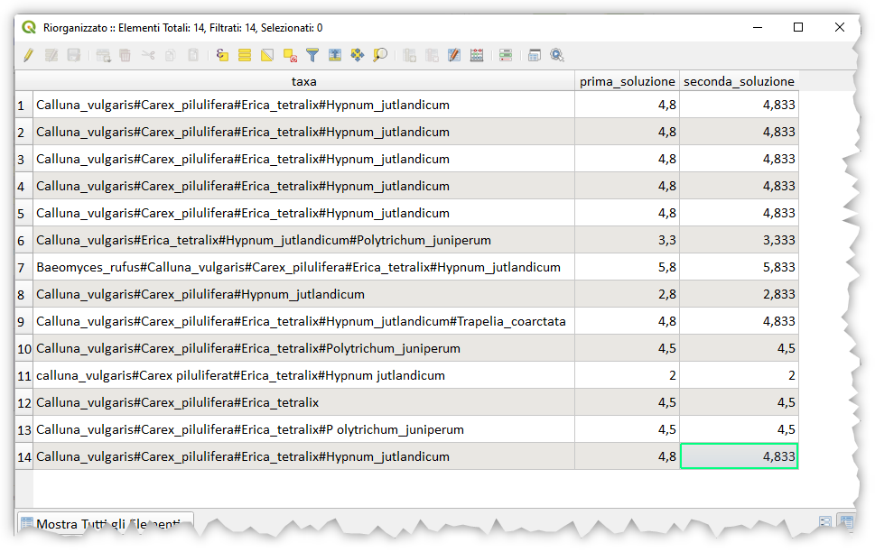

# Classificare specie

Una colonna `taxa` contiene una serie di specie separate da #. Come creare una nuova colonna che restituisce una somma di valori, in base alla specie, definiti in un'altra tabella. Sotto un esempio:

[](../img/esempi/classificazione_specie/img_01.png)

di seguito alcuni esempi di valori per specie:

taxon                | value
---------------------|------
Calluna_vulgaris     | 1
Baeomyces_rufus      | 1
Porpidia_crustulata  | 2
Rhizocarpon_reductum | 2
Micarea_erratica     | 2
Hypnum_jutlandicum   | 0.333
Erica_tetralix       | 2
Carex_pilulifera     | 1.5

esempio di cosa ottenere: se la colonna `taxa` contenesse `Calluna_vulgaris#Porpidia_crustulata#Micarea_erratica`
la nuova colonna devobbe contenere 5 (1+2+2).

## Prima soluzione

```
array_sum(
  array_foreach(
    string_to_array("taxa",'#'),
    to_real(attribute(get_feature('taxon','taxon',@element),'value'))))
```

questa soluzione fa uso di un layer `taxon` che contiene l'elenco delle specie e i relativi valori.

## Seconda soluzione

```
array_sum(
  array_foreach(
  string_to_array("taxa",'#'),
  map_get(
    map(
        'Calluna_vulgaris',1,
        'Baeomyces_rufus',1,
        'Porpidia_crustulata',2,
        'Rhizocarpon_reductum',2,
        'Micarea_erratica',2,
        'Hypnum_jutlandicum',0.333,
        'Erica_tetralix',2,
        'Carex_pilulifera',1.5),
@element)))
```

questa soluzione fa uso di un dizionario (mappe valori) che contiene l'elenco e i valori delle specie.

## output

[](../img/esempi/classificazione_specie/img_02.png)

### Prova tu

Geopackage è [qui](../prova_tu/taxon.gpkg)

---

Funzioni e variabili utilizzate:

* [array_sum](../gr_funzioni/array/array_unico.md#array_sum)
* [array_foreach](../gr_funzioni/array/array_unico.md#array_foreach)
* [get_feature](../gr_funzioni/record_e_attributi/record_e_attributi_unico/#get_feature)
* [attribute](../gr_funzioni/record_e_attributi/record_e_attributi_unico.md#attribute)
* [map_get](../gr_funzioni/maps/maps_unico.md#map_get)
* [map](../gr_funzioni/maps/maps_unico.md#map)
* [string_to_array](../gr_funzioni/array/array_unico.md#string_to_array)
* [to_real](../gr_funzioni/conversioni/conversioni_unico/#to_real)
