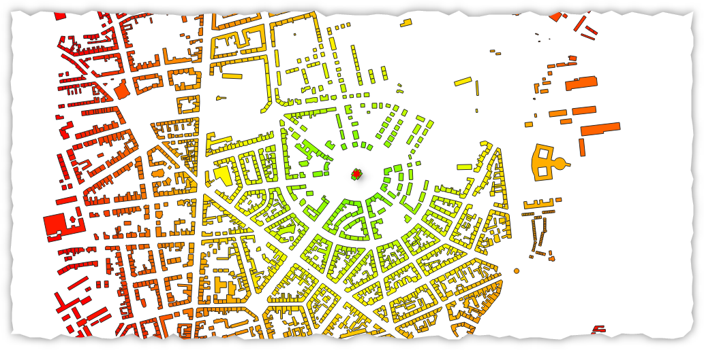

---
tags:
  - contare
  - punti
  - poligoni
  - condizioni
  - classificare
---

# Contare  i punti nel poligono per categorie

```
color_hsv(
    scale_linear( 
      distance( 
        geometry(
          get_feature('center','name','Test')),
          $geometry),0,1000,100,0),100,100)
```

[](../img/esempi/colorare_distanza_da_punto/img_01.png)

by [eurojam](https://twitter.com/27aea577f17d4c4)
- <https://twitter.com/27aea577f17d4c4/status/1591081607108390913>
- <https://geoobserver.wordpress.com/2022/11/21/qgis-tipp-objekte-nach-abstand-einfarben/>

---

Funzioni e variabili utilizzate:

* [@parent](../gr_funzioni/variabili/parent.md)
* [aggregate](../gr_funzioni/aggrega/aggrega_unico.md#aggregate)
* [AND](../gr_funzioni/operatori/operatori_unico.md#AND)
* [geometry](../gr_funzioni/geometria/geomatria_unico.md#geometry)
