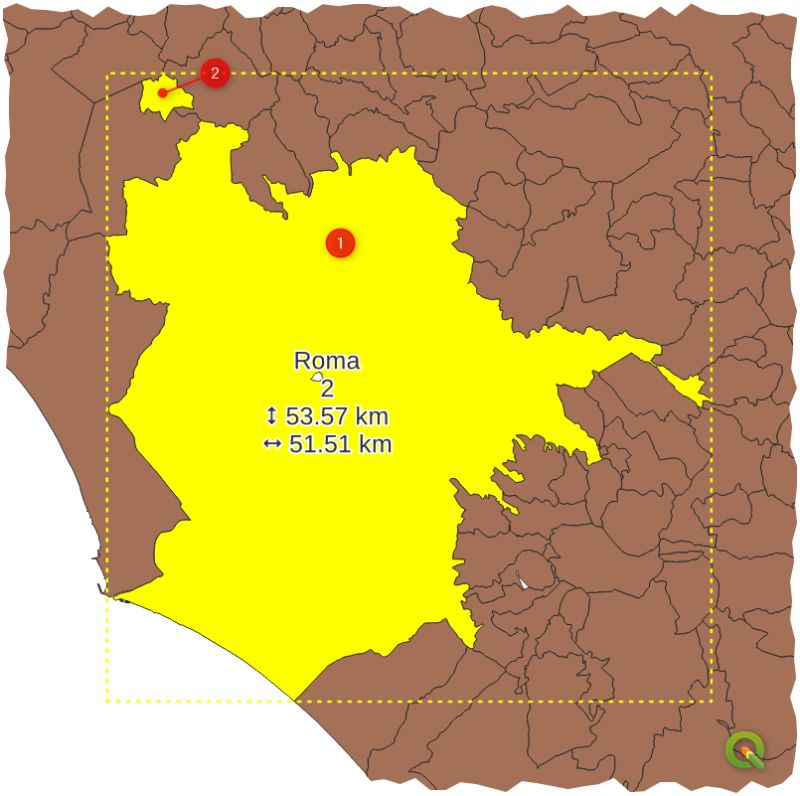

---
tags:
  - geometria
  - bounds
  - multipart
  - comuni
---

## Trovare il comune più sviluppato in senso verticale (Nord-Sud)

**Quesito:** Usando lo shapefile dei comuni italiani (generalizzato) ISTAT 2025, qual è il comune più sviluppato in senso verticale (Nord-Sud) che non abbia parti separate?



*Esempio: il comune di Roma ha due parti separate (multipart geometry), quindi non va considerato*

### Soluzione

Per risolvere questo quesito dobbiamo:

1. **Filtrare i comuni con geometria singola** (escludere le geometrie multipart)
2. **Calcolare l'estensione verticale** di ogni comune (differenza tra coordinate Y massima e minima)
3. **Ordinare i risultati** per trovare il comune con maggiore sviluppo verticale

#### Passo 1: Creare un campo per identificare geometrie multipart

Nel calcolatore di campi, creare un nuovo campo `n_parti` di tipo `intero`:

```py
num_geometries($geometry)
```

Questa espressione restituisce il numero di parti della geometria. I comuni con una sola parte avranno valore `1`.

#### Passo 2: Calcolare lo sviluppo verticale

Creare un nuovo campo `sviluppo_verticale_km` di tipo `decimale (double)`:

```py
-- Calcola la differenza tra Y massimo e Y minimo
-- e converte in chilometri
(y_max(bounds($geometry)) - y_min(bounds($geometry))) / 1000
```

Oppure, in alternativa, si può usare:

```py
-- Usando bounds_height
bounds_height($geometry) / 1000
```

#### Passo 3: Filtrare e ordinare

Nella tabella attributi:

1. Applicare un filtro per visualizzare solo i comuni con geometria singola:
   ```
   num_geometries($geometry) = 1
   ```

2. Ordinare il campo `sviluppo_verticale_km` in ordine decrescente

Il primo risultato sarà il comune più sviluppato in senso verticale che non ha parti separate.

### Soluzione con una singola espressione

È possibile ottenere direttamente il nome del comune e lo sviluppo verticale usando questa espressione nel calcolatore di campi o nella console Python:

```py
array_first(
  array_agg(
    expression:= map(
      'comune', "COMUNE",
      'sviluppo_km', bounds_height(@geometry) / 1000
    ),
    filter:= bounds_height(@geometry) = maximum(bounds_height(@geometry), filter:= num_geometries(@geometry) = 1)
  )
)
```

Questa espressione:

- Usa `array_agg` per aggregare i dati dei comuni in formato mappa
- Filtra solo il comune la cui altezza del bounds è uguale al massimo tra tutti i comuni con geometria singola
- Restituisce una mappa con il nome del comune e il suo sviluppo verticale in km
- Output esempio: `{'comune': 'Nome Comune', 'sviluppo_km': 53.57}`

### Espressione semplificata per la selezione

Per selezionare direttamente il comune cercato:

```py
maximum(bounds_height(@geometry), filter:= num_geometries(@geometry) = 1)
=
bounds_height(@geometry)
```

Questa espressione confronta l'altezza del bounds della geometria corrente con il massimo delle altezze di tutte le geometrie che hanno una sola parte (num_geometries = 1).

### Note

- La funzione `num_geometries()` restituisce `1` per geometrie singole e `>1` per geometrie multipart
- La funzione `bounds_height()` è equivalente a `y_max(bounds()) - y_min(bounds())`
- I calcoli sono effettuati nel sistema di riferimento del layer (tipicamente EPSG:32632 o EPSG:3857 per i dati italiani)
- Per dataset molto grandi, è più efficiente creare campi separati per filtrare e ordinare nella tabella attributi

### Riferimenti

- [num_geometries](../gr_funzioni/geometria/geometria_unico.md#num_geometries)
- [bounds_height](../gr_funzioni/geometria/geometria_unico.md#bounds_height)
- [bounds](../gr_funzioni/geometria/geometria_unico.md#bounds)
- [y_max](../gr_funzioni/geometria/geometria_unico.md#y_max)
- [y_min](../gr_funzioni/geometria/geometria_unico.md#y_min)
- [array_agg](../gr_funzioni/array/array_unico.md#array_agg)
- [maximum](../gr_funzioni/aggregates/aggregates_unico.md#maximum)
