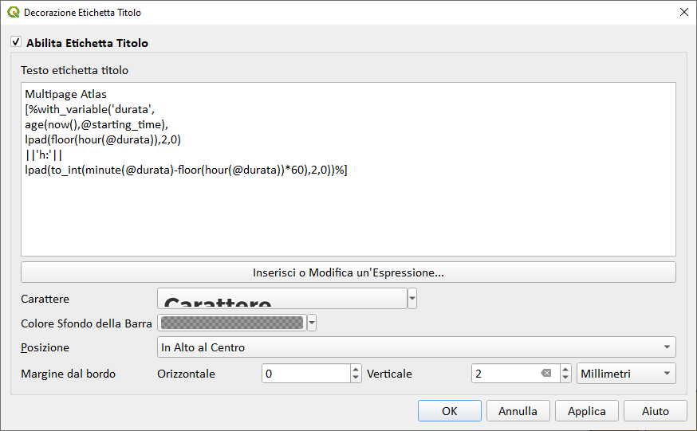

---
tags:
  - decorazioni
  - cronometro
  - tempo
---

# Cronometro

Come visualizzare un cronometro che misuri il tempo trascorso in una sessione di lavoro con QGIS. Il cronometro verrà posizionato in alto nella map canvas tramite l'uso delle decorazioni e in particolare `Etichetta Titolo...`

[](../img/esempi/cronometro/img_01.png)

Le **Decorazioni** sono raggiungibili dal Menu _Visualizza | Decorazioni | Etichetta Titolo..._

[](../img/esempi/cronometro/img_02.png)

verrà aperta una finestra per configurare `Etichetta Titolo` e dove editare l'espressione:

[](../img/esempi/cronometro/img_03.png)

## Espressione

### senza Macro

```
with_variable('durata',
  age(
    now(),
    make_datetime(2022,04,07,09,05,42) -- i valori vanno inseriti manualmente
    ),
lpad(floor(hour(@durata)),2,0)
||'h:'||
lpad(to_int(minute(@durata)-floor(hour(@durata))*60),2,0))
```

### con Macro

```
with_variable('durata',
  age(
    now(),
    @starting_time -- variabile che contine il datetime di apertura progetto
    ),
lpad(floor(hour(@durata)),2,0)
||'h:'||
lpad(to_int(minute(@durata)-floor(hour(@durata))*60),2,0))
```

[](../img/esempi/cronometro/img_04.png)

## Macro

La macro è stata realizzata da [**Valerio Pinna**](https://github.com/ValPinnaSardinia) e [**Giulio Fattori**](https://github.com/Korto19) che ringraziamo per il prezioso aiuto.

```py
from datetime import datetime
from qgis.core import QgsProject, QgsExpression, QgsExpressionContextUtils


def openProject():
    project = QgsProject.instance()
    QgsExpressionContextUtils.setProjectVariable(project,'starting_time',str(datetime.now()))
    QgsExpressionContextUtils.projectScope(project).variable('starting_time')


def saveProject():
    pass

def closeProject():
    pass
```

<https://docs.qgis.org/testing/en/docs/user_manual/introduction/qgis_configuration.html#id71>

**NB:** per utilizzare la macro nel Progetto:

1. Impostazioni | Opzioni | Generale → Abilita Macro | Sempre
2. Progetto | Proprietà | Macro

---

Funzioni e variabili utilizzate:

* [with_variable](../gr_funzioni/generale/generale_unico.md/#with_variable)
* [age](../gr_funzioni/data_ora/data_ora_unico.md/#age)
* [now()](../gr_funzioni/data_ora/data_ora_unico.md/#now)
* [make_datetime](../gr_funzioni/data_ora/data_ora_unico.md/#make_datetime)
* [lpad](../gr_funzioni/stringhe_di_testo/stringhe_di_testo_unico.md/#lpad)
* [floor](../gr_funzioni/matematica/matematica_unico.md/#floor)
* [to_int](../gr_funzioni/conversioni/conversioni_unico.md/#to_int)
* [minute](../gr_funzioni/data_ora/data_ora_unico.md/#minute)
* [hour](../gr_funzioni/data_ora/data_ora_unico.md/#hour)
