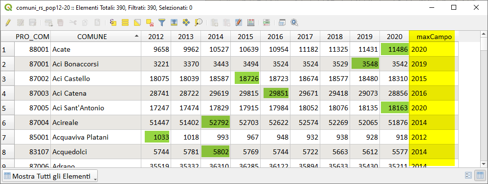
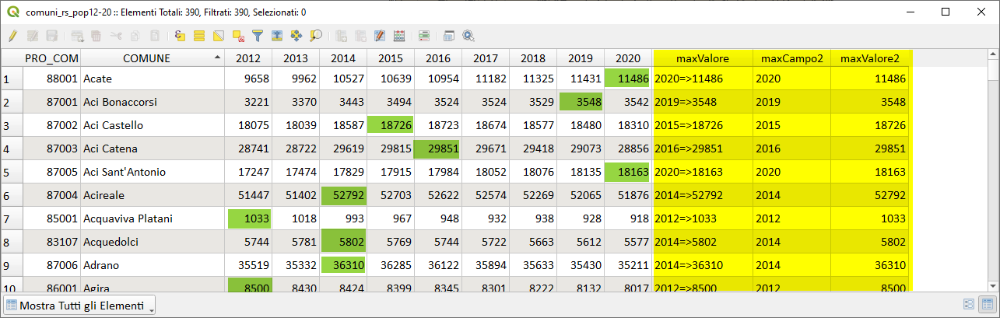

# Nome del campo con massimo valore

Le funzioni di aggregazione di QGIS agiscono su un campo, ma se volessimo determinare il _nome del campo_ che contenesse il valore massimo per ogni record, come faremmo?

La funzione che permette di creare una mappa per ogni record è `attributes()` e tramite questa risolveremo il seguente problema.

Abbiamo uno shapefile dei comuni siciliani e la tabella degli attributi presenta, per ogni anno (dal 2012 al 2020), il valore della popolazione residente, sotto la tabella:


determinare, per ogni comune, quale è l'anno (quindi, il nome del campo) in cui la popolazione è massima e scriverlo in un campo nuovo (annoMax).

La tabella attributi ha 11 campi, ma la ricerca della popolazione massima va fatta solo negli ultimi 9 campi.

Nel caso non dovessimo evitare alcuni campi, l'espressione da utilizzare è:

```
with_variable ('sel',
        map_avals (attributes ()),
        map_akeys (attributes ())[array_find (@sel, array_max (@sel))]
              )
```

ma nell'esempio occorre evitare la ricerca del massimo nei campi `PRO_COM` e `COMUNE`, occorre, quindi, utilizzare la seguente espressione:ù

```
with_variable('deleteField',
        map_delete(map_delete(
        attributes(),'PRO_COM'),'COMUNE'),
with_variable('sel',
        map_avals( @deleteField),
        map_akeys( @deleteField)[array_find(@sel,array_max(@sel))])
             )
```



Se volessimo aggiungere anche il campo con il valore massimo, basterebbe creare una mappa con chiave il campo (che contiene il valore massimo) e come valore, il valore massimo; per far questa **mappa** occorre utilizzare la seguente espressione:

```
hstore_to_map(
with_variable('deleteField',
        map_delete(map_delete(
        attributes(),'PRO_COM'),'COMUNE'),
with_variable('sel',
        map_avals( @deleteField),
        map_akeys( @deleteField)[array_find(@sel,array_max(@sel))]
		||'=>'|| map_get(@deleteField,
		map_akeys( @deleteField)[array_find(@sel,array_max(@sel))])
             ))
             )
```

dalla mappa posso estrarre la chiave e il valore in due campi diversi:

estraggo dalla mappa la chiave:

```
map_akeys( -- estraggo la chiave, ovvero anno
hstore_to_map(
with_variable('deleteField',
        map_delete(map_delete(map_delete(
        attributes(),'PRO_COM'),'COMUNE'),'max_valore'),
with_variable('sel',
        map_avals( @deleteField),
        map_akeys( @deleteField)[array_find(@sel,array_max(@sel))]
		||'=>'|| map_get(@deleteField,
		map_akeys( @deleteField)[array_find(@sel,array_max(@sel))])
             ))
             )
        )[0]
```

estraggo dalla mappa il valore:

```
map_avals( -- estraggo il valore
hstore_to_map(
with_variable('deleteField',
        map_delete(map_delete(map_delete(
        attributes(),'PRO_COM'),'COMUNE'),'maxCampo2'),
with_variable('sel',
        map_avals( @deleteField),
        map_akeys( @deleteField)[array_find(@sel,array_max(@sel))]
		||'=>'|| map_get(@deleteField,
		map_akeys( @deleteField)[array_find(@sel,array_max(@sel))])
             ))
             )
        )[0]
```



Idea presa da qui:
link: <https://gis.stackexchange.com/questions/411369/returning-column-name-of-the-max-value>

## provaci tu, qui il geopackage

[scarica](../prova_tu/comuni_rs.gpkg)

## Funzione Custom

La funzione personalizzata scritta in Python fa la stessa cosa:

- [MaxMinValueFieldName](../gr_funzioni/custom/custom_unico.md#MaxMinValueFieldName)
---

Funzioni e variabili utilizzate:

* [@with_variable](../gr_funzioni/variabili/with_variable.md)
* [hstore_to_map](../gr_funzioni/maps/maps_unico.md#array_get)
* [array_max](../gr_funzioni/array/array_unico.md#array_max)
* [array_find](../gr_funzioni/array/array_unico.md#array_find)
* [attributes](../gr_funzioni/record_e_attributi/record_e_attributi_unico.md#attributes)
* [map_delete](../gr_funzioni/maps/maps_unico.md#map_delete)
* [map_avals](../gr_funzioni/maps/maps_unico.md#map_avals)
* [map_akeys](../gr_funzioni/maps/maps_unico.md#map_akeys)

