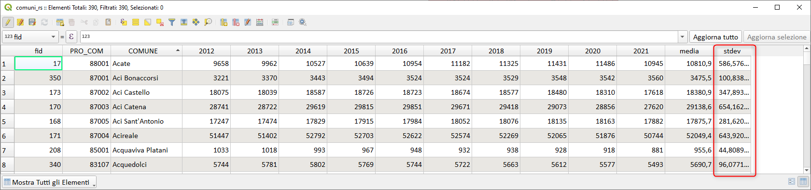

---
tags:
  - campi
  - attributi
  - chiave-valore
  - array
---

# Media e deviazione standard tra campi

Le funzioni di aggregazione di QGIS agiscono su un campo, ma se volessimo determinare la _media_ e la _stdev_ dei valori di ogni record, come faremmo?

La funzione che permette di creare una mappa per ogni record è `attributes()` e tramite questa risolveremo il problema.

Abbiamo uno shapefile dei comuni siciliani e la tabella degli attributi presenta, per ogni anno (dal 2012 al 2020), il valore della popolazione residente, sotto la tabella:

[](../img/esempi/media_stdev_tra_campi/img_01.png)

determinare, per ogni comune, la _media_ e la _stdev_ (deviazione standard campionaria)

La tabella attributi ha 11 campi, ma i valori della popolazione è negli ultimi 9 campi.

Nell'esempio occorre evitare i campi `"fid"`, `PRO_COM` e `COMUNE`, occorre, quindi, utilizzare la seguente espressione:

- media:

```
with_variable('deleteField',
        map_delete(map_delete(map_delete(
        attributes(),'PRO_COM'),'COMUNE'),'fid'),
-- media
array_mean(map_avals((@deleteField))
))
```

[](../img/esempi/media_stdev_tra_campi/img_02.png)

- deviazione standard: (occorre evitare anche il campo `media`)

```
with_variable('deleteField',
        map_delete(map_delete(map_delete(map_delete(
        attributes(),'PRO_COM'),'COMUNE'),'fid'),'media'),
-- stdev campionaria
with_variable('riga',map_avals(@deleteField),
        sqrt(
                array_sum(
                        array_foreach(
                                @riga,
                                (@element-array_mean(@riga))^2))
                                /
                                (array_length(@riga)-1))
                )
)
```

[](../img/esempi/media_stdev_tra_campi/img_03.png)

## provaci tu, qui il geopackage

[scarica](../prova_tu/comuni_rs.gpkg)

---

Funzioni e variabili utilizzate:

* [@with_variable](../gr_funzioni/variabili/with_variable.md)
* [array_foreach](../gr_funzioni/array/array_unico.md#foreach)
* [array_mean](../gr_funzioni/array/array_unico.md#array_mean)
* [attributes](../gr_funzioni/record_e_attributi/record_e_attributi_unico.md#attributes)
* [map_delete](../gr_funzioni/maps/maps_unico.md#map_delete)
* [map_avals](../gr_funzioni/maps/maps_unico.md#map_avals)
* [map_akeys](../gr_funzioni/maps/maps_unico.md#map_akeys)

