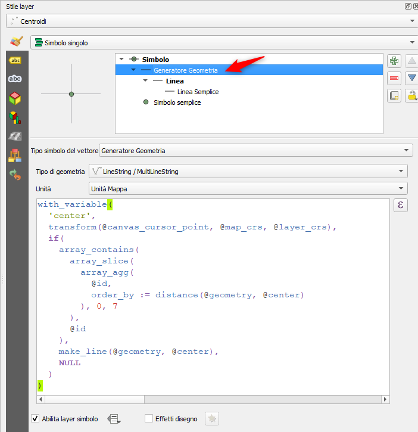
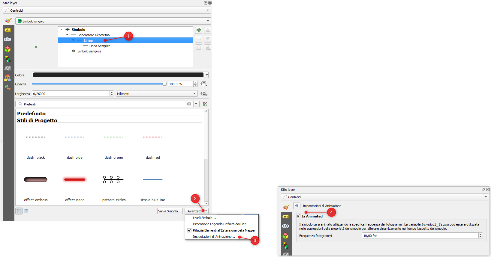
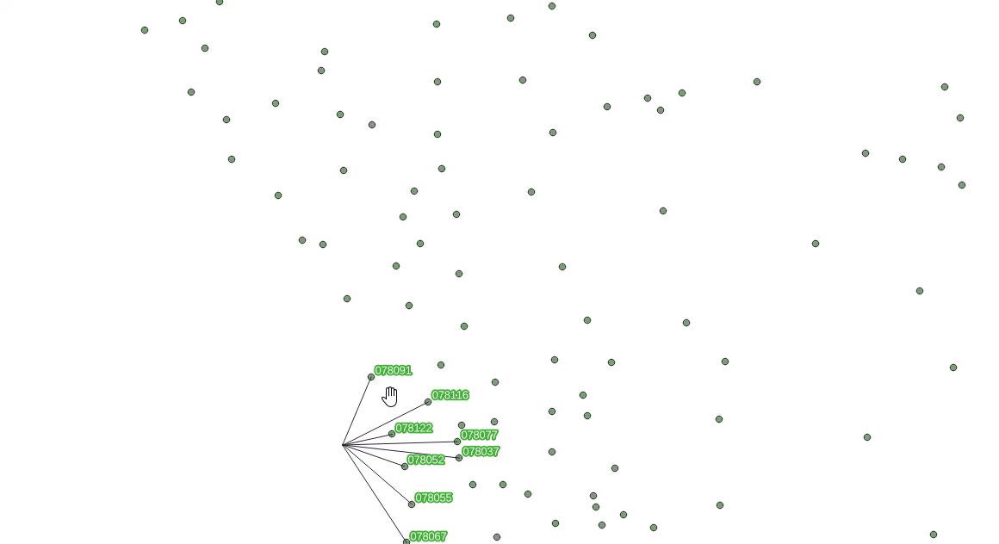

---
tags:
  - punti
  - linee
  - nearest
  - distance
  - geometry_generator
---

# ragnetto

Dato un layer vettoriale, l'espressione permette di simulare un ragnetto che si sposta nella mappa a partire dal centro della stessa mappa e collegandosi ai primi 8 punti più vicini. (per far seguire il mouse usare la variabile `@canvas_cursor_point` al posto di `@map_extent_center`)

L'espressione va utilizzata in un layer di stile come `generatore di geometrie`.

```
with_variable(
  'center',
  transform(@map_extent_center, @map_crs, @layer_crs),
  if(
    array_contains(
      array_slice(
        array_agg(
          @id,
          order_by := distance(@geometry, @center)
        ), 0, 7
      ),
      @id
    ),
    make_line(@geometry, @center),
    NULL
  )
)
```

[](../img/esempi/ragnetto/ragnetto.gif)

- riferimento: <https://discourse.osgeo.org/t/funziona-male-lespressione-overlay-nearest-edit-no/146923>
- ringraziamenti: [Andrea Giudiceandrea](https://github.com/agiudiceandrea)

## Ragnetto insegue puntatore mouse

L'espressione è la seguente:

```
with_variable(
  'center',
  transform(@canvas_cursor_point, @map_crs, @layer_crs),
  if(
    array_contains(
      array_slice(
        array_agg(
          @id,
          order_by := distance(@geometry, @center)
        ), 0, 7
      ),
      @id
    ),
    make_line(@geometry, @center),
    NULL
  )
)
```

[](../img/esempi/ragnetto/img_01.png)

[](../img/esempi/ragnetto/img_02.png)

## Etichette

Per visualizzare le sole etichette degli otti elementi più vicini: attivare l'etichettatura tramite regola e utilizzare la seguente espressione:

```
with_variable(
  'center',
  transform(@canvas_cursor_point, @map_crs, @layer_crs),
  if(
    array_contains(
      array_slice(
        array_agg(
          @id,
          order_by := distance(@geometry, @center)
        ), 0, 7
      ),
      @id
    ),
    true,
    NULL
  )
) is true
```

[](../img/esempi/ragnetto/label_ragnetto.gif)
---

Funzioni e variabili utilizzate:

* [with_variable](../gr_funzioni/generale/generale_unico.md#with_variable)
* [@map_extent_center](../gr_funzioni/variabili/parent.md)
* [@map_crs](../gr_funzioni/variabili/parent.md)
* [@layer_crs](../gr_funzioni/variabili/parent.md)
* [distance](../gr_funzioni/geometria/geometria_unico#distance)
* [make_line](../gr_funzioni/geometria/geometria_unico.md#make_line)
* [transform](../gr_funzioni/geometria/geometria_unico.md#transform)
* [array_contains](../gr_funzioni/array/array_unico.md#array_contains)
* [array_slice](../gr_funzioni/array/array_unico.md#array_slice)
* [array_agg](../gr_funzioni/array/array_unico.md#array_agg)
