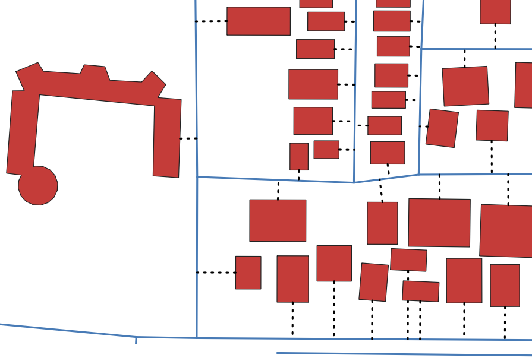
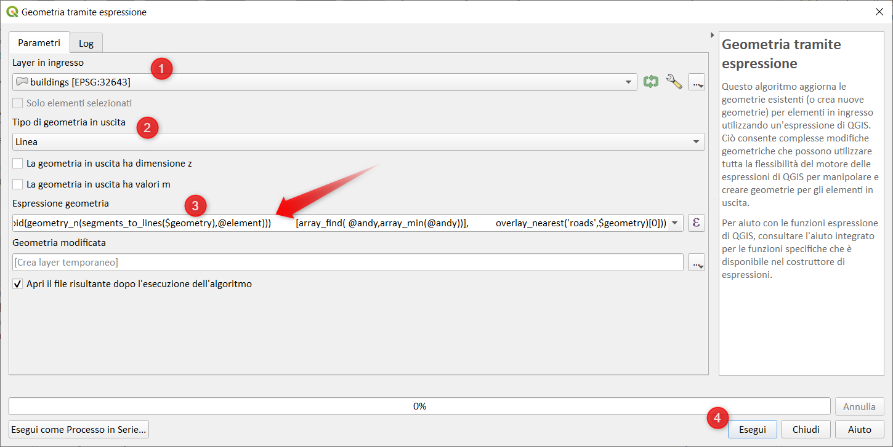

# Segmento minimo tra facciata e strada

[New SpatialAnalysis Challenge](https://twitter.com/spatialthoughts/status/1427691959171248130): Riesci a definire un flusso di lavoro per collegare il bordo di ogni edificio rivolto verso la strada al punto più vicino sul segmento di strada? L'idea alla base della sfida è trovare il bordo del poligono il cui punto centrale è più vicino a una strada e quindi collegarlo con il punto più vicino sulla strada. [tweet](https://twitter.com/spatialthoughts/status/1427691959171248130)



## La mia prima soluzione

```
with_variable('andy',
    array_foreach( array_foreach(
    generate_series(1,num_geometries(segments_to_lines($geometry))),
    centroid(geometry_n(segments_to_lines($geometry),@element))),
    distance(@element, overlay_nearest('roads',$geometry)[0])),
/*shortest line*/
    shortest_line(
        array_foreach(
        generate_series(1, num_geometries( segments_to_lines($geometry))),
        centroid(geometry_n(segments_to_lines($geometry),@element)))
        [array_find( @andy,array_min(@andy))], 
        overlay_nearest('roads',$geometry)[0]))
```

L'espressione può essere usata come tema tramite il _generatore di geometrie_:


oppure direttamente nell'algoritmo _Geometria tramite espressione_ per ottenere un nuovo layer:



altra soluzione con stesso risultato:

```
with_variable('toto',
    collect_geometries( 
    array_foreach(
    generate_series(1,num_geometries(segments_to_lines($geometry))),
    centroid(geometry_n(segments_to_lines($geometry),@element)))),
/*shortest line*/
    shortest_line(@toto,overlay_nearest('roads',$geometry)[0]))
```

ma entrambe le soluzioni hanno un problema, la funzione `overlay_nearest` restituisce la strada più vicina all'edificio e non al centroide della facciata, ecco un esempio estratto dal dataset:


la freccia rossa indica il segmanto più corto tracciato erroneamente in quanto la strada più vicina risulterebbe quella indicata con (1).

La soluzione corretta deve per forza passare per due step:
1. estrarre i centroidi delle facciate:
2. tracciare il segmento più corto.

I centroidi delle facciate degli edifici li estraggo con:

```
collect_geometries (
    array_foreach (
    generate_series (1, num_geometries (segments_to_lines ($ geometry)))),
    centroid (geometry_n (segments_to_lines ($ geometry), @ element))))
```

il segmento più corto lo traccio con:

```
shortest_line( $geometry,
overlay_nearest('roads',$geometry)[0])
```

ecco il risultato:


---

Funzioni e variabili utilizzate:

* [@with_variable](../gr_funzioni/variabili/with_variable.md)
* [generate_series](../gr_funzioni/array/array_unico.md#generate_series)
* [array_foreach](../gr_funzioni/array/array_unico.md#array_foreach)
* [array_find](../gr_funzioni/array/array_unico.md#array_find)
* [num_geometries](../gr_funzioni/geometria/geometria_unico.md#num_geometries)
* [collect_geometries](../gr_funzioni/geometria/geometria_unico.md#collect_geometries)
* [geometry_n](../gr_funzioni/geometria/geometria_unico.md#geometry_n)
* [segments_to_lines](../gr_funzioni/geometria/geometria_unico.md#segments_to_lines)
* [overlay_nearest](../gr_funzioni/geometria/geometria_unico.md#overlay_nearest)
* [distance](../gr_funzioni/geometria/geometria_unico.md#distance)
* [centroid](../gr_funzioni/geometria/geometria_unico.md#centroid)
* [shortest_line](../gr_funzioni/geometria/geometria_unico.md#shortest_line)
* [$geometry](../gr_funzioni/geometria/geometria_unico.md#geometry)

## dati

<https://t.co/u0xGe5YtCT?amp=1>