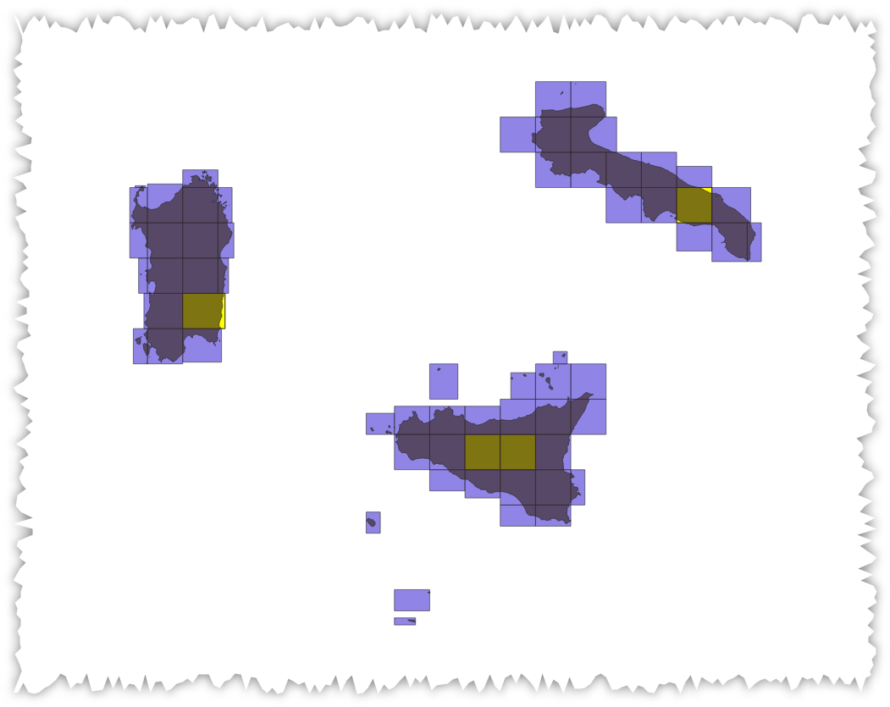

---
tags:
  - selezionare
  - poligoni
  - overlay
---

# Selezionare i riquadri con massima/minima area sovrapposta da altro layer poligonale

Supponiamo di avere il quadro di unione di tutta Italia relativo al [DEM Tinitaly](http://tinitaly.pi.ingv.it/) e di voler selezionare, per ogni regione, quale siano i riquadri con maggiore sovrapposizione di territorio.

Usando solo le espressioni di QGIS e `Select by Expression` , l'espressione da usare è:


```
area(
intersection(
	$geometry,
	overlay_intersects('Reg01012022_G_Wgs84',
						$geometry)[0]))
=
maximum(
		area(
		intersection($geometry,
					overlay_intersects('Reg01012022_G_Wgs84',
										$geometry)[0])),
										group_by:=overlay_intersects('Reg01012022_G_Wgs84',
																	 "cod_reg")[0])
```

per ottenere i riquadri minimi, sostituire la funzione `maximun` con `minimun`:



---

Funzioni e variabili utilizzate:

* [maximum](../gr_funzioni/aggrega/aggrega_unico.md#maximum)
* [intersection](../gr_funzioni/geometria/geometria_unico.md#intersection)
* [area](../gr_funzioni/geometria/geometria_unico.md#area)
* [overlay_intersects](../gr_funzioni/geometria/geometria_unico.md#overlay_intersects)
* [$geometry](../gr_funzioni/geometria/geometria_unico.md#geometry)
