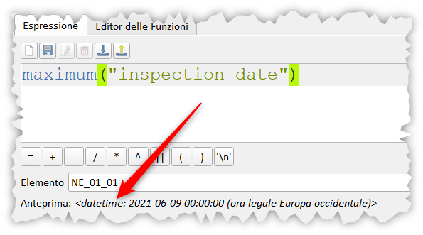

# Selezionare ultimo record per data

L'esempio è preso da qui:

**stackexchange**: <https://gis.stackexchange.com/questions/419587/selecting-latest-record-by-date> :

Una tabella degli attributi (in un GeoPackage) contenente un campo _stringa_ `box_ide` e un campo _data_ `inspection_date`. Le righe della tabella sono simili a:

box_id   | inspection_date
---------|----------------
NE_01_01 | 2021/05/01
NE_01_01 | 2021/05/02
NE_01_01 | 2021/05/04
SE_03_02 | 2021/06/09
SW_01_04 | 2021/06/05
SW_01_04 | 2021/06/07

come selezionare quei record con l'ultimo `inspection_date` per ciascuno `box_id`.

Usando i dati di esempio, la selezione risultante sarebbe simile a:

box_id   | inspection_date
---------|----------------
NE_01_01 | 2021/05/04
SE_03_02 | 2021/06/09
SW_01_04 | 2021/06/07

## Funzione di Aggregazione

Usando le funzioni di aggregazione, per esempio `maximum`:

```
"inspection_date" = maximum("inspection_date", group_by:="box_id")
```

non funziona in quanto (sembra) la funzione `maximum` trasformi un oggetto `QDate` in `QDateTime` e di conseguenza l'uguaglianza non è mai verificata, infatti l'espressione:

```
maximum("inspection_date") → <datetime: 2021-06-09 00:00:00 (ora legale Europa occidentale)>
```

per ovviare occorre trasformare l'output della funzione maximun in data:

```
"inspection_date" = to_date(maximum("inspection_date", group_by:="box_id"))
```

questa funziona!!!

[](../img/esempi/selezione_ultimo_record_per_data/img_01.png)

## Funzioni Array

Usando gli Array non occorre nessuna trasformazione:

```
"inspection_date" =
       array_max(array_agg("inspection_date", group_by:="box_id"))
```

[](https://i.stack.imgur.com/3qqfc.png)

## Osservazione

Dal menù **Impostazioni | Opzioni** è possibile modificare la visualizzazione delle date:

[](../img/esempi/selezione_ultimo_record_per_data/img_02.png)

### prova tu

[Geopackage](../prova_tu/layers.gpkg)

---

Funzioni e variabili utilizzate:

* [maximum](../gr_funzioni/aggrega/aggrega_unico/#maximum)
* [array_agg](../gr_funzioni/array/array_unico.md#array_agg)
* [array_max](../gr_funzioni/array/array_unico.md#array_max)

