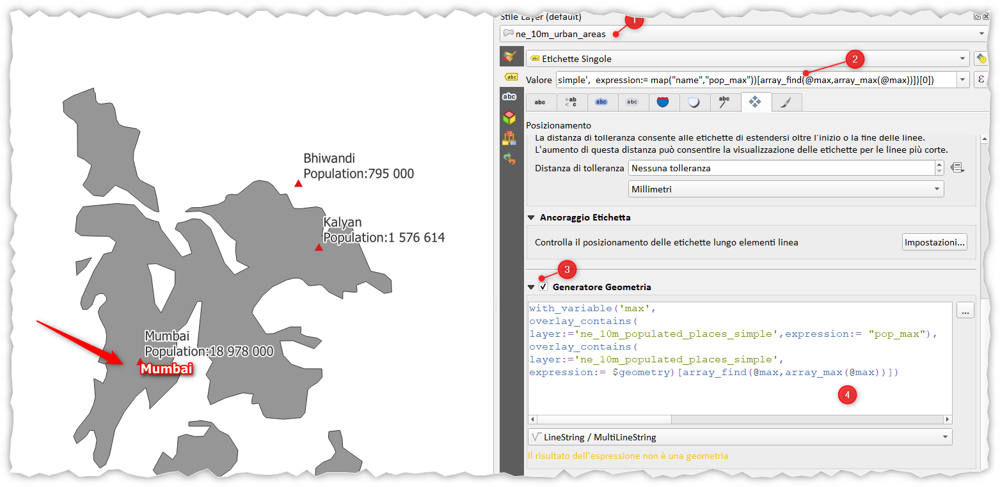

---
tags:
  - spatial-join
  - aggregare
  - challenge
---

# Spatial join con condizione

L’unione spaziale di attributi è un problema frequente in ambito GIS - si tratta di trasferire attributi da un layer ad un altro basandosi solo sulle loro reciproche relazioni spaziali, in questo esempio aggiungiamo una difficoltà in più, ovvero, una condizione. 

Il quesito nasce da [questa](https://twitter.com/spatialthoughts/status/1684895102001614848) challenge, proposta da [Ujaval Gandhi](https://twitter.com/spatialthoughts) e chiede:


Hai uno strato poligonale di aree urbane e uno strato puntuale di luoghi.Etichettare il poligono con il nome della città con popolazione maggiore usando una spatial join con condizione? 


[](https://pbs.twimg.com/media/F2HzGagbcAA8NpB?format=jpg&name=large)

qui i dati: <https://t.co/fqEKY68uGC>

## Soluzione proposta da Ujaval Gandhi

```
array_get(aggregate(
  layer:='ne_10m_populated_places_simple',
  aggregate:='array_agg',
  expression:="name",
  filter:=intersects($geometry, geometry(@parent)), order_by:="POP_MAX"), -1)
```

nel linguaggio umano:<br>
Ordina in modo crescente (_order_by_) la popolazione relativa ai punti che ricadono dentro (_aggregate_) i poligoni ed estrai il nome della città.
dove:
- array_agg: crea un array che contiene i nomi delle città dentro i poligoni;
- il filtro ordina i punti usando la popolazione

video youtube: <https://youtu.be/qpiFT8UHhwM>

## Soluzione proporta da Totò Fiandaca

nel linguaggio umano:<br>
Crea una variabile e la popola con il valore massimo della popolazione dei punti che ricadono dentro ogni poligono (ma non so ancora il nome della città), quindi ripeto la ricerca creando una mappa (_map("name","pop_max")_) e tra le varie mappe, prendo quella con popolazione maggiore (quest'ultima ricerca la fa array_find).

```
with_variable('max',
  overlay_contains(
    layer:='ne_10m_populated_places_simple',expression:= "pop_max"),
map_akeys( 
  overlay_contains(
    layer:='ne_10m_populated_places_simple',
    expression:= map("name","pop_max"))[array_find(@max,array_max(@max))])[0])
```
oppure:

```
with_variable('max',
  overlay_contains(
    layer:='ne_10m_populated_places_simple',expression:= "pop_max"),
attribute(overlay_contains(
  layer:='ne_10m_populated_places_simple',
  expression:= @feature)[array_find(@max,array_max(@max))],'name'))
```

in questo caso ho usato la variabile `@faeture` che contiene l'intero rigo (compreso di geometria) dell'elemento valutato; quindi, usando `attribute` posso richiamare qualsiasi attributo delle riga.

video youtube: <https://youtu.be/NOgDku2S9ws>

### posizionare l'etichetta

Per posizionare l'etichetta nel corretto punto, corrispondente al punto della città con popolazione maggiore, occorre usare questa espressione nel tab `posizione` Generatore geometria:

```
with_variable('max',
  overlay_contains(
  layer:='ne_10m_populated_places_simple',expression:= "pop_max"),
overlay_contains(
  layer:='ne_10m_populated_places_simple',
  expression:= $geometry)[array_find(@max,array_max(@max))])
```

[](../img/esempi/spatial_join_condizionato/img01.png)
---

Funzioni e variabili utilizzate:

* [@parent](../gr_funzioni/variabili/parent.md)
* [with_variable](../gr_funzioni/variabili/with_variable.md)
* [aggregate](../gr_funzioni/aggrega/aggrega_unico.md#aggregate)
* [geometry](../gr_funzioni/geometria/geometria_unico.md#geometry)
* [to_string](../gr_funzioni/stringhe_di_testo/stringhe_di_testo_unico.md#to_string)
* [intersects](../gr_funzioni/geometria/geometria_unico.md#intersects)
* [$geometry](../gr_funzioni/geometria/geometria_unico.md#geometry)
* [overlay_contains](../gr_funzioni/geometria/geometria_unico.md#overlay_contains)
* [map](../gr_funzioni/maps/maps_unico.md#map)
* [map_akeys](../gr_funzioni/maps/maps_unico.md#map_akeys)
