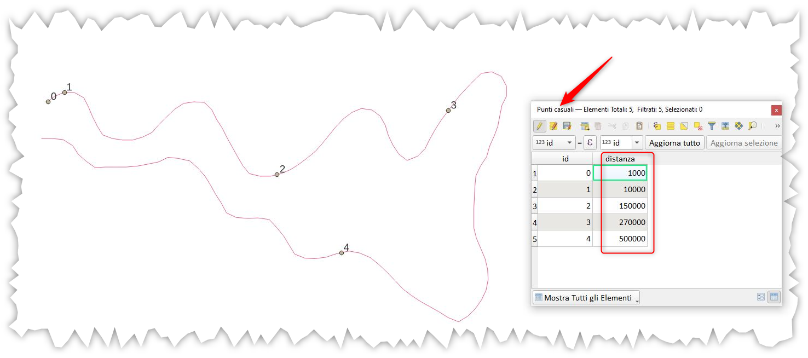

---
tags:
  - linee
  - punti
---

# Tracciare punti a distanza prefissata lungo una linea

Come tracciare dei punti su una linea a distanza prefissata a partire dall'origine della linea:

[](../img/esempi/tracciare_punti_adistanzaprefissata_lungo_linea/ing_01.png)

1. tracciare dei _punti casuali_ sulla linea (nome layer:_linea_);
2. nella tabella attributi, dei _punti casuali_, aggiungere un campo `distanza` e popolere con le distanze desiderate (a partire dallo `start_point` della linea);
3. _**aggiornare**_ la geometria dei punti usando il field calc e la seguente espressione:

```
 line_interpolate_point( 
	overlay_nearest('linea',$geometry)[0],
					       "distanza") 
```

video: <https://youtu.be/iYPjdYOHSLc>

## Usando algoritmo di processing

È possibile creare direttamente la geometria punto usando l'algoritmo `Geometria con Espressione` a partire dal Layer in ingresso il layer lineare, tipo di geometria `Punto` ed espressione:

```
collect_geometries( 
    array_foreach(array(1000,10000,150000,270000,500000),
    line_interpolate_point($geometry,@element)))
```

[](../img/esempi/tracciare_punti_adistanzaprefissata_lungo_linea/ing_02.png)

---

Funzioni e variabili utilizzate:

* [overlay_nearest](../gr_funzioni/geometria/geometria_unico.md#overlay_nearest)
* [collect_geometries](../gr_funzioni/geometria/geometria_unico.md#collect_geometries)
* [line_interpolate_point](../gr_funzioni/geometria/geometria_unico.md#line_interpolate_point)
* [\$geometry](../gr_funzioni/geometria/geometria_unico.md#geometry)
* [array_foreach](../gr_funzioni/array/array_unico.md#array_foreach)
* [array](../gr_funzioni/array/array_unico.md#array)
