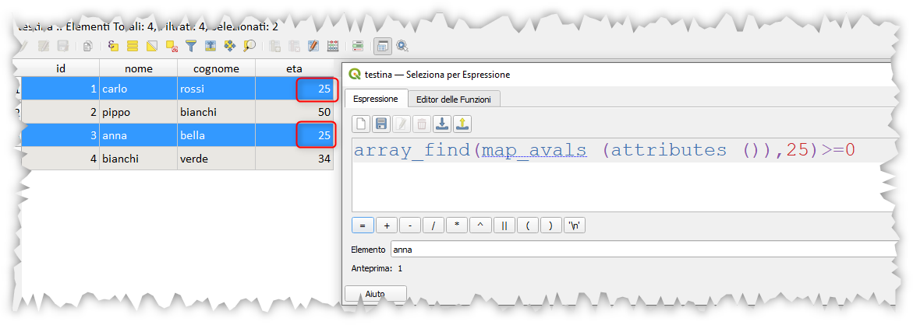

# Trova nella tabella attributi

La ricerca di un valore (numero o stringa) avviene sempre all'interno di un campo, ma se volessimo fare una ricerca su tutta la tabella attributi? ecco un trucco:

Usando solo le espressioni di QGIS e `Select by Expression` , l'espressione da usare è:

```
array_find(map_avals (attributes ()),'valore')>=0
```

dove:

- 'valore' = 'stringa da cercare tra apici'
- 'valore' = x numero senza apici

## esempio

id|nome|cognome|eta
--|----|-------|---
1|carlo|rossi|25
2|pippo|bianchi|50
3|anna|bella|25
4|bianchi|verde|34

se volessi selezionare le feature che contenessero, non importa in quale campo, il valore 25:

```
array_find(map_avals (attributes ()),25)>=0
```

selezionerebbe la prima e la terza riga;



se invece volessi cercare, la parola `bianchi`:

```
array_find(map_avals (attributes ()),'bianchi')>=0
```

otterrei selezionate le righe 2 e 4


---

Funzioni e variabili utilizzate:

* [array_find](../gr_funzioni/array/array_unico.md#array_find)
* [map_avals](../gr_funzioni/maps/maps_unico/#map_avals)
* [attributes](../gr_funzioni/record_e_attributi/record_e_attributi_unico/#attributes)

