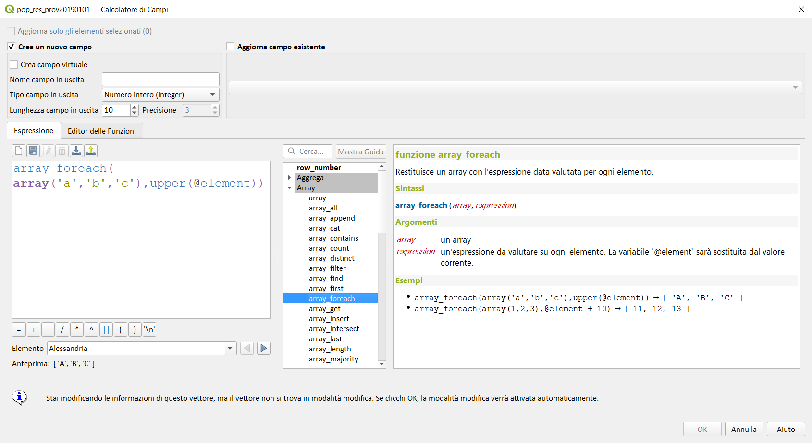

# array_foreach

Restituisce una matrice con l'espressione data valutata su ciascun elemento.

## Sintassi

array_foreach(_array,expression_)

## Argomenti

* _array_ un array
* _expression_ un'espressione da valutare su ogni oggetto. La variabile `@element` sarà sostituita dal valore corrente.

## Esempi

* `array_foreach(array('a','b','c'),upper(@element)) → array: 'A', 'B', 'C'`
* `array_foreach(array(1,2,3),@element + 10) → array: 11, 12, 13`

## nota bene

--

## osservazioni

Funzione utile, assieme ad altre, nel compositore di stampe o nella decorazione copyright.

[Tweet](https://twitter.com/etrimaille/status/1032631326418067457)
