# Gruppo Array

!!! Abstract
    **Questo gruppo contiene funzioni espressione per la creazione e la manipolazione di array (noti anche come strutture dati ad elenco). L'ordine dei valori all'interno dell'array è importante, al contrario della struttura dati 'a mappa', in cui l'ordine delle coppie chiave-valore è irrilevante e i valori vengono identificati dalle loro chiavi.**

---

## array

Restituisce un array contenente tutti i valori passati come parametro.

Sintassi:

- array(_<span style="color:red;">value1</span>, <span style="color:red;">value2</span>, …)

Argomenti:

* _<span style="color:red;">value</span>_ un valore

Esempi:

```
array(2,10) → array: 2, 10
```

[](../../img/array/array/array1.png)

---

## array_all

Restituisce true se un array contiene tutti i valori di un determinato array.

Sintassi:

- array_all(_<span style="color:red;">array_a</span>_, _<span style="color:red;">array_b</span>_, …_)

Argomenti:

* _<span style="color:red;">array_a</span>_ un array
* _<span style="color:red;">array_b</span>_ un array di valori da cercare

Esempi:

```
array_all(array(1,2,3),array(2,3)) → vero
array_all(array(1,2,3),array(1,2,4)) → falso
```

[](../../img/array/array_all/array_all1.png)

---

## array_append

Restituisce un array con il valore passato aggiunto alla fine.

Sintassi:

- array_append(_<span style="color:red;">array</span>, <span style="color:red;">value</span>_)

Argomenti:

* _<span style="color:red;">array</span>_ un array
* _<span style="color:red;">value</span>_ il valore da aggiungere

Esempi:

```
array_append(array(1,2,3),4) → array: 1,2,3,4
```

[](../../img/array/array_append/array_append1.png)

---

## array_cat

Restituisce un array contenente tutti gli arrays passati concatenati.

Sintassi:

- array_cat(_<span style="color:red;">array1</span>, <span style="color:red;">array2</span>, <span style="color:red;">…</span>_)

Argomenti:

* _<span style="color:red;">array</span>_ un array

Esempi:

```
array_cat(array(1,2),array(2,3)) → array: 1,2,2,3
```

[](../../img/array/array_cat/array_cat1.png)

---

## array_contains

Restituisce _true_ se un array contiene il valore specificato.

Sintassi:

- array_contains(_<span style="color:red;">array</span>, <span style="color:red;">value</span>_)

Argomenti:

* _<span style="color:red;">array</span>_ un array
* _<span style="color:red;">value</span>_ il valore da cercare

Esempi:

```
array_contains(array(1,2,3),2) → true
```

[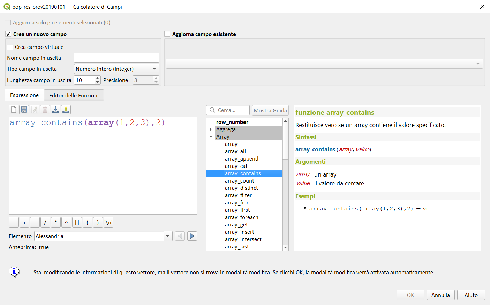](../../img/array/array_contains/array_contains1.png)

---

## array_count

Conta il numero di occorrenze di un dato valore in un array.

Sintassi:

- array_count(_<span style="color:red;">array</span>_,_<span style="color:red;">value</span>_)

Argomenti:

* _<span style="color:red;">array</span>_ un array
* _<span style="color:red;">value</span>_ un valore da contare

Esempi:

```
array_count(array('a', 'b', 'c', 'b'), 'b') → 2
```

[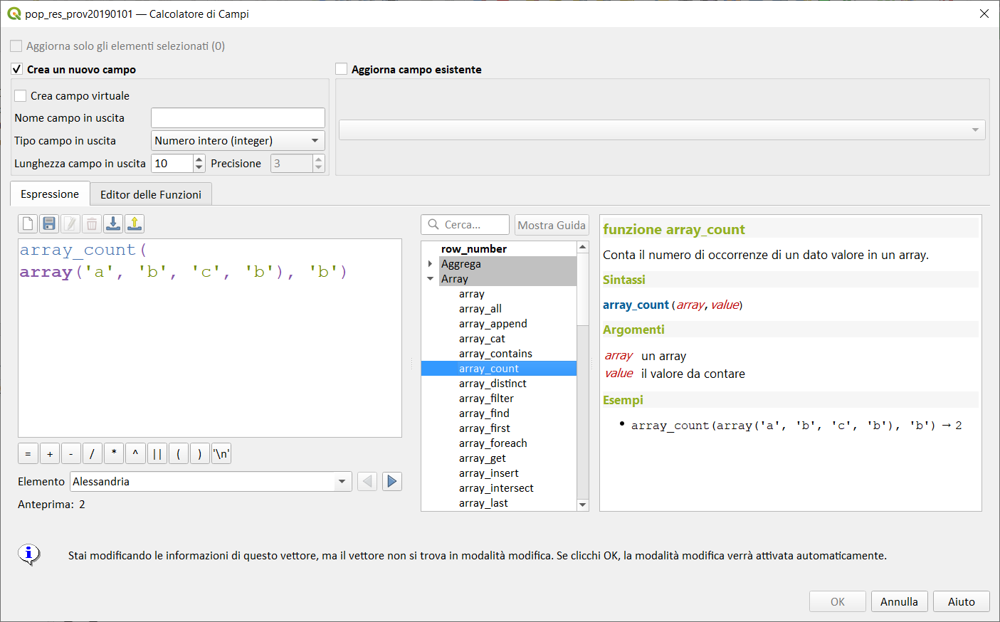](../../img/array/array_count/img_02.png)

---

## array_distinct

Restituisce un array contenente valori distinti dell'array dato.

Sintassi:

- array_distinct(_<span style="color:red;">array</span>_)

Argomenti:

* _<span style="color:red;">array</span>_ un array

Esempi:

```
array_distinct(array(1,2,3,2,1)) → array: 1,2,3
```

[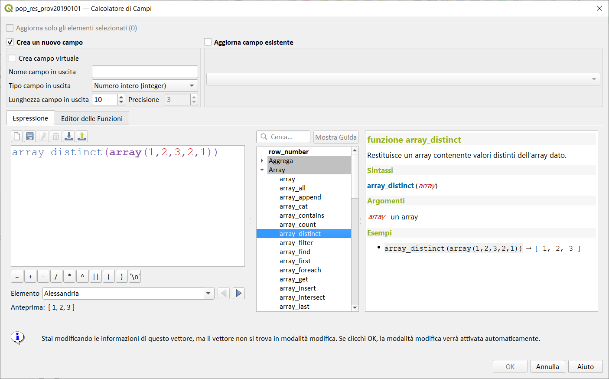](../../img/array/array_distinct/array_distinct1.png)

---

## array_filter

Restituisce un array con solo gli elementi per i quali l'espressione restituisce true (vero).

Sintassi:

- array_filter(_<span style="color:red;">array</span>,<span style="color:red;">expression</span>_[,_<span style="color:red;">limit=0</span>_])

Argomenti:

* _<span style="color:red;">array</span>_ un array
* _<span style="color:red;">expression</span>_ un'espressione da valutare su ogni oggetto. La variabile `@ element` sarà sostituita dal valore corrente.
* _<span style="color:red;">limit</span>_ numero massimo di elementi da restituire. Usa 0 per restituire tutti i valori.


Esempi:

```
array_filter(array(1,2,3),@element < 3) → [ 1, 2 ]
```

[](../../img/array/array_filter/array_filter1.png)

---

## array_find

Restituisce l'indice (0 per il primo elemento) di un valore all'interno di un array. Restiuisce -1 se il valore non viene trovato

Sintassi:

- array_find(_<span style="color:red;">array</span>, <span style="color:red;">value</span>_)

Argomenti:

* _<span style="color:red;">array</span>_ un array
* _<span style="color:red;">value</span>_ il valore da cercare

Esempi:

```
array_find(array(1,2,3),2) → 1
```

[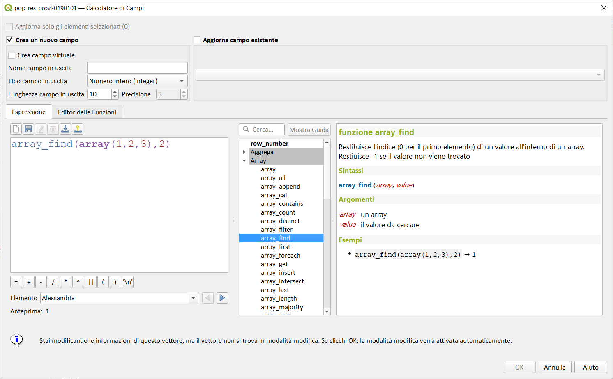](../../img/array/array_find/array_find1.png)

---

## array_first

Restituisce il primo valore di un array.

Sintassi:

* array_first(_<span style="color:red;">array</span>_)

Argomenti:

* _<span style="color:red;">array</span>_ un array

Esempi:

```
array_first(array('a','b','c')) → 'a'
```

[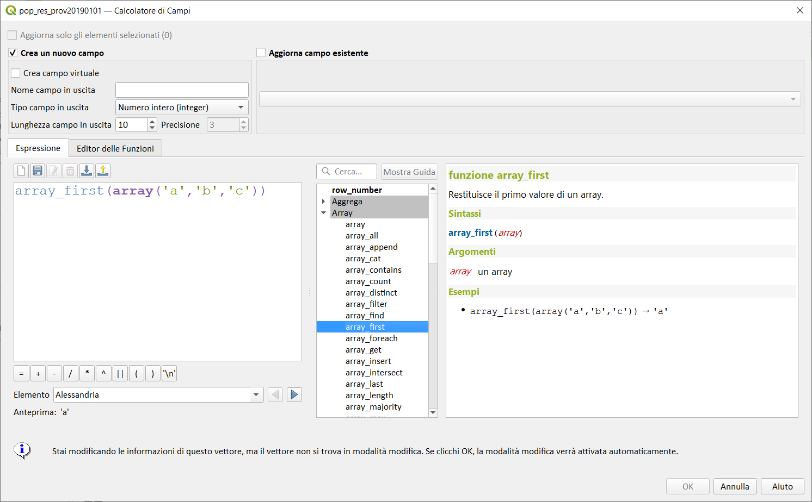](../../img/array/array_first/array_first1.png)

---

## array_foreach

Restituisce una matrice con l'espressione data valutata su ciascun elemento.

Sintassi:

- array_foreach(_<span style="color:red;">array</span>,<span style="color:red;">expression</span>_)

Argomenti:

* _<span style="color:red;">array</span>_ un array
* _<span style="color:red;">expression</span>_ un'espressione da valutare su ogni oggetto. La variabile `@element` sarà sostituita dal valore corrente.

Esempi:

```
array_foreach(array('a','b','c'),upper(@element)) → [ 'A', 'B', 'C' ]
array_foreach(array(1,2,3),@element + 10) → [ 11, 12, 13 ]
```

[](../../img/array/array_foreach/array_foreach1.png)

Osservazioni

Funzione utile, assieme ad altre, nel compositore di stampe o nella decorazione copyright.

[Tweet](https://twitter.com/etrimaille/status/1032631326418067457)

---

## array_get

Restituisce l'ennesimo valore (0 per il primo) o l'ultimo -Nesimo valore (-1 per l'ultimo) di un array. Aggiornato a QGIS 3.18

Sintassi:

* array_get(_<span style="color:red;">array</span>_, _<span style="color:red;">index</span>_)

Argomenti:

* _<span style="color:red;">array</span>_ un array
* _<span style="color:red;">index</span>_ l'indice da estrarre (partendo da 0)

Esempi:

```
array_get(array('a','b','c'),-1) → 'c'
```

[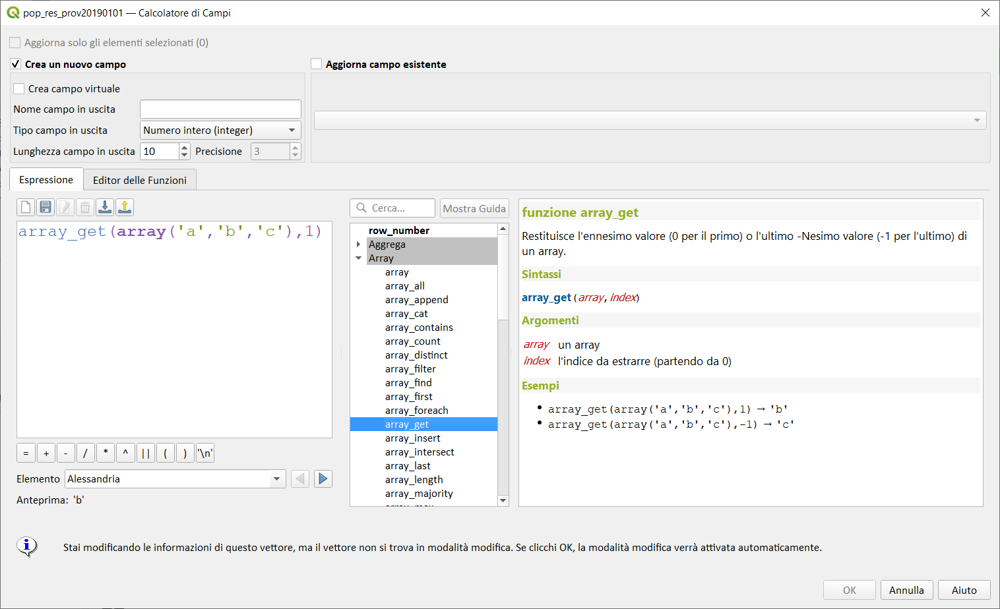](../../img/array/array_get/array_get1.png)

---

## array_insert

Restituisce un array con il valore passato aggiunto nella posizione indicata.

Sintassi:

* array_insert(_<span style="color:red;">array</span>, <span style="color:red;">pos</span>, <span style="color:red;">value</span>_)

Argomenti:

* _<span style="color:red;">array</span>_ un array
* _<span style="color:red;">pos</span>_ la posizione in cui aggiungere (partendo da 0)
* _<span style="color:red;">value</span>_ il valore da aggiungere

Esempi:

```
array_insert(array(1,2,3),1,100) → [ 1, 100, 2, 3 ]
```

[](../../img/array/array_insert/array_insert1.png)

---

## array_intersect

Restituisce true (vero) se almeno un elemento dell'_array1_ esiste in _array2_.

Sintassi:

- array_intersect(_<span style="color:red;">array1</span>, <span style="color:red;">array2</span>_)

Argomenti:

* _<span style="color:red;">array1</span>_ un array
* _<span style="color:red;">array2</span>_ un altro array

Esempi:

```
array_intersect(array(1,2,3,4),array(4,0,2,5)) → true
```

[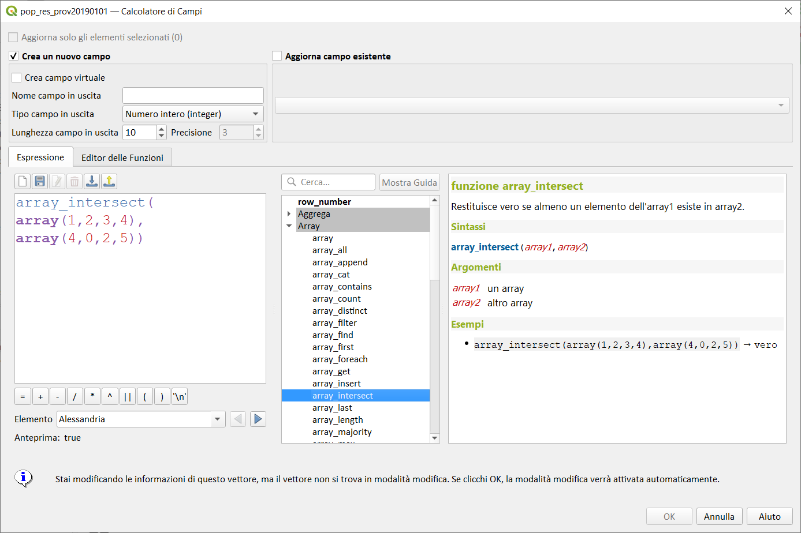](../../img/array/array_intersect/array_intersect1.png)

---

## array_last

Restituisce l'ultimo valore di un array.

Sintassi:

- array_last(_<span style="color:red;">array</span>_)

Argomenti:

* _<span style="color:red;">array</span>_ un array

Esempi:

```
array_last(array('a','b','c')) → 'c'
```

[](../../img/array/array_last/array_last1.png)

---

## array_length

Restituisce il numero di elementi di un array.

Sintassi:

* array_length(_<span style="color:red;">array</span>_)

Argomenti:

* _<span style="color:red;">array</span>_ un array

Esempi:

```
array_length(array(1,2,3)) → 3
```

[](../../img/array/array_length/array_length1.png)

---

## array_majority

Restituisce i valori più comuni in un array.

Sintassi:

- array_majority(_<span style="color:red;">array</span>_[,_<span style="color:red;">option='all'</span>_])  

Argomenti:

* _<span style="color:red;">array</span>_ un array
* _<span style="color:red;">option='all'</span>_ una stringa che specifica la gestione dei valori restituiti. Le opzioni valide sono:

- _all_: Predefinito, tutti i valori più comuni vengono restituiti in un array.
- _any_: Restituisce uno dei valori più comuni.
- _median_: Restituisce la mediana dei valori più comuni. I valori non aritmetici sono ignorati.
- _real_majority_: Restituisce il valore che si verifica più della metà delle volte rispetto alla dimensione dell'array.

Esempi:

```
array_majority(array(0,1,42,42,43), 'all') → [ 42 ]
array_majority(array(0,1,42,42,43,1), 'all') → [ 42, 1 ]
array_majority(array(0,1,42,42,43,1), 'any') → 1 or 42
array_majority(array(0,1,1,2,2), 'median') → 1.5
array_majority(array(0,1,42,42,43), 'real_majority') → NULL
array_majority(array(0,1,42,42,43,42), 'real_majority') → NULL
array_majority(array(0,1,42,42,43,42,42), 'real_majority') → 42
```

[](../../img/array/array_majority/array_majority1.png)

---

## array_max

Restituisce il valore massimo di un array.

Sintassi:

- array_max(_<span style="color:red;">array</span>_) 

Argomenti:

* _<span style="color:red;">array</span>_ un array o stringa (valori separati da virgola) 

Esempi:

```
array_max(array(0,42,4,2)) → 42
```

[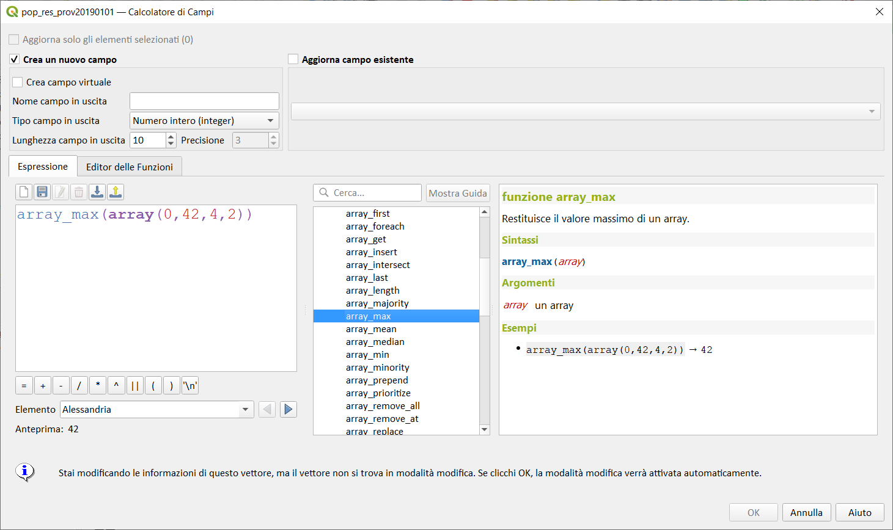](../../img/array/array_max/array_max1.png)

---

## array_mean

Restituisce la media dei valori aritmetici in un array. I valori non-numerici nell'array vengono ignorati.

Sintassi:

- array_mean(_<span style="color:red;">array</span>_)  

Argomenti:

* _<span style="color:red;">array</span>_ un array

Esempi:

```
array_mean(array(0,1,7,66.6,135.4)) → 42.000000
array_mean(array(0,84,'a','b','c')) → 42
```

[](../../img/array/array_mean/array_mean.png)

---

## array_median

Restituisce la mediana dei valori aritmetici in un array. I valori non-numerici nell'array vengono ignorati.

Sintassi:

- array_median(_<span style="color:red;">array</span>_)

Argomenti:

* _<span style="color:red;">array</span>_ un array

Esempi:

```
array_median(array(0,1,42,42,43)) → 42
array_median(array(0,1,2,42,'a','b')) → 1.5`
```

[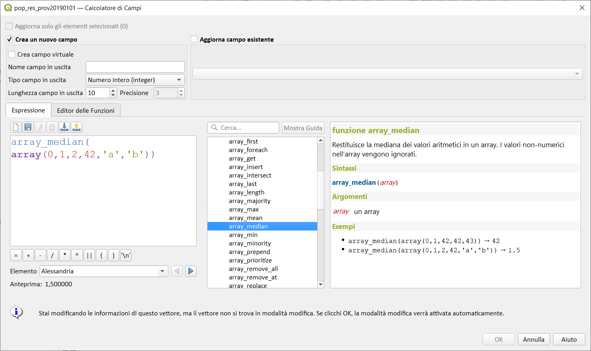](../../img/array/array_median/array_median.png)

---

## array_min

Restituisce il valore minimo di un array.

Sintassi:

- array_min(_<span style="color:red;">array</span>_) 

Argomenti:

* _<span style="color:red;">array</span>__ un array o stringa (valori separati da virgola)

Esempi:

```
array_min(array(43,42,54)) → 42
```

[](../../img/array/array_min/array_min1.png)

---

## array_minority

Restituisce i valori meno comuni in un array.

Sintassi:

- array_minority(_<span style="color:red;">array</span>_[,_<span style="color:red;">option='all'</span>_])  

Argomenti:

* _<span style="color:red;">array</span>_ un array
* _<span style="color:red;">option='all'</span>_ una stringa che specifica la gestione dei valori restituiti. Le opzioni valide sono:

- _all_: Predefinito, tutti i valori meno comuni vengono restituiti in un array.
- _any_: Restituisce uno dei valori meno comuni.
- _median_: Restituisce la mediana dei valori meno comuni. I valori non aritmetici sono ignorati.
- _real_minority_: Restituisce valori che si verificano meno della metà delle volte rispetto alla dimensione dell'array.

Esempi:

```
array_minority(array(0,42,42), 'all') → [ 0 ]
array_minority(array(0,1,42,42), 'all') → [ 0, 1 ]
array_minority(array(0,1,42,42,43,1), 'any') → 0 or 43
array_minority(array(1,2,3,3), 'median') → 1.5
array_minority(array(0,1,42,42,43), 'real_minority') → [ 42, 43, 0, 1 ]
array_minority(array(0,1,42,42,43,42), 'real_minority') → [ 42, 43, 0, 1 ]
array_minority(array(0,1,42,42,43,42,42), 'real_minority') → [ 43, 0, 1 ]
```

[](../../img/array/array_minority/array_minority1.png)

---

## array_prepend

Restituisce un array con il valore dato aggiunto all'inizio.

Sintassi:

* array_prepend(_<span style="color:red;">array</span>, <span style="color:red;">value</span>_)

Argomenti:

* _<span style="color:red;">array</span>_ un array
* _<span style="color:red;">value</span>_ il valore da aggiungere

Esempi:

```
array_prepend(array(1,2,3),0) → [ 0, 1, 2, 3 ]
```

[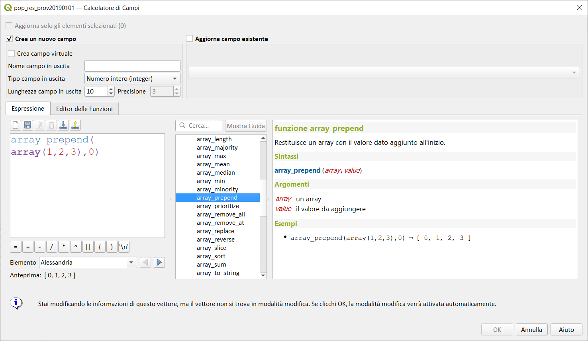](../../img/array/array_prepend/array_prepend1.png)

---

## array_prioritize

Restituisce un array ordinato usando l'ordine specificato in un altro array. I valori che sono presenti nel primo array ma assenti nel secondo array saranno aggiunti alla fine del risultato.

Sintassi:

- array_prioritize(_<span style="color:red;">array</span>_,_<span style="color:red;">array_prioritize</span>_) 

Argomenti:

* _<span style="color:red;">array</span>_ un array o stringa (valori separati da virgola) 
* _<span style="color:red;">array_prioritize</span>_ array o stringa (valori separati da virgola) contenenti i valori ordinati

Esempi:

```
array_prioritize(array(1, 8, 2, 5), array(5, 4, 2, 1, 3, 8)) → [ 5, 2, 1, 8 ]
array_prioritize(array(5, 4, 2, 1, 3, 8), array(1, 8, 6, 5)) → [ 1, 8, 5, 4, 2, 3 ]
```

[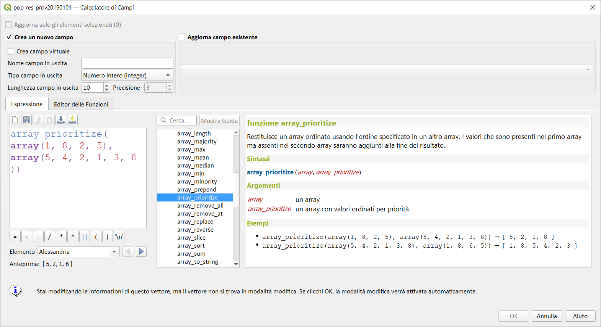](../../img/array/array_prioritize/array_prioritize1.png)

---

## array_remove_all

Restituisce un array con tutti gli elementi del valore passato rimossi.

Sintassi:

* array_remove_all(_<span style="color:red;">array</span>, <span style="color:red;">value</span>_)

Argomenti:

* _<span style="color:red;">array</span>_ un array
* _<span style="color:red;">value</span>_ i valori da rimuovere

Esempi:

```
array_remove_all(array('a','b','c','b'),'b') → [ 'a', 'c' ]
```

[](../../img/array/array_remove_all/array_remove_all1.png)

---

## array_remove_at

Restituisce un array con l'elemento in corrispondenza dell'indice dato rimosso. Supporta indice positivo (0 per il primo elemento) e negativo (l'ultimo -Nesimo valore, -1 per l'ultimo elemento) da >= QGIS 3.24.

Sintassi:

* array_remove_at(_<span style="color:red;">array</span>, <span style="color:red;">pos</span>_)

Argomenti:

* _<span style="color:red;">array</span>_ un array
* _<span style="color:red;">pos</span>_ la posizione da rimuovere (partendo da 0)

Esempi:

```
array_remove_at(array(1,2,3),1) → [ 1, 3 ]
```

[](../../img/array/array_remove_at/array_remove_at1.png)

---

## array_replace

Restituisce un array con il valore, l'array o la mappa dei valori forniti sostituiti.

### Valore & variante dell'array

Restituisce un array con il valore o con un array di valori forniti sostituito da un altro valore o da un altro array di valori.

Sintassi:

- array_replace(_<span style="color:red;">array</span>_,_<span style="color:red;">before</span>_,_<span style="color:red;">after</span>_)

Argomenti:

- _<span style="color:red;">array</span>_ l'array in ingresso
- _<span style="color:red;">before</span>_ il valore o l'array di valori da sostituire
- _<span style="color:red;">after</span>_ il valore o l'array di valori da utilizzare come sostituzione

Esempi:

```
array_replace(array('QGIS','SHOULD','ROCK'),'SHOULD','DOES') → [ 'QGIS', 'DOES', 'ROCK' ]
array_replace(array(3,2,1),array(1,2,3),array(7,8,9)) → [ 9, 8, 7 ]
array_replace(array('Q','G','I','S'),array('Q','S'),'-') → [ '-', 'G', 'I', '-' ]
```

[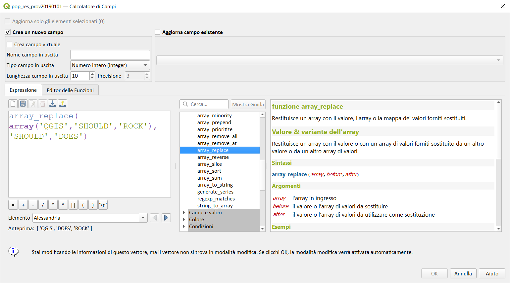](../../img/array/array_replace/img_01.png)

### Variabile mappa

Restituisce un array con le chiavi della mappa fornite sostituite dai loro valori abbinati.

Sintassi:

- array_replace(_<span style="color:red;">array</span>_,_<span style="color:red;">map</span>_)

Argomenti:

- _<span style="color:red;">array</span>_ l'array in ingresso
- _<span style="color:red;">map</span>_ la mappa che contiene le chiavi e i valori

Esempi:

```
array_replace(array('APP', 'SHOULD', 'ROCK'),map('APP','QGIS','SHOULD','DOES')) → [ 'QGIS', 'DOES', 'ROCK' ]
```

[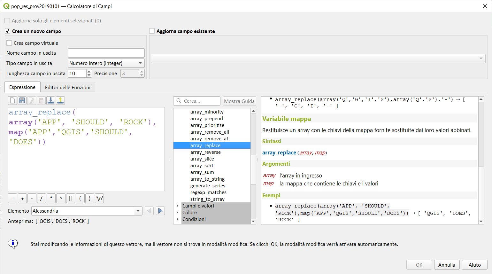](../../img/array/array_replace/img_02.png)

---

## array_reverse

Restituisce l'array dato con valori dell'array in ordine inverso.

Sintassi:

* array_reverse(_<span style="color:red;">array</span>_)

Argomenti:

* _<span style="color:red;">array</span>_ un array

Esempi:

```
array_reverse(array(2,4,0,10)) → [ 10, 0, 4, 2 ]
```

[](../../img/array/array_reverse/array_reverse1.png)

---

## array_slice

Restituisce una porzione dell'array. Il taglio è definito dagli argomenti _start_pos_ e _end_pos_.

Sintassi:

* array_slice(_<span style="color:red;">array</span>, <span style="color:red;">start_pos</span>, <span style="color:red;">end_pos</span>_)

Argomenti:

* _<span style="color:red;">array</span>_ un array
* _<span style="color:red;">start_pos</span>_ l'indice della posizione iniziale della fetta (a partire da 0). L'indice start_pos è incluso nella fetta. Se si utilizza un valore negativo di start_pos, l'indice è contato dalla fine della lista (a partire da -1).
* _<span style="color:red;">end_pos</span>_ l'indice della posizione finale della fetta (a partire da 0). L'indice end_pos è incluso nella fetta. Se si utilizza un valore negativo di start_pos, l'indice è contato dalla fine della lista (a partire da -1).

Esempi:

```
array_slice(array(1,2,3,4,5),0,3) → [ 1, 2, 3, 4 ]
array_slice(array(1,2,3,4,5),0,-1) → [ 1, 2, 3, 4, 5 ]
array_slice(array(1,2,3,4,5),-5,-1) → [ 1, 2, 3, 4, 5 ]
array_slice(array(1,2,3,4,5),0,0) → [ 1 ]
array_slice(array(1,2,3,4,5),-2,-1) → [ 4, 5 ]
array_slice(array(1,2,3,4,5),-1,-1) → [ 5 ]
array_slice(array('Dufour','Valmiera','Chugiak','Brighton'),1,2) → [ 'Valmiera', 'Chugiak' ]
array_slice(array('Dufour','Valmiera','Chugiak','Brighton'),-2,-1) → [ 'Chugiak', 'Brighton' ]
```

[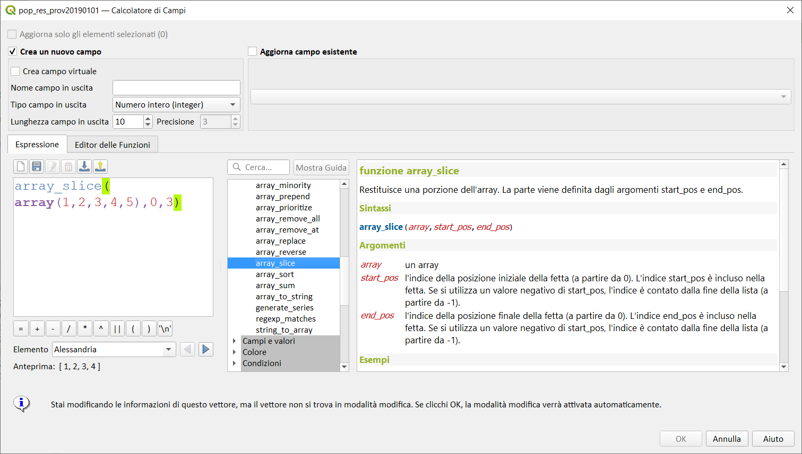](../../img/array/array_slice/array_slice1.png)

---

## array_sort

Ordina i valori in ordine crescente (usa _array_reverse_ per desc).

Sintassi:

- array_sort(_<span style="color:red;">array</span>_[,_<span style="color:red;">ascending=true</span>_]) 

Argomenti:

* _<span style="color:red;">array</span>_ un array o stringa (valori separati da virgola)
* _<span style="color:red;">ascending</span>_ imposta questo parametro a false per ordinare l'array in modo decrescente

Esempi:

```
array_sort(array(3,2,1)) → [ 1, 2, 3 ]
```

[](../../img/array/array_sort/array_sort1.png)

---

## array_sum

Restituisce la somma dei valori aritmetici in un array. I valori non-numerici nell'array vengono ignorati.

Sintassi:

- array_sum(_<span style="color:red;">array</span>_) 

Argomenti:

* _<span style="color:red;">array</span>_ un array

Esempi:

```
array_sum(array(0,1,39.4,1.6,'a')) → 42.0
```

[](../../img/array/array_sum/array_sum1.png)

---

## array_to_string

Concatena gli elementi di un array in una stringa separata da un delimitatore usando una stringa opzionale per valori mancanti.

Sintassi:

* array_to_string(_<span style="color:red;">array</span>[,<span style="color:red;">delimiter</span>][,<span style="color:red;">empty_value</span>_])

[ ] indica componenti opzionali

Argomenti:

* _<span style="color:red;">array</span>_ l'array in ingresso
* _<span style="color:red;">delimiter</span>_ il delimitatore stringa usato per separare gli elementi array concatenati
* _<span style="color:red;">empty_value</span>_ la stringa opzionale da usare come sostituzione per le corrispondenze (lunghezza nulla) mancanti

Esempi:

```
array_to_string(array('1','2','3')) → '1,2,3'
array_to_string(array(1,2,3),'-') → '1-2-3'
array_to_string(array('1','','3'),',','0') → '1,0,3'
```

[](../../img/array/array_to_string/array_to_string1.png)

---

## generate_series

La funzione crea una matrice contenente una sequenza di numeri, segue le stesse regole della funzione generate_series () di PostgreSQL.

Sintassi:

- generate_series(_<span style="color:red;">start</span>,<span style="color:red;">stop</span>[,<span style="color:red;">step</span>=1]_)

[ ] contrassegna componenti opzionali

Argomenti:

* _<span style="color:red;">start</span>_ primo valore della sequenza
* _<span style="color:red;">stop</span>_  valore che termina la sequenza una volta raggiunta
* _<span style="color:red;">step</span>_ passo usato come incremento tra i valori

Esempi:

```
generate_series(1,5) → [ 1, 2, 3, 4, 5 ]
generate_series(5,1,-1) → [ 5, 4, 3, 2, 1 ]
```

[](../../img/array/generate_series/generate_series1.png)

---

## regexp_matches

Restituisce un array di tutte le stringhe catturate dai gruppo, nell'ordine che i gruppi stessi compaiono con l'espressione regolare fornita con una stringa.

Sintassi:

* regexp_matches(_<span style="color:red;">string</span>, <span style="color:red;">regex</span>[,<span style="color:red;">empty_value=''</span>_])

[ ] indica componenti opzionali

Argomenti:

* _<span style="color:red;">string</span>_ la stringa con cui catturare i gruppi da un'espressione regolare
* _<span style="color:red;">regex</span>_ l'espressione regolare usata per catturare gruppi
* _<span style="color:red;">empty_value</span>_ la stringa opzionale da usare come sostituzione per le corrispondenze (lunghezza nulla) mancanti

Esempi:

```
regexp_matches('QGIS=>rocks','(.*)=>(.*)') → [ 'QGIS', 'rocks' ]
regexp_matches('key=>','(.*)=>(.*)','empty value') → [ 'key', 'empty value' ]
```

[](../../img/array/regexp_matches/regexp_matches1.png)

---

## string_to_array

Divide la stringa in un array usando il delimitatore fornito e la stringa opzionale per valori mancanti.

Sintassi:

* string_to_array(_<span style="color:red;">string</span>[,<span style="color:red;">delimiter</span>][,<span style="color:red;">empty_value=''</span>_])

[ ] indica componenti opzionali

Argomenti:

* _<span style="color:red;">string</span>_ la stringa in ingresso
* _<span style="color:red;">delimiter</span>_ il delimitatore stringa usato per dividere la stringa in ingresso
* _<span style="color:red;">empty_value</span>_ la stringa opzionale da usare come sostituzione per le corrispondenze (lunghezza nulla) mancanti

Esempi:

```
string_to_array('1,2,3',',') → [ '1', '2', '3' ]
string_to_array('1,,3',',','0') → [ '1', '0', '3' ]
```

[](../../img/array/string_to_array/string_to_array1.png)

---
