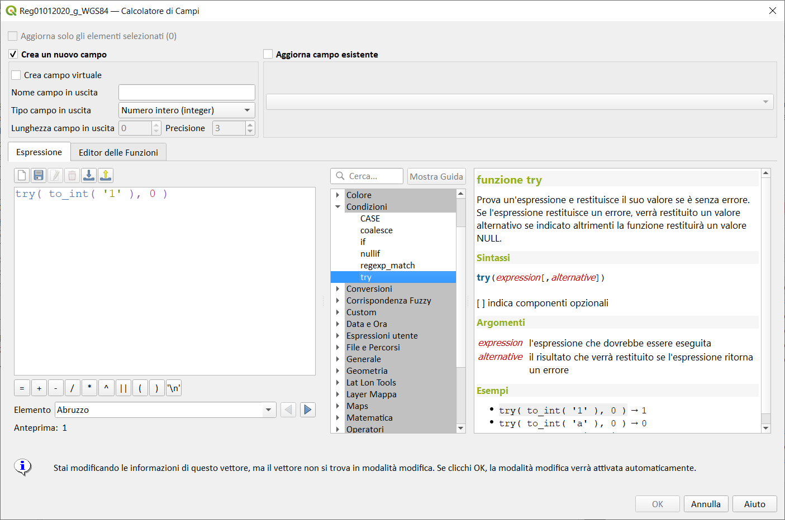

# Gruppo Condizioni

!!! Abstract
    **Questo gruppo contiene funzioni per gestire controlli condizionali nelle espressioni.**

---

## CASE

Valuta un'espressione e restituisce un risultato diverso, sia esso vero o falso. Puoi testare più condizioni

Sintassi:

```
CASE
WHEN condizione THEN risultato
[ ...n ]
[ ELSE risultato ]
END
```

[ ] indica componenti opzionali

Argomenti:

* _<span style="color:red;">WHEN condizione</span>_ - L'espressione di condizione da valutare. 
* _<span style="color:red;">THEN risultato</span>_ - Se _condizione_ valutata a True (vero) allora risultato viene valutato e restituito. 
* _<span style="color:red;">ELSE risultato</span>_ - Se nessuna delle condizioni valutate sopra restituisce True (vero) allora _risultato_ viene valutato e restituito.

Esempi:

```
CASE
WHEN "column" IS NULL THEN 'None'
END
```

```
CASE 
WHEN  "COD_REG" =19 or  "COD_REG"  = 20
THEN  "DEN_REG" 
ELSE 'NON SONO ISOLE' 
END
```


```
CASE 
WHEN   length( "DEN_REG") >15  THEN 'LUNGO'
WHEN   length( "DEN_REG") <15   AND length( "DEN_REG") >10 THEN 'MEDIO'
ELSE 'CORTA' 
END
```


Altri Esempi:

popolare un campo un funzione di un altro

```
CASE 
WHEN "livello3" ILIKE 'A%' THEN 'ciao'
WHEN "livello3" ILIKE 'B%' THEN 'arrivederci'
WHEN "livello3" ILIKE 'C%' THEN 'ciaone'
ELSE 'CUCU'
END
```

In questo Esempio viene popolato un campo (dove è usata l'espressione) in funzione del campo _livello3_: se il campo contiene un valore che inizia per _A_ allora scriverà _ciao_, se contiene un valore che inizia con _B_ scriverà _arrivederci_; se contiene un valore che inizia per _C_ scriverà _ciaone_ in tutti gli altri casi scriverà _CUCU_

--

posizionamento etichetta 


<p align="center">
  
</p>

---

## coalesce

Restituisce il primo valore non NULL dalla lista delle espressioni.
Questa funzione può usare qualsiasi numero di Argomenti:.

Sintassi:

* coalesce(*<span style="color:red;">expression1</span>, <span style="color:red;">expression2</span>, <span style="color:red;">…</span>*)

Argomenti:

* _<span style="color:red;">expression</span>_ qualsiasi valore o espressione valida, senza tener conto del tipo. 

Esempi:

```
coalesce(NULL, 2) → 2
coalesce(NULL, 2, 3) → 2
coalesce(7, NULL, 3*2) → 7
coalesce("fieldA", "fallbackField", 'ERRORE') → valore di "fieldA" se non è NULL, altrimenti il valore di "fallbackField" o la stringa 'ERRORE' se sono entrambi NULL
```

Osservazioni:

Questa funzione è utile all'interno di una espressione che prevede l'uso di più campi ed uno o più di essi ha valore NULL, questo valore penalizza l'intera stringa e rende non visibile il risultato.

Esempio senza l'uso della funzione *coalesce*:


Esempio con l'uso della funzione *coalesce*:


---

## if

Testa una condizione e restituisce un risultato diverso a seconda della verifica.

Sintassi:

* if(*<span style="color:red;">condition</span>, <span style="color:red;">result_when_true</span>, <span style="color:red;">result_when_false</span>*)

Argomenti:

* *<span style="color:red;">condition</span>* la condizione che deve essere controllata
* *<span style="color:red;">result_when_true</span>* il risultato che viene restituito quando la condizione è vera o un altro valore non si trasforma in falso.
* *<span style="color:red;">result_when_false</span>* il risultato che viene restituito quando la condizione è falsa o un altro valore si trasforma in falso come 0 o ''. NULL sarà inoltre convertito in falso.

Esempi:

```
if( 1+1=2, 'Sì', 'No' ) → 'Sì'
if( 1+1=3, 'Sì', 'No' ) → 'No'
if( 5 > 3, 1, 0) → 1
if( '', 'It is true (not empty)', 'It is false (empty)' ) → 'It is false (empty)'
if( ' ', 'It is true (not empty)', 'It is false (empty)' ) → 'It is true (not empty)'
if( 0, 'One', 'Zero' ) → 'Zero'
if( 10, 'One', 'Zero' ) → 'One'
```

Osservazioni:

--


---

## nullif

Restituisce un valore nullo se _value1_ è uguale a _value2_; altrimenti restituisce _value1_. Questo può essere usato per sostituire in modo condizionale i valori con `NULL`.

Sintassi:

* nullif(_<span style="color:red;">value1</span>_,_<span style="color:red;">value2</span>_)

Argomenti:

* _<span style="color:red;">value1</span>_ Il valore che dovrebbe essere utilizzato o sostituito con `NULL`.
* _<span style="color:red;">value2</span>_ Il valore di controllo che attiverà la sostituzione `NULL`.

Esempi:

```
nullif('(none)', '(none)') → NULL
nullif('text', '(none)') → 'text'
nullif("name", '') → NULL, se "name" è una stringa vuota (o già NULL), "name" in qualsiasi altro caso.
```

Osservazioni:

--


---

## regexp_match

Restituisce la prima posizione di corrispondenza che soddisfa un'espressione regolare all'interno di una stringa, o 0 se la sottostringa non viene trovata.

Sintassi:

* regexp_match(<span style="color:red;">input_string</span>, <span style="color:red;">regex</span>)

Argomenti:

* <span style="color:red;">input_string</span> la stringa da confrontare con l'espressione regolare
* <span style="color:red;">regex</span> L'espressione regolare da confrontare. I caratteri backslash devono essere doppiamente escaped (es "\\s" per selezionare un carattere spazio bianco).

Esempi:

```
regexp_match('QGIS ROCKS','\\sROCKS') → 5
```

Osservazioni:

--

In questo Esempio la prima lettere di *Fiandaca* si trova alla posizione 10

```
regexp_match('Salvatore Fiandaca','\\sFiandaca') → 10
```


---

## try

Prova un'espressione e restituisce il suo valore se priva di errori. Se l'espressione restituisce un errore, verrà restituito un valore alternativo se fornito altrimenti la funzione restituirà null.

Sintassi:

* try(_<span style="color:red;">expression</span>_[,_<span style="color:red;">alternative</span>_])

[ ] contrassegna componenti opzionali

Argomenti:

* _<span style="color:red;">expression</span>_ l'espressione che dovrebbe essere eseguita
* _<span style="color:red;">alternative</span>_ il risultato che verrà restituito se l'espressione restituisce un errore

Esempi:

```
try( to_int( '1' ), 0 ) → 1
try( to_int( 'a' ), 0 ) → 0
try( to_date( 'invalid_date' ) ) → NULL
```


