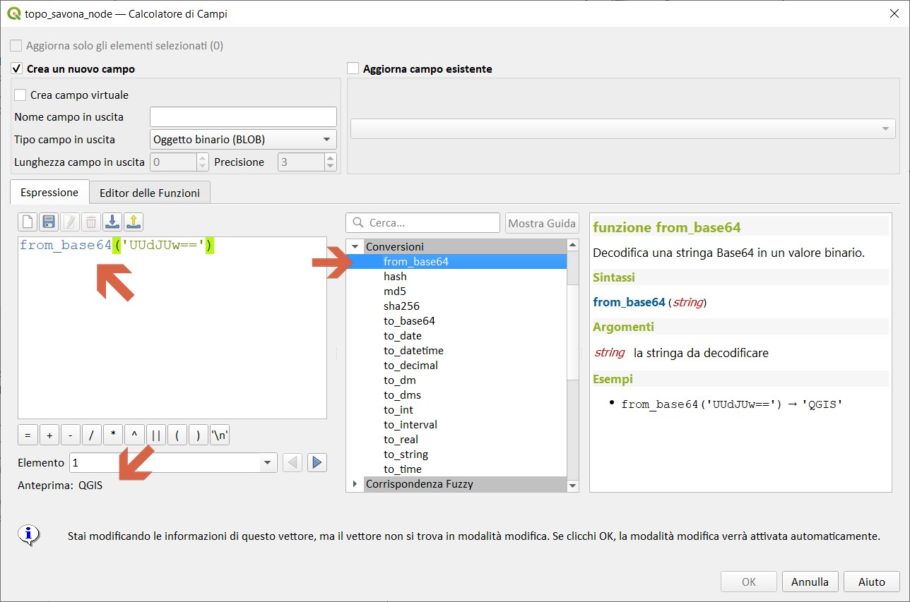
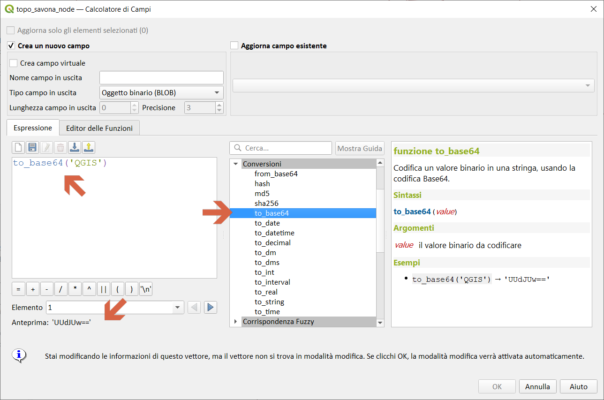

# Gruppo Conversioni

!!! Abstract
    **Questo gruppo contiene funzioni per convertire i dati da un tipo ad un altro, es. da stringa a intero, da intero a stringa.**

---

## from_base64

Decodifica una stringa Base64 in un valore binario.

Sintassi:

- from_base64(_<span style="color:red;">string</span>_)

Argomenti:

* _<span style="color:red;">string</span>_ stringa da decodificare

Esempi:

```
from_base64('UUdJUw==') → 'QGIS'
```

[](../../img/conversioni/from_base64.png)

---

## hash

Crea un [hash](https://it.wikipedia.org/wiki/Funzione_crittografica_di_hash) da una stringa con un determinato metodo.

Sintassi:

* hash(_<span style="color:red;">string</span>_, _<span style="color:red;">method</span>_)

Argomenti:

* _<span style="color:red;">string</span>_ stringa di hash
* _<span style="color:red;">method</span>_ Il metodo hash tra 'md4', 'md5', 'sha1', 'sha224', 'sha384', 'sha512', 'sha3_224', 'sha3_256', 'sha3_384', 'sha3_512', 'keccak_224', 'keccak_256 ',' keccak_384 ',' keccak_512 '

Esempi:

```
hash('QGIS', 'md4') → 'c0fc71c241cdebb6e888cbac0e2b68eb'
hash('QGIS', 'md5') → '57470aaa9e22adaefac7f5f342f1c6da'
hash('QGIS', 'sha1') → 'f87cfb2b74cdd5867db913237024e7001e62b114'
hash('QGIS', 'sha224') → '4093a619ada631c770f44bc643ead18fb393b93d6a6af1861fcfece0'
hash('QGIS', 'sha256') → 'eb045cba7a797aaa06ac58830846e40c8e8c780bc0676d3393605fae50c05309'
hash('QGIS', 'sha384') → '91c1de038cc3d09fdd512e99f9dd9922efadc39ed21d3922e69a4305cc25506033aee388e554b78714c8734f9cd7e610'
hash('QGIS', 'sha512') → 'c2c092f2ab743bf8edbeb6d028a745f30fc720408465ed369421f0a4e20fa5e27f0c90ad72d3f1d836eaa5d25cd39897d4cf77e19984668ef58da6e3159f18ac'
hash('QGIS', 'sha3_224') → '467f49a5039e7280d5d42fd433e80d203439e338eaabd701f0d6c17d'
hash('QGIS', 'sha3_256') → '540f7354b6b8a6e735f2845250f15f4f3ba4f666c55574d9e9354575de0e980f'
hash('QGIS', 'sha3_384') → '96052da1e77679e9a65f60d7ead961b287977823144786386eb43647b0901fd8516fa6f1b9d243fb3f28775e6dde6107'
hash('QGIS', 'sha3_512') → '900d079dc69761da113980253aa8ac0414a8bd6d09879a916228f8743707c4758051c98445d6b8945ec854ff90655005e02aceb0a2ffc6a0ebf818745d665349'
hash('QGIS', 'keccak_224') → '5b0ce6acef8b0a121d4ac4f3eaa8503c799ad4e26a3392d1fb201478'
hash('QGIS', 'keccak_256') → '991c520aa6815392de24087f61b2ae0fd56abbfeee4a8ca019c1011d327c577e'
hash('QGIS', 'keccak_384') → 'c57a3aed9d856fa04e5eeee9b62b6e027cca81ba574116d3cc1f0d48a1ef9e5886ff463ea8d0fac772ee473bf92f810d'
hash('QGIS', 'keccak_512') → '6f0f751776b505e317de222508fa5d3ed7099d8f07c74fed54ccee6e7cdc…'
```

[](../../img/conversioni/hash1.png)

---

## md5

Crea un hash md5 da una stringa.

Sintassi:

* md5(_<span style="color:red;">string</span>_)

Argomenti:

* _<span style="color:red;">string</span>_ stringa di md5

Esempi:

```
md5('QGIS') → '57470aaa9e22adaefac7f5f342f1c6da'
```

[](../../img/conversioni/md51.png)

---

## sha256

Crea un hash sha256 da una stringa.

Sintassi:

* sha256(_<span style="color:red;">string</span>_)

Argomenti:

* _<span style="color:red;">string</span>_ stringa di sha256

Esempi:

```
sha256('QGIS') → 'eb045cba7a797aaa06ac58830846e40c8e8c780bc0676d3393605fae50c05309'
```

[](../../img/conversioni/sha2561.png)

---

## to_base64

Decodifica una stringa Base64 in un valore binario.

Sintassi:

- to_base64* md5(_<span style="color:red;">value</span>_)

Argomenti:

* _<span style="color:red;">value</span>_ il valore binario da codificare

Esempi:

```
to_base64('QGIS') → 'UUdJUw=='
```

[](../../img/conversioni/to_base64.png)


---

## to_date

Converte una stringa in un oggetto data.

Sintassi:

* to_date(_<span style="color:red;">string</span>_)

Argomenti:

* _<span style="color:red;">string</span>_ stringa rappresentante il valore data

Esempi:

```
to_date('2012-05-04') → 2012-05-04
```

[](../../img/conversioni/to_date1.png)

---

## to_datetime

Converte una stringa in un oggetto datetime.

Sintassi:

* to_datetime(_<span style="color:red;">string</span>_)

Argomenti:

* _<span style="color:red;">string</span>_ stringa rappresentante il valore datatime

Esempi:

```
to_datetime( '2018-05-06 12:02:00') → 2018-05-06T12:02:00
```

[](../../img/conversioni/to_datetime1.png)

---

## to_decimal

Converte una coordinata in gradi, minuti e secondi nel suo equivalente decimale.

Sintassi:

* to_decimal(_<span style="color:red;">value</span>_)

Argomenti:

* _<span style="color:red;">value</span>_ Una stringa di gradi, minuti, secondi

Esempi:

```
to_decimal('6°9′16.445″')) → 6.154568055555556
```

[](../../img/conversioni/to_decimal.png)

---

## to_dm

Converte una coordinata in gradi, minuti

Sintassi:

* to_dm(_<span style="color:red;">coordinate</span>,<span style="color:red;">axis</span>,<span style="color:red;">precision</span>[,<span style="color:red;">formatting</span>]_)

[ ] indica componenti opzionali

Argomenti:

* _<span style="color:red;">coordinate</span>_ Un valore di latitudine o longitudine
* _<span style="color:red;">axis</span>_ L'asse della coordinata 'x' o 'y'
* _<span style="color:red;">precision</span>_ Numero di decimali
* _<span style="color:red;">formatting</span>_ Designa il tipo di formattazione. I valori accettabili sono NULL, 'aligned' o 'suffix'

Esempi:

```
to_dm(6.3545681, 'x', 3) → 6°21.274′
to_dm(6.3545681, 'y', 4, 'suffix') → 6°21.2741′N
```

[](../../img/conversioni/to_dm1.png)

---

## to_dms

Converte una coordinata in gradi, minuti e secondi

Sintassi:

* to_dms(_<span style="color:red;">coordinate</span>,<span style="color:red;">axis<span style="color:red;">,<span style="color:red;">precision</span>[,<span style="color:red;">formatting</span>]_)

[ ] indica componenti opzionali

Argomenti:

* _<span style="color:red;">coordinate</span>_ Un valore di latitudine o longitudine
* _<span style="color:red;">axis</span>_ L'asse della coordinata 'x' o 'y'
* _<span style="color:red;">precision</span>_ Numero di decimali
* _<span style="color:red;">formatting</span>_ Designa il tipo di formattazione. I valori accettabili sono NULL, 'aligned' o 'suffix'

Esempi:

```
to_dms(6.3545681, 'x', 3) → 6°21′16.445″
to_dms(6.3545681, 'y', 4, 'suffix') → 6°21′16.4452″N
```

[](../../img/conversioni/to_dms1.png)

---

## to_int

Converte una stringa in un numero intero. Non viene restituito nulla se un valore non può essere convertito ad intero (es. '123asd' non è valido)

Sintassi:

* to_int(_<span style="color:red;">string</span>_)

Argomenti:

* _<span style="color:red;">string</span>_ stringa da convertine i n numero intero

Esempi:

```
to_int('123') → 123
```

Nota bene:

un testo va scritto sempre tra apici semplici es: '123'

[](../../img/conversioni/to_int1.png)

---

## to_interval

Converte una stringa in un tipo intervallo. Può essere usata per estrarre giorni, ore, mese, etc. da una data.

Sintassi:

* to_interval(_<span style="color:red;">string</span>_)

Argomenti:

* _<span style="color:red;">string</span>_ una stringa rappresentante un intervallo. I formati ammessi includono {n} giorni {n} ore {n} mesi.

Esempi:

```
to_datetime('2018-05-04 12:23:00') - to_interval('1 day 2 hours') → 2018-05-03T10:23:00
```

[](../../img/conversioni/to_interval1.png)

---

## to_real

Converte una stringa in un numero reale. Non viene restituito nulla se un valore non può essere convertito a reale (es. '123.56asd' non è valido). I numeri sono arrotondati dopo aver salvato le modifiche se la precisione è minore del risultato della conversione.

Sintassi:

* to_real(_<span style="color:red;">string</span>_)

Argomenti:

* _<span style="color:red;">string</span>_ stringa da convertire in numero reale

Esempi:

```
to_real('123.45') → 123.45
```

Nota bene:

Il punto (`.`) è il separatore decimale.

[](../../img/conversioni/to_real1.png)

---

## to_string

Converte una stringa in un numero reale. Non viene restituito nulla se un valore non può essere convertito a reale (es. '123.56asd' non è valido). I numeri sono arrotondati dopo aver salvato le modifiche se la precisione è minore del risultato della conversione.

Sintassi:

* to_string(_<span style="color:red;">number</span>_)

Argomenti:

* _<span style="color:red;">number</span>_ Valore intero o reale. Il numero da convertire in stringa.

Esempi:

```
to_string(123.45) → '123.45'
to_string(123) → '123'
```

Nota bene:

Il punto (`.`) è il separatore decimale; una stringa è sempre tra apici semplici es: '123'.

[](../../img/conversioni/to_string1.png)

---

# to_time

Converti una stringa in un oggetto time.

Sintassi:

* to_time(_<span style="color:red;">string</span>_)

Argomenti:

* _<span style="color:red;">string</span>_ stringa rappresentante un valore time

Esempi:

```
to_time('12:30:01') → 12:30:0
```

[](../../img/conversioni/to_time1.png)

---
