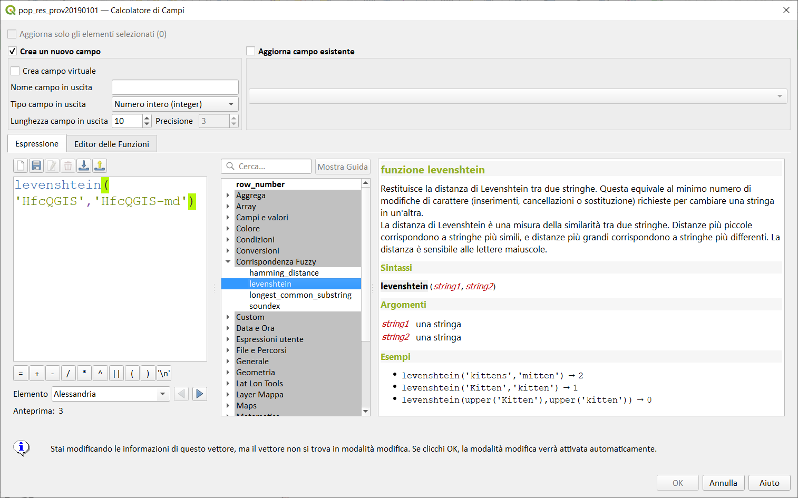

# Gruppo corrispondenza fuzzy

!!! Abstract
    **Questo gruppo contiene funzioni per [confronti fuzzy](https://it.wikipedia.org/wiki/Logica_fuzzy) fra valori.**

---

## hamming_distance

Restituisce la distanza di Hamming tra due stringhe. Questa equivale al numero di caratteri nelle corrispondenti posizioni delle stringhe in ingresso dove i caratteri sono diversi. Le stringhe in ingresso devono avere la stessa lunghezza, e il confronto è sensibile alle lettere maiuscole.

Sintassi:

* hamming_distance(*<span style="color:red;">string1</span>, <span style="color:red;">string2</span>*)

Argomenti:

* _<span style="color:red;">string1</span>_ una stringa
* _<span style="color:red;">string2</span>_ una stringa

Esempi:

```
hamming_distance('abc','xec') → 2
hamming_distance('abc','ABc') → 2
hamming_distance(upper('abc'),upper('ABC')) → 0
```


---

## levenshtein

Restituisce la distanza di Levenshtein tra due stringhe. Questa equivale al minimo numero di modifiche di caratterere (inserimenti, cancellazioni o sostituzione) richieste per cambiare una stringa in un'altra.
La distanza di Levenshtein è una misura della somiglianza tra due stringhe. Distanze più piccole corrispondono a stringhe più simili, e distanze più grandi corrispondono a stringhe più differenti. La distanza è sensibile alle lettere maiuscole.

Sintassi:

* levenshtein(*<span style="color:red;">string1</span>, <span style="color:red;">string2</span>*)

Argomenti:

* _<span style="color:red;">string1</span>_ una stringa
* _<span style="color:red;">string2</span>_ una stringa

Esempi:

```
levenshtein('kittens','mitten') → 2
levenshtein('Kitten','kitten') → 1
levenshtein(upper('Kitten'),upper('kitten')) → 0
```



---

## longest_common_substring

Restituisce la sottostringa in comune più lunga tra due stringhe. Questa sottostringa è la stringa più lunga che è una sottostringa delle due stringhe in ingresso. Es: la sottostringa in comune più lunga di "ABABC" e "BABCA" è "ABC". La sottostringa è sensibile alle lettere maiuscole

Sintassi:

* longest_common_substring(*<span style="color:red;">string1</span>, <span style="color:red;">string2</span>*)

Argomenti:

* _<span style="color:red;">string1</span>_ una stringa
* _<span style="color:red;">string2</span>_ una stringa


Esempi:

```
longest_common_substring('ABABC','BABCA') → 'ABC'
longest_common_substring('abcDeF','abcdef') → 'abc'
longest_common_substring(upper('abcDeF'),upper('abcdex')) → 'ABCDE'
```


---

## soundex

Restituisce la rappresentazione Soundex di una stringa. Soundex è un algoritmo di abbinamento fonetico, per cui le stringhe con suoni simili dovrebbero essere rappresentate dallo stesso codice Soundex.

Sintassi:

* soundex(*<span style="color:red;">string</span>*)

Argomenti:

* _<span style="color:red;">string</span>_ una stringa

Esempi:

```
soundex('robert') → 'R163'
soundex('rupert') → 'R163'
soundex('rubin') → 'R150'
```


secondo questo algoritmo *Sicilia bedda* e *Sicilia bella* hanno stesso suono :+1:


