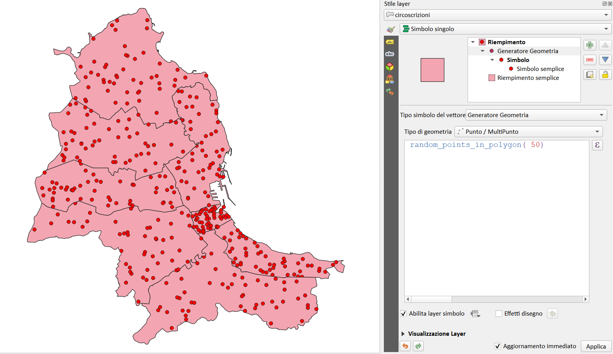
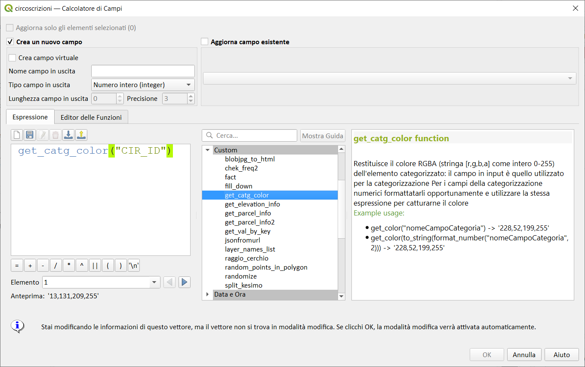
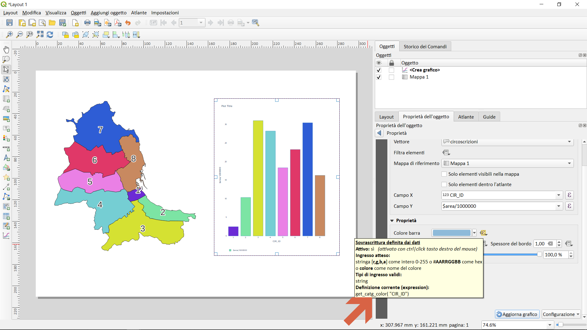
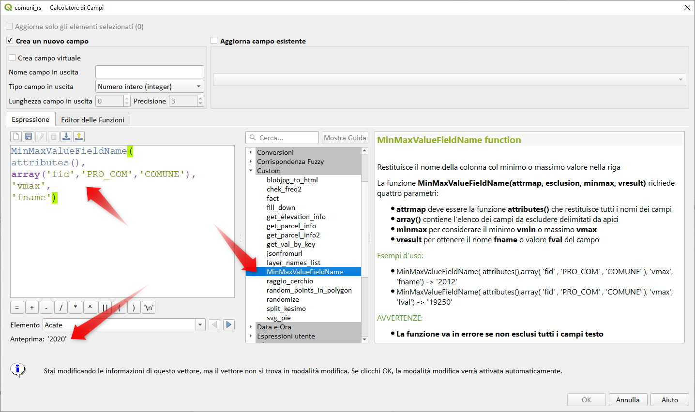

# Gruppo Custom

!!! Abstract
    **Questo gruppo contiene funzioni Python create dall'utente. <br> Le funzioni vanno salvate in file *.py nella cartella `espression` presente nel profilo utente QGIS `(C:\Users\nomeUtente\AppData\Roaming\QGIS\QGIS3\profiles\default\python\expressions)`<br>Un ringraziamento particolare a [Giulio Fattori](https://github.com/Korto19), autore di molte di queste funzioni personalizzate**

---

## fattoriale

Calcola il fattoriale di un numero definito come il prodotto di tutti i numeri tra 1 e n.
Per convenzione il fattoriale di 0 = 1 la notazione matematica per fattoriale è n!
La funzione è compresa nel modulo math
**NB:** valore massimo memorizzabile in un campo numerico è 20! (2432902008176640000)

Sintassi:

- fact(_<span style="color:red;">numero</span>_)

Argomenti:

- _<span style="color:red;">numero</span>_ un numero intero

Esempio:

```
fact(10)→ 3628800
```

[](../../img/custom/fact1.png)

Codice Python:

```py
from qgis.core import *
from qgis.gui import *
import math

@qgsfunction(args='auto', group='Custom')
def fact(n, feature, parent):
    """
    Calcola il fattoriale di un numero
    definito come il prodotto di tutti
    i numeri tra 1 e n.<ul> </ul>
    Per convenzione il fattoriale di 0 = 1
    la notazione matematica per fattoriale è n!
    La funzione è compresa nel modulo math
    NB: valore massimo memorizzabile 20!
    <ul> </ul>
    <h2>Example usage:</h2>
    <ul>
      <li>Fattoriale(5) -> 120</li>
      <li>in simboli 5! = 120</li>
    </ul>
    """
    return math.factorial(n)
```

Lo script Python è stato realizzato da [Giulio Fattori](https://github.com/Korto19)

---

## my_sum

Calcola la somma dei due parametri valore1 e valore2. 

Sintassi:

- my_sum(_<span style="color:red;">numero1</span>_, _<span style="color:red;">numero2</span>_)

Argomenti:

- _<span style="color:red;">numero1_</span>_ un valore numerico o un campo
- _<span style="color:red;">numero2</span>_ un valore numerico o un campo
Esempio:

```
my_sum(5, 8) -> 13
my_sum("fiel1", "field2") -> 42
```

[](../../img/custom/my_sum1.png)

Codice Python:

```py
from qgis.core import *
from qgis.gui import *

@qgsfunction(args='auto', group='Custom')
def my_sum(value1, value2, feature, parent):
    """
    Calcola la somma dei due parametri valore1 e valore2.
    <h2>Esempio di utilizzo:</h2>
    <ul>
      <li>my_sum(5, 8) -> 13</li>
      <li>my_sum("fiel1", "field2") -> 42</li>
    </ul>
    """
    return value1 + value2
```

---

## perimetro_km

Questa funzione ritorna il valore del perimetro della geometria in km 

Sintassi:

- perimetro_km()

Argomenti:

- senza argomenti

Esempio:

```
perimetro_km() - > 25
```

[.png)](../../img/custom/perimetro_km().png)

Codice Python:

```py
from qgis.core import *
from qgis.gui import *

@qgsfunction(args='auto', group='Custom')
def perimetro_km( feature, parent):
    """ 
	Questa funzione ritorna il valore del perimetro della geometria in km
	<ul>
      <li>perimetro_km() - > 25</li>
    </ul>
	"""
    geom_perimetro_km = feature.geometry().length()/1000
    return geom_perimetro_km
```

---

## reverse_string

Questa funzione ritorna il valore rovesciato di un testo

Sintassi:

- reverse_string(_<span style="color:red;">stringa</span>_)

Argomenti:

- _<span style="color:red;">stringa</span>_ una stringa di testo
Esempio:

``` 
reverse_string('Pigrecoinfinito) - > 'otinifniocergiP' `
```

[](../../img/custom/reverse_string1.png)

Codice Python:

```py
from qgis.core import *
from qgis.gui import *

@qgsfunction(args='auto', group='Custom')
def reverse_string(string_to_reverse, feature, parent):
   """ 
   Questa funzione ritorna il valore rovesciato di un testo
	<ul>
      <li>reverse_string('Pigrecoinfinito) - > 'otinifniocergiP'</li>
    </ul>
	"""
   return string_to_reverse[::-1]
```

---

## get_parcel_info

[WMS Catasto Agenzia delle Entrate CC BY 4.0](https://www.agenziaentrate.gov.it/portale/it/web/guest/schede/fabbricatiterreni/consultazione-cartografia-catastale/servizio-consultazione-cartografia):

La funzione, tramite una richiesta [GetFeatureInfo](https://gdal.org/drivers/raster/wms.html?highlight=getfeatureinfo), restituisce le informazioni utili sulla particella che ricade sotto il pixel di mio interesse:

Sintassi:

- get_parcel_info(_<span style="color:red;">x</span>_,_<span style="color:red;">y</span>_)

Argomenti:

- _<span style="color:red;">x</span>_ coordinata x di un punto
- _<span style="color:red;">y</span>_ coordinata x di un punto

Esempio:

```
get_parcel_info(355461.5,4222490.7) → 'IT.AGE.PLA.G273_0033A0.673'
```

codice Python:

```py
# -*- coding: utf-8 -*-
"""
/***************************************************************************
 WMS Catasto Agenzia delle Entrate CC BY 4.0
                              -------------------
        copyright            : (C) 2020 by Giulio Fattori
        email                : giulio.fattori@tin.it
 ***************************************************************************/
"""

from qgis.core import *
from qgis.gui import *
import requests


@qgsfunction(args='auto', group='Custom')
def get_parcel_info(xx, yy, feature, parent):
    """
    <h1>WMS Catasto Agenzia delle Entrate CC BY 4.0:</h1><br>    
    La funzione, tramite una richiesta GetFeatureInfo, restituisce le informazioni utili sulla particella che ricade sotto il pixel di mio interesse:
    <h2>Esempio:</h2>
    <ul>
      <li>get_parcel_info(355461.5,4222490.7) -> 'IT.AGE.PLA.G273_0033A0.673'</li>
      <li>get_parcel_info("fieldX", "fieldY") -> 'IT.AGE.PLA.G273_0033A0.673'</li>
    </ul>
    <h2>NB: le coordinate X e Y devono essere in EPSG 3045</h2>
    """
    req = "https://wms.cartografia.agenziaentrate.gov.it/inspire/wms/ows01.php?REQUEST=GetFeatureInfo&SERVICE=WMS&SRS=EPSG:3045&STYLES=&VERSION=1.1&FORMAT=image/png&BBOX="+str(xx-1)+","+str(yy-1)+","+str(xx+1)+","+str(yy+1)+"&HEIGHT=9&WIDTH=9&LAYERS=CP.CadastralParcel&QUERY_LAYERS=CP.CadastralParcel&INFO_FORMAT=text/html&X=5&Y=5"

    r = requests.get(req, auth=('user', 'pass'))
    a = r.text.partition("InspireId localId</th><td>")[2]
    b = a.partition("</td>")[0]
    return b
```

[](../../img/custom/get_parcel_info1.png)

Lo script Python è stato realizzato da [Giulio Fattori](https://github.com/Korto19)

---

## get_catastal_info

[Catasto Agenzia delle Entrate CC BY 4.0](https://www.agenziaentrate.gov.it/portale/it/web/guest/schede/fabbricatiterreni/consultazione-cartografia-catastale/servizio-consultazione-cartografia):

La funzione, tramite una richiesta ajax.php, restituisce le informazioni disponibili su quel che ricade sotto il punto selezionato.

Sintassi:

- get_catastal_info(_<span style="color:red;">longitudine</span>_, _<span style="color:red;">latitudine</span>_, _<span style="color:red;">chiave</span>_)

Argomenti:

- _<span style="color:red;">longitudine</span>_ coordinata  x del punto
- _<span style="color:red;">latitudine</span>_ coordinata  y del punto
- _<span style="color:red;">chiave</span>_ per le Particelle: 

    * SIGLA_PROV 
    * COD_COMUNE 
    * DENOM 
    * SEZIONE 
    * FOGLIO 
    * ALLEGATO 
    * SVILUPPO 
    * NUM_PART 
    * TIPOLOGIA
  <br>Per Acque e Strade:
    * TIPOLOGIA 
    * COMUNI 

Esempio:

```
get_catastal_info(12.567315,37.914197, 'TIPOLOGIA') -> 'ACQUA'
```

codice Python:

```py
# -*- coding: utf-8 -*-
"""
/***************************************************************************
 WMS Catasto Agenzia delle Entrate CC BY 4.0
                              -------------------
        copyright            : (C) 2020 by Giulio Fattori
        email                : giulio.fattori@tin.it
 ***************************************************************************/
"""

from qgis.core import *
from qgis.gui import *
import requests, json

@qgsfunction(args='auto', group='Custom')
def get_catastal_info(xx, yy, chiave, feature, parent):
    """
    <h1>Catasto Agenzia delle Entrate CC BY 4.0:</h1>    
    La funzione, tramite una richiesta ajax.php, restituisce le informazioni disponibili su quel che ricade sotto il punto selezionato.
    
    <p style="color:Olive"><b>Sintassi</b></p>
    <p style="color:blue"><b>get_catastal_info</b><mark style="color:black">(</mark>
    <mark style="color:red">x</mark>
    <mark style="color:black">,</mark>
    <mark style="color:red">y</mark>
    <mark style="color:black">,</mark>
    <mark style="color:red">chiave</mark>
    <mark style="color:black">)</mark><br>
    
    <br><mark style="color:black"><b>Le possibili chiavi sono:
    <ul>
        Per le particelle:
        <li>SIGLA_PROV</li>
        <li>COD_COMUNE</li>
        <li>DENOM</li>
        <li>SEZIONE</li>
        <li>FOGLIO</li>
        <li>ALLEGATO</li>
        <li>SVILUPPO</li>
        <li>NUM_PART</li>
        <li>TIPOLOGIA</li>
    </ul>    
    <ul>Per Acque e Strade:
        <li>TIPOLOGIA</li>
        <li>COMUNI</li>
    </ul></b>
    
    <h2>Esempio:</h2>
    <ul>
      <li>get_catastal_info(12.567315,37.914197, 'TIPOLOGIA') -> 'ACQUA'</li>
    </ul>
    
    <h2><b>Le coordinate X e Y devono essere espresse nel sistema WGS84 (EPSG:4326)</h2>
    <h2><b>Il campo risultante deve essere di tipo string di adeguata lunghezza</h2>
    <h2><b>Se la chiave non è presente risulterà ND</h2>
    """
    
    req = "https://wms.cartografia.agenziaentrate.gov.it/inspire/ajax/ajax.php?op=getDatiOggetto&lon=" + str(xx) + "&lat=" + str(yy)
    r = requests.get(req, auth=('user', 'pass'))
    res = json.loads(r.text)
    try:
        b = str(res[chiave])
    except:
        b = 'ND'
    
    return b
```

[](../../img/custom/get_catastal_info1.png)

Lo script Python è stato realizzato da [Giulio Fattori](https://github.com/Korto19)

---

## fill-down

Restituisce un valore dal campo specificato, dove il valore del campo della riga precedente viene propagato ai campi con valori `NULL` successivi. Opera in base all'id dei record.

Sintassi:

- fill_down(_<span style="color:red;">attibuto</span>_) -> popola le celle sottostanti

Argomenti:

- _<span style="color:red;">attributo</span>_ un campo

Esempio:

```
fill-down("attributo")
```

```py
from qgis.core import *
from qgis.gui import *
mem = 'NULL'

@qgsfunction(args='auto', group='Custom', handlesnull=True)
def fill_down(value1, feature, parent):
    """
    Restituisce un valore dal campo specificato,
    dove il valore del campo della riga precedente
    viene propagato ai campi con valori Null successivi
    <p>    
    Returns a value from the specified field,
    where the value of the field of the previous row
    it is propagated to subsequent null fields
    <h2>Example usage:</h2>
    <ul>
      <li>fill_down("Dato") -> Fill_Data</li>
      <table>
        <thead>
        <tr>
        <th>Dato</th>
        <th>Fill_Data</th>
        </tr>
        </thead>
        <tbody>
        <tr>
        <td style="text-align:right">a</td>
        <td style="text-align:right">a</td>
        </tr>
        <tr>
        <td>&nbsp;</td>
        <td style="text-align:right">a</td>
        </tr>
        <tr>
        <td>&nbsp;</td>
        <td style="text-align:right">a</td>
        </tr>
        <tr>
        <td style="text-align:right">b</td>
        <td style="text-align:right">b</td>
        </tr>
        <tr>
        <td></td>
        <td style="text-align:right">b</td>
        </tr>
        </tbody>
        </table>
            </ul>
        
        Opera in base all'id dei record
        <p>
        Operate based on the ID of the records
    """
    global mem
    res = str(value1)
    if res in ('NULL',''):
        res = mem
    else:
        mem = str(value1)
    return res
```

[](../../img/custom/fill-down1.png)

Lo script Python è stato realizzato da [Giulio Fattori](https://github.com/Korto19)

---

## random_points_in_polygon

Genera 'n' di punti all'interno della geometria del poligono corrente.

Sintassi:

- random_points_in_polygon(_<span style="color:red;">numero</span>_)

Argomenti:

- _<span style="color:red;">numero</span>_ numero di punti da tracciare

```py
from qgis.core import *
from qgis.gui import *

import random   # Needed for generating pseudo random numbers

@qgsfunction(args='auto', group='Custom')
def random_points_in_polygon(number_of_points, feature, parent):
    """
    <i>random_points_in_polygon( n )</i><br><br>
    Generates 'n' number of points inside the current polygon geometry.<br><br>
    <b>Requires</b><br>
    <i>n</i> (Integer)<br><br>
    <b>Example</b><br>
    <i>random_points_in_polygon( 25 )</i><br>
    <br>
    &lt;geometry: MultiPoint&gt; with 25 points
    """
    points = list() # Create an empty list for the points
    
    
    # Until there's the required points in the list, loop (not the best way probably)
    while len(points) < number_of_points:
        # Create random x and y coordinates inside feature geometry bounding box
        rnd_x = random.uniform(feature.geometry().boundingBox().xMinimum(), feature.geometry().boundingBox().xMaximum())
        rnd_y = random.uniform(feature.geometry().boundingBox().yMinimum(), feature.geometry().boundingBox().yMaximum())
        # Use the coordinates to create a point
        rnd_point = QgsPointXY(rnd_x, rnd_y)
        
        # Test if the point is inside the feature geometry
        if QgsGeometry.fromPointXY(rnd_point).within(feature.geometry()):
            # If it is inside, add it to the list (increasing the length of the list)
            points.append(rnd_point)
    
    # Return a multipoint geometry
    return QgsGeometry.fromMultiPointXY(points)
```

[](../../img/custom/random_points_in_polygon1.png)

Lo script Python è stato realizzato da  

---

## randomize

Calcola un valore random intero univoco compreso tra start e stop.

ATTENZIONE A NON IMPOSTARE L'INTERVALLO MINORE DEL NUMERO DI FEATURE

Sintassi:

- randomize(_<span style="color:red;">start</span>_, _<span style="color:red;">stop</span>_)

Argomenti:

- _<span style="color:red;">start</span>_ un numero intero
- _<span style="color:red;">stop</span>_ un numero intero

Esempi:

```
randomize( 0, 1000 ) -> 13 
```

[](../../img/custom/randomize.png)

Osservazione:

La funzione è particolarmente utile se si volessero generare, tra _<span style="color:red;">start</span>_ e _<span style="color:red;">stop</span>_, enne valori casuali univoci (senza ripetizioni)

```py
from qgis.core import *
from qgis.gui import *
import random

random_list = []

@qgsfunction(args='auto', group='Custom')

def randomize(start, stop, feature, parent):
    """
    Calcola un valore random intero univoco
    compreso tra start e stop
    <ul>ATTENZIONE A NON IMPOSTARE L'INTERVALLO MINORE DEL NUMERO DI FEATURE
    </ul>
    <h2>Example usage:</h2>
    <ul>
      <li>randomize( 0, 1000 ) -> 13</li>
    </ul>
    """
    a = random.randint(start, stop)

    while a in random_list:
        a = random.randint(start, stop)

    random_list.append(a)

    return a
```

Lo script Python è stato realizzato da [Giulio Fattori](https://github.com/Korto19)

---

## get_catg_color

Restituisce il colore RGBA (stringa [r,g,b,a] come intero 0-255) dell'elemento categorizzato: il campo in input è quello utilizzato per la categorizzazione. Per i campi della categorizzazione numerici formattatarli opportunamente e utilizzare la stessa espressione per catturarne il colore.

Sintassi:

- get_catg_color(_<span style="color:red;">nomeCampoCategoria</span>_)

Argomenti:

- _<span style="color:red;">nomeCampoCategoria</span>_ nome del campo con cui si è effettuata la categorizzazione

Esempi:

```
get_catg_color("nomeCampoCategoria") → '228,52,199,255'
get_catg_color(to_string(format_number("nomeCampoCategoria",2))) → '228,52,199,255'
```

[](../../img/custom/get_catg_color1.png)

```py
from qgis.core import *
from qgis.gui import *
from qgis.utils import iface

@qgsfunction(args='auto', group='Custom')
def get_catg_color(value, feature, parent):
    """
    Restituisce il colore RGBA (stringa [r,g,b,a] come intero 0-255) dell'elemento categorizzato:
    il campo in input è quello utilizzato per la categorizzazione
    Per i campi della categorizzazione numerici formattatarli opportunamente e 
    utilizzare la stessa espressione per catturarne il colore
    
    <h2>Example usage:</h2>
    <ul>
      <li>get_color("nomeCampoCategoria") -> '228,52,199,255'</li>
      <li>get_color(to_string(format_number("nomeCampoCategoria",2))) -> '228,52,199,255'</li>
    </ul>
    """
    
    layer = iface.activeLayer()
    renderer = layer.renderer()

    if layer.renderer().type() == "categorizedSymbol":
        campo = renderer.legendClassificationAttribute()

        for cat in renderer.categories():
            if str(value) == cat.value():
                colorato = cat.symbol().symbolLayer(0).properties()['color']
                break
            
    return colorato
```

Osservazioni:

La funzione è utile nel Plugin DataPlotly per associare i colori ai grafici.

[](../../img/custom/get_catg_color2.png)

Lo script Python è stato realizzato da [Giulio Fattori](https://github.com/Korto19)

---

## svg_pie

Genera un grafico a torta inseribile in una cornice HTML nel compositore di stampe.

Sintassi:

- svg_pie( _<span style="color:red;">array(values)</span>_, _<span style="color:red;">donut</span>_, _<span style="color:red;">array(colors)</span>_, _<span style="color:red;">array(descriptions)</span>_, _<span style="color:red;">legenda</span>_)

Argomenti:

- _<span style="color:red;">array(val)</span>_ - array percentuali 
- _<span style="color:red;">donut</span>_ - raggio del vuoto al centro [0-1]
- _<span style="color:red;">array(colors)</span>_ - array colori
- _<span style="color:red;">array(descriptions)</span>_ - array descrizioni
- _<span style="color:red;">legenda</span>_ - legenda [-1] - percentuali interne[0] - legenda [1]

Esempi:

```
svg_Pie(array(.5,.1,.3),.8,array('red','cyan','gray'),array('uno','due','tre'),0)
```

La somma delle percentuali deve essere pari a 1 o inferiore Se la somma delle percentuali e' inferiore al 100% ci sara' un settore vuoto. Elenco dei colori desiderati, se vuoto o in numero insufficiente saranno utilizzati quelli di default.
Elenco delle descrizioni, se vuoto o in numero insufficiente sara' utilizzato il carattere spazio.

Colori di default in ordine di utilizzo Red, Aquamarine, Orange, Cyan, Yellow, Green, Grey, Beige, Gold, DarkKhaki, Royalblue, Fucsia è comunque possibile utilizzare qualsiasi colore CSS inserendone il nome.

[](../../img/custom/svg_pie1.png)

[](../../img/custom/svg_pie2.png)

```py
#Korto19 2021

from qgis.core import *
from qgis.gui import *
import math

@qgsfunction(args='auto', group='Custom')
def svg_pie(value, donut, pcol, flipper, legenda, feature, parent):
    """
    Genera un grafico a torta inseribile in una cornice HTML nel compositore di stampe
    <p style="color:Olive"><b>Sintassi</b></p>
    <p style="color:blue"><b>svg_pie</b><mark style="color:black">(</mark>
    <mark style="color:red">array(values)</mark><mark style="color:black">,</mark>
    <mark style="color:red">donut</mark><mark style="color:black">,</mark>
    <mark style="color:red">array(colors)</mark><mark style="color:black">,</mark>
    <mark style="color:red">array(descriptions)</mark><mark style="color:black">,</mark>
    <mark style="color:red">legenda</mark><mark style="color:black">)</mark>
    <p style="color:Olive"><b>Argomenti</b></p>
    <p style="color:red"><b>array(val)</b><mark style="color:black"> - array percentuali </mark><br>
    <mark style="color:red"><b>donut </b><mark style="color:black"> - raggio del vuoto al centro [0-1]</mark><br>
    <mark style="color:red"><b>array(colors) </b><mark style="color:black"> - array colori</mark><br>
    <mark style="color:red"><b>array(descriptions) </b><mark style="color:black"> - array descrizioni</mark><br>
    <mark style="color:red"><b>legenda</b><mark style="color:black"> - legenda [-1] - percentuali interne[0] - legenda [1]</mark></p>
    <h2><strong>Example usage:</strong></h2>
    <ul>
      <li>svg_Pie(array(.5,.1,.3),.8,array('red','cyan','gray'),array('uno','due','tre'),0)<li>
    </ul>  
    <br> 
    <strong> La somma delle percentuali deve essere pari a 1 o inferiore</strong><br>
    <strong> Se la somma delle percentuali e' inferiore al 100% ci sara' un settore vuoto</strong><br>
    <strong> Elenco dei colori desiderati, se vuoto o in numero insufficiente saranno utilizzati quelli di default</strong><br>
    <strong> Elenco delle descrizioni, se vuoto o in numero insufficiente sara' utilizzato il carattere spazio</strong><br><br>
    Colori di default in ordine di utilizzo<br>
    Red, Aquamarine, Orange, Cyan, Yellow, Green, Grey, Beige, Gold, DarkKhaki, Royalblue, Fucsia<br>
    e' comunque possibile utilizzare qualsiasi colore CSS inserendone il nome
    """
    dcol =  ['red', 'Aquamarine', 'orange', 'cyan', 'yellow', 'green', 'grey', 'beige', 'Gold', 'DarkKhaki', 'royalblue', 'fucsia']
    
    #aggiunge colori mancanti
    if len(pcol) < len(value):
        for j in range (0, len(value)-len(pcol)+1):
            if dcol[j] not in pcol:
                pcol.append(dcol[j])
    
    #aggiunge vuoti se non ci son testi
    if len(flipper) < len(value):
        for j in range (0, len(value)-len(flipper)+1):
            flipper.append('')

    vc =  0.85
    vt = -0.81
    
    xi = '1'
    yi = '0'
    
    if legenda:
        riq = '''viewBox="-1.2 -1.2 4 4"'''
    else:
        riq = '''viewBox="-1.1 -1.1 2.2 2.2"'''
    
    svg_text = '''<svg width="100%" heigth="100%"'''+riq+'''" >
                <style>
                    #legend{
                        text-anchor: middle;
                        font-weight: bold;
                        font-size: .008em;
                        fill: purple;
                    }
                    text{
                        font-weight: light;
                        font-size: .006em;
                        font-family: Arial;
                        transform: rotate(90deg);
                    }
                    #perc{
                        fill: black;
                        font-weight: bold;
                        font-size: .006em;
                        font-family: Arial;
                        text-anchor: middle;
                    }
                    path{
                        stroke: white;
                        stroke-width: 0.01;
                    }
                </style>
                <g transform="translate(0,0) rotate(-90)">'''
        
    if sum(value[0:])>1:
        svg_text = 'Somma valori maggiore del 100%'
    else:
        for i in range (0, len(value)):
            pr = sum(value[0:i+1])
            vx = str(math.cos(2*3.14*pr))
            vy = str(math.sin(2*3.14*pr))
            if value[i] > 0.5:
                larc = '1'
            else:
                larc = '0'
            svg_text = svg_text + '''<path d= "M '''+ xi + ''' ''' + yi +''' A 1 1 0 ''' + larc + ''' 1 '''+ vx + ''' ''' + vy +''' L 0 0" fill="''' + pcol[i] + '''"/>'''
            xi = vx
            yi = vy
        
            if legenda == -1:
                svg_text = svg_text + '''<circle r="0.06" cx="'''+ str(vc) +'''" cy="1.4" fill="''' + pcol[i] + '''"/>
                                 <text x="1.5" y="'''+ str(vt) +'''" >'''+ "{:.2%}".format(value[i]) + " " + flipper[i] + '''</text>'''
                vc = vc - .2
                vt = vt + .2

            if legenda == 1:
                svg_text = svg_text + '''<circle r="0.06" cx="'''+ str(vc) +'''" cy="1.4" fill="''' + pcol[i] + '''"/>
                                 <text x="1.5" y="'''+ str(vt) +'''" >'''+ " " + flipper[i] + '''</text>'''
                vc = vc - .2
                vt = vt + .2
                
        if pr > 0.5:
            larc = '0'
        else:
            larc = '1'
        
        if donut:
            svg_text = svg_text + '''<circle r="''' + str(donut) + '''" cx="0" cy="0" fill="white" />'''
        
        if legenda:
            svg_text = svg_text + '''<text id="legend" x="1.9" y="-1">Legenda</text>'''
        
        #scrive percentuali entro torta
        if legenda >= 0:
            pr = 0
            for i in range (0, len(value)):
                pr = sum(value[0:i+1]) - value[i]/2
                vx = 0.8*math.cos(2*3.14*(pr-.25))
                vy = 0.8*math.sin(2*3.14*(pr-.25))
                svg_text = svg_text + '''<text id="perc" x="''' + str(vx) + '''" y="''' + str(vy) + '''">'''+"{:.2%}".format(value[i]) +'''</text>'''
        
        svg_text = svg_text + '''</g></svg>'''
    
    return svg_text
```

Lo script Python è stato realizzato da [Giulio Fattori](https://github.com/Korto19)

---

## MinMaxValueFieldName

Restituisce il nome/valore della colonna col minimo o massimo valore nella riga.

Sintassi:

- MinMaxValueFieldName (_<span style="color:red;">attrmap</span>_, _<span style="color:red;">esclusion</span>_, _<span style="color:red;">minmax</span>_, _<span style="color:red;">vresult</span>_)

Argomenti:

- _<span style="color:red;">attrmap</span>_ deve essere la funzione [attributes()](../record_e_attributi/record_e_attributi_unico.md#attributes2) che restituisce tutti i nomi dei campi 
- _<span style="color:red;">array()</span>_ contiene l'elenco dei campi da escludere delimitati da apici 
- _<span style="color:red;">minmax</span>_ per considerare il minimo vmin o massimo vmax 
- _<span style="color:red;">vresult</span>_ per ottenere il nome _fname_ o valore _fval_ del campo

Avvertenze:

La funzione va in errore se non esclusi tutti i campi testo.

Esempi:

```
MinMaxValueFieldName( attributes(),array('fid','PRO_COM','COMUNE'),'vmax','fname') -> '2012' 
MinMaxValueFieldName( attributes(),array( fid','PRO_COM','COMUNE'),'vmax','fval') -> '19250'
```

[](../../img/custom/MaxMinValueFieldName.png)


```py
#Korto19 2021

from qgis.core import *
from qgis.gui import *
import json

@qgsfunction(args='auto', group='Custom')
def MinMaxValueFieldName(attrmap, esclusion, minmax, vresult, feature, parent):
    """
    Restituisce il nome della colonna col  minimo o massimo valore nella riga<p>
    La funzione <b>MinMaxValueFieldName(attrmap, esclusion, minmax, vresult)</b> richiede quattro parametri:
    <ul>
        <li> <b>attrmap</b> deve essere la funzione <b>attributes()</b> che restituisce tutti i nomi dei campi</li>
        <li> <b>array()</b> contiene l'elenco dei campi da escludere delimitati da apici</li>
        <li> <b>minmax</b> per considerare il minimo <b>vmin</b> o massimo <b>vmax</b></li>
        <li> <b>vresult</b> per ottenere il nome <b>fname</b> o valore <b>fval</b> del campo</li>
    </ul>
    
    <h2>Esempi d'uso:</h2>
    <ul>
      <li>MinMaxValueFieldName( attributes(),array( 'fid' , 'PRO_COM' , 'COMUNE' ), 'vmax', 'fname') -> '2012'</li>
      <li>MinMaxValueFieldName( attributes(),array( 'fid' , 'PRO_COM' , 'COMUNE' ), 'vmax', 'fval') -> '19250'</li>
    </ul>
    
    <b><h2>AVVERTENZE:</h2>
    <ul>
      <li>La funzione va in errore se non esclusi tutti i campi testo</li>
    </ul></b>
    
    """
    #Trasformo in array l'elenco dei campi
    esclusion = json.dumps(esclusion)
    #Recupero i valori numerici della riga
    _attrmap = {key: attrmap[key] for key in attrmap.keys() if key not in esclusion and attrmap[key] is not None} # exclude not needed fields
    #Discrimino per vmin o vmax
    if vresult == 'fname':
        if minmax == 'vmax':
            result = [k for k,v in _attrmap.items() if v==max(_attrmap.values())][0]
        elif minmax == 'vmin':
            result = [k for k,v in _attrmap.items() if v==min(_attrmap.values())][0]
    elif vresult == 'fval':
        if minmax == 'vmax':
            result = [v for k,v in _attrmap.items() if v==max(_attrmap.values())][0]
        elif minmax == 'vmin':
            result = [v for k,v in _attrmap.items() if v==min(_attrmap.values())][0]
    return result
```

Lo script è stato riscritto da [Giulio Fattori](https://github.com/Korto19), la fonte è [qui](https://gis.stackexchange.com/questions/411369/returning-column-name-of-the-max-value/411399#411399), grazie [Taras](https://gis.stackexchange.com/users/99589/taras)

---

## Ordina array alfanumerico in modo numerico

```py
# -*- coding: utf-8 -*-
"""
/***************************************************************************
 WMS Catasto Agenzia delle Entrate CC BY 4.0
                              -------------------
        copyright            : (C) 2021 by Giulio Fattori
        email                : giulio.fattori@tin.it
 ***************************************************************************/
"""

from qgis.core import *
from qgis.gui import *

@qgsfunction(args='auto', group='Custom', referenced_columns=[])
def array_sort_special(value1, feature, parent):
    """
    Ordina un array alfanumerico numericamente
    <h2>Esempio:</h2>
    <ul>
      <li>array_sort_special('5/A-5-4-8-3-6-9-7-1-10-7/B-2-7/A') -> ['1','2','3','4','5','5/A','6','7','7/A','7/B','8','9','10']</li>
    </ul>
    """

    data = value1.split('-')
    r = sorted(data, key=lambda item: (int(item.partition('/')[0])
    if item[0].isdigit() else float('inf'), item))
    #return (','.join(r))
    return r
```

Lo script è stato riscritto da [Giulio Fattori](https://github.com/Korto19)

---

## Natural sorting

```py
from qgis.core import *
from qgis.gui import *
import re

def natural_sort_key(s):
    ns = re.compile('([0-9]+)')
    return [int(t) if t.isdigit() else t.lower() for t in re.split(ns, s)]  

@qgsfunction(args='auto', group='Custom', usesgeometry=False)
def sort_my_list(field, feature, parent):
    """
    Ordina un array secondo la Natural sorting
    <h2>Esempio:</h2>
    <ul>
      <li>sort_my_list('field') -> 'elementi ordinati'</li>
    </ul>
    
    Nota: il nome del parametro del campo (field) per sort_my_addresses 
    deve essere compreso tra virgolette singole ('), non virgolette doppie (").
    Ad esempio 'field', non "field"
    <ul>
    by Kadir Şahbaz
    </ul>
    Commentare decomentare le ulti due righe per avere una array o una stringa
    """
    
    _list = feature[field].split("-")
    _list.sort(key=natural_sort_key)
    return _list
    #return ','.join(_list)
```

Lo script è stato riscritto da [Kadir Şahbaz](https://gis.stackexchange.com/a/421168/73605)