# Gruppo Data e Ora

!!! Abstract
    **Questo gruppo contiene funzioni per gestire dati con date e ore.**

---

## age

Restituisce la differenza fra due date o datetimes.
La differenza è restituita come _Interval_ e deve essere usata con una della seguenti funzioni per estrarre informazioni utili:

* year
* month
* week
* day
* hour
* minute
* second

Sintassi:

* age(_<span style="color:red;">datetime1</span>, <span style="color:red;">datetime2</span>_)

Argomenti:

* _<span style="color:red;">datetime1</span>_ una stringa, in formato data o data/ora rappresentante la meno recente
* _<span style="color:red;">datetime2</span>_ una stringa, in formato data o data/ora rappresentante la data più recente

Esempi:

```
age('2012-05-12','2012-05-02') → intervallo (usa day per estrarre il numero di giorni)
day(age('2012-05-12','2012-05-02')) → 10
```

[](../../img/data_e_ora/age1.png)

---

## datetime_from_epoch

Restituisce un datetime il cui data e ora sono il numero di millisecondi, msec, che sono passati dal 1970-01-01T00: 00: 00.000, Coordinated Universal Time (Qt.UTC) e convertiti in Qt.LocalTime.

Sintassi:

* datetime_from_epoch(_<span style="color:red;">int</span>_)

Argomenti:

* _<span style="color:red;">int</span>_ numero (millisecondi)
  
Esempi:

```
datetime_from_epoch(1483225200000) → 2017-01-01T00:00:00
```

[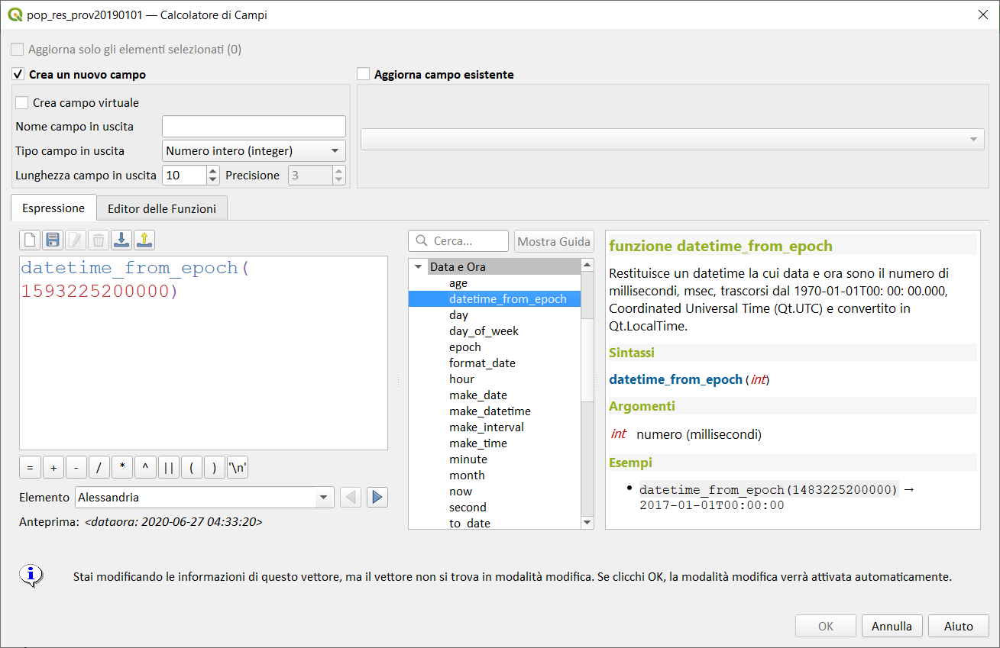](../../img/data_e_ora/datetime_from_epoch1.png)

Feature introdotta a partire da **QGIS 3.12**

---

## day

Estrae il giorno da una data, o il numero dei giorni da un intervallo.

### Variabile data

Estrae il giorno da una data o un data/ora.

Sintassi:

* day(_<span style="color:red;">date</span>_)

Argomenti:

* _<span style="color:red;">date</span>_ un valore data o data/ora

### Variabile intervallo

Calcola la lunghezza in giorni di un intervallo.

Sintassi: 

* day(_<span style="color:red;">interval</span>_)

Argomenti:

* _<span style="color:red;">interval</span>_ valore intervallo da cui restituire il numero di giorni

Esempi:

```
day(to_interval('3 days')) → 3
day(to_interval('3 weeks 2 days')) → 23
day(age('2012-01-01','2010-01-01')) → 730
```

[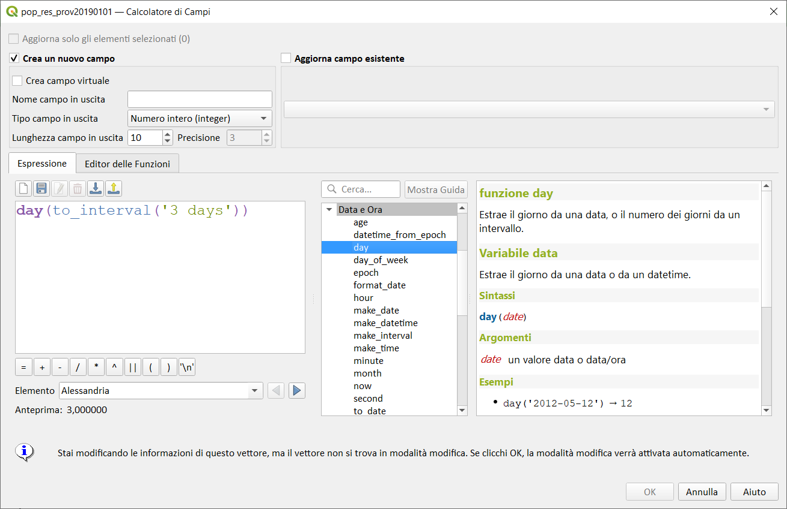](../../img/data_e_ora/day1.png)

---

## day_of_week

Restituisce il giorno della settimana per una data o un datetime. L'intervallo del valore restituito và da 0 a 6, dove 0 corrisponde a Domenica e 6 a Sabato.

Sintassi:

* day_of_week(_<span style="color:red;">date</span>_)

Argomenti:

* _<span style="color:red;">date</span>_ valore data o datetime

Esempi:

```
day_of_week(todate('2018-05-09')) → 3 (Mercoledì)
```

[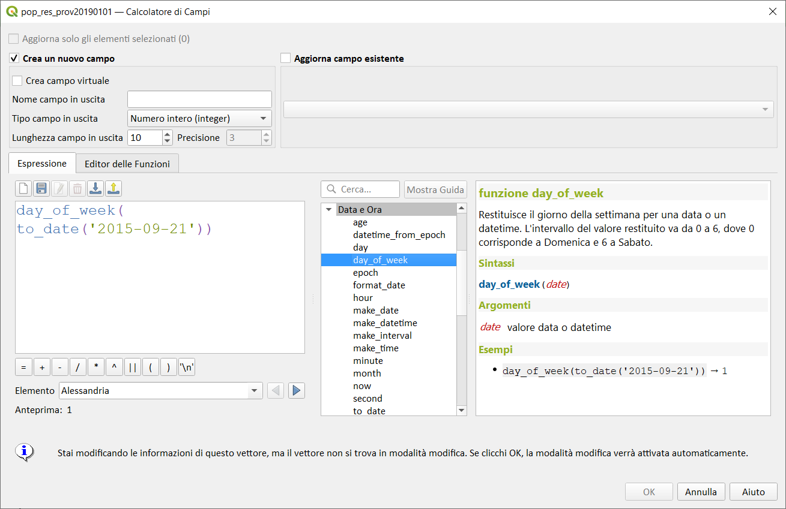](../../img/data_e_ora/day_of_week1.png)

Osservazioni:

* 0 → Domenica
* 1 → Lunedì
* 2 → Martedì
* 3 → Mercoledì
* 4 → Giovedì
* 5 → Venerdì
* 6 → Sabato

---

## epoch

Restituisce l'intervallo in millisecondi fra l'[epoca unix](https://it.wikipedia.org/wiki/Tempo_(Unix)) e la data inserita.

Sintassi:

* epoch(_<span style="color:red;">date</span>_)

Argomenti:

* _<span style="color:red;">date</span>_ un valore data o data/ora

Esempi:

```
epoch(to_date('2017-01-01')) → 1483203600000
```

[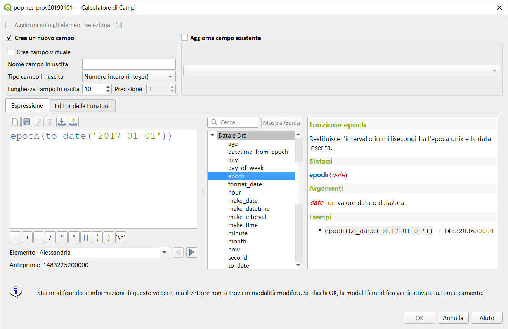](../../img/data_e_ora/epoch1.png)

---

## format_date

Formatta un tipo di data o stringa in un formato stringa personalizzato. Usa stringhe nel formato data/ora Qt. Vedi [QDateTime::toString](https://doc.qt.io/qt-5/qdatetime.html#toString).

Sintassi:

* format_date(_<span style="color:red;">datetime</span>_, _<span style="color:red;">format</span>_[,_<span style="color:red;">language</span>_]_)

Argomenti:

* _<span style="color:red;">datetime</span>_ valora data, ora, o data/ora
* _<span style="color:red;">format</span>_ Modello di stringhe usato per formattare la stringa. 

Espressione|In uscita
----------:|---------
d|il giorno in numero senza lo zero iniziale (da 1 a 31)
dd|il giorno in numero con lo zero iniziale (da 01 a 31)
ddd|il nome locale del giorno abbreviato (es. da 'Mon' a 'Sun')
dddd|il nome locale del giorno per esteso (es. da 'Monday' a 'Sunday')
M|il mese in numero senza lo zero iniziale (1-12)
MM|il mese in numero con lo zero iniziale (01-12)
MMM|il nome locale del mese abbreviato (es. da 'Jan' a 'Dec')
MMMM|il nome locale del mese per esteso (es. da 'January' a 'December')
yy|l'anno come un numero a due cifre (00-99)
yyyy|l'anno come un numero a quattro cifre

Queste espressioni possono essere usate per la parte time della stringa da formattare:

Espressione|In uscita
----------:|---------
h|l'ora senza lo zero iniziale (da 0 a 23 o da 1 a 12 se visualizzi AM/PM)
hh|l'ora con lo zero iniziale (da 00 a 23 o da 01 a 12 se visualizzi AM/PM)
H|l'ora senza lo zero iniziale (da 0 a 23, anche se visualizzi AM/PM)
HH|l'ora con lo zero iniziale (da 00 a 23, anche se visualizzi AM/PM)
m|il minuto senza lo zero iniziale (da 0 a 59)
mm|il minuto con lo zero iniziale (da 00 a 59)
s|il secondo senza lo zero iniziale (da 0 a 59)
ss|il secondo con lo zero iniziale (da 00 a 59)
z|i millisecondi senza gli zeri iniziali (da 0 a 999)
zzz|i millisecondi con gli zeri iniziali (da 000 a 999)
AP o A|interpretato come un orario nel formato AM/PM. AP deve essere "AM" oppure "PM".
ap o a|interpretato come un orario nel formato AM/PM. ap deve essere "am" oppure "pm".


* _<span style="color:red;">language</span>_ linguaggio (minuscolo, due o tre lettere, [codice ISO 639](https://en.wikipedia.org/wiki/List_of_ISO_639-1_codes)) utilizzato per formattare la data in una stringa personalizzata (**>= QGIS 3.12**)

Esempi:

```
format_date('2012-05-15','dd.MM.yyyy') → '15.05.2012'
format_date('2012-05-15','d MMMM yyyy','fr') → '15 mai 2012'
format_date('2012-05-15','dddd') → 'Tuesday', se la lingua corrente è una variante inglese
format_date('2012-05-15 13:54:20','dd.MM.yy') → '15.05.12'
format_date('13:54:20','hh:mm AP') → '01:54 PM'
```

[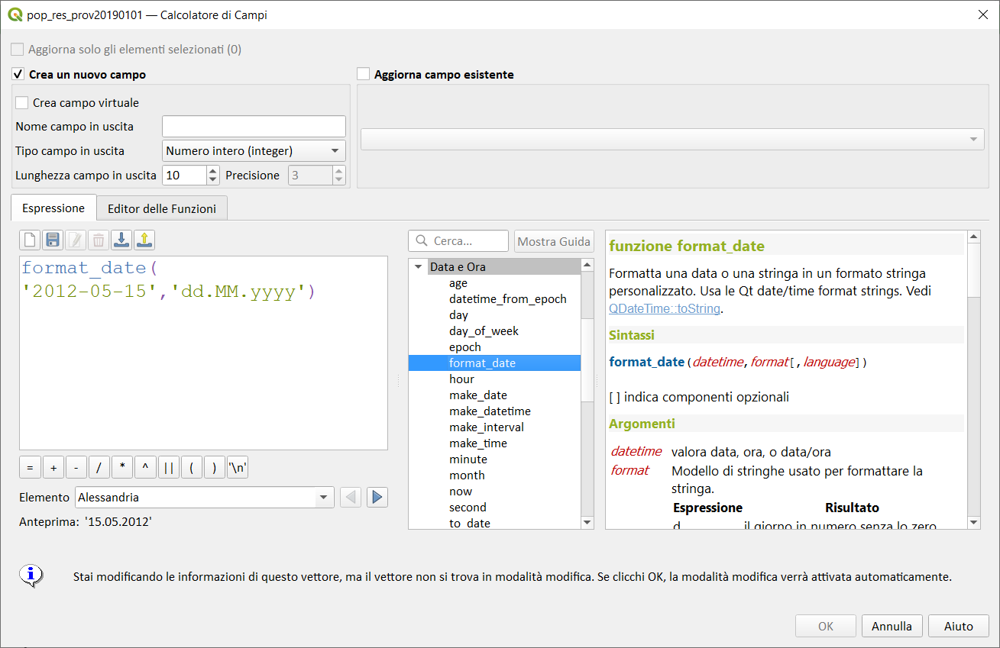](../../img/data_e_ora/format_date1.png)


[](../../img/data_e_ora/format_data_2.png)

---

## hour

Estrae la parte ore da una data/ora o orario, o il numero delle ore da un intervallo.

### Variabile ora

Estrae la parte ore da un orario o data/ora.

Sintassi:

* hour(_<span style="color:red;">datetime</span>_)

Argomenti:

* _<span style="color:red;">datetime</span>_ un valore data o data/ora

Esempi:

```
hour(to_datetime('2018-05-09T11:58:57')) → 11
```
[](../../img/data_e_ora/hour1.png)

### Variabile intervallo

Calcola la lunghezza in ore di un intervallo.

Sintassi:

* hour(_<span style="color:red;">interval</span>_)

Argomenti:

* _<span style="color:red;">interval</span>_ valore intervallo da cui restituire il numero di ore

Esempi:

```
hour(tointerval('3 hours')) → 3
hour(age('2012-07-22T13:00:00','2012-07-22T10:00:00')) → 3
hour(age('2012-01-01','2010-01-01')) → 17520
```

[](../../img/data_e_ora/hour2.png)

---

## make_date

Crea un valore di data dai numeri di anno, mese e giorno.

Sintassi:

* make_date(_<span style="color:red;">year</span>_,_<span style="color:red;">month</span>_,_<span style="color:red;">day</span>_)

Argomenti:

* _<span style="color:red;">year</span>_ Numero dell'anno. Gli anni da 1 a 99 vengono interpretati così come sono. L'anno 0 non è valido.
* _<span style="color:red;">month</span>_ Numero del mese, dove 1 = gennaio
* _<span style="color:red;">day</span>_ Day Numero del giorno, che inizia con 1 per il primo giorno del mese.

Esempi:


make_date(2020,5,4) → date value 2020-05-04`

[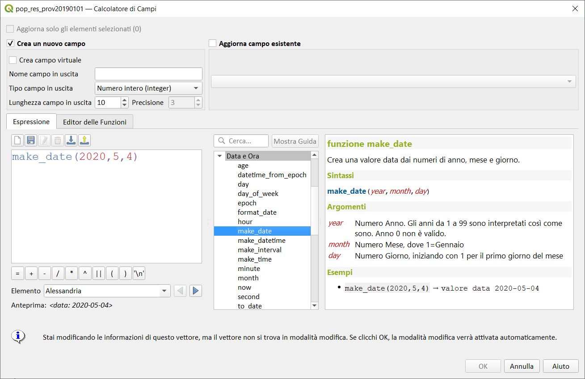](../../img/data_e_ora/make_date1.png)

---

## make_datetime

Crea un valore datetime da anno, mese, giorno, ora, minuti e secondi numeri.

Sintassi:

* make_datetime(_<span style="color:red;">year</span>_,_<span style="color:red;">month</span>_,_<span style="color:red;">day</span>_,_<span style="color:red;">hour</span>_,_<span style="color:red;">minute</span>_,_<span style="color:red;">second</span>_)

Argomenti:

* <span style="color:red;">year</span> Numero dell'anno. Gli anni da 1 a 99 vengono interpretati così come sono. L'anno 0 non è valido.
* <span style="color:red;">month</span> Numero del mese, dove 1 = gennaio
* <span style="color:red;">day</span> Day Numero del giorno, che inizia con 1 per il primo giorno del mese;
* <span style="color:red;">hour</span> numero ore;
* <span style="color:red;">minute</span> minuti;
* <span style="color:red;">second</span> secondi (i valori frazionari includono millisecondi).

Esempi:

```
make_datetime(2020,5,4,13,45,30.5) → datetime value 2020-05-04 13:45:30.500
```

[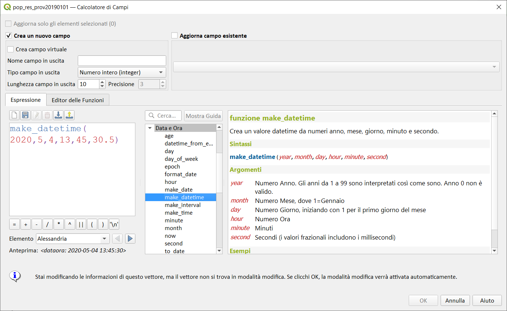](../../img/data_e_ora/make_datetime1.png)

Osservazioni:

---

## make_interval

Crea un valore di intervallo dai valori di anno, mese, settimane, giorni, ore, minuti e secondi.

Sintassi:

* make_interval(_<span style="color:red;">_years=0</span>_][,_<span style="color:red;">months=0</span>_][,_<span style="color:red;">weeks=0</span>_][,_<span style="color:red;">days=0</span>_][,_<span style="color:red;">hours=0</span>_][,_<span style="color:red;">minutes=0</span>_][,_<span style="color:red;">seconds=0</span>])

[ ] indica componenti opzionali

Argomenti:

* _<span style="color:red;">year</span>_ Numero di anni (presuppone una durata di 365,25 giorni).
* _<span style="color:red;">month</span>_ Numero di mesi (presuppone una durata del mese di 30 giorni)
* _<span style="color:red;">weeks</span>_ numero settimane;
* _<span style="color:red;">day</span>_ Numero di giorno;
* _<span style="color:red;">hour</span>_ numero ore;
* _<span style="color:red;">minute</span>_ minuti;
* _<span style="color:red;">second</span>_ secondi.


Esempi:

```
make_interval(2020,5,4,13,45,30.5) → datetime value 2020-05-04 13:45:30.500
```

[](../../img/data_e_ora/make_interval1.png)

---

## make_time

Crea un valore temporale da ore, minuti e secondi numeri.

Sintassi:

* make_time(_<span style="color:red;">hour</span>_,_<span style="color:red;">minute_</span>_,_<span style="color:red;">second</span>_)

Argomenti:

* _<span style="color:red;">hour</span>_ numero ore
* _<span style="color:red;">minute</span>_ minuti
* _<span style="color:red;">second</span>_ secondi (le frazioni includono i millisecondi)


Esempi:

```
make_time(13,45,30.5) → time value 13:45:30.500
```

[](../../img/data_e_ora/make_time1.png)

---

## minute

Estrae la parte minuti da un data/ora o ora, o il numero dei minuti da un intervallo.

### Variabile ora

Estrae la parte minuti da una time o una datetime.

Sintassi:

* minute(_<span style="color:red;">datetime</span>_)

Argomenti:

* _<span style="color:red;">datetime</span>_ un valore data o data/ora

Esempi:

```
minute('2012-07-22T13:24:57') → 24
```
[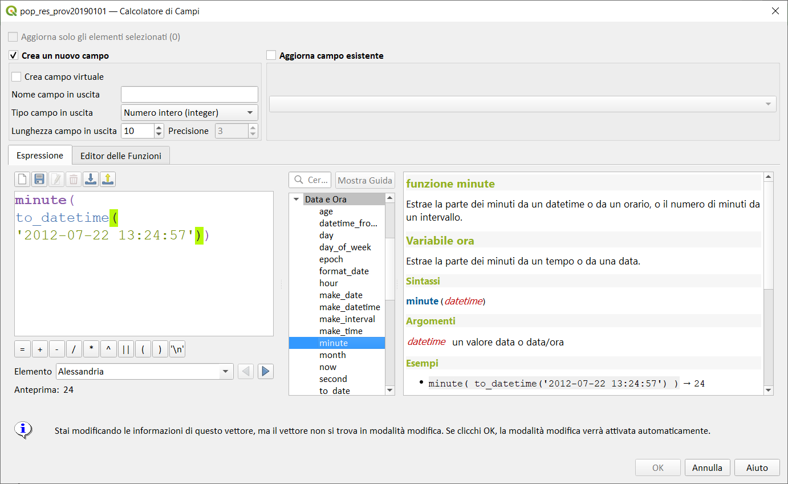](../../img/data_e_ora/minute1.png)

### Variabile intervallo

Calcola la lunghezza in minuti di un intervallo.

Sintassi:

* minute(_<span style="color:red;">interval</span>_)

Argomenti:

* _<span style="color:red;">interval</span>_ valore intervallo da cui restituire il numero di minuti

Esempi:

```
minute(tointerval('3 minutes')) → 3
minute(age('2012-07-22T00:20:00','2012-07-22T00:00:00')) → 20
minute(age('2012-01-01','2010-01-01')) → 1051200
```

[](../../img/data_e_ora/minute2.png)

---

## month

Estrae la parte mese da una data, o il numero di mesi da un intervallo.

### Variabile data

Estrae la parte mese da una data o datetime.

Sintassi:

* month(_<span style="color:red;">date</span>_)

Argomenti:

* _<span style="color:red;">date</span>_ un valore data o data/ora

Esempi:

```
month('2012-05-12') → 05
```

[](../../img/data_e_ora/month1.png)

### Variabile intervallo

Calcola la lunghezza in mesi di un intervallo.

Sintassi:

* month(_<span style="color:red;">interval</span>_)

Argomenti:

* _<span style="color:red;">interval</span>_ valore intervallo da cui restituire il numero di mesi

Esempi:

```
month(to_interval('3 months')) → 3
month(age('2012-01-01','2010-01-01')) → 24.3333
```

[](../../img/data_e_ora/month1.png)

---

## now

Restituisce la data e l'ora correnti. La funzione è statica e restituirà risultati coerenti durante la valutazione. Il tempo restituito è il momento in cui viene preparata l'espressione.

Sintassi:

* now()

Esempi:

```
now() → 2018-05-09 12:18:38`
```

[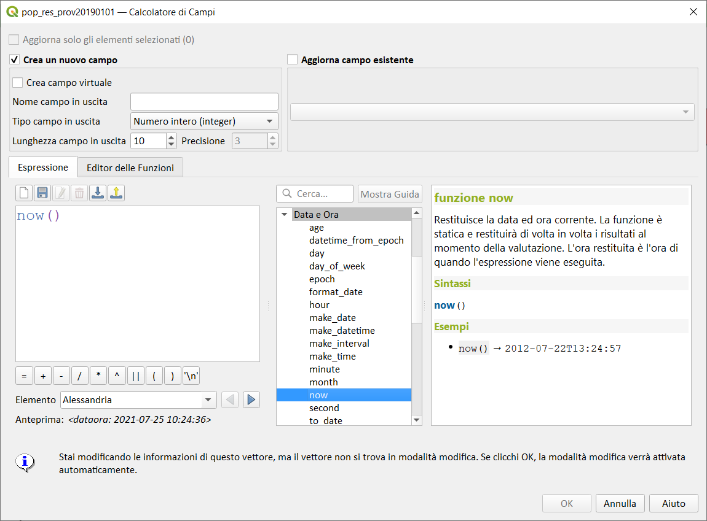](../../img/data_e_ora/now1.png)

---

## second

Estrae la parte secondi da un datetime o time, o il numero dei secondi da un intervallo.

### Variabile ora

Estrae la parte secondi da una time o una datetime.

Sintassi:

* second(_<span style="color:red;">datetime</span>_)

Argomenti:

* _<span style="color:red;">datetime</span>_ un valore data o data/ora

Esempi:

```
second('2012-07-22T13:24:57') → 57
```

[](../../img/data_e_ora/second1.png)

### Variabile intervallo

Calcola la lunghezza in secondi di un intervallo.

Sintassi:

* second(_<span style="color:red;">interval</span>_)

Argomenti:

* _<span style="color:red;">interval</span>_ valore intervallo da cui restituire il numero di secondi

Esempi:

```
second(age('2012-07-22T00:20:00','2012-07-22T00:00:00')) → 1200
second(age('2012-01-01','2010-01-01')) → 63072000
```

[](../../img/data_e_ora/second2.png)

---

## to_date

Converte una stringa in un oggetto data. È possibile fornire una stringa di formato opzionale per analizzare la stringa; vedi [QDate::fromString](https://doc.qt.io/qt-5/qdate.html#fromString-2) o la documentazione della funzione format_date per ulteriore documentazione sul formato. Per impostazione predefinita, viene utilizzata la locale dell'utente di QGIS corrente.

Sintassi:

* to_date(_<span style="color:red;">string</span>_,[_<span style="color:red;">format</span>_][,_<span style="color:red;">language</span>_])

[ ] indica componenti opzionali

Argomenti:

* _<span style="color:red;">string</span>_ stringa rappresentante il valore data
* _<span style="color:red;">format</span>_ formato usato per convertire la stringa in una data
* _<span style="color:red;">language</span>_ lingua (minuscolo, due o tre lettere, codice lingua ISO 639) utilizzata per convertire la stringa in una data. Per impostazione predefinita, viene utilizzata la locale dell'utente di QGIS corrente.

Esempi:

```
to_date('2012-05-04') → 2012-05-04
to_date('June 29, 2019','MMMM d, yyyy') → 2019-06-29, se la locale corrente utilizza il nome 'June' per il sesto mese, altrimenti si verifica un errore
to_date('29 juin, 2019','d MMMM, yyyy','fr') → 2019-06-29
```

[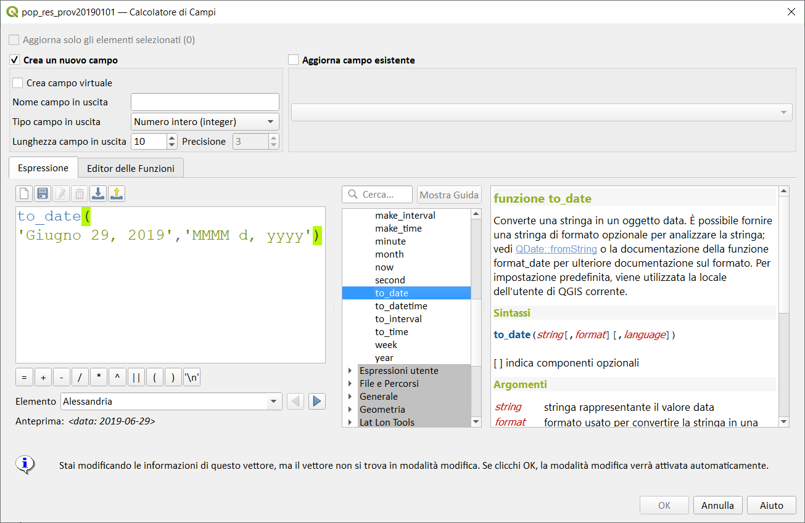](../../img/data_e_ora/to_date1.png)

---

## to_datetime

Converte una stringa in un oggetto datetime. È possibile fornire una stringa di formato opzionale per analizzare la stringa; vedi [QDate::fromString](https://doc.qt.io/qt-5/qdate.html#fromString-2), [QTime::fromString](https://doc.qt.io/qt-5/qtime.html#fromString-1) o la documentazione della funzione format_date per ulteriore documentazione sul formato. Per impostazione predefinita, viene utilizzata la locale dell'utente di QGIS corrente.

Sintassi:

* to_datetime(_<span style="color:red;">string</span>_,[_<span style="color:red;">format</span>_][,_<span style="color:red;">language</span>_])

[ ] indica componenti opzionali

Argomenti:

* _<span style="color:red;">string</span>_ stringa rappresentante il valore data
* _<span style="color:red;">format</span>_ formato usato per convertire la stringa in una data
* _<span style="color:red;">language</span>_ lingua (minuscolo, due o tre lettere, codice lingua ISO 639) utilizzata per convertire la stringa in una data. Per impostazione predefinita, viene utilizzata la locale dell'utente di QGIS corrente.

Esempi:

```
to_datetime('2012-05-04 12:50:00') → 2012-05-04T12:50:00
to_datetime('June 29, 2019 @ 12:34','MMMM d, yyyy @ HH:mm') → 2019-06-29T12:34, se la locale corrente utilizza il nome 'June' per il sesto mese, altrimenti si verifica un errore
to_datetime('29 juin, 2019 @ 12:34','d MMMM, yyyy @ HH:mm','fr') → 2019-06-29T12:3
```

[](../../img/data_e_ora/to_datetime1.png)

---

## to_interval

Converte una stringa in un tipo intervallo. Può essere usata per estrarre giorni, ore, mese, etc. da una data.

Sintassi:

* to_interval(_<span style="color:red;">string</span>_)

Argomenti:

* _<span style="color:red;">string</span>_ una stringa rappresentante un intervallo. I formati ammessi includono {n} giorni {n} ore {n} mesi.

Esempi:

```
to_interval('1 day 2 hours') → interval: 1.08333 days
to_interval( '0.5 hours' ) → intervallo: 30 minuti
to_datetime('2012-05-05 12:00:00') - to_interval('1 day 2 hours') → 2012-05-04T10:00:00
```

[](../../img/data_e_ora/to_interval1.png)

---

## to_time

Converte un stringa in un oggetto ora. Una stringa opzionale di formato può essere fornita per valutare la stringa; Vedi [QTime::fromString](https://doc.qt.io/qt-5/qtime.html#fromString-1) per documentazione aggiuntiva sul formato.

Sintassi:

* to_time(_<span style="color:red;">string</span>_,[_<span style="color:red;">format</span>_][,_<span style="color:red;">language</span>_])

[ ] indica componenti opzionali

Argomenti:

* _<span style="color:red;">string</span>_ stringa rappresentante il valore ora
* _<span style="color:red;">format</span>_ formato usato per convertire la stringa in orario
* _<span style="color:red;">language</span>_ lingua (minuscolo, due o tre lettere, codice lingua ISO 639) utilizzata per convertire la stringa in un orario.
* 
Esempi:

```
to_time('12:30:01') → 12:30:01
to_time('12:34','HH:mm') → 12:34:00
to_time('12:34','HH:mm','fr') → 12:34:00
```

[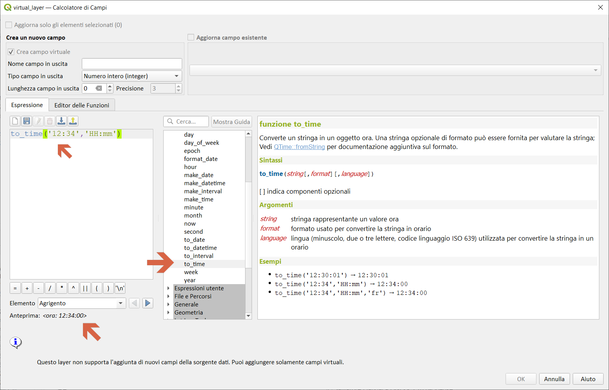](../../img/data_e_ora/to_time1.png)

---

## week

Estrae il numero della settimana da una data, o il numero di settimane da un intervallo.

### Variabile data

Estrae il numero della settimana da una data o un datetime.

Sintassi:

* week(_<span style="color:red;">date</span>_)

Argomenti:

* _<span style="color:red;">date</span>_ un valore data o data/ora

Esempi:

```
week('2018-05-09') → 19
```

[](../../img/data_e_ora/week1.png)

### Variabile intervallo

Calcola la lunghezza in settimane di un intervallo.

Sintassi:

* week(_<span style="color:red;">interval</span>_)

Argomenti:

* _<span style="color:red;">interval</span>_ valore intervallo da cui restituire il numero di mesi

Esempi:

```
week(tointerval('3 weeks')) → 3
week(age('2012-01-01','2010-01-01')) → 104.285
```

[](../../img/data_e_ora/week2.png)

---

## year

Estrae la parte anno da una data, o il numero di anni da un intervallo.

### Variabile data

Estrae la parte anno da una data o datetime.

Sintassi:

* year(_<span style="color:red;">date</span>_)

Argomenti:

* _<span style="color:red;">date</span>_ un valore data o data/ora

Esempi:

```
week('2018-05-09') → 19
```

[](../../img/data_e_ora/year1.png)

### Variabile intervallo

Calcola la lunghezza in anni di un intervallo.

Sintassi:

* year(_<span style="color:red;">interval</span>_)

Argomenti:

* _<span style="color:red;">interval</span>_ valore intervallo da cui restituire il numero di anni

Esempi:

```
year(to_interval('3 years')) → 3
year(age('2012-01-01','2010-01-01')) → 1.9986
```

[](../../img/data_e_ora/year2.png)

---
