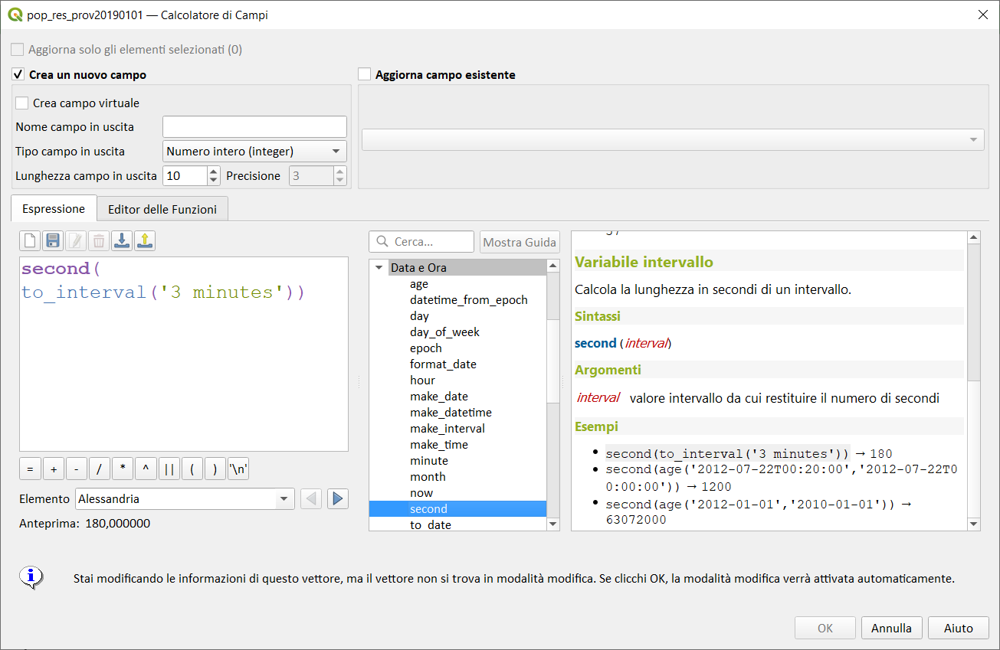

# second

Estrae la parte secondi da un datetime o time, o il numero dei secondi da un intervallo.

## Variabile ora

Estrae la parte secondi da una time o una datetime.

## Sintassi

* second(_<span style="color:red;">datetime</span>_)

## Argomenti

* _<span style="color:red;">datetime</span>_ un valore data o data/ora

## Esempi
```
* second('2012-07-22T13:24:57') → 57
```


## Variabile ora

Calcola la lunghezza in secondi di un intervallo.

## Sintassi

* second(_<span style="color:red;">interval</span>_)

## Argomenti

* _<span style="color:red;">interval</span>_ valore intervallo da cui restituire il numero di secondi

## Esempi
```
second(age('2012-07-22T00:20:00','2012-07-22T00:00:00')) → 1200
second(age('2012-01-01','2010-01-01')) → 63072000
```


