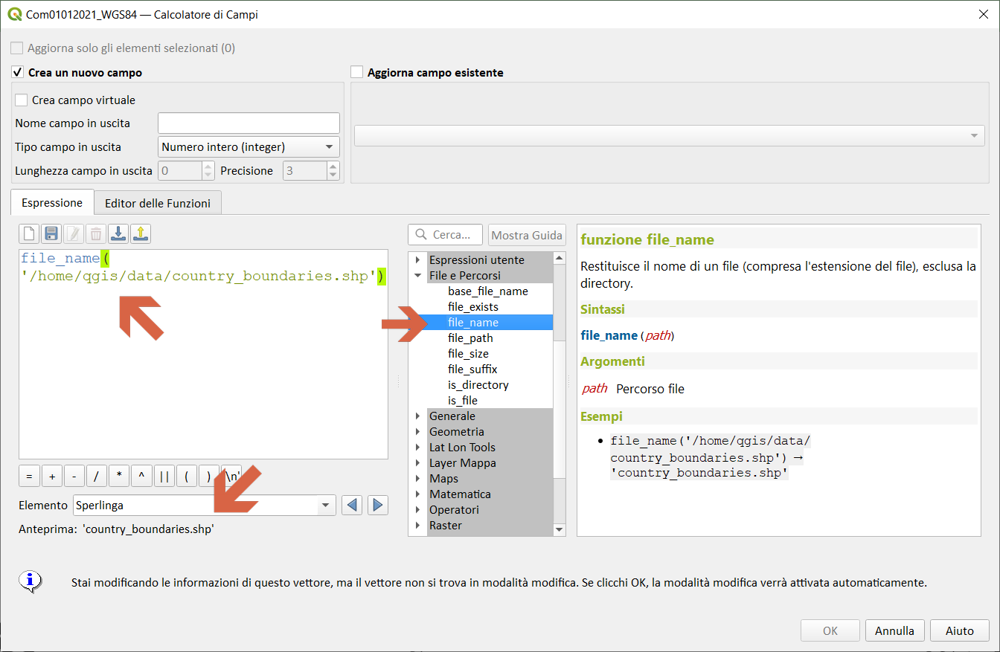
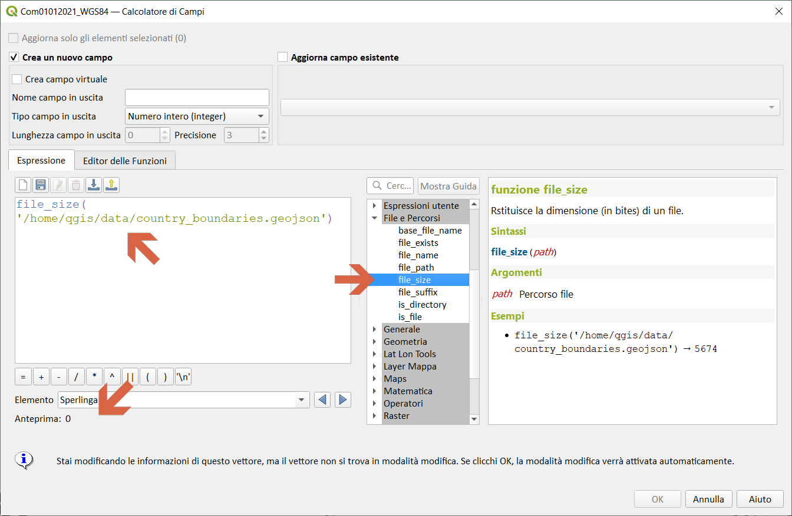
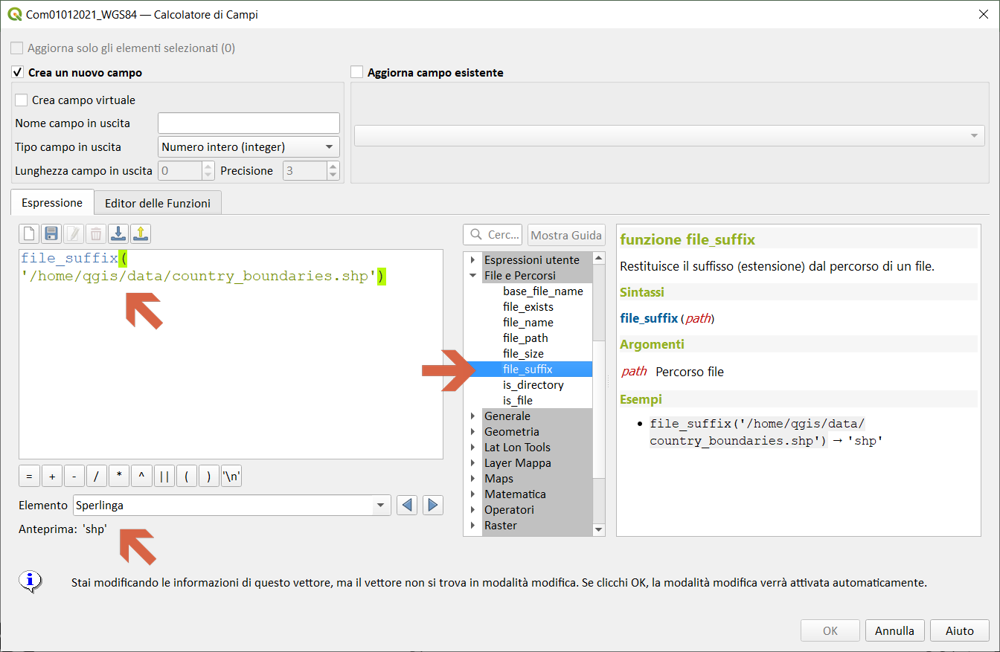
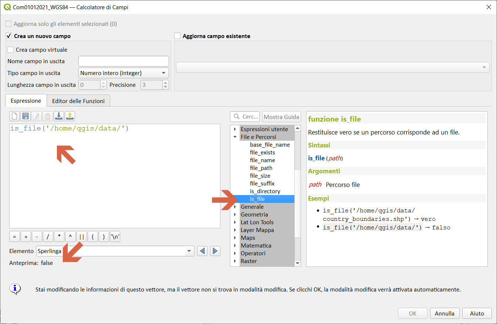

# Gruppo File e Percorsi

Contiene funzioni che manipolano nomi di file e di percorsi.

## base_file_name

Restituisce il nome del file senza la cartella o il suffisso del file. 

Sintassi:

- base_file_name(_<span style="color:red;">path</span>_)

Argomenti:

- _<span style="color:red;">path</span>_ Percorso file

Esempi:

```
- base_file_name('/home/qgis/data/country_boundaries.shp') → 'country_boundaries'
```


## file_exists

Restituisce vero se un percorso del file esiste. 

Sintassi:

- file_exists(_<span style="color:red;">path</span>_)

Argomenti:

- _<span style="color:red;">path</span>_ Percorso file

Esempi:

```
- file_exists('/home/qgis/data/country_boundaries.shp') → vero
```


## file_name

Restituisce il nome di un file (compresa l'estensione del file), esclusa la directory.

Sintassi:

- file_name(_<span style="color:red;">path</span>_)

Argomenti:

- _<span style="color:red;">path</span>_ Percorso file

Esempi:

```
- file_name('/home/qgis/data/country_boundaries.shp') → 'country_boundaries.shp'
```



## file_path

Restituisce il componente della cartella del un percorso di un file. Questo non include il nome del file.

Sintassi:

- file_path(_<span style="color:red;">path</span>_)

Argomenti:

- _<span style="color:red;">path</span>_ Percorso file

Esempi:

```
- file_path('/home/qgis/data/country_boundaries.shp') → '/home/qgis/data'
```


## file_size

Restituisce la dimensione (in bites) di un file.

Sintassi:

- file_size(_<span style="color:red;">path</span>_)

Argomenti:

- _<span style="color:red;">path</span>_ Percorso file

Esempi:

```
- file_size('/home/qgis/data/country_boundaries.geojson') → 5674
```



## file_suffix

Restituisce il suffisso (estensione) dal percorso di un file.

Sintassi:

- file_suffix(_<span style="color:red;">path</span>_)

Argomenti:

- _<span style="color:red;">path</span>_ Percorso file

Esempi:

```
- file_suffix('/home/qgis/data/country_boundaries.shp') → 'shp'
```



## is_directory

Restituisce vero se un percorso corrisponde ad una directory.

Sintassi:

- is_directory(_<span style="color:red;">path</span>_)

Argomenti:

- _<span style="color:red;">path</span>_ Percorso file

Esempi:

```
- is_directory('/home/qgis/data/country_boundaries.shp') → falso
- is_directory('/home/qgis/data/') → vero
```


## is_file

Restituisce vero se un percorso corrisponde ad un file.

Sintassi:

- is_file(_<span style="color:red;">path</span>_)

Argomenti:

- _<span style="color:red;">path</span>_ Percorso file

Esempi:

```
- is_file('/home/qgis/data/country_boundaries.shp') → vero
- is_file('/home/qgis/data/') → falso
```


