# Gruppo Geometria

!!! Abstract
	**Questo gruppo contiene funzioni che operano sugli oggetti geometrici es: _lunghezza_, _area_.**


| Area           |      lunghezza           |        Predicati          |      Overlay_*                            | coordinate            | vari
|----------------|--------------------------|---------------------------|-------------------------------------------|----------------------|---------------
|[$area](#area)  | [$length](#length)       | [contains](#contains)     | [overlay_contains](#overlay_contains)     | [$x](#x1)            | [centroid](#centroid)
|[area](#area)   | [length](#length)        | [crosses](#crosses)       | [overlay_crosses](#overlay_crosses)       | [$y](#y1)|           | [buffer](#buffer)
|    -           | [$perimeter](#perimeter) | [disjoint](#disjoint)     | [overlay_disjoint](#overlay_disjoint)     | [x](#x_1)            |
|	-		     | [perimeter](#perimeter)  | [intersects](#intersects) | [overlay_equals](#overlay_equals)         | [y](#y_1)            |
|	-			 |			-			    | [overlaps](#overlaps)	    | [overlay_intersects](#overlay_intersects) | [z](#z)              |
|	-			 |			-			    | [touches](#touches)	    | [overlay_nearest](#overlay_nearest)       | [m](#m)               |
|	-			 |			-			    | [within](#within)		    | [overlay_touches](#overlay_touches)       |      -               |
|	-			 |			-			    |           -               | [overlay_within](#overlay_within)         |      -               |

---

## $area

!!! Note "Definizione"
	**Restituisce l'area della geometria corrente. L'area calcolata da questa funzione rispetta sia le impostazioni dell'ellissoide del progetto corrente sia delle unità di misura. Per esempio, se è stato impostato un ellissoide per il progetto allora l'area calcolata sarà ellisoidica altrimenti se non è stato impostato alcun ellissoide l'area calcolata sarà planimetrica.**

Sintassi:

- $area

!!! Example "Esempi"
	```
	* $area → 131196498,619546
	```

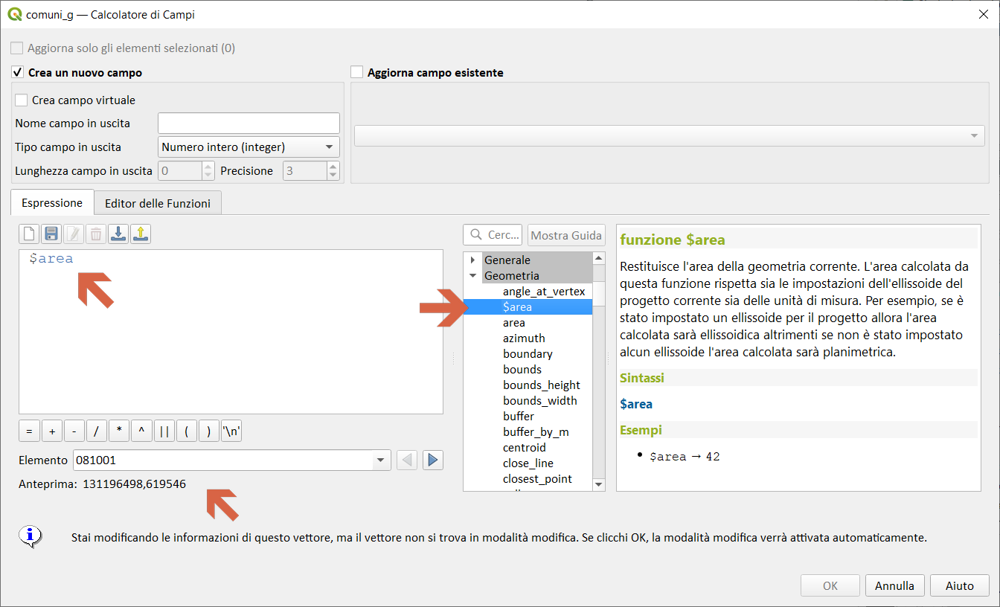

!!! Danger "Nota bene"
    se il _<span style="color:red;">SR del progetto</span>_ in cui si sta calcolando l'area (**$area**) fosse un sistema proiettato (es:EPSG 3003/4; 32632/33/34 ecc..) allora l'unità di misura sarebbe il metro, invece se il _<span style="color:red;">SR del progetto</span>_ fosse EPSG 4326, cioè un sistema geografico, allora l'unità di misura dell'area sarebbe _**gradi**_ e quindi poco comprensibile e valori piccoli (0.00001).

!!! Warning "Attenzione!"
	```
	in generale $area <> area($geometry)
	```

---

## $geometry

!!! Note "Definizione"
	**Restituisce la geometria dell'elemento attuale. Può essere usato per il processamento con altre funzioni.**

Sintassi:

- $geometry

!!! Example "Esempi"
	* geomToWKT( $geometry ) → POINT(6 50)
	* area($geoamtry) → 1234567.89 mq
	* perimeter($geometry) → 25689.25 m

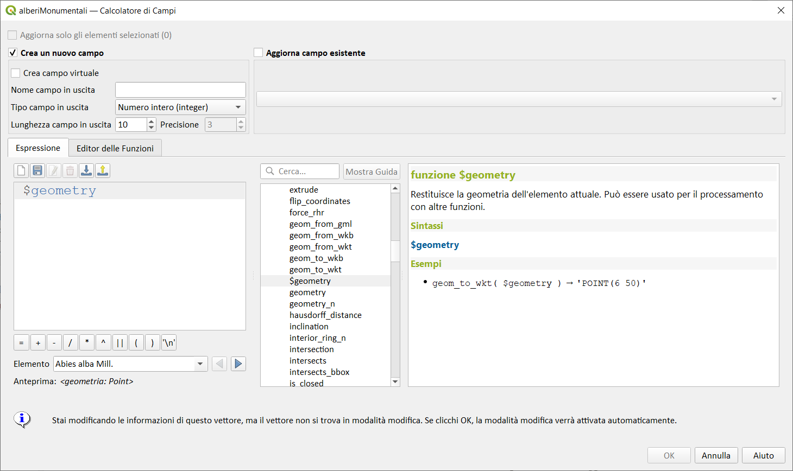

!!! Info "Osservazioni"
	**il `$` indica che è relativo all'elemento corrente e non ha bisogno di argomenti.**

---

## $length

!!! Note "Definizione"
	**Restituisce la lunghezza di una linestring. Se hai bisogno della lunghezza del bordo di un poligono, utilizza invece [$perimeter](#perimeter). La lunghezza calcolata da questa funzione rispetta le impostazioni sia dell'ellissoide sia delle unità di misura del progetto corrente. Per esempio, se è stato impostato un ellissoide per il progetto allora la lunghezza calcolata sarà ellisoidica altrimenti se non è stato impostato alcun ellissoide la lunghezza calcolata sarà planimetrica.**

Sintassi:

- $length

!!! Example "Esempi"
	```
	* $length → 42.4711 
	```

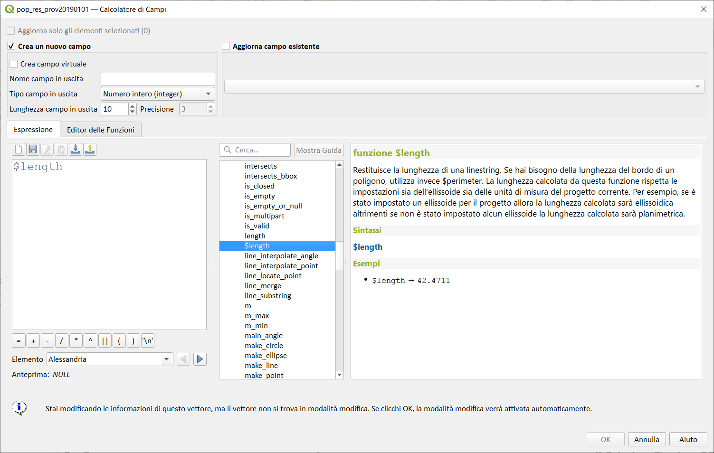

!!! Warning "Attenzione!"
	Come evidenziano nella definizione della funzione, [$length](#length) calcola la lunghezza rispettando le impostazioni di progetto:


Occorre cambiare entrambe le impostazioni, sia quelle dell'ellissoide → 'None/Planimetric' sia le Unità di misura per le distanze' → Gradi


Queste modofiche non valgono per l'etichettatura, la lunghezza sarà quella relativa alla geometria e quindi al suo SR.

!!! Info "Osservazioni"
	**il `$` indica che è relativo all'elemento corrente e non ha bisogno di argomenti.**

---

## $perimeter

!!! Note "Definizione"
	**Restituisce la lunghezza del perimetro della geometria corrente. Il perimetro calcolato da questa funzione rispetta le impostazioni sia dell'ellissoide sia delle unità di misura del progetto corrente. Per esempio, se è stato impostato un ellissoide per il progetto allora il perimetro calcolato sarà ellisoidico altrimenti se non è stato impostato alcun ellissoide il perimetro calcolato sarà planimetrico.**

Sintassi:

- $perimeter

!!! Example "Esempi"
	```
	- $perimeter → 2545897.26
	```


!!! Nota
    Si utilizza SOLO per i poligoni, nel caso di feature lineari [$length ](#length)

!!! Info "Osservazioni"
	**il `$` indica che è relativo all'elemento corrente e non ha bisogno di argomenti.**

---

## $x

!!! Note "Definizione"
	**Restituisce la coordinata x della geometria corrente.**

Sintassi:

- $x

!!! Example "Esempi"
	```
  	* $x → 12.2568971
	```


!!! Warning "Attenzione!"
	La funzione [$x](#x) restituisce la coordinata `x` della geometria corrente purchè sia un POINT altrimenti restituisce NULL (vedi screenshot)

!!! Info "Osservazioni"
	Per ottenere le coordinate `x` o `y` occorre utilizzare una combinazione di funzioni ed: `x($geometry)` che vale per qualunque tipologia di geometria (point, linestring, polygon)

---

## $x_at

!!! Note "Definizione"
	**Recupera una coordinata x per la geometria dell'elemento corrente.**

Sintassi:

- $x_at(_<span style="color:red;">i</span>_)

Argomenti:

* _<span style="color:red;">i</span>_ indice del punto di una linea (indici partono da 0; valori negativi si applicano dall'ultimo indice, partendo da -1)

!!! Example "Esempi"
  	```
    * $x_at(1) → 12.6882843
	```


!!! Info "Osservazioni"
	Le lineastring hanno un verso e quindi l'indice 0 indica il primo vertice mentre indici negativi significano che la conta inizia dalla l'ultimo vertice: -10 significa il 10-mo vertice partendo dall'ultimo vertice.

---

## $y

!!! Note "Definizione"
	**Restituisce la coordinata y della geometria corrente.**

Sintassi:

- $y

!!! Example "Esempi"
	```
    * $y → 12.2568971
	```


!!! Warning "Attenzione!"
	La funzione [$y](#y_1) restituisce la coordinata `y` della geometria corrente purchè sia un POINT altrimenti restituisce NULL (vedi screenshot)

!!! Info "Osservazioni"
	Per ottenere le coordinate x o y occorre utilizzare una combinazione di funzioni es: y($geometry) che vale per qualunque tipologia di geometria (point, linestring, polygon)

---

## $y_at

!!! Note "Definizione"
	**Recupera una coordinata y per la geometria dell'elemento corrente.**

Sintassi:

- $y_at(_<span style="color:red;">i_</span>)

Argomenti:

* _<span style="color:red;">i</span>_ indice del punto di una linea (indici partono da 0; valori negativi si applicano dall'ultimo indice, partendo da -1)

!!! Example "Esempi"
	```
	* $y_at(1) → 2
	```
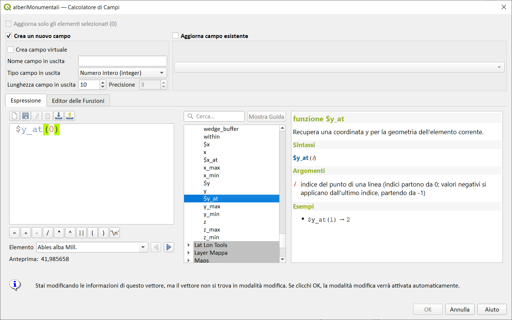

!!! Info "Osservazioni"
	Le lineastring hanno un verso e quindi l'indice 0 indica il primo vertice mentre indici negativi significano che la conta inizia dalla l'ultimo vertice: -10 significa il 10-mo vertice partendo dall'ultimo vertice.

---

## angle_at_vertex

!!! Note "Definizione"
	**Restituisce l'angolo della bisettrice (angolo medio) della geometria per un vertice specifico di una geometria di tipo linestring. Gli angoli sono in gradi in senso orario dal nord.**

Sintassi:

- angle_at_vertex(_<span style="color:red;">geometry</span>, <span style="color:red;">vertex</span>_)

Argomenti:

* _<span style="color:red;">geometry</span>_ una geometria di tipo linestring
* _<span style="color:red;">vertex</span>_ indice vertice, partendo da 0

!!! Example "Esempi"
	```
	* angle_at_vertex(geometry:=geom_from_wkt('LineString(0 0, 10 0, 10 10)'),vertex:=1) → 45.0
	```


!!! Warning "Attenzione!"
	Il primo ed ultimo vertice di una lineastring aperta la funzione restituisce il valore dell'angolo e non la bisettrice.


---

## area

!!! Note "Definizione"
	**Restituisce l'area di un oggetto a geometria poligonale. I calcoli sono sempre planimetrici nel Sistema di Riferimento Spaziale (SR) di detta geometria, e l'unità di misura dell'area restituita è conforme all'unità di misura del SR. Ciò differisce dal calcolo eseguito dalla funzione $area, la quale esegue calcoli ellisoidici basati sull'ellissoide del progetto e sulle impostazioni delle unità di misura dell'area.**

Sintassi:

- area(_<span style="color:red;">geometry</span>_)

Argomenti:

* _<span style="color:red;">geometry</span>_ oggetto geometria poligono

!!! Example "Esempi"
	```
	- area($geometry) → 1234.567
	```


!!! Occhio
	Se il _<span style="color:red;">SR del layer</span>_ in cui si sta calcolando l'area (_**area()**_) fosse un sistema proiettato (es:EPSG 3003/4; 32632/33/34 ecc..) l'unità di misura sarebbe il metro, invece se il _<span style="color:red;">SR del layer</span>_ fosse EPSG 4326, cioè un sistema geografico, allora l'unità di misura dell'area sarebbe in gradi e quindi poco comprensibile e valori piccoli.

!!! Info "Osservazioni"
	```
	in generale area($geometry) <> $area
	```
---

## Azimuth

!!! Note "Definizione"
	**Restituisce l'azimut dal nord quale angolo in radianti misurato in senso orario dalla verticale del punto_a al punto_b.**

Sintassi:

- azimuth(<span style="color:red;">point_a</span>, <span style="color:red;">point_b</span>)

Argomenti:

* <span style="color:red;">point_a</span> geometria punto
* <span style="color:red;">point_b</span> geometria punto

!!! Example "Esempi"
	```
	* degrees( azimuth( make_point(25, 45), make_point(75, 100) ) ) → 42.273689
	* degrees( azimuth( make_point(75, 100), make_point(25,45) ) ) → 222.273689
	```


!!! Warning "Attenzione!"
	**Azimuth** per definizione restituisce un angolo in radianti, per trasformarlo in gradi usare la funzione [degrees()](../matematica/degrees.md)


---

## boundary

!!! Note "Definizione"
	**Restituisce l'area minima della combinazione dei confini della geometria (cioè il confine topologico della geometria). Per esempio, una geometria poligonale avrà un confine costituito dalle linee di ogni anello nel poligono. Alcuni tipi di geometrie non hanno confini, es collezioni di punti o geometrie e pertanto verrà restituito null.**

Sintassi:

- boundary(_<span style="color:red;">geometry</span>_)

Argomenti:

* _<span style="color:red;">geometry</span>_ una geometria

!!! Example "Esempi"
	```
	- geom_to_wkt(boundary(geom_from_wkt('Polygon((1 1, 0 0, -1 1, 1 1))'))) → 'LineString(1 1,0 0,-1 1,1 1)'
	- geom_to_wkt(boundary(geom_from_wkt('LineString(1 1,0 0,-1 1)'))) → 'MultiPoint ((1 1),(-1 1))'
	```

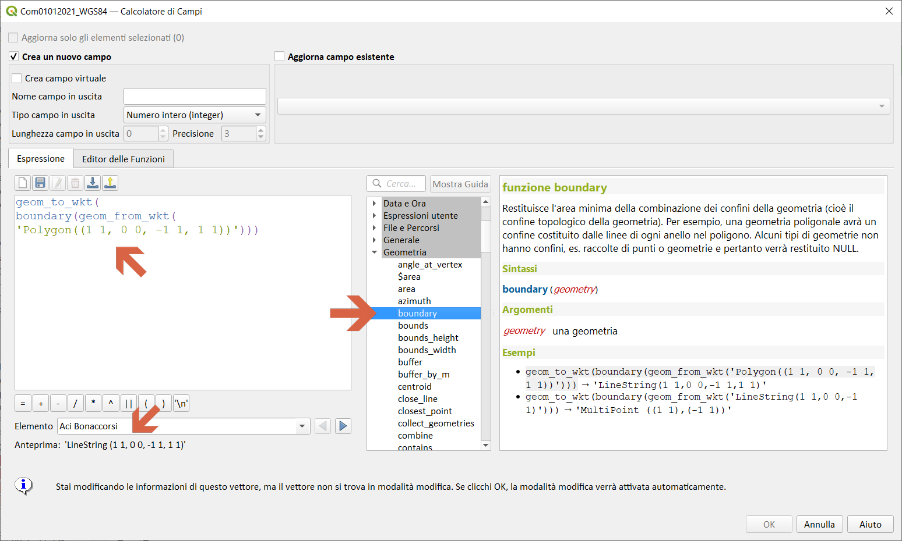


!!! Info "Osservazioni"
	funzione molto utile per la tematizzazione aggiungendo un nuovo layer con geometry generator


---

## bounds

!!! Note "Definizione"
	**Restituisce la geometria che rappresenta il perimetro di delimitazione di una geometria in ingresso. I calcoli sono effettuati nel sistema di riferimento spaziale di tale geometria.**

Sintassi:

- bounds(*<span style="color:red;">geometry</span>*)

Argomenti:

* _<span style="color:red;">geometry</span>_ una geometria

!!! Example "Esempi"
	```
	- bounds($geometry) → perimetro di delimitazione dell'elemento geometrico corrente
	- geom_to_wkt(bounds(geom_from_wkt('Polygon((1 1, 0 0, -1 1, 1 1))'))) → 'Polygon ((-1 0, 1 0, 1 1, -1 1, -1 0))'
	```

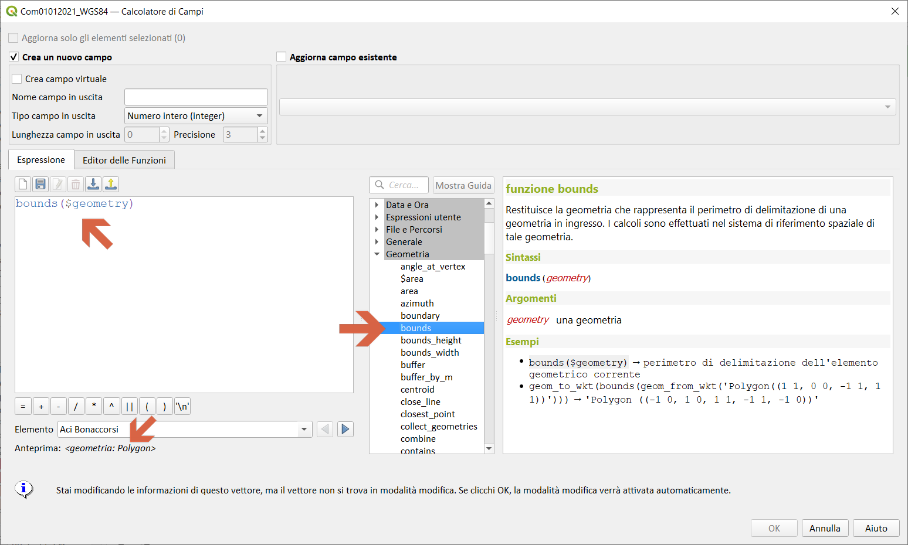


!!! Info "Osservazioni"
	funzione molto utile per la tematizzazione aggiungendo un nuovo layer con geometry generator


---

## bounds_height

!!! Note "Definizione"
	**Restituisce l'altezza del perimetro di delimitazione di una geometria. I calcoli sono effettuati nel sistema di riferimento spaziale di tale geometria.**

Sintassi:

- bounds_height(_<span style="color:red;">geometry</span>_)

Argomenti:

* _<span style="color:red;">geometry</span>_ una geometria

!!! Example "Esempi"
	```
	- bounds_height($geometry) → altezza del perimetro di delimitazione dell'elemento geometrico corrente
	- bounds_height(geom_from_wkt('Polygon((1 1, 0 0, -1 1, 1 1))')) → 1
	```

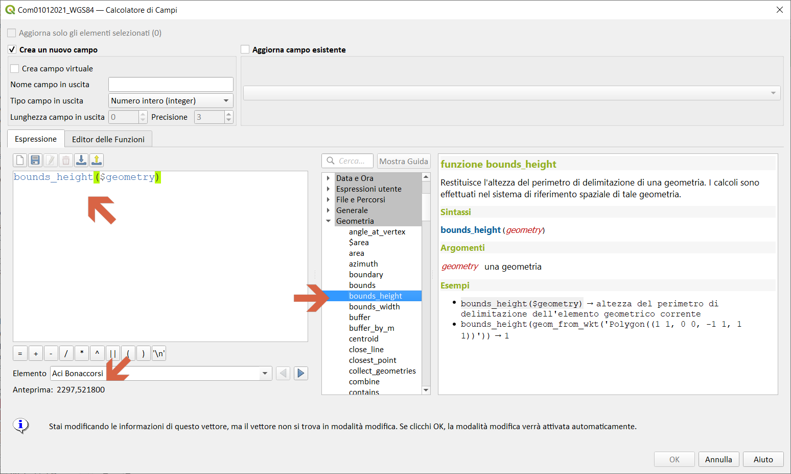


!!! Info "Osservazioni"
	La funzione restituisce un numero che corrisponde all'altezza del rettangolo di ingombro di una geometria.

---

## bounds_width

!!! Note "Definizione"
	**Restituisce la larghezza del perimetro di delimitazione di una geometria. I calcoli sono effettuati nel sistema di riferimento spaziale di tale geometria.**

Sintassi:

- bounds_width(*<span style="color:red;">geometry</span>*)

Argomenti:

* *<span style="color:red;">geometry</span>* una geometria

!!! Example "Esempi"
	```
    - bounds_width($geometry) → larghezza del perimetro di delimitazione di $geometry
	```

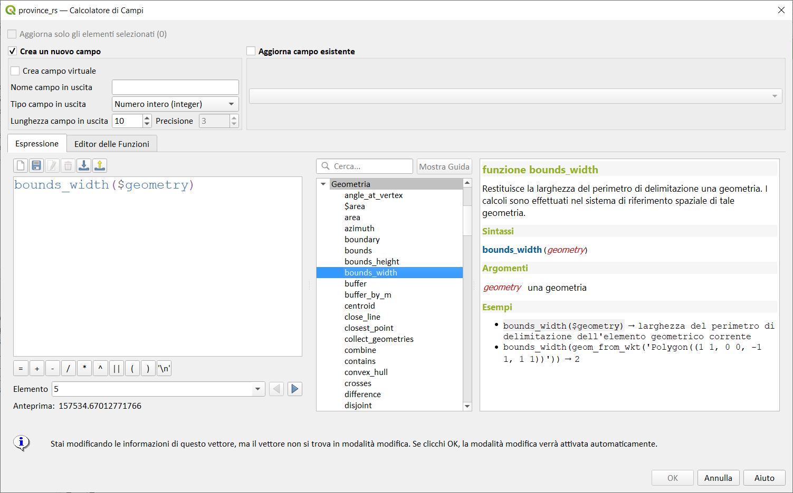


!!! Info "Osservazioni"
	La funzione restituisce un numero che corrisponde alla larghezza del rettangolo di ingombro di una geometria.

---

## buffer

!!! Note "Definizione"
	**Restituisce una geometria che rappresenta tutti i punti la cui distanza dalla geometria è minore o uguale alla distanza inserita. I calcoli vengono effettuati nel sistema di riferimento spaziale della geometria.**

Sintassi:

- buffer(*<span style="color:red;">geometry</span>*,*<span style="color:red;">distance</span>*[,_<span style="color:red;">segments=8</span>_])

Argomenti:

* *<span style="color:red;">geometry</span>* una geometria
* *<span style="color:red;">distance</span>* distanza buffer nelle unità del layer
* *<span style="color:red;">segments</span>* numero di segmenti da usare per rappresentare un quarto di cerchio quando è utilizzato uno stile di unione arrotondato. Un numero grande risulta in un buffer più morbido, con più nodi.

!!! Example "Esempi"
	```
    - buffer($geometry, 10.5) → poligono di $geometry bufferizzato di 10.5 unità
	```

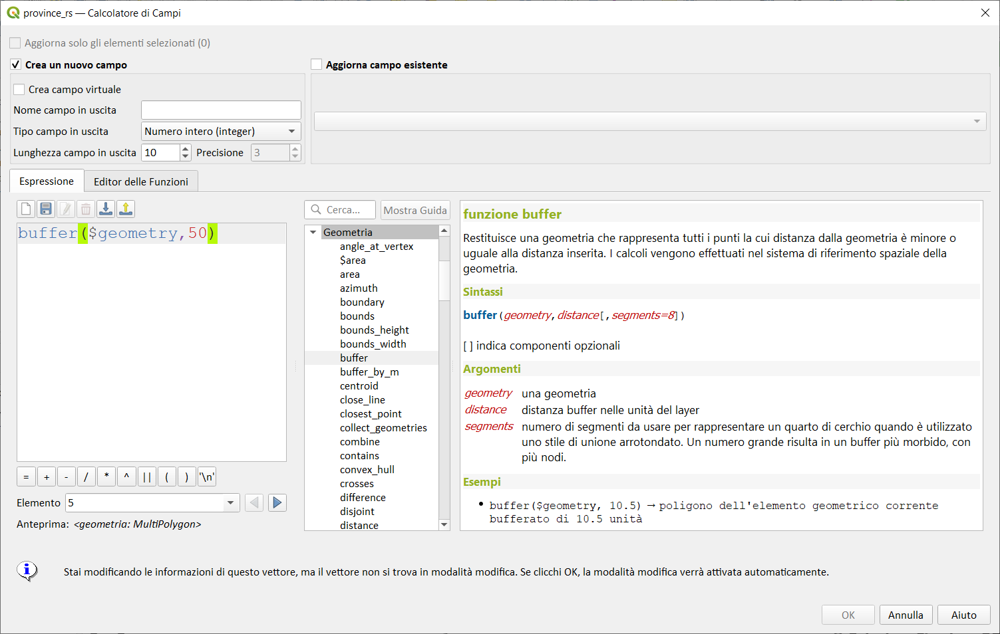


!!! Danger
	Utilizzando SR proiettati l'unità di misura è il metro, mentre, per SR geografici è il grado, quindi attenzione al valore della distanza.

Osservazioni:

!!! Nota
	La Funzione restituisce SEMPRE un poligono sia per geometry **POINT**, **LINESTRING** o **POLYGON**


---

## buffer_by_m

!!! Note "Definizione"
	**Crea un _buffer_ lungo una geometria _linestring_ in cui il diametro del buffer varia in base ai valori _m_ nei vertici della linea.**

Sintassi:

- buffer_by_m(_<span style="color:red;">geometry</span>, <span style="color:red;">segments</span>_)

Argomenti:

* _<span style="color:red;">geometry</span>_ la geometria deve essere una (multi) geometria linestring con valori m.
* _<span style="color:red;">segments</span>_ numero di segmenti per approssimare le curve del quarto di cerchio nel buffer


!!! Example "Esempi"
	```
	* buffer_by_m(geometry:=geom_from_wkt('LINESTRINGM(1 2 0.5, 4 2 0.2)'),segments:=8) → Un buffer di larghezza variabile che inizia con un diametro di 0,5 e termina con un diametro di 0,2 lungo la linea.
	```


relativa all'esempio di sopra:


Osservazioni:

[QGIS - feature](https://github.com/qgis/QGIS/pull/6882)

---

## centroid

!!! Note "Definizione"
	**Restituisce il centro geometrico di una geometria.**

Sintassi:

- centroid(*<span style="color:red;">geometry</span>*)

Argomenti:

* *<span style="color:red;">geometry</span>* una geometria

!!! Example "Esempi"
	```
    * centroid($geometry) → una geometria punto
	```

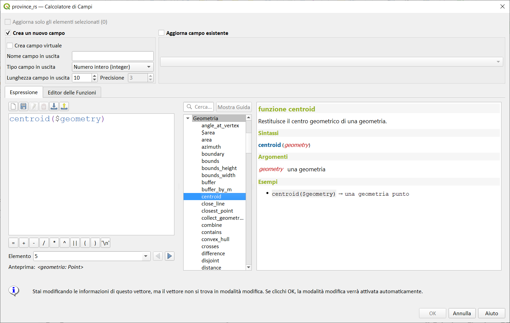


!!! Osservazioni
	La Funzione restituisce SEMPRE una geometry **POINT**


---

## close_line

!!! Note "Definizione"
	**Restituisce una linestring chiusa della linestring di input aggiungendo il primo punto alla fine della linea, se non è già chiusa. Se la geometria non è una linestring o una MultiLinestring, il risultato sarà NULL.**

Sintassi:

* close_line(_<span style="color:red;">geometry</span>_)

Argomenti:

* _<span style="color:red;">geometry</span>_ una geometria linestring

!!! Example "Esempi"
	```
	* geom_to_wkt(close_line(geom_from_wkt('LINESTRING(0 0, 1 0, 1 1)'))) → LineString (0 0, 1 0, 1 1, 0 0)
	* geom_to_wkt(close_line(geom_from_wkt('LINESTRING(0 0, 1 0, 1 1, 0 0)'))) → LineString (0 0, 1 0, 1 1, 0 0)
	```

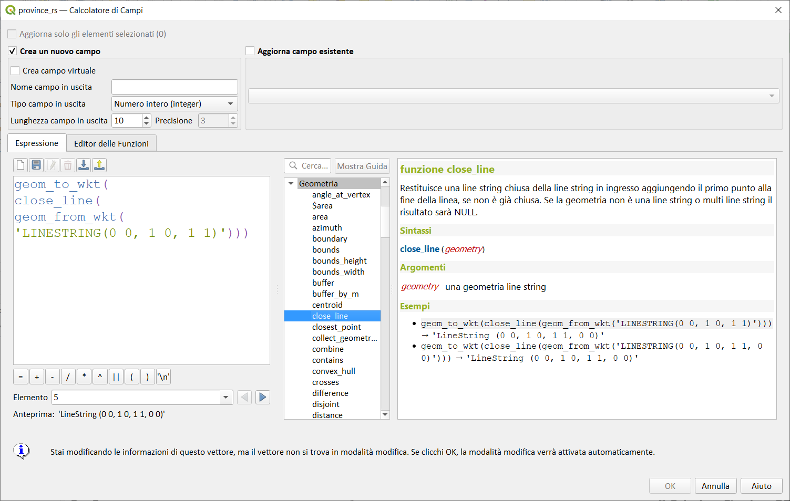

---

## closest_point

!!! Note "Definizione"
	**Restituisce il punto sulla geometria1 che è più vicino alla geometria2.**

Sintassi:

- closest_point(_<span style="color:red;">geometry1</span>_, _<span style="color:red;">geometry2</span>)

Argomenti:

* _<span style="color:red;">geometry1</span>_ geometria _sulla_ quale cercare il punto più vicino
* _<span style="color:red;">geometry</span>_ geometria _dalla_ quale cercare il punto più vicino

!!! Example "Esempi"
	```
  	* geom_to_wkt(closest_point(geom_from_wkt('LINESTRING (20 80, 98 190, 110 180, 50 75 )'),geom_from_wkt('POINT(100 100)'))) → Point(73.0769 115.384)
	```

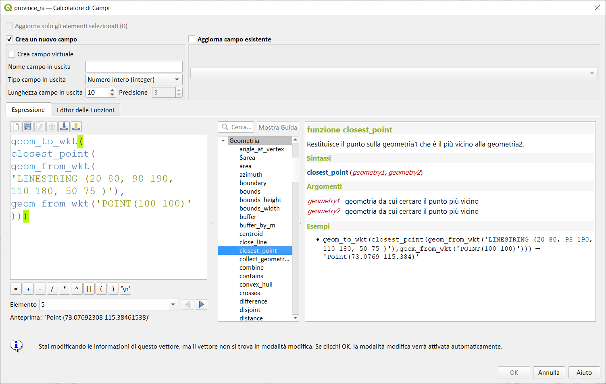


!!! Info "Osservazioni"
	Utilizzando il _geometry generator_ per i temi (il layer strade è una unica feature):

* `closest_point( geometry(get_feature('strade', 'reg',19)),$geometry)`


Gif animata: _geometry 1_ è la rete stradale; _geometry 2_ sono i punti; in rosso i closestpoint


---

## collect_geometries

!!! Note "Definizione"
	**Raccoglie un set di geometrie in un oggetto geometria multiparte.**

### Variante geometry

Sintassi:

- collect_geometries(_<span style="color:red;">geometry1</span>_, _<span style="color:red;">geometry2</span>_...)

Argomenti:

* _<span style="color:red;">geometry</span>_ geometria sulla quale cercare il punto più vicino

!!! Example "Esempi"
	```
  	* geom_to_wkt(collect_geometries(make_point(1,2), make_point(3,4), make_point(5,6))) → 'MultiPoint ((1 2),(3 4),(5 6))'
	```

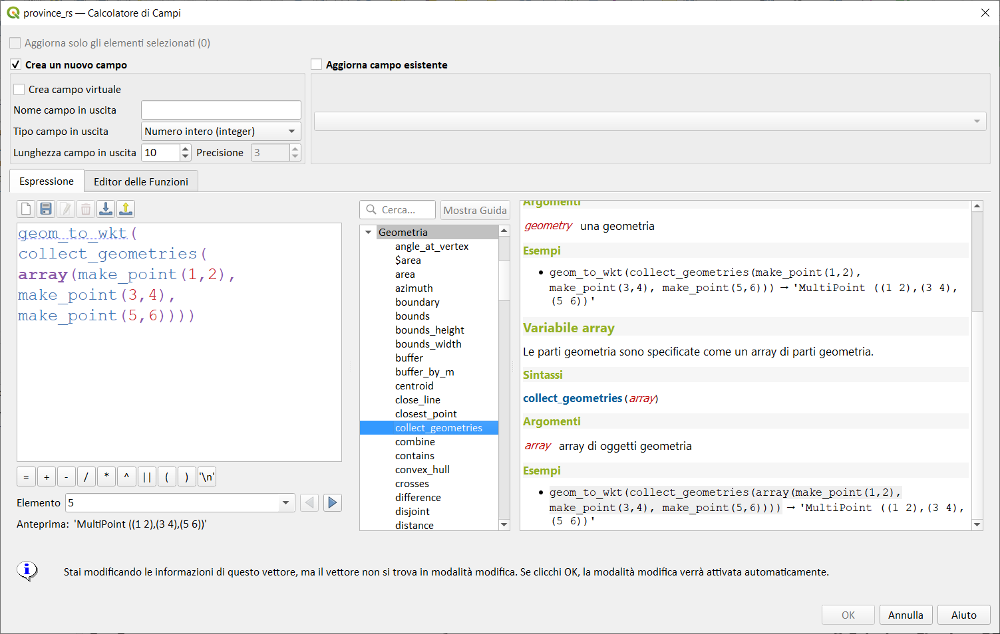

### Variante con array

Sintassi:

- collect_geometries(_<span style="color:red;">array</span>_)

Argomenti:

* _<span style="color:red;">array</span>_ array con oggetti geometrici


!!! Example "Esempi"
	```
	* geom_to_wkt(collect_geometries(array(make_point(1,2), make_point(3,4), make_point(5,6)))) → 'MultiPoint ((1 2),(3 4),(5 6))'
	```

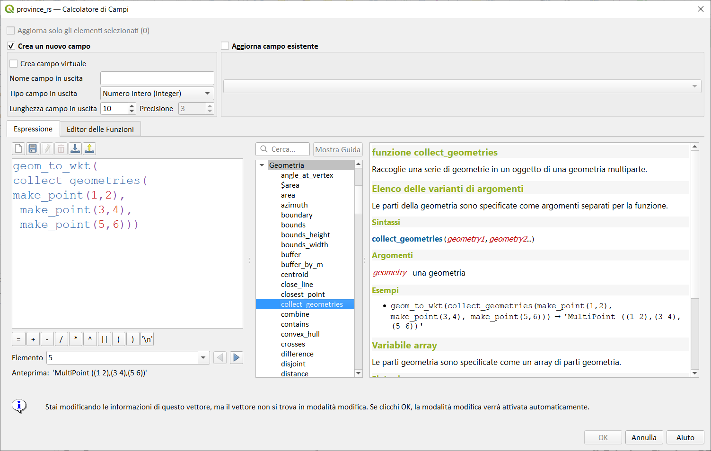

Osservazioni:


---

## combine

!!! Note "Definizione"
	**Restituisce la combinazione di due geometrie.**

Sintassi:

- combine(_<span style="color:red;">geometry1</span>, <span style="color:red;">geometry2</span>_)

Argomenti:

* _<span style="color:red;">geometry1</span>_ una geometria
* _<span style="color:red;">geometry2</span>_ una geometria

!!! Example "Esempi"
	```
	* geom_to_wkt( combine( geom_from_wkt( 'LINESTRING(3 3, 4 4, 5 5)' ), geom_from_wkt( 'LINESTRING(3 3, 4 4, 2 1)' ) ) ) → MULTILINESTRING((4 4, 2 1), (3 3, 4 4), (4 4, 5 5))
	* geom_to_wkt( combine( geom_from_wkt( 'LINESTRING(3 3, 4 4)' ), geom_from_wkt( 'LINESTRING(3 3, 6 6, 2 1)' ) ) ) → LINESTRING(3 3, 4 4, 6 6, 2 1)
	```


---

## contains

!!! Note "Definizione"
	**Verifica se una geometria ne contiene un'altra. Restituisce vero se e solo se nessun punto di geometry2 giace all'esterno di geometry1 e almeno un punto dell'interno di geometry2 si trova all'interno di geometry1.**

Sintassi:

- contains(_<span style="color:red;">geometry1</span>_, _<span style="color:red;">geometry2</span>)

Argomenti:

* _<span style="color:red;">geometry1</span>_  una geometria
* _<span style="color:red;">geometry2</span>_  una geometria

!!! Example "Esempi"
	```
	* contains( geom_from_wkt( 'POLYGON((0 0, 0 1, 1 1, 1 0, 0 0))' ), geom_from_wkt( 'POINT(0.5 0.5 )' ) ) → vero
	* contains( geom_from_wkt( 'POLYGON((0 0, 0 1, 1 1, 1 0, 0 0))' ), geom_from_wkt( 'LINESTRING(3 3, 4 4, 5 5)' ) ) → falso
	```

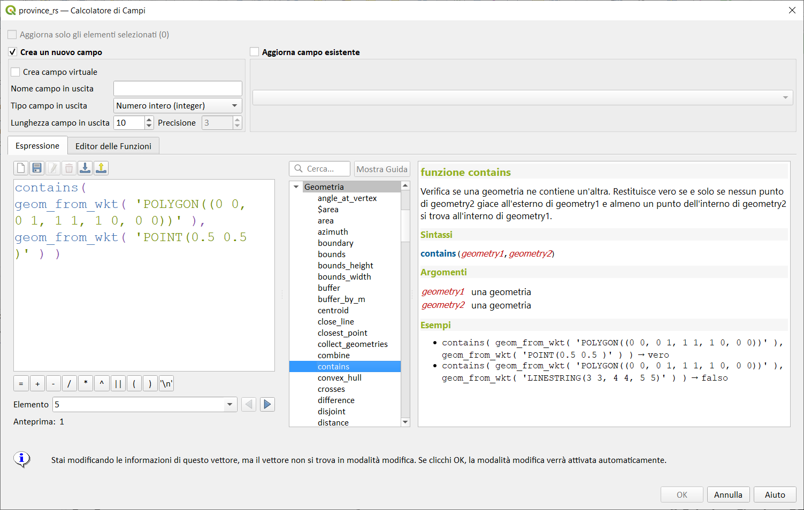

!!! Info "Osservazioni"
	Usando algoritmo `Seleziona per espressione` presente in strumenti di processing oppure  (Ctrl+F3):
	```
	- contains(geometry(get_feature( 'province_rt_rt','pk_uid','46')),$geometry)
	```

dove:

* _geometry1_ è `geometry(get_feature( 'province_rt_rt','pk_uid','46'))`
* _geometry2_ è `$geometry`


seleziono tutti i comuni `contains` (contenuti) nella provincia con `pk_uid`46 (Lucca)

**PS:** potrei anche negare (`NOT`) l'espressione per selezionare il complementare (tutti i comuni tranne quelli contenuti nella provincia di Lucca).

`NOT contains(geometry(get_feature( 'province_rt_rt','pk_uid','46')),$geometry)`

---

## convex_hull

!!! Note "Definizione"
	**Restituisce il poligono convesso di una geometria. Rappresenta la minima geometria convessa che racchiude tutte le geometria contenute nell'insieme.**

Sintassi:

- convex_hull(_<span style="color:red;">geometry</span>_)

Argomenti:

* _<span style="color:red;">geometry</span>_ una geometria

!!! Example "Esempi"
	```
	* geom_to_wkt( convex_hull( geom_from_wkt( 'LINESTRING(3 3, 4 4, 4 10)' ) ) ) → POLYGON((3 3,4 10,4 4,3 3))
	```


!!! Info "Osservazioni"
	La funzione restituisce sempre un poligono.


---

## crosses

!!! Note "Definizione"
	**Verifica se una geometria interseca un'altra. Restituisce vero (1) se le geometrie interessate hanno qualche, ma non tutti, punto interno in comune.**

Sintassi:

- crosses(_<span style="color:red;">geometry1</span>_, _<span style="color:red;">geometry2</span>)

Argomenti:

* _<span style="color:red;">geometry1</span>_ una geometria
* _<span style="color:red;">geometry2</span>_ una geometria

!!! Example "Esempi"
	```
    * crosses( geom_from_wkt( 'LINESTRING(3 5, 4 4, 5 3)' ), geom_from_wkt( 'LINESTRING(3 3, 4 4, 5 5)' ) ) → vero
    * crosses( geom_from_wkt( 'POINT(4 5)' ), geom_from_wkt( 'LINESTRING(3 3, 4 4, 5 5)' ) ) → falso
	```

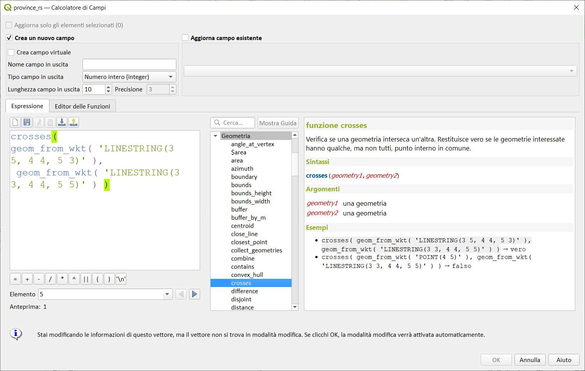

!!! Info "Osservazioni"
	Usando algoritmo `Seleziona per espressione` presente in strumenti di processing oppure  (Ctrl+F3):
	```
	- crosses(geometry(get_feature( 'fiume_arno','nome','ARNO')), $geometry)
	```
dove:

* _geometry1_ è `geometry(get_feature( 'fiume_arno','nome','ARNO'))`
* _geometry2_ è `$geometry`


seleziono tutti i comuni `crosses` (attraversati) dal fiume ARNO

**PS:** potrei anche negare (`NOT`) l'espressione per selezionare il complementare (tutti i comuni tranne quelli attraversati dal fiume ARNO).

`NOT crosses(geometry(get_feature( 'fiume_arno','nome','ARNO')), $geometry)`

---

## difference

!!! Note "Definizione"
	**Restituisce una geometria che rappresenta la porzione della _geometry_a_ che non interseca la _geometry_b_.**

Sintassi:

- difference(_<span style="color:red;">geometry1</span>_, _<span style="color:red;">geometry2</span>)

Argomenti:

* _<span style="color:red;">geometry1</span>_ una geometria
* _<span style="color:red;">geometry2</span>_ una geometria

!!! Example "Esempi"
	```
    * geom_to_wkt( difference( geom_from_wkt( 'LINESTRING(3 3, 4 4, 5 5)' ), geom_from_wkt( 'LINESTRING(3 3, 4 4)' ) ) ) → LINESTRING(4 4, 5 5)
	```


Espressione:

!!! Tip "Espressione"
	```
	-- differenza linea a - linea b
	difference( 
	make_line(  -- linea a
		start_point(geometry(get_feature_by_id('linea_a',0))), 
		start_point($geometry),
		end_point(geometry(get_feature_by_id('linea_a',0)))),
	make_line(  -- linea b
		start_point($geometry), 
		end_point(geometry(get_feature_by_id('linea_a',0))),
		end_point($geometry))
					)
	-- NB: -- è importante ordine delle geometrie
	-- a - b è diverso da b - a
	```


!!! Tip "Espressione"
	```
	-- differenza linea b - linea a
	difference( 
	make_line( -- linea b
		start_point($geometry), 
		end_point(geometry(get_feature_by_id('linea_a',0))),
		end_point($geometry)),
	make_line(  -- linea a
		start_point(geometry(get_feature_by_id('linea_a',0))), 
		start_point($geometry),
		end_point(geometry(get_feature_by_id('linea_a',0))))
					)
	-- NB: -- è importante ordine delle geometrie
	-- a - b è diverso da b - a
	```

!!! Question "Prova tu"
	[Dati e progetto qgz](https://github.com/gbvitrano/HfcQGIS/raw/master/prova_tu/DIFFERENCE.zip)

Esempio di sopra:


---

## disjoint

!!! Note "Definizione"
	**Controlla qualora una geometria non ne interseca spazialmente un'altra. Restituisce true (1) se le geometrie non condividono nessuno spazio comune.**

Sintassi:

- disjoint(_<span style="color:red;">geometry1</span>_, _<span style="color:red;">geometry2</span>)

Argomenti:

* _<span style="color:red;">geometry1</span>_ una geometria
*_<span style="color:red;">geometry2</span>_ una geometria

!!! Example "Esempi"
	```
	* disjoint( geom_from_wkt( 'POLYGON((0 0, 0 1, 1 1, 1 0, 0 0 ))' ), geom_from_wkt( 'LINESTRING(3 3, 4 4, 5 5)' ) ) → vero
	* disjoint( geom_from_wkt( 'LINESTRING(3 3, 4 4, 5 5)' ), geom_from_wkt( 'POINT(4 4)' )) → falso
	```

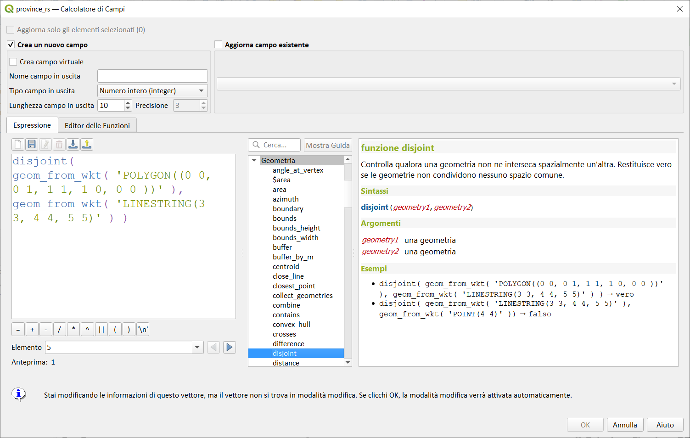

!!! Warning "Attenzione!"
	Vero = 1; Falso= 0

!!! Info "Osservazioni"
	Usando algoritmo `Seleziona per espressione` presente in strumenti di processing oppure  (Ctrl+F3):
	```
	- disjoint(geometry(get_feature( 'fiume_arno','nome','ARNO')), $geometry)
	```

dove:

* _geometry1_ è `geometry(get_feature( 'fiume_arno','nome','ARNO'))`
* _geometry2_ è `$geometry`


seleziono tutti i comuni `disjoint` (disgiunti) dal fiume ARNO

---

## distance

!!! Note "Definizione"
	**Restituisce la distanza minima (basata su riferimento spaziale) tra due geometrie in unità proiettate.**

Sintassi:

- distance(_<span style="color:red;">geometry1</span>_, _<span style="color:red;">geometry2</span>)

Argomenti:

* _<span style="color:red;">geometry1</span>_ una geometria
* _<span style="color:red;">geometry2</span>_ una geometria


!!! Example "Esempi"
	```
	- distance( geom_from_wkt( 'POINT(4 4)' ), geom_from_wkt( 'POINT(4 8)' ) ) → 4
	```


--


---

## distance_to_vertex

!!! Note "Definizione"
	**Restituisce la distanza lungo una geometria ad un vertice specificato.**

Sintassi:

- distance_to_vertex(_<span style="color:red;">geometry</span>_, _<span style="color:red;">vertex</span>_)

Argomenti:

* _<span style="color:red;">geometry</span>_ una geometria di tipo linestring
* _<span style="color:red;">vertex</span>_ indice vertice, partendo da 0; se il valore è negativo, l'indice del vertice selezionato sarà il suo conteggio totale meno il valore assoluto


!!! Example "Esempi"
	```
	* distance_to_vertex(geometry:=geom_from_wkt('LineString(0 0, 10 0, 10 10)'),vertex:=1) → 10.0
	```


--

esempio di sopra:


---

## end_point

!!! Note "Definizione"
	**Restituisce l'ultimo nodo di una geometria.**

Sintassi:

- end_point(_<span style="color:red;">geometry</span>_)

Argomenti:

* _<span style="color:red;">geometry</span>_ oggetto geometria

!!! Example "Esempi"
	```
	* geom_to_wkt(end_point(geom_from_wkt('LINESTRING(4 0, 4 2, 0 2)'))) → 'Point (0 2)'
	```

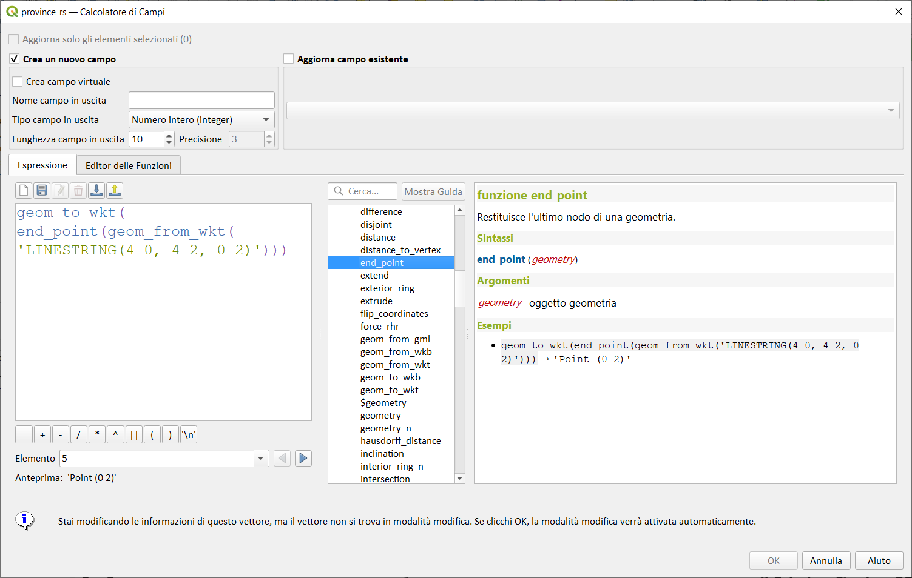

--

End_point di geometria poligonale:


End_point di geometria lineare:


---

## extend

!!! Note "Definizione"
	**Estende l'inizio e la fine di una geometria di tipo linestring di una quantità specificata. Le linee sono estese usando la direzione di immersione del primo e dell'ultimo segmento nella linea. Le distanze sono espresse nel SR di tale geometria.**

Sintassi:

- extend(_<span style="color:red;">geometry</span>_, _<span style="color:red;">start_distance</span>_, _<span style="color:red;">end_distance</span>_)

Argomenti:

* _<span style="color:red;">geometry</span>_ una geometria (multi)linestring
* _<span style="color:red;">start_distance</span>_ distanza alla quale estendere l'_inizio_ della linea
* _<span style="color:red;">end_distance</span>_ distanza alla quale estendere la _fine_ della linea.


!!! Example "Esempi"
	```
	* geom_to_wkt(extend(geom_from_wkt('LineString(0 0, 1 0, 1 1)'),1,2)) → 'LineString (-1 0, 1 0, 1 3)'
	* geom_to_wkt(extend(geom_from_wkt('MultiLineString((0 0, 1 0, 1 1), (2 2, 0 2, 0 5))'),1,2)) → 'MultiLineString ((-1 0, 1 0, 1 3),(3 2, 0 2, 0 7))'
	```


--


---

## exterior_ring

!!! Note "Definizione"
	**Restituisce una linestring che rappresenta l'anello esterno di una geometria poligonale. Se la geometria non è un poligono, il risultato sarà NULL.**

Sintassi:

- exterior_ring(_<span style="color:red;">geometry</span>_)

Argomenti:


* _<span style="color:red;">geometry</span>_ una geometria poligono

!!! Example "Esempi"
	```
	* geom_to_wkt(exterior_ring(geom_from_wkt('POLYGON((-1 -1, 4 0, 4 2, 0 2, -1 -1),( 0.1 0.1, 0.1 0.2, 0.2 0.2, 0.2, 0.1, 0.1 0.1))'))) → 'LineString (-1 -1, 4 0, 4 2, 0 2, -1 -1)'
	```


--


---

## extrude

!!! Note "Definizione"
	**Restituisce una versione estrusa della geometria (Multi-)Curve o (Multi-)Linestring in ingresso, con un'estensione specificata da x e y.**

Sintassi:

- extrude(_<span style="color:red;">geometry</span>_,_<span style="color:red;">x</span>_, _<span style="color:red;">y</span>_)

Argomenti:

* _<span style="color:red;">geometry</span>_ una geometria poligono
* _<span style="color:red;">x</span>_ estensione x, valore numerico
* _<span style="color:red;">y</span>_ estensione y, valore numerico


!!! Example "Esempi"
	```
	* extrude(geom_from_wkt('LineString(1 2, 3 2, 4 3)'), 1, 2) → Polygon ((1 2, 3 2, 4 3, 5 5, 4 4, 2 4, 1 2))
	* extrude(geom_from_wkt('MultiLineString((1 2, 3 2), (4 3, 8 3)'), 1, 2) → MultiPolygon (((1 2, 3 2, 4 4, 2 4, 1 2)),((4 3, 8 3, 9 5, 5 5, 4 3)))
	```

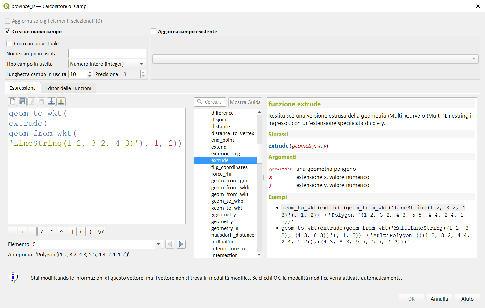

!!! Info "Osservazioni"
	Nell'esempio ho utilizzato la funzione [boundary()](boundary.md) perché la geometria di ingresso deve essere lineare.


---

## flip_coordinates

!!! Note "Definizione"
	**Restituisce una copia della geometria con le coordinate x e y scambiate. Utile per riparare le geometrie che hanno invertito i valori di latitudine e longitudine.**

Sintassi:

- flip_coordinates(_<span style="color:red;">geometry</span>_)

Argomenti:

* _<span style="color:red;">geometry</span>_ una geometria

!!! Example "Esempi"
	```
	* geom_to_wkt(flip_coordinates(make_point(1, 2))) → Point (2 1)
	```

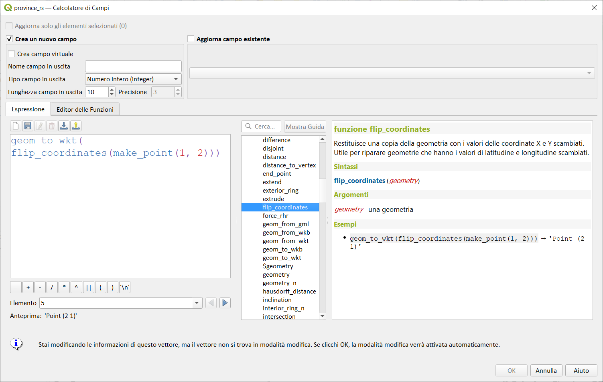

--

Esempio con vettore poligonale (aggiorno la geometry): 


il flip è da usare con cautela perché cambia radicalemnte la posizione del vettore


---

## force_rhr

!!! Note "Definizione"
	**Forza una geometria a rispettare la regola della mano destra, in cui l'area delimitata da un poligono si trova a destra del limite. In particolare, l'anello esterno è orientato in senso orario e l'interno in senso antiorario.**

Sintassi:

- force_rhr(_<span style="color:red;">geometry</span>_)

Argomenti:

* _<span style="color:red;">geometry</span>_ una geometria. Qualsiasi geometria non poligonale viene restituita invariata.

!!! Example "Esempi"
	```
    * geom_to_wkt(force_rhr(geometry:=geom_from_wkt('POLYGON((-1 -1, 4 0, 4 2, 0 2, -1 -1))'))) → Polygon ((-1 -1, 0 2, 4 2, 4 0, -1 -1))
	```

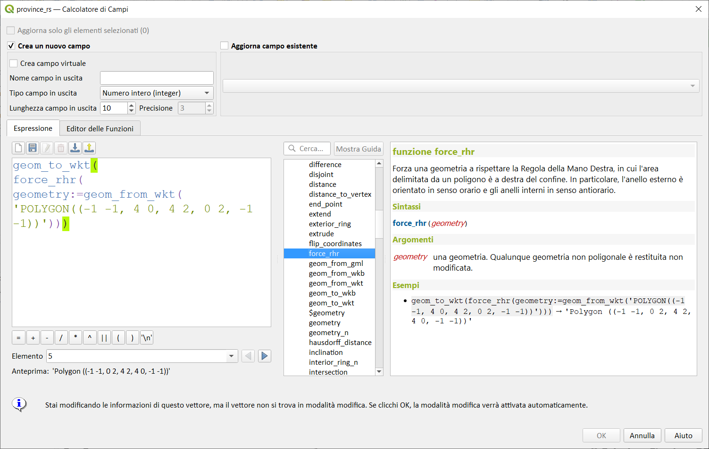

!!! Info "Osservazioni"
	Ecco un esempio pratico della funzione (presente anche nelgli strumenti fi processing) ovvero un poligono disegnato in senso antiorario viene forzato in senso orario e l'etichettature è visibile correttamente.

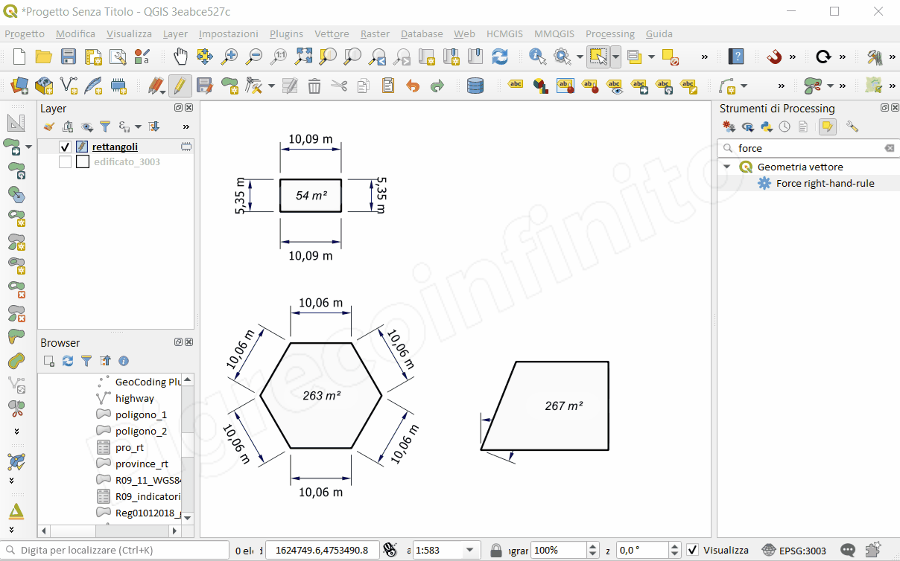

---

## geom_from_gml

!!! Note "Definizione"
	**Restituisce una geometria da una rappresentazione GML di una geometria.**

Sintassi:

- geom_from_gml(_<span style="color:red;"></span>_gml</span>_)

Argomenti:

* _<span style="color:red;">gml</span>_ Rappresentazione GML di una geometria come stringa

!!! Example "Esempi"
	```
    * geom_to_wkt(geom_from_gml('<gml:LineString srsName="EPSG:4326"><gml:coordinates>4,4 5,5 6,6</gml:coordinates></gml:LineString>') )  → 'LineString (4 4, 5 5, 6 6)'
	```


---

## geom_from_wkb

!!! Note "Definizione"
	**Restituisce una geometria creata da una rappresentazione binaria ben nota (WKB).**

Sintassi:

- geom_from_wkb(_<span style="color:red;">binari</span>_)

Argomenti:

* _<span style="color:red;">binari</span>_ Rappresentazione binaria ben nota (WKB) di una geometria (come BLOB binario)

!!! Example "Esempi"
	```
	* geom_from_wkb( geom_to_wkb( make_point(4,5) ) ) → un oggetto geometria punto
	```

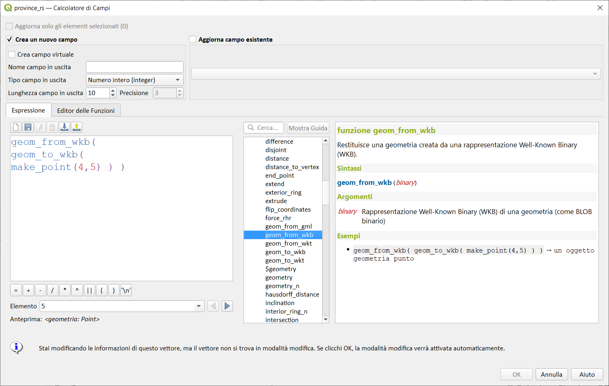

---

## geom_from_wkt

!!! Note "Definizione"
	**Restituisce una geometria creata da una rappresentazione Well-Known Text (WKT).**

Sintassi:

- geom_from_wkt_<span style="color:red;">text</span>_)

Argomenti:

* _<span style="color:red;">text</span>_ Rappresentazione Well-Known Text (WKT) di una geometria


!!! Example "Esempi"
	```
	* geom_from_wkt( 'POINT(4 5)' ) → un oggetto geometria
	```


---

## geom_to_wkb

!!! Note "Definizione"
	**Restituisce la rappresentazione binaria ben nota (WKB) di una geometria come BLOB binario.**

Sintassi:

- geom_to_wkb(_<span style="color:red;">geometry</span>_)

Argomenti:

* _<span style="color:red;">geometry</span>_ una geometria

!!! Example "Esempi"
	```
	* geom_to_wkb( $geometry ) → BLOB binario contenente un oggetto geometria
	```

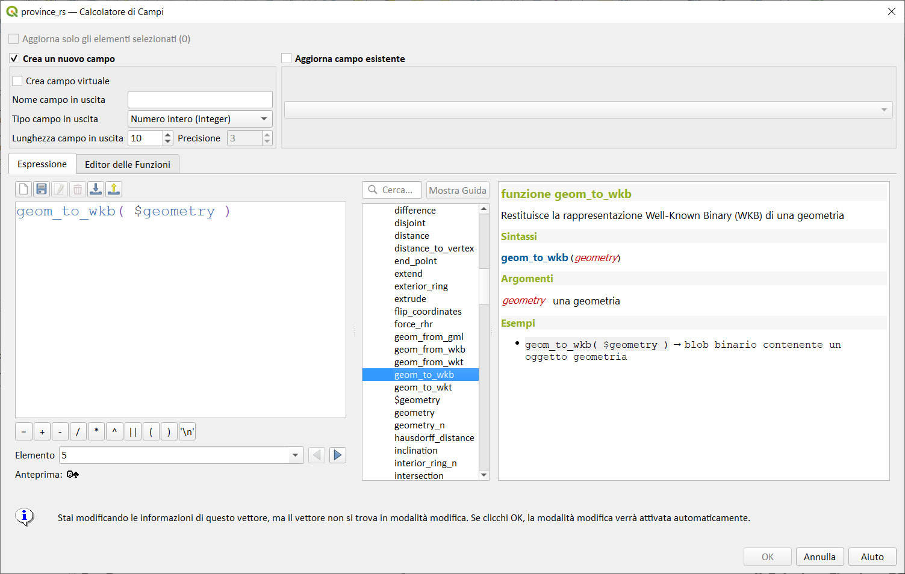

---

## geom_to_wkt

!!! Note "Definizione"
	**Restituisce la rappresentazione Well-Known Text (WKT) della geometria senza metadati del SR**

Sintassi:

- geom_to_wkt(_<span style="color:red;">geometry</span>_)

Argomenti:

* _<span style="color:red;">geometry</span>_ una geometria

!!! Example "Esempi"
	```
	* geom_to_wkt( make_point(6, 50) ) → 'POINT(6 50)'
	* geom_to_wkt(centroid(geom_from_wkt('Polygon((1 1, 0 0, -1 1, 1 1))'))) → 'POINT(0 0.66666667)'
	* geom_to_wkt(centroid(geom_from_wkt('Polygon((1 1, 0 0, -1 1, 1 1))')), 2) → 'POINT(0 0.67)'
	```

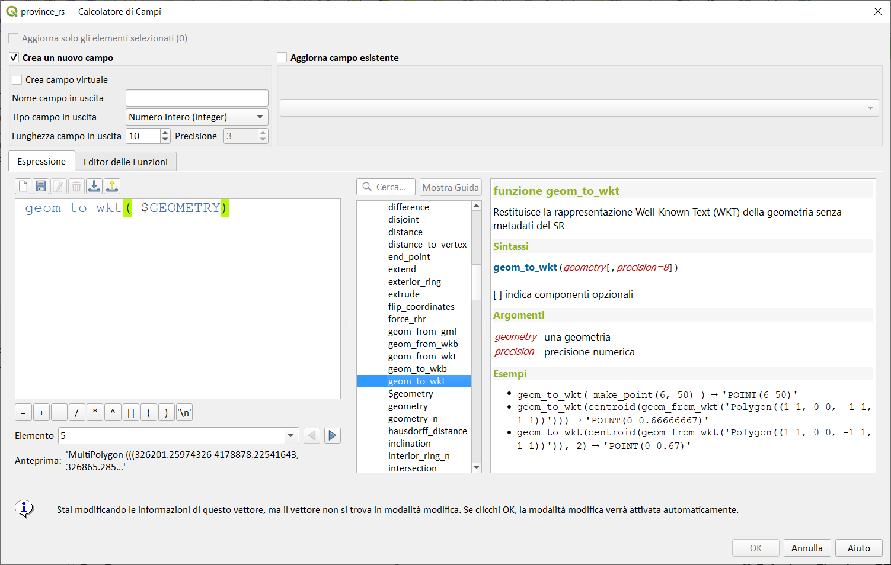

---

## geometry

!!! Note "Definizione"
	**Restituisce la geometria di un elemento.**

Sintassi:

- geometry(_<span style="color:red;">feature</span>_)

Argomenti:

* _<span style="color:red;">feature</span>_ un oggetto elemento

!!! Example "Esempi"

* `geom_to_wkt( geometry( get_feature( layer, attributeField, value ) ) ) → 'POINT(6 50)'`
* `intersects( $geometry, geometry( get_feature( layer, attributeField, value ) ) ) → vero`

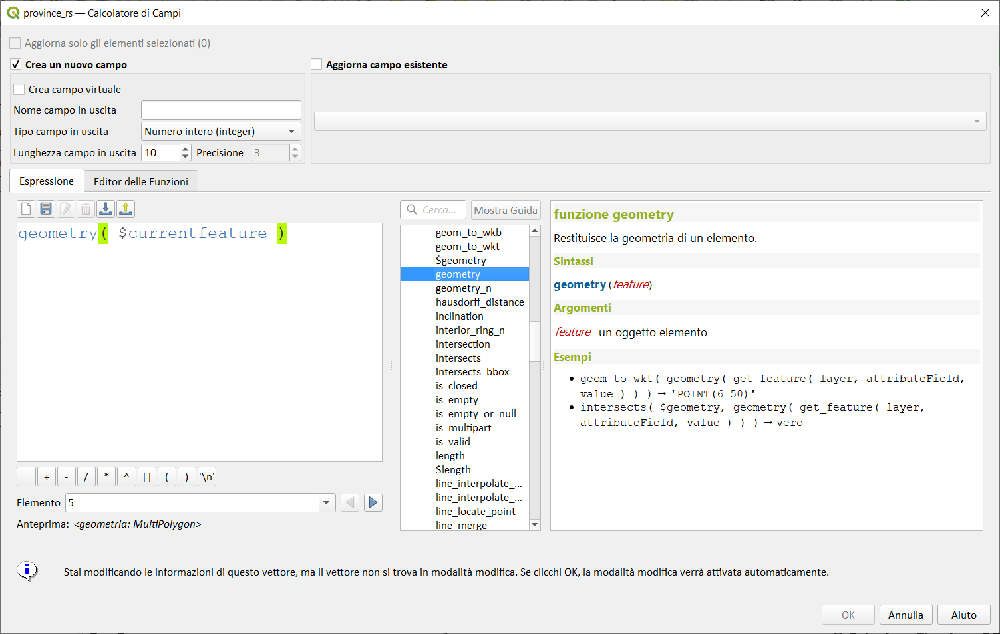

--

Usando il **Select by Expression**: selezionare le feature di un layer (quartieri) in funzione di altro layer (test):


---

## geometry_n

!!! Note "Definizione"
	**Restituisce una geometria specifica da una raccolta di geometrie, o null se la geometria in ingresso non è una raccolta.**

Sintassi:

- geometry_n(_<span style="color:red;">geometry</span>_, _<span style="color:red;">index</span>_)

Argomenti:

* _<span style="color:red;">geometry</span>_ raccolta di geometrie
* _<span style="color:red;">index</span>_ indice della geometria da restituire, dove 1 è la prima geometria nella raccolta

!!! Example "Esempi"
	```
	* geom_to_wkt(geometry_n(geom_from_wkt('GEOMETRYCOLLECTION(POINT(0 1), POINT(0 0), POINT(1 0), POINT(1 1))'),3)) → 'Point (1 0)'
	```


---

## hausdorff_distance

!!! Note "Definizione"
	Restituisce la distanza di _Hausdorff_ tra due geometrie. Questa è in sostanza una misura di come le 2 geometrie sono simili o dissimili: una distanza più bassa indica geometrie più simili. La funzione può essere eseguita con un argomento opzionale di densificazione della frazione. Se non viene specificato, viene utilizzata una approssimazione alla distanza standard di Hausdorff. Questa approssimazione è esatta o abbastanza vicina per un grande sottoinsieme di casi utili. Esempi di questi sono:

  * calcolare la distanza tra Linestrings che sono approssimativamente paralleli tra loro e sono sostanzialmente uguali in lunghezza. Ciò si verifica nelle verifica di reti lineari. 
  * testare la somiglianza di geometrie. 

Se l'approssimazione predefinita fornita da questo metodo è insufficiente, specifica l'argomento opzionale di densificazione della frazione. Specificando questo argomento si esegue una densificazione del segmento prima di calcolare la distanza Hausdorff discreta. Il parametro imposta la frazione con cui densificare ogni segmento. Ogni segmento sarà suddiviso in un numero di subsegmenti di uguale lunghezza, la cui frazione della lunghezza totale è la più vicina alla frazione data. Riducendo il parametro di densificazione della frazione, la distanza restituita si avvicinerà alla vera distanza Hausdorff per le geometrie.

Sintassi:

- hausdorff_distance(_<span style="color:red;">geometry1</span>_, _<span style="color:red;">geometry2</span>_, _<span style="color:red;">densify_fraction</span>_)

Argomenti:

* _<span style="color:red;">geometry1</span>_ una geometria
* _<span style="color:red;">geometry2</span>_ una geometria
* _<span style="color:red;">densify_fraction</span>_ quantità di densificazione della frazione

!!! Example "Esempi"
	```
	* hausdorff_distance( geometry1:= geom_from_wkt('LINESTRING (0 0, 2 1)'),geometry2:=geom_from_wkt('LINESTRING (0 0, 2 0)')) → 2
	* hausdorff_distance( geom_from_wkt('LINESTRING (130 0, 0 0, 0 150)'),geom_from_wkt('LINESTRING (10 10, 10 150, 130 10)')) → 14.142135623
	* hausdorff_distance( geom_from_wkt('LINESTRING (130 0, 0 0, 0 150)'),geom_from_wkt('LINESTRING (10 10, 10 150, 130 10)'),0.5) → 70.0
	```


--

Nel caso di geometrie puntuali la [hausdorff_distance](#hausdorff_distance) coincide con la funzione [distance](#distance), segue un esempio:

!!! Tip "Espressione"
	```
	format_number(
	hausdorff_distance( 
	transform($geometry,'EPSG:4326','EPSG:3004'), 
	transform(geometry(get_feature('fontanelle','n',1)),'EPSG:4326','EPSG:3004'))/1000,4) || ' km'  
	|| '\n'|| 
	format_number(
	distance( 
	transform($geometry,'EPSG:4326','EPSG:3004'), 
	transform(geometry(get_feature('fontanelle','n',1)),'EPSG:4326','EPSG:3004'))/1000,4) || ' km'
	```


--

In questo esempio confronto due layer: il numero più piccolo indica il poligono più simile a al poligono più grande.


---

## inclination

!!! Note "Definizione"
	**Restituisce l'inclinazione misurata dallo zenit (0) al nadir (180) del _punto_a_ al _punto_b_.**

Sintassi:

- inclination(_<span style="color:red;">point_a</span>_, _<span style="color:red;">point_b</span>_)

Argomenti:

* _<span style="color:red;">point_a</span>_ geometria punto
* _<span style="color:red;">point_b</span>_ geometria punto

!!! Example "Esempi"
	```
	* inclination( make_point( 5, 10, 0 ), make_point( 5, 10, 5 ) ) → 0.0
	* inclination( make_point( 5, 10, 0 ), make_point( 5, 10, 0 ) ) → 90.0
	* inclination( make_point( 5, 10, 0 ), make_point( 50, 100, 0 ) ) → 90.0
	* inclination( make_point( 5, 10, 0 ), make_point( 5, 10, -5 ) ) → 180.0
	```

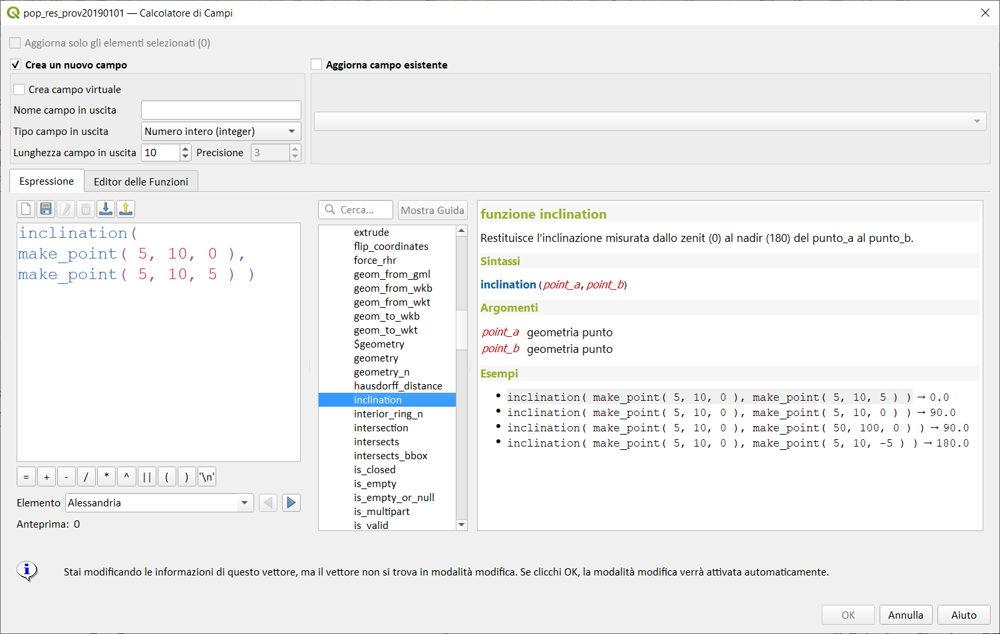

--


---

## interior_ring_n

!!! Note "Definizione"
	**Restituisce un anello interno specifico da una geometria poligonale, o null se la geometria non è un poligono.**

Sintassi:

- interior_ring_n(_<span style="color:red;">geometry</span>_, _<span style="color:red;">index</span>_)

Argomenti:

* _<span style="color:red;">geometry</span>_ geometria poligono
* _<span style="color:red;">index</span>_ Indice dell'anello interno da restituire, dove 1 è il primo anello interno

!!! Example "Esempi"
	```
	* geom_to_wkt(interior_ring_n(geom_from_wkt('POLYGON((-1 -1, 4 0, 4 2, 0 2, -1 -1),(-0.1 -0.1, 0.4 0, 0.4 0.2, 0 0.2, -0.1 -0.1),(-1 -1, 4 0, 4 2, 0 2, -1 -1))'),1)) → 'LineString (-0.1 -0.1, 0.4 0, 0.4 0.2, 0 0.2, -0.1 -0.1))'
	```


!!! Info "Osservazioni"
	Restituisce una lineastring!!!


---

## intersection

!!! Note "Definizione"
	**Restituisce una geometria che rappresenta la porzione condivisa fra le due geometrie.**

Sintassi:

- intersection(<span style="color:red;">_geometry1_</span>, <span style="color:red;">_geometry2_</span>)

Argomenti:

* <span style="color:red;">_geometry1_</span> una geometria
* <span style="color:red;">_geometry2_</span> una geometria

!!! Example "Esempi"
	```
	* geom_to_wkt( intersection( geom_from_wkt( 'LINESTRING(3 3, 4 4, 5 5)' ), geom_from_wkt( 'LINESTRING(3 3, 4 4)' ) ) ) → 'LINESTRING(3 3, 4 4)'
	* geom_to_wkt( intersection( geom_from_wkt( 'LINESTRING(3 3, 4 4, 5 5)' ), geom_from_wkt( 'MULTIPOINT(3.5 3.5, 4 5)' ) ) ) → 'POINT(3.5 3.5)'
	```


!!! Tip "Espressione"
	```
	-- intersezione tra le due linee
	intersection( 
	make_line( -- linea a
		start_point($geometry), 
		end_point(geometry(get_feature_by_id('linea_a',0))),
		end_point($geometry)),
	make_line(  -- linea b
		start_point(geometry(get_feature_by_id('linea_a',0))), 
		start_point($geometry),
		end_point(geometry(get_feature_by_id('linea_a',0))))
					)
	-- NB: -- l' ordine delle geometrie è indifferente
	```

!!! Question "Prova tu"
	[Dati e progetto qgz](https://github.com/gbvitrano/HfcQGIS/raw/master/prova_tu/DIFFERENCE.zip)

--


---

## intersects

!!! Note "Definizione"
	**Controlla qualora una geometria ne interseca un'altra. Restituisce true (1) se la geometrie si intersecano spazialmente (condividono una porzione di spazio) altrimenti da false (0).**

Sintassi:

- intersects(<span style="color:red;">_geometry1_</span>, <span style="color:red;">_geometry2_</span>)

Argomenti:

* <span style="color:red;">_geometry1_</span> una geometria
* <span style="color:red;">_geometry2_</span> una geometria

!!! Example "Esempi"
	```
	* intersects( geom_from_wkt( 'POINT(4 4)' ), geom_from_wkt( 'LINESTRING(3 3, 4 4, 5 5)' ) ) → vero
	* intersects( geom_from_wkt( 'POINT(4 5)' ), geom_from_wkt( 'POINT(5 5)' ) ) → falso
	```


!!! Info "Osservazioni"
	Usando algoritmo `Seleziona per espressione` presente in strumenti di processing oppure  (Ctrl+F3):
	```
	- intersects(geometry(get_feature( 'province_rt_rt','pk_uid','46')),$geometry)
	```

dove:

* _geometry1_ è `geometry(get_feature( 'province_rt_rt','pk_uid','46'))`
* _geometry2_ è `$geometry`


seleziono tutti i comuni `intersects` (interseca) nella provincia con `pk_uid`46 (Lucca)

**PS:** potrei anche negare (`NOT`) l'espressione per selezionare il complementare (tutti i comuni tranne quelli intersecati con la provincia di Lucca).

`NOT intersects(geometry(get_feature( 'province_rt_rt','pk_uid','46')),$geometry)`

---

## intersects_bbox

!!! Note "Definizione"
	**Controlla se il perimetro di delimitazione della geometria si sovrappone a quello di un'altra geometria. Restituisce vero (1) se le geometrie intersecano spazialmente il perimetro di delimitazione definito e falso (0) se non lo intersecano.**

Sintassi:

- intersects_bbox(<span style="color:red;">_geometry1_</span>, <span style="color:red;">_geometry2_</span>)

Argomenti:

* <span style="color:red;">_geometry1_</span> una geometria
* <span style="color:red;">_geometry2_</span> una geometria

!!! Example "Esempi"
	```
	* intersects_bbox( geom_from_wkt( 'POINT(4 5)' ), geom_from_wkt( 'LINESTRING(3 3, 4 4, 5 5)' ) ) → vero
	* intersects_bbox( geom_from_wkt( 'POINT(6 5)' ), geom_from_wkt( 'POLYGON((3 3, 4 4, 5 5, 3 3))' ) ) → falso
	```
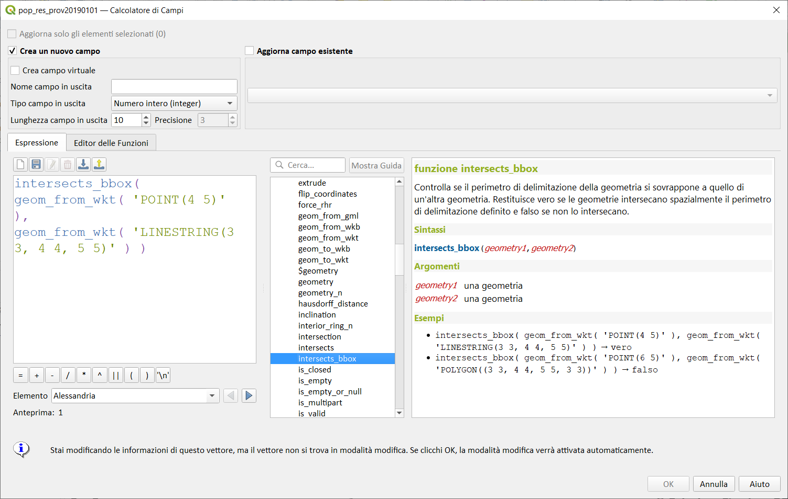

---

## is_closed

!!! Note "Definizione"
	**Restituisce vero (true) se una linestring è chiusa (i punti di inizio e di fine coincidono), o falso (false) se una linestring non è chiusa. Se la geometria non è una linestring, il risultato sarà NULL.**

Sintassi:

- is_closed(<span style="color:red;">_geometry_</span>)

Argomenti:

* <span style="color:red;">_geometry_</span> una geometria linestring

!!! Example "Esempi"
	```
	* is_closed(geom_from_wkt('LINESTRING(0 0, 1 1, 2 2)')) → falso
	* is_closed(geom_from_wkt('LINESTRING(0 0, 1 1, 2 2, 0 0)')) → vero
	```

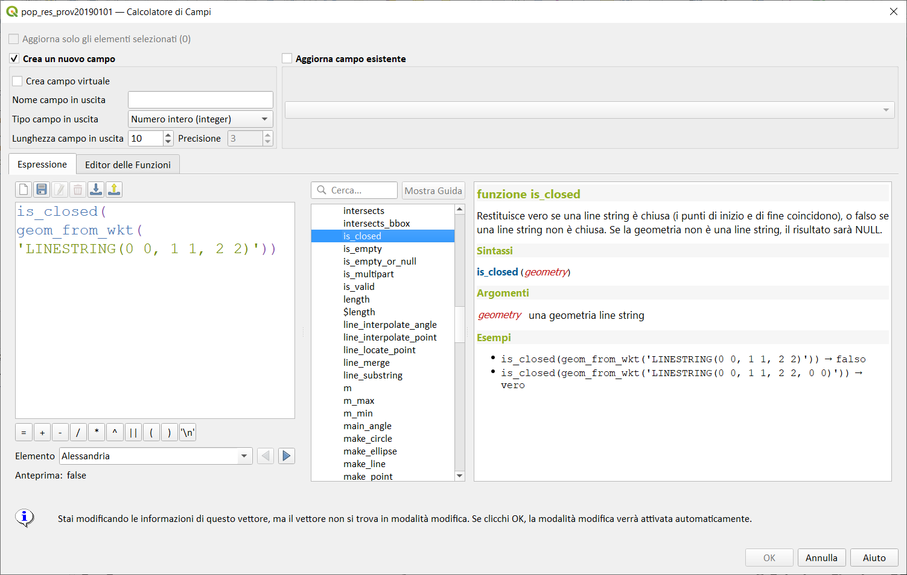

--

 

---

## is_empty

!!! Note "Definizione"
	**Restituisce vero se una geometria è vuota (senza coordinate), falso se la geometria non è vuota e NULL se non c'è geometria. Vedi anche `is_empty_or_null`.**

Sintassi:

- is_empty(<span style="color:red;">_geometry_</span>)

Argomenti:

* <span style="color:red;">_geometry_</span> una geometria

!!! Example "Esempi"
	```
	* is_empty(geom_from_wkt('LINESTRING(0 0, 1 1, 2 2)')) → falso
	* is_empty(geom_from_wkt('LINESTRING EMPTY')) → vero
	* is_empty(geom_from_wkt('POINT(7 4)')) → falso
	* is_empty(geom_from_wkt('POINT EMPTY')) → vero
	```

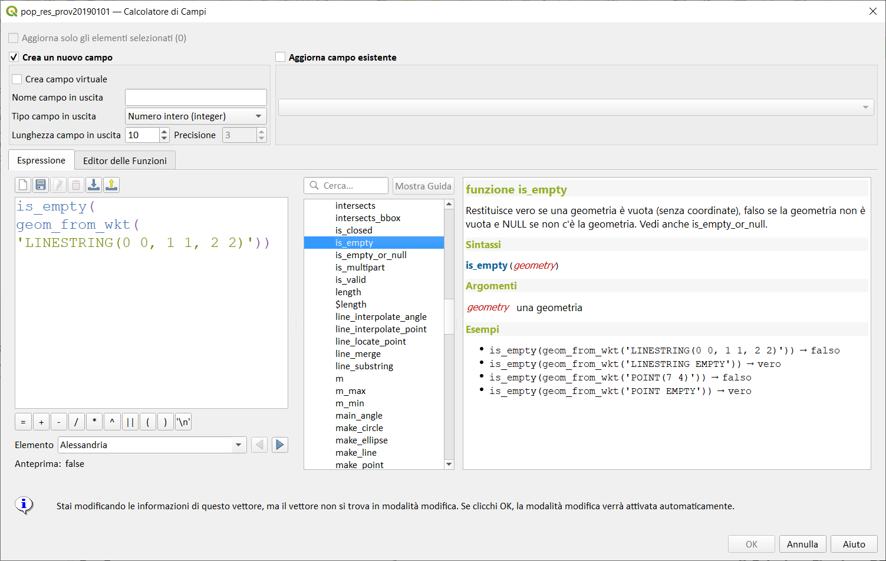


---

## is_empty_or_null

!!! Note "Definizione"
	**Restituisce vero se una geometria è vuota (senza coordinate), falso se la geometria non è vuota e NULL se non c'è geometria. Vedi anche `is_empty_or_null_or_null`.**

Sintassi:

- is_empty_or_null(<span style="color:red;">_geometry_</span>)

Argomenti:

* <span style="color:red;">_geometry_</span> una geometria

!!! Example "Esempi"
	```
	* is_empty_or_null(geom_from_wkt('LINESTRING(0 0, 1 1, 2 2)')) → falso
	* iis_empty_or_null(geom_from_wkt('POINT(7 4)')) → falso
	* is_empty_or_null(geom_from_wkt('POINT EMPTY')) → vero
	```


---

## is_multipart

!!! Note "Definizione"
	**Restituisce vero se la geometria è di tipo Multi.**

Sintassi:

- is_multipart(<span style="color:red;">_geometry_</span>)

Argomenti:

* <span style="color:red;">_geometry_</span> una geometria

!!! Example "Esempi"
	```
	* is_multipart(geom_from_wkt('MULTIPOINT ((0 0),(1 1),(2 2))')) → vero
	* is_multipart(geom_from_wkt('POINT (0 0)')) → falso
	```


---

## is_valid

!!! Note "Definizione"
	**Restituisce vero se una geometria è valida; se è ben formato in 2D secondo le regole **OGC****

Sintassi:

- is_valid(<span style="color:red;">_geometry_</span>)

Argomenti:

* <span style="color:red;">_geometry_</span> una geometria

!!! Example "Esempi"
	```
	* is_valid(geom_from_wkt('LINESTRING(0 0, 1 1, 2 2, 0 0)')) → vero
	* is_valid(geom_from_wkt('LINESTRING(0 0)')) → falso
	```


---

## length

!!! Note "Definizione"
	**Restituisce il numero di caratteri in una stringa o la lunghezza di una geometria di tipo linestring.**

### Variabile stringa

Restituisce il numero di caratteri contenuti in una stringa.

Sintassi:

- length(_<span style="color:red;">string</span>_)

Argomenti:

* _<span style="color:red;">string</span>_ stringa della quale calcolare la lunghezza

!!! Example "Esempi"
	```
	* length('hello') → 5
	```

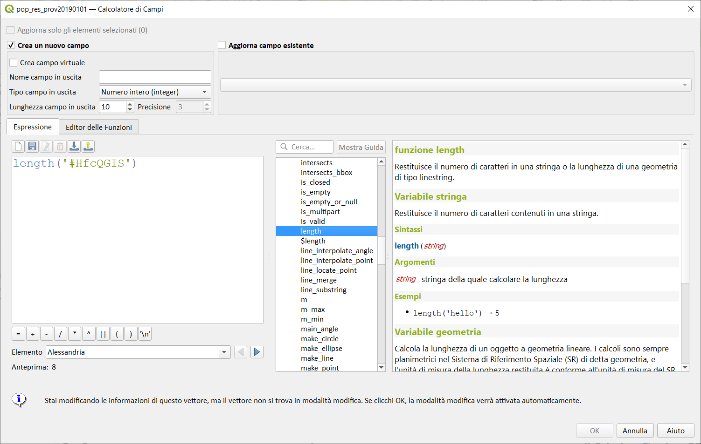

### Variabile geometria

Calcola la lunghezza di un oggetto a geometria lineare. I calcoli sono sempre _planimetrici_ nel Sistema di Riferimento Spaziale (SR) di detta geometria, e l'unità di misura della lunghezza restituita è conforme all'unità di misura del SR. Ciò differisce dal calcolo eseguito dalla funzione [$length](#length), la quale esegue calcoli _ellissoidici_ basati sull'ellissoide del progetto e sulle impostazioni delle unità di distanza.

Sintassi:

- length(_<span style="color:red;">geometry</span>_)

Argomenti:

* _<span style="color:red;">geometry</span>_ oggetto geometria linea

!!! Example "Esempi"

* `length(geom_from_wkt('LINESTRING(0 0, 4 0)')) → 4.0`

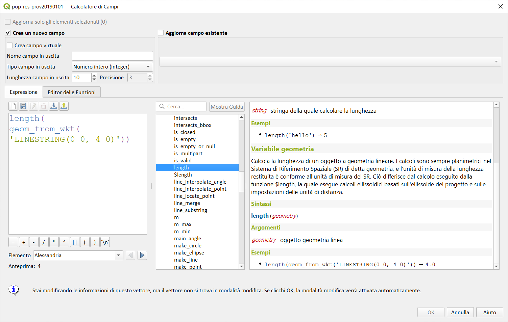

---

## length3D

!!! Note "Definizione"
	**Calcola la lunghezza 3D di un oggetto linea geometrica. Se la geometria non è un oggetto linea 3D, restituisce la sua lunghezza 2D. I calcoli sono sempre planimetrici nel Sistema di Riferimento Spaziale (SR) di questa geometria, e le unità della lunghezza restituita corrisponderanno alle unità per l'SR. Questo differisce dai calcoli eseguiti dalla funzione [$length](#length), che eseguirà calcoli ellissoidali basati sulle impostazioni dell'ellissoide e dell'unità di distanza del progetto.**

Sintassi:

- length3D(_<span style="color:red;">geometry</span>_)

Argomenti:

* _<span style="color:red;">geometry</span>_ oggetto geometria linea

!!! Example "Esempi"
	```
	- length3D(geom_from_wkt('LINESTRINGZ(0 0 0, 3 0 4)')) → 5.0
	```


---

## line_interpolate_angle

!!! Note "Definizione"
	**Restituisce l'angolo parallelo alla geometria ad una distanza specifica lungo una geometria di tipo linestring. Gli angoli sono in gradi in senso orario dal nord.**

Sintassi:

- line_interpolate_angle(_<span style="color:red;">geometry</span>_, _<span style="color:red;">distance</span>_)

Argomenti:

* _<span style="color:red;">geometry</span>_ una geometria di tipo linestring
* _<span style="color:red;">distance</span>_ distanza lungo la linea a cui interpolare l'angolo

!!! Example "Esempi"
	```
	* line_interpolate_angle(geometry:=geom_from_wkt('LineString(0 0, 10 0)'),distance:=5) → 90.0
	```

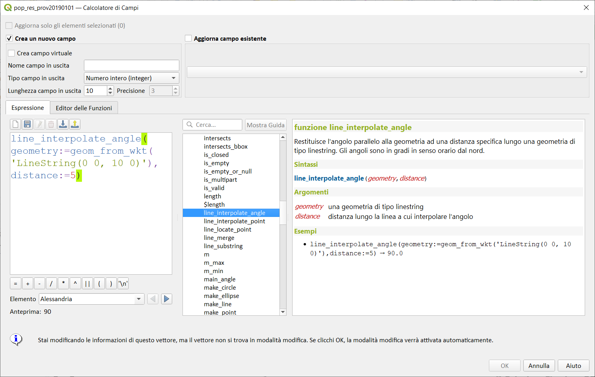

--

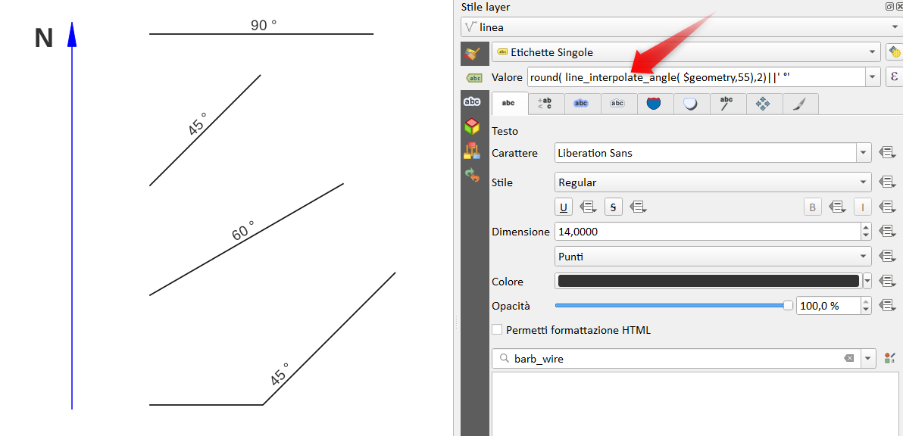

---

## line_interpolate_point

!!! Note "Definizione"
	**Restituisce il punto interpolato ad una specifica distanza lungo una geometria di tipo linestring.**

Sintassi:

- line_interpolate_point(_<span style="color:red;">geometry</span>_, _<span style="color:red;">distance</span>_)

Argomenti:

* _<span style="color:red;">geometry</span>_ una geometria di tipo linestring
* _<span style="color:red;">distance</span>_ distanza lungo la linea

!!! Example "Esempi"
	```
	* geom_to_wkt(line_interpolate_point(geometry:=geom_from_wkt('LineString(0 0, 10 0)'),distance:=5)) → 'Point (4 0)'
	```

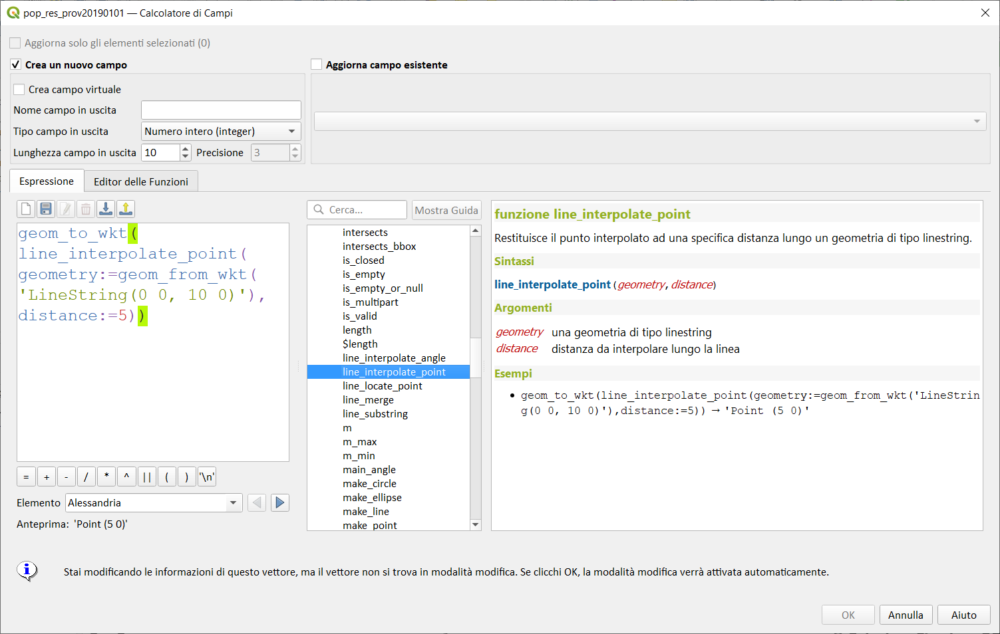

--


---

## line_locate_point

!!! Note "Definizione"
	**Restituisce la distanza lungo una linestring corrispondente alla posizione più vicina alla linestring di una geometria puntuale specificata.**

Sintassi:

- line_locate_point(_<span style="color:red;">geometry</span>_, _<span style="color:red;">point</span>_)

Argomenti:

* _<span style="color:red;">geometry</span>_ una geometria di tipo linestring
* _<span style="color:red;">point</span>_ geometria puntuale per cui ricercare la posizione più vicina sulla linestring

!!! Example "Esempi"
	```
	* line_locate_point(geometry:=geom_from_wkt('LineString(0 0, 10 0)'),point:=geom_from_wkt('Point(5 1)')) → 5.0
	```


---

## line_merge

!!! Note "Definizione"
	**Restituisce una geometria di tipo LineString o MultiLineString, dove qualsiasi LineString connessa dalla geometria in ingresso è stata fusa (merge) in una linestring singola. Questa funzione restituirà `NULL` se la geometria considerata non è una LineString/MultiLineString.**

Sintassi:

- line_merge(_<span style="color:red;">geometry</span>_)

Argomenti:

* _<span style="color:red;">geometry</span>_ una geometria di tipo LineString/MultiLineString

!!! Example "Esempi"
	```
	* geom_to_wkt(line_merge(geom_from_wkt('MULTILINESTRING((0 0, 1 1),(1 1, 2 2))'))) → 'LineString(0 0,1 1,2 2)'
	* geom_to_wkt(line_merge(geom_from_wkt('MULTILINESTRING((0 0, 1 1),(11 1, 21 2))'))) → 'MultiLineString((0 0, 1 1),(11 1, 21 2)'
	```


--


---

## line_substring

!!! Note "Definizione"
	**Restituisce la porzione di una geometria di linea (o curva) che rientra tra le distanze iniziale e finale specificate (misurata dall'inizio della linea). I valori Z e M sono linearmente interpolati dai valori esistenti.**

Sintassi:

- line_substring(_<span style="color:red;">geometry</span>,<span style="color:red;">start_distance</span>,<span style="color:red;">end_distance</span>_)

Argomenti:

* _<span style="color:red;">geometry</span>_ una geometria lineare o curva
* _<span style="color:red;">start_distance</span>_ distanza all'inizio della sottostringa
* _<span style="color:red;">end_distance</span>_ distanza alla fine della sottostringa

!!! Example "Esempi"
	```
	* geom_to_wkt(line_substring(geometry:=geom_from_wkt('LineString(0 0, 10 0)'),start_distance:=2,end_distance:=6)) → 'LineString (2 0,6 0)'
	* line_substring( $geometry,  $length *.1,$length *.6) → <geometria: LineString>
	```


--

Funzione utile per la tematizzazione


---

## m

!!! Note "Definizione"
	**Restituisce il valore m di una geometria puntuale.**

Sintassi:

- m(_<span style="color:red;">geometry</span>_) 

Argomenti:

* _<span style="color:red;">geometry</span>_ una geometria punto

!!! Example "Esempi"
	```
	* ( geom_from_wkt( 'POINTM(2 5 4)' ) ) → 4
	```

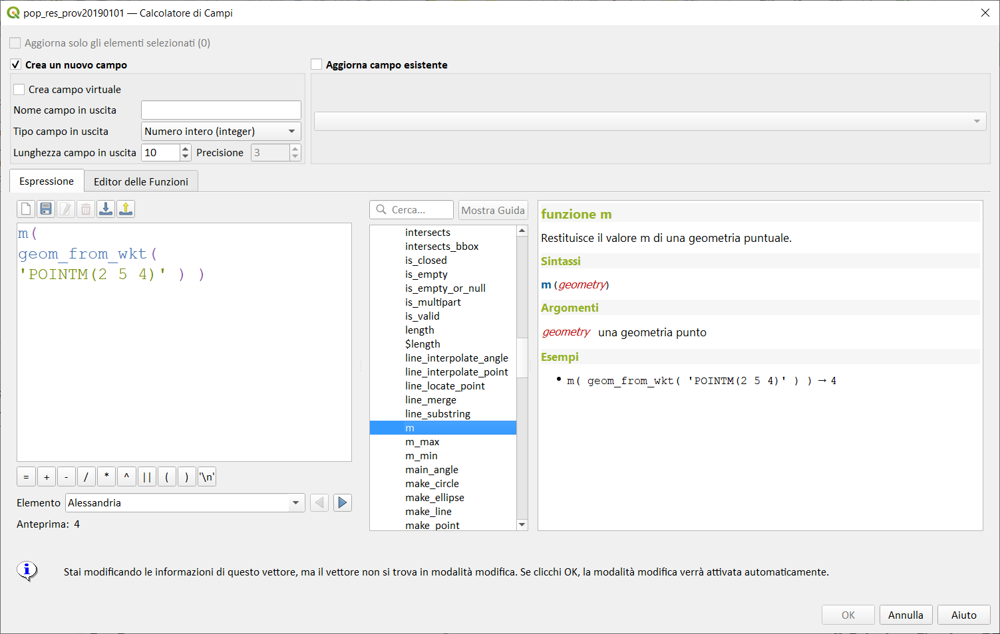

---

## m_max

!!! Note "Definizione"
	**Restituisce il valore minimo m (misura) di una geometria.**

Sintassi:

* m_max(_<span style="color:red;">geometry</span>_)

Argomenti:

* _<span style="color:red;">geometry</span>_ una geometria contenente m valori

!!! Example "Esempi"
	```
	* m_max( make_point_m( 0,0,1 ) ) → 1
	* m_max(make_line( make_point_m( 0,0,1 ), make_point_m( -1,-1,2 ), make_point_m( -2,-2,0 ) ) ) → 2
	```

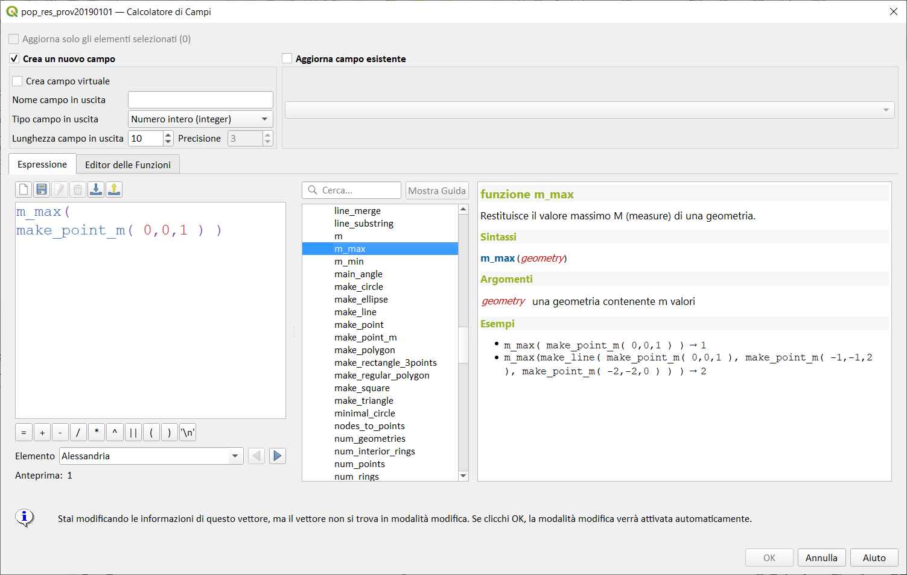

---

## m_min

!!! Note "Definizione"
	**Restituisce il valore minimo m (misura) di una geometria.**

Sintassi:

* m_min(_<span style="color:red;">geometry</span>_)

Argomenti:

* _<span style="color:red;">geometry</span>_ una geometria contenente m valori

!!! Example "Esempi"
	```
	* m_min( make_point_m( 0,0,1 ) ) → 1
	* m_min(make_line( make_point_m( 0,0,1 ), make_point_m( -1,-1,2 ), make_point_m( -2,-2,0 ) ) ) → 0
	```


---

## main_angle

!!! Note "Definizione"
	**Restituisce l'angolo principale di una geometria (senso orario, in gradi dal Nord), il quale rappresenta l'angolo dell'orientamento del rettangolo minimo che copre completamente la geometria.**

Sintassi:

* main_angle(_<span style="color:red;">geometry</span>_)

Argomenti:

* _<span style="color:red;">geometry</span>_ una geometria poligono

!!! Example "Esempi"
	```
	* main_angle(geom_from_wkt('Polygon ((321577 129614, 321581 129618, 321585 129615, 321581 129610, 321577 129614))')) → 38.66
	```


Osservazioni:


---

## make_circle

!!! Note "Definizione"
	**Crea un poligono circolare.**

Sintassi:

- make_circle(_<span style="color:red;">center</span>_, _<span style="color:red;">radius</span>_[, _<span style="color:red;">segments=36</span>_])

[ ] indica componenti opzionali

Argomenti:

* _<span style="color:red;">center</span>_ centro del cerchio
* _<span style="color:red;">radius</span>_ raggio del cerchio
* _<span style="color:red;">segments</span>_ argomento opzionale per la segmentazione del poligono. Valore predefinito pari a 36

!!! Example "Esempi"
	```
	* geom_to_wkt(make_circle(make_point(10,10), 5, 4)) → 'Polygon ((10 15, 15 10, 10 5, 5 10, 10 15))'
	* geom_to_wkt(make_circle(make_point(10,10,5), 5, 4)) → 'PolygonZ ((10 15 5, 15 10 5, 10 5 5, 5 10 5, 10 15 5))''
	* geom_to_wkt(make_circle(make_point(10,10,5,30), 5, 4)) → 'PolygonZM ((10 15 5 30, 15 10 5 30, 10 5 5 30, 5 10 5 30, 10 15 5 30))'
	```

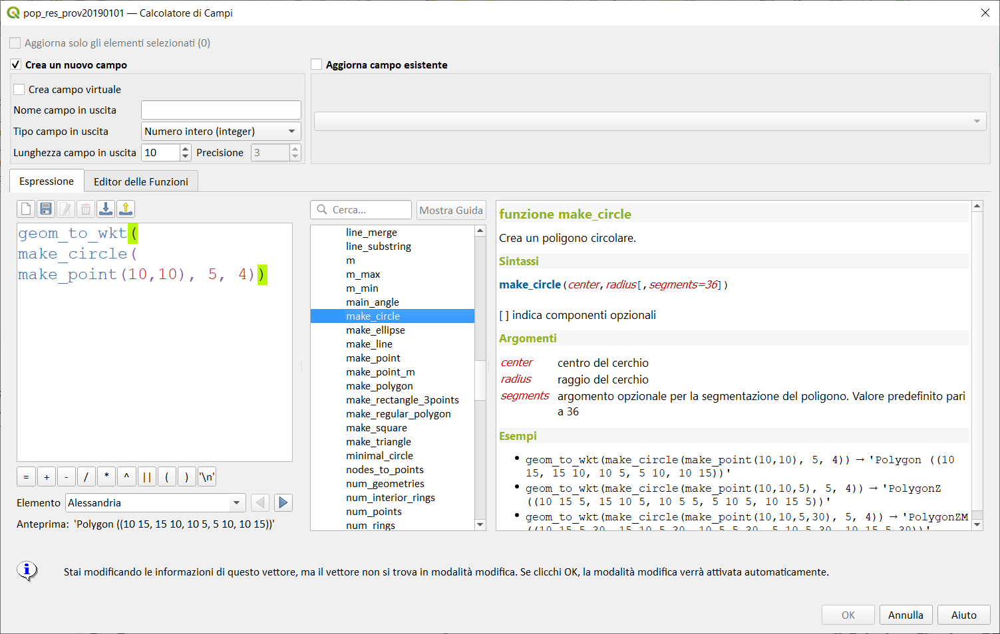


---

## make_ellipse

!!! Note "Definizione"
	**Crea un poligono ellittico.**

Sintassi:

- make_ellipse(_<span style="color:red;">center</span>_, _<span style="color:red;">semi_major_axis</span>_, _<span style="color:red;">semi_minor_axis</span>_, _<span style="color:red;">azimuth</span>_[, _<span style="color:red;">segments=36</span>_])

Argomenti:

* _<span style="color:red;">center</span>_ centro dell'ellisse
* _<span style="color:red;">semi_major_axis</span>_ semi-asse maggiore dell'ellisse
* _<span style="color:red;">semi_minor_axis</span>_ semi-asse minore dell'ellisse
* _<span style="color:red;">azimuth</span>_ orientazione dell'ellisse
* _<span style="color:red;">segments</span>_ argomento opzionale per la segmentazione del poligono. Valore predefinito pari a 36

!!! Example "Esempi"
	```
	* geom_to_wkt(make_ellipse(make_point(10,10), 5, 2, 90, 4)) → 'Polygon ((15 10, 10 8, 5 10, 10 12, 15 10))
	* geom_to_wkt(make_ellipse(make_point(10,10,5), 5, 2, 90, 4)) → 'PolygonZ ((15 10 5, 10 8 5, 5 10 5, 10 12 5, 15 10 5))'
	* geom_to_wkt(make_circle(make_point(10,10,5,30), 5, 2, 90, 4)) → 'PolygonZM ((15 10 5 30, 10 8 5 30, 5 10 5 30, 10 12 5 30, 15 10 5 30))'
	```


---

## make_line

!!! Note "Definizione"
	**Crea una geometria linea da una serie di geometrie punto.**

Sintassi:

- make_line(_<span style="color:red;">point1</span>_, _<span style="color:red;">point2</span>_, …_)

Argomenti:

* _<span style="color:red;">point</span>_ una geometria punto

!!! Example "Esempi"
	```
	* geom_to_wkt(make_line(make_point(2,4),make_point(3,5))) → 'LineString (2 4, 3 5)'
	* geom_to_wkt(make_line(make_point(2,4),make_point(3,5),make_point(9,7))) → 'LineString (2 4, 3 5, 9 7)'
	```

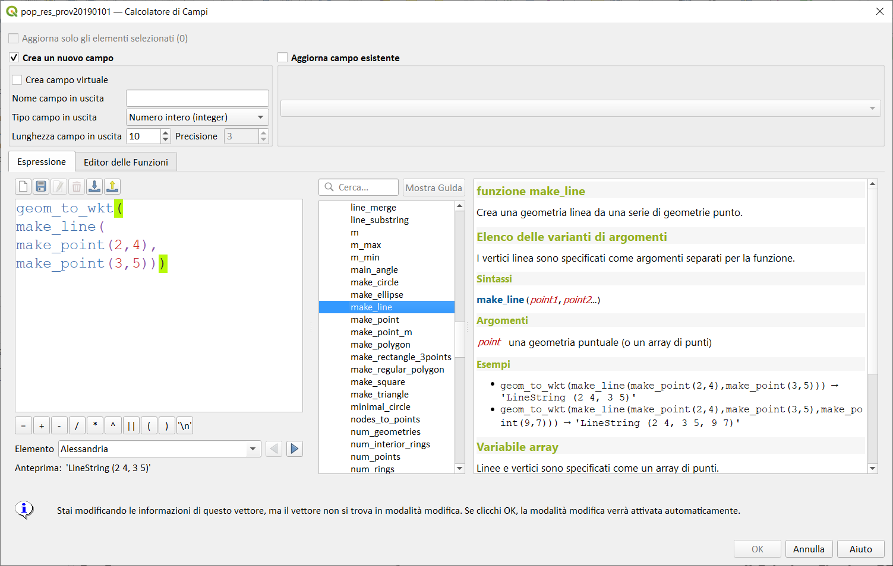

### Array variant

I vertici di linea sono specificati come una matrice di punti.

Sintassi:

- make_line(_<span style="color:red;">array</span>_)

Argomenti:

* _<span style="color:red;">array</span>_ Matrice di punti

!!! Example "Esempi"
	```
	* geom_to_wkt(make_line(array(make_point(2,4),make_point(3,5),make_point(9,7)))) → 'LineString (2 4, 3 5, 9 7)'
	```


!!! Tip "Espressione"
	```
	make_line(
	array(geometry(
		get_feature_by_id('fontanelle_Palermo',$id))),
	array(geometry(
		get_feature_by_id('fontanelle_Palermo',not $id%2)))
			) 
	```


---

## make_point

!!! Note "Definizione"
	**Crea una geometria punto da valori x ed y (e opzionalmente z ed m).**

Sintassi:

- make_point(_<span style="color:red;">x</span>_, _<span style="color:red;">y</span>_, _<span style="color:red;">z</span>_, _<span style="color:red;">m</span>_)

Argomenti:

* _<span style="color:red;">x</span>_ coordinata x del punto
* _<span style="color:red;">y</span>_ coordinata y del punto
* _<span style="color:red;">z</span>_ coordinata opzionale z del punto
* _<span style="color:red;">m</span>_ valore m del punto

!!! Example "Esempi"
	```
	* geom_to_wkt(make_point(2,4,6,8)) → 'PointZM (2 4 6 8)'
	```

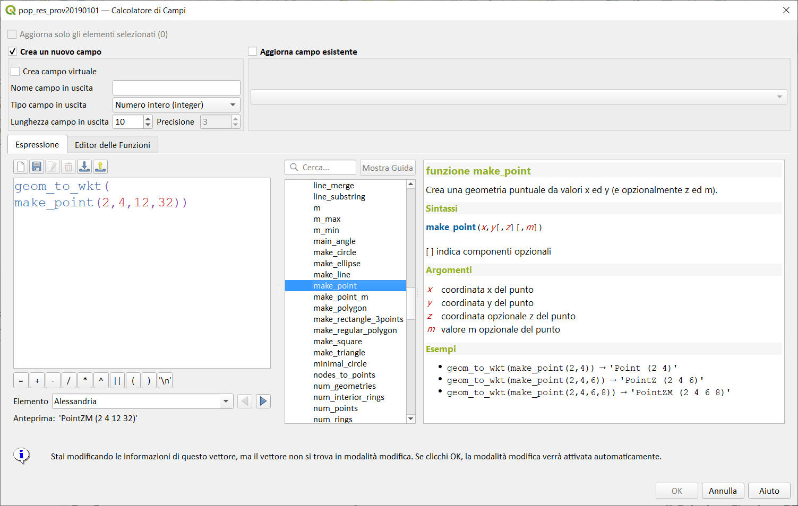

---

## make_point_m

!!! Note "Definizione"
	**Crea una geometria punto da una coordinata x, y ed un valore m.**

Sintassi:

- make_point_m_(_<span style="color:red;">x</span>_, _<span style="color:red;">y</span>_, _<span style="color:red;">m</span>_)

Argomenti:

* _<span style="color:red;">x</span>_ coordinata x del punto
* _<span style="color:red;">y</span>_ coordinata y del punto
* _<span style="color:red;">m</span>_ valore m del punto

!!! Example "Esempi"
	```
	* geom_to_wkt(make_point_m(2,4,6)) → 'PointM (2 4 6)'
	```


---

## make_polygon

!!! Note "Definizione"
	**Crea una geometria poligono da un'anello esterno e opzionalmente da geometrie ad anello interne.**

Sintassi:

- make_polygon(_<span style="color:red;">outerRing</span>_[, _<span style="color:red;">innerRing1</span>_][, _<span style="color:red;">innerRing2</span>_] …_)

[ ] indica componenti opzionali

Argomenti:

* _<span style="color:red;">outerRing</span>_ geometria a linea chiusa per l'anello esterno del poligono
* _<span style="color:red;">innerRing</span>_ geometria a linea chiusa opzionale per anello interno

!!! Example "Esempi"
	```
	* geom_to_wkt(make_polygon(geom_from_wkt('LINESTRING( 0 0, 0 1, 1 1, 1 0, 0 0 )'))) → 'Polygon ((0 0, 0 1, 1 1, 1 0, 0 0))'
	* geom_to_wkt(make_polygon(geom_from_wkt('LINESTRING( 0 0, 0 1, 1 1, 1 0, 0 0 )'),geom_from_wkt('LINESTRING( 0.1 0.1, 0.1 0.2, 0.2 0.2, 0.2 0.1, 0.1 0.1 )'),geom_from_wkt('LINESTRING( 0.8 0.8, 0.8 0.9, 0.9 0.9, 0.9 0.8, 0.8 0.8 )'))) → 'Polygon ((0 0, 0 1, 1 1, 1 0, 0 0),(0.1 0.1, 0.1 0.2, 0.2 0.2, 0.2 0.1, 0.1 0.1),(0.8 0.8, 0.8 0.9, 0.9 0.9, 0.9 0.8, 0.8 0.8))'
	```


---

## make_rectangle_3points

!!! Note "Definizione"
	**Crea un rettangolo da 3 punti.**

Sintassi:

- make_rectangle_3points(_<span style="color:red;">point1</span>_,_<span style="color:red;">point2</span>_,_<span style="color:red;">point3</span>_[,option=0]…)

Argomenti:

* _<span style="color:red;">point1</span>_ Primo punto
* _<span style="color:red;">point2</span>_ Secondo punto
* _<span style="color:red;">point3</span>_ Terzo punto
* _<span style="color:red;">option</span>_ Un argomento facoltativo per costruire il rettangolo. Di default questo valore è 0. Il valore può essere 0 (distanza) o 1 (proiettato). Distanza opzione: la seconda distanza è uguale alla distanza tra il 2 ° e il 3 ° punto. Opzione proiettata: la seconda distanza è uguale alla distanza della proiezione perpendicolare del terzo punto sul segmento o della sua estensione.

!!! Example "Esempi"
	```
	* geom_to_wkt(make_rectangle_3points(make_point(0, 0), make_point(0,5), make_point(5, 5), 0))) → 'Polygon ((0 0, 0 5, 5 5, 5 0, 0 0))'
	* geom_to_wkt(make_rectangle_3points(make_point(0, 0), make_point(0,5),make_point(5, 3), 1))) → 'Polygon ((0 0, 0 5, 5 5, 5 0, 0 0))'
	```

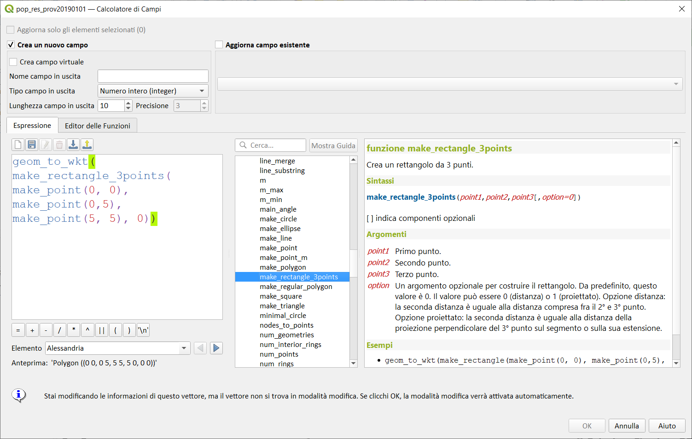

--


---

## make_regular_polygon

!!! Note "Definizione"
	**Crea un poligono regolare.**

Sintassi:

- make_regular_polygon(_<span style="color:red;">center</span>_, _<span style="color:red;">radius</span>_, _<span style="color:red;">number_sides</span>_[, _<span style="color:red;">circle=0</span>_])

[ ] indica componenti opzionali

Argomenti:

* _<span style="color:red;">center</span>_ centro del poligono regolare
* _<span style="color:red;">radius</span>_ secondo punto. Il primo se il poligono regolare è inscritto. Il punto intermedio del primo lato se il poligono regolare è circoscritto.
* _<span style="color:red;">number_sides</span>_ Numero di lati del poligono regolare
* _<span style="color:red;">circle</span>_ Argomento opzionale per la costruzione del poligono regolare. Il valore predefinito è 0. Il valore può essere 0 (poligono iscritto) o 1 (poligono circoscritto)

!!! Example "Esempi"
	```
	* geom_to_wkt(make_regular_polygon(make_point(0,0), make_point(0,5), 5)) → 'Polygon ((0 5, 4.76 1.55, 2.94 -4.05, -2.94 -4.05, -4.76 1.55, 0 5))'
	* geom_to_wkt(make_regular_polygon(make_point(0,0), project(make_point(0,0), 4.0451, radians(36)), 5)) → 'Polygon ((0 5, 4.76 1.55, 2.94 -4.05, -2.94 -4.05, -4.76 1.55, 0 5))'
	```

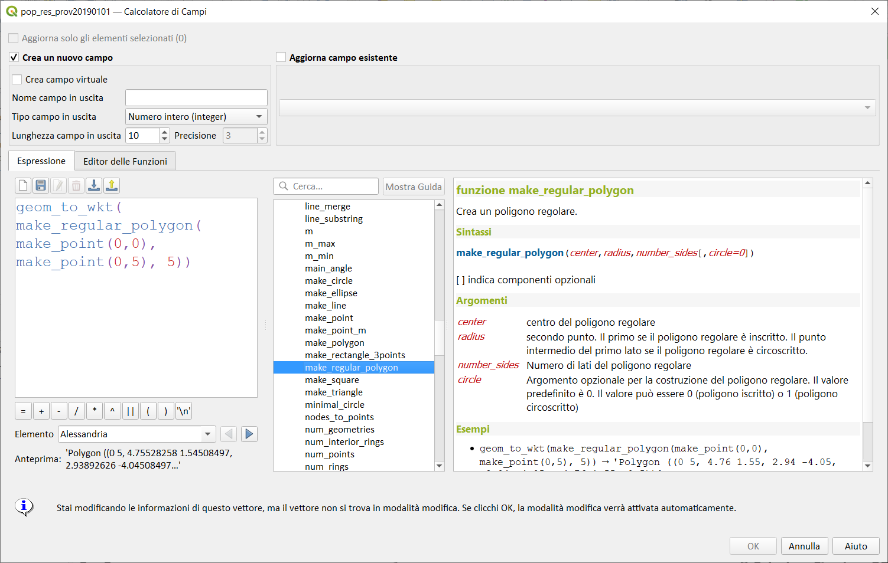


---

## make_square

!!! Note "Definizione"
	**Crea un quadrato da una diagonale.**

Sintassi:

- make_square(_<span style="color:red;">point1</span>_,_<span style="color:red;">point2</span>_)

Argomenti:

- _<span style="color:red;">point1</span>_ Primo punto della diagonale
- _<span style="color:red;">point2</span>_ Secondo punto della diagonale

!!! Example "Esempi"
	```
	* geom_to_wkt(make_square( make_point(0,0), make_point(5,5))) → 'Polygon ((0 0, -0 5, 5 5, 5 0, 0 0))'
	* geom_to_wkt(make_square( make_point(5,0), make_point(5,5))) → 'Polygon ((5 0, 2.5 2.5, 5 5, 7.5 2.5, 5 0))'
	```

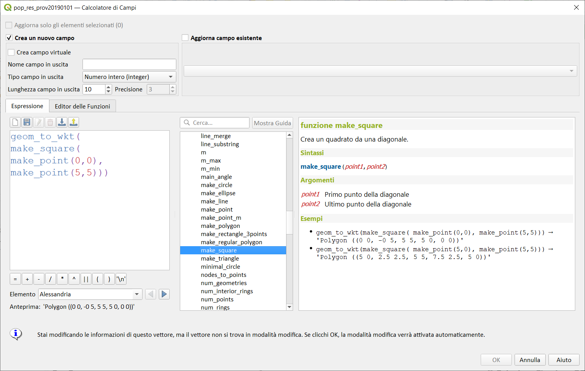

---

## make_triangle

!!! Note "Definizione"
	**Crea un poligono triangolare**

Sintassi:

- make_triangle(_<span style="color:red;">point1</span>_,_<span style="color:red;">point2</span>_,_<span style="color:red;">point3</span>_)

Argomenti:

- _<span style="color:red;">point1</span>_ Primo punto del triangolo
- _<span style="color:red;">point2</span>_ Secondo punto del triangolo
- _<span style="color:red;">point3</span>_ Secondo punto del triangolo
- 
!!! Example "Esempi"
	```
	* geom_to_wkt(make_triangle(make_point(0,0), make_point(5,5), make_point(0,10))) → 'Triangle ((0 0, 5 5, 0 10, 0 0))'
	* geom_to_wkt(boundary(make_triangle(make_point(0,0), make_point(5,5), make_point(0,10)))) → 'LineString (0 0, 5 5, 0 10, 0 0)'
	```


---

## minimal_circle

!!! Note "Definizione"
	**Restituisce la circonferenza circoscritta minima di una geometria. Rappresenta il cerchio minimo che circoscrive tutte le geometrie presenti in un dataset.**

Sintassi:

- minimal_circle(_<span style="color:red;">geometry</span>_[, _<span style="color:red;">segments=36</span>_])

[ ] indica componenti opzionali

Argomenti:

* _<span style="color:red;">geometry</span>_ una geometria
* _<span style="color:red;">segments</span>_ argomento opzionale per la segmentazione del poligono. Valore predefinito pari a 36

!!! Example "Esempi"
	```
	* geom_to_wkt( minimal_circle( geom_from_wkt( 'LINESTRING(0 5, 0 -5, 2 1)' ), 4 ) ) → Polygon ((0 5, 5 -0, -0 -5, -5 0, 0 5))
	* geom_to_wkt( minimal_circle( geom_from_wkt( 'MULTIPOINT(1 2, 3 4, 3 2)' ), 4 ) ) → Polygon ((3 4, 3 2, 1 2, 1 4, 3 4))
	```

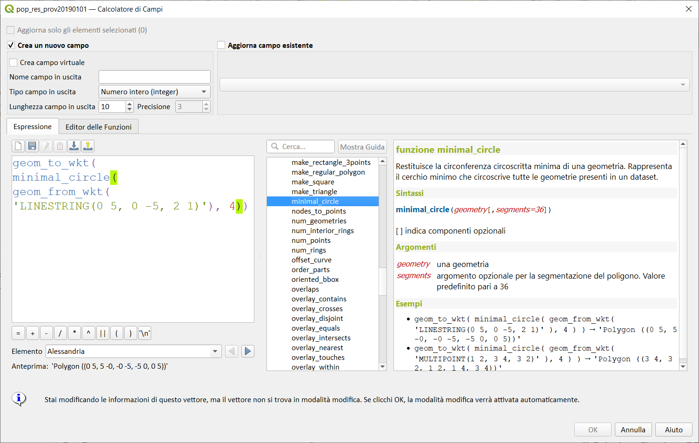

--


---

## nodes_to_points

!!! Note "Definizione"
	**Restituisce una geometria multi-punti costituita da ogni nodo della geometria in ingresso.**

Sintassi:

- nodes_to_points(_<span style="color:red;">geometry</span>_[, _<span style="color:red;">ignore_closing_nodes=false</span>_])

Argomenti:

* _<span style="color:red;">geometry</span>_ oggetto geometria
* _<span style="color:red;">ignore_closing_nodes</span>_ argomento opzionale che specifica se includere i nodi duplicati che chiudono linee o poligoni ad anello. Normalmente false, impostare a true per evitare di includere questi nodi duplicati nella raccolta in uscita.

!!! Example "Esempi"
	```
	* geom_to_wkt(nodes_to_points(geom_from_wkt('LINESTRING(0 0, 1 1, 2 2)'))) → 'MultiPoint ((0 0),(1 1),(2 2))'
	* geom_to_wkt(nodes_to_points(geom_from_wkt('POLYGON((-1 -1, 4 0, 4 2, 0 2, -1 -1))'),true)) → 'MultiPoint ((-1 -1),(4 0),(4 2),(0 2))'
	```

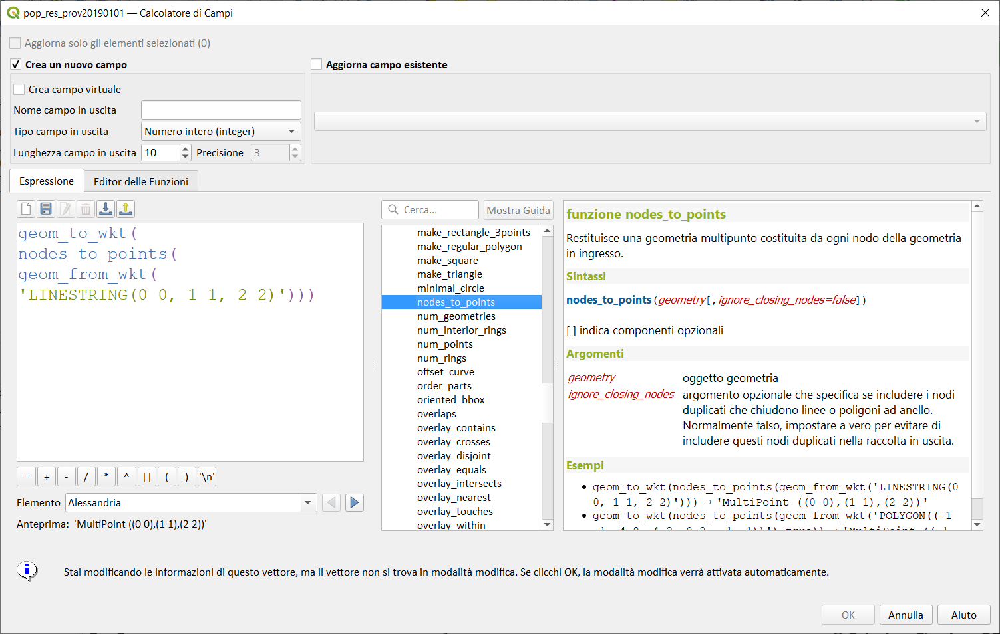

--


---

## num_geometries

!!! Note "Definizione"
	**Restituisce il numero di geometrie in una raccolta di geometrie, o null se la geometria in ingresso non è una raccolta.**

Sintassi:

- num_geometries(_<span style="color:red;">geometry</span>_)

Argomenti:

* _<span style="color:red;">geometry</span>_ raccolta di geometrie

!!! Example "Esempi"
	```
	* num_geometries(geom_from_wkt('GEOMETRYCOLLECTION(POINT(0 1), POINT(0 0), POINT(1 0), POINT(1 1))')) → 4
	```


---

## num_interior_rings

!!! Note "Definizione"
	**Restituisce il numero di anelli interni in un poligono o in una raccolta di geometrie, o null se la geometria in ingresso non è un poligono o una raccolta.**

Sintassi:

- num_interior_rings(_<span style="color:red;">geometry</span>_) 

Argomenti:

* _<span style="color:red;">geometry</span>_ geometria in ingresso

!!! Example "Esempi"
	```
	* num_interior_rings(geom_from_wkt('POLYGON((-1 -1, 4 0, 4 2, 0 2, -1 -1),(-0.1 -0.1, 0.4 0, 0.4 0.2, 0 0.2, -0.1 -0.1))')) → 1
	```

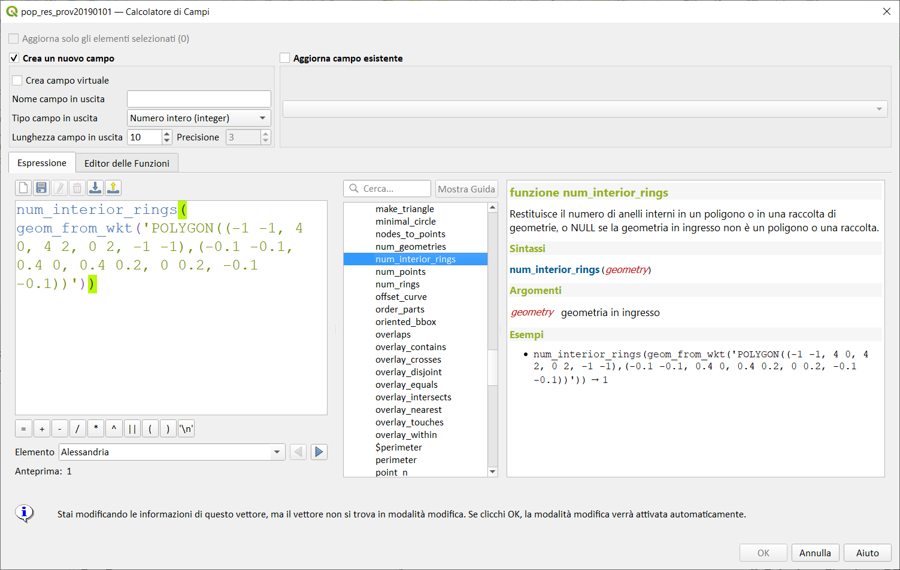


---

## num_points

!!! Note "Definizione"
	**Restituisce il numero di vertici in una geometria.**

Sintassi:

- num_points(_<span style="color:red;">geometry</span>_) 

Argomenti:

* _<span style="color:red;">geometry</span>_ una geometria

!!! Example "Esempi"
	```
	* num_points($geometry) → numero di vertici in $geometry
	```

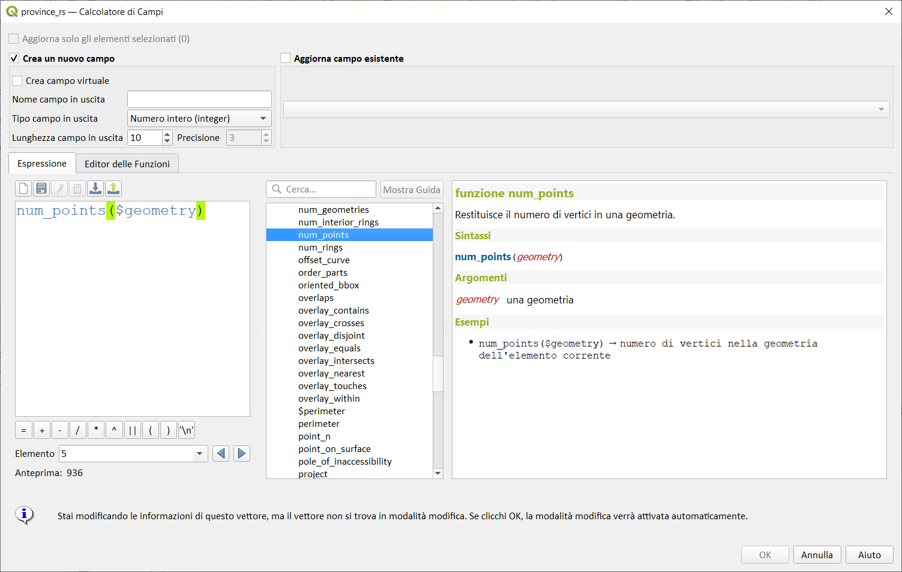

---

## num_rings

!!! Note "Definizione"
	**Restituisce il numero di anelli (includendo anche anelli esterni) in un poligono o in una raccolta di geometrie, o null se la geometria in ingresso non è un poligono o una raccolta.**

Sintassi:

- num_rings(_<span style="color:red;">geometry</span>_)

Argomenti:

* _<span style="color:red;">geometry</span>_ geometria in ingresso

!!! Example "Esempi"
	```
	* num_rings(geom_from_wkt('POLYGON((-1 -1, 4 0, 4 2, 0 2, -1 -1),(-0.1 -0.1, 0.4 0, 0.4 0.2, 0 0.2, -0.1 -0.1))')) → 2
	```

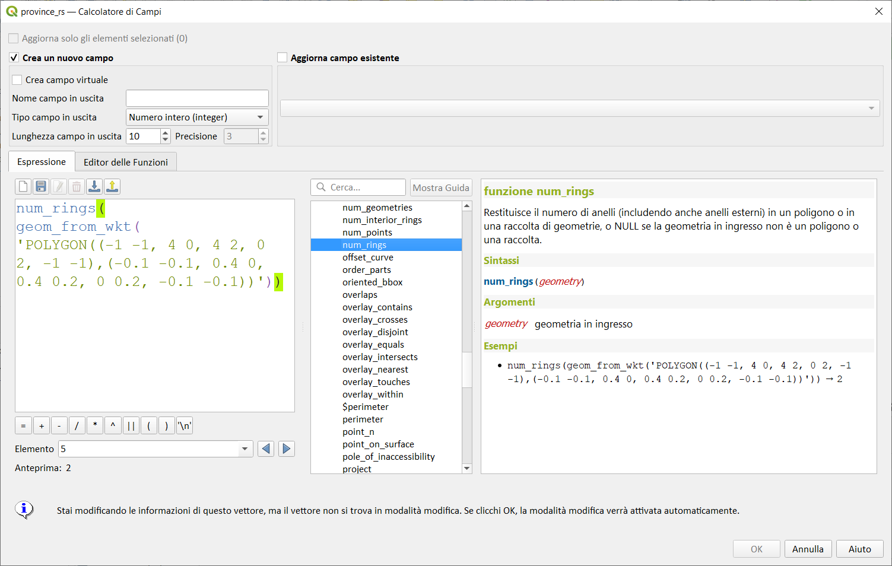

--


---

## offset_curve

!!! Note "Definizione"
	**Restituisce una geometria formata facendo l'offset di una geometria di tipo linestring a lato. Le distanze sono espresse nel SR di tale geometria.**

Sintassi:

- offset_curve(_<span style="color:red;">geometry</span>_, _<span style="color:red;">distance</span>_[, _<span style="color:red;">segments=8</span>_][, _<span style="color:red;">join=1</span>_][, _<span style="color:red;">miter_limit=2.0</span>_])

[ ] indica componenti opzionali

Argomenti:

* _<span style="color:red;">geometry</span>_ una geometria (multi)linestring
* _<span style="color:red;">distance</span>_ distanza di offset. Valori positivi saranno bufferizzati a sinistra delle linee, valori negativi a destra
* _<span style="color:red;">segments</span>_ numero di segmenti da usare per rappresentare un quarto di cerchio quando è utilizzato uno stile di unione arrotondato. Un numero grande risulta in una linea più morbida, con più nodi.
* _<span style="color:red;">join</span>_ stile di unione per gli angoli, dove 1 = arrotondato, 2 = seghettato e 3 = smussato
* _<span style="color:red;">miter_limit</span>_ limite sul rapporto di seghettatura usato per angoli molto appuntiti (solamente quando si usano le unioni seghettate)

!!! Example "Esempi"
	```
	* offset_curve($geometry, 10.5) → linea scostata a sinistra di 10.5 unità
	* offset_curve($geometry, -10.5) → linea scostata a destra di 10.5 unità
	* offset_curve($geometry, 10.5, segments=16, join=1) → linea scostata a sinistra di 10.5 unità, usando più segmenti per risultare in una curva più morbida
	* offset_curve($geometry, 10.5, join=3) → linea scostata a sinistra di 10.5 unità, usando un'unione smussata
	```


!!! Info "Osservazioni"
	La linea è scostata a sinistra o destra rispetto al verso della linea:


---

## order_parts

!!! Note "Definizione"
	**Ordina le parti di una MultiGeometria secondo un dato criterio**

Sintassi:

- order_parts(_<span style="color:red;">geometry</span>_, _<span style="color:red;">orderby</span>_[, _<span style="color:red;">ascending=true</span>_])

[ ] indica componenti opzionali

Argomenti:

* _<span style="color:red;">geometry</span>_ una geometria multi-tipo
* _<span style="color:red;">orderby</span>_ un espressione stringa che definisce il criterio di ordinamento
* _<span style="color:red;">ascending</span>_ booleano, True per ascendente, False per discendente

!!! Example "Esempi"
	```
	* order_parts(geom_from_wkt('MultiPolygon (((1 1, 5 1, 5 5, 1 5, 1 1)),((1 1, 9 1, 9 9, 1 9, 1 1)))'), 'area($geometry)', False) → MultiPolygon (((1 1, 9 1, 9 9, 1 9, 1 1)),((1 1, 5 1, 5 5, 1 5, 1 1)))
	* order_parts(geom_from_wkt('LineString(1 2, 3 2, 4 3)'), '1', True) → LineString(1 2, 3 2, 4 3)
	```


---

## oriented_bbox

!!! Note "Definizione"
	**Restituisce una geometria che rappresenta il perimetro di delimitazione minimo orientato di una geometria.**

Sintassi:

- oriented_bbox(_<span style="color:red;">geometry</span>_) 

Argomenti:

* _<span style="color:red;">geometry</span>_ una geometria

!!! Example "Esempi"
	```
	* geom_to_wkt(oriented_bbox(geom_from_wkt('MULTIPOINT(1 2, 3 4, 3 2)'))) → 'Polygon ((1 2, 2 1, 4 3, 3 4, 1 2))'
	```

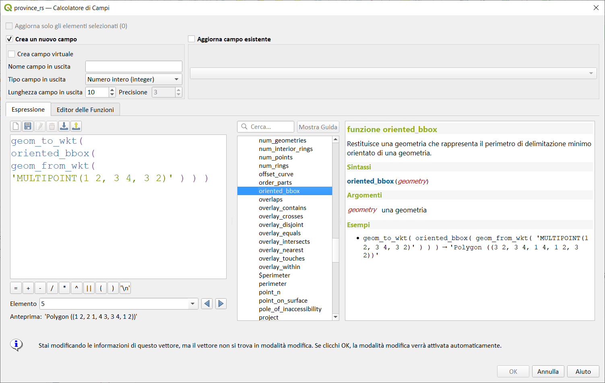


---

## overlaps

!!! Note "Definizione"
	**Controlla qualora una geometria si sovrapponga ad un'altra. Restituisce true (1) se le geometrie condividono aree, ma non sono completamente contenute una nell'altra.**

Sintassi:

- overlaps(_<span style="color:red;">geometry1</span>_, _<span style="color:red;">geometry2</span>_)

Argomenti:

* _<span style="color:red;">geometry1</span>_ una geometria
* _<span style="color:red;">geometry2</span>_ una geometria

!!! Example "Esempi"
	```
	* overlaps( geom_from_wkt( 'LINESTRING(3 5, 4 4, 5 5, 5 3)' ), geom_from_wkt( 'LINESTRING(3 3, 4 4, 5 5)' ) ) → 1
	* overlaps( geom_from_wkt( 'LINESTRING(0 0, 1 1)' ), geom_from_wkt( 'LINESTRING(3 3, 4 4, 5 5)' ) ) → 0
	```

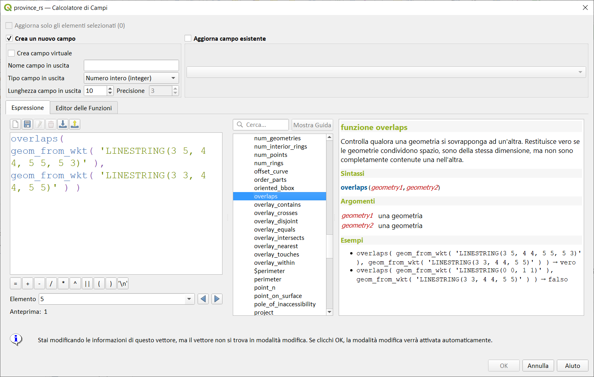

!!! Info "Osservazioni"
	Usando algoritmo `Seleziona per espressione` presente in strumenti di processing oppure  (Ctrl+F3):
	```
	- overlaps(geometry(get_feature( 'cerchio','id','1')), $geometry)
	```

dove:

* _geometry1_ è `geometry(get_feature('cerchio','id','1'))`
* _geometry2_ è `$geometry`


seleziono tutti i comuni `overlaps` (sovrapposti) al cerchio in figura.

**PS:** potrei anche negare (`NOT`) l'espressione per selezionare il complementare (tutti i comuni tranne quelli sovrapposti con il cerchio).

`NOT overlaps(geometry(get_feature('cerchio','id','1')),$geometry)`

---

## overlay_contains

!!! Note "Definizione"
	**Restituisce se l'elemento corrente contiene spazialmente almeno un elemento da un layer target o un array di risultati basati su espressioni per gli elementi nel layer target contenuti nell'elemento corrente. Ulteriori informazioni sul predicato GEOS "Contains" sottostante, come descritto nella funzione PostGIS [ST_CONTAINS](https://postgis.net/docs/ST_Contains.html).**

Sintassi:

- overlay_contains(_<span style="color:red;">layer</span>_[,_<span style="color:red;">expression</span>_][,_<span style="color:red;">filter</span>_][,_<span style="color:red;">limit</span>_][,_<span style="color:red;">cache=false</span>_])

[ ] indica componenti opzionali

Argomenti:

* _<span style="color:red;">layer</span>_ l'altro layer;
* _<span style="color:red;">expression</span>_ un'espressione opzionale per valutare gli elementi dell'altro layer (se non impostata, la funzione restituisce semplicemente un booleano che indica se c'è almeno una corrispondenza);
* _<span style="color:red;">filter</span>_ un'espressione opzionale per filtrare gli elementi corrispondenti (se non impostata, verranno restituiti tutti gli elementi);
* _<span style="color:red;">limit</span>_ un numero intero opzionale per limitare il numero di elementi corrispondenti (se non impostato, verranno restituiti tutti gli elementi);
* _<span style="color:red;">cache</span>_ imposta su "vero" per creare un indice spaziale locale (il più delle volte, questo è indesiderato, a meno che tu non stia lavorando con un fornitore di dati particolarmente lento);

[ ] indica componenti opzionali

!!! Example "Esempi"
	```
	* overlay_contains('regions') → true se l'elemento corrente contiene spazialmente una regione
	* overlay_contains('regions', filter:= population > 10000) → vero se l'elemento corrente contiene spazialmente una regione con una popolazione maggiore di 10000
	* overlay_contains('regions', name) → un array di nomi, per le regioni contenute nell'elemento corrente
	* array_to_string(overlay_contains('regions', name)) → una stringa come una lista di nomi separata da virgola, per le regioni contenute nell'elemento corrente
	* overlay_contains('regions', name)[0] → una stringa con il nome della regione contenuta nell'elemento corrente
	* array_sort(overlay_contains(layer:='regions', expression:="name", filter:= population > 10000)) → un array ordinato di nomi, per le regioni contenute nell'elemento corrente e con una popolazione superiore a 10000
	* overlay_contains(layer:='regions', expression:= geom_to_wkt($geometry), limit:=2) → un array di geometrie (in WKT), per un massimo di due regioni contenute nell'elemento corrente
	```


---

## overlay_crosses

!!! Note "Definizione"
	**Restituisce se l'elemento corrente attraversa spazialmente almeno un elemento di un layer target o un array di risultati basati su espressioni per gli elementi nel layer target attraversati dall'elemento corrente. Ulteriori informazioni sul predicato GEOS "Crosses" sottostante, come descritto nella funzione PostGIS [ST_Crosses](https://postgis.net/docs/ST_Crosses.html).**

Sintassi:

- overlay_crosses(_<span style="color:red;">layer</span>_[,_<span style="color:red;">expression</span>_][,_<span style="color:red;">filter</span>_][,_<span style="color:red;">limit</span>_][,_<span style="color:red;">cache=false</span>_])

[ ] indica componenti opzionali

Argomenti:

* _<span style="color:red;">layer</span>_ l'altro layer;
* _<span style="color:red;">expression</span>_ un'espressione opzionale per valutare gli elementi dell'altro layer (se non impostata, la funzione restituisce semplicemente un booleano che indica se c'è almeno una corrispondenza);
* _<span style="color:red;">filter</span>_ un'espressione opzionale per filtrare gli elementi corrispondenti (se non impostata, verranno restituiti tutti gli elementi);
* _<span style="color:red;">limit</span>_ un numero intero opzionale per limitare il numero di elementi corrispondenti (se non impostato, verranno restituiti tutti gli elementi);
* _<span style="color:red;">cache</span>_ imposta su "vero" per creare un indice spaziale locale (il più delle volte, questo è indesiderato, a meno che tu non stia lavorando con un fornitore di dati particolarmente lento);

[ ] indica componenti opzionali

!!! Example "Esempi"
	```
	* overlay_crosses('regions') → true se l'elemento corrente attraversa spazialmente una regione
	* overlay_crosses('regions', filter:= population > 10000) → vero se l'elemento corrente attraversa spazialmente una regione con una popolazione maggiore di 10000
	* overlay_crosses('regions', name) → un array di nomi, per le regioni attraversate dall'elemento corrente
	* array_to_string(overlay_crosses('regions', name)) → una stringa come una lista di nomi separata da virgola, per le regioni attraversate dall'elemento corrente
	* overlay_crosses('regions', name)[0] → una stringa con il nome della prima regioni attraversata dall'elemento corrente
	* array_sort(overlay_crosses(layer:='regions', expression:="name", filter:= population > 10000)) → un array ordinato di nomi, per le regioni attraversate dall'elemento corrente e con una popolazione superiore a 10000
	* overlay_crosses(layer:='regions', expression:= geom_to_wkt($geometry), limit:=2) → un array di geometrie (in WKT), per un massimo di due regioni attraversate dall'elemento corrente
	```


---

## overlay_disjoint

!!! Note "Definizione"
	**Restituisce se l'elemento corrente è spazialmente disgiunto da tutti gli elementi di un layer target, o un array di risultati basati su espressione per gli elementi nel layer target che sono disgiunti dall'elemento corrente. Ulteriori informazioni sul sottostante predicato GEOS "Disjoint", come descritto nella funzione PostGIS [ST_Disjoint](https://postgis.net/docs/ST_Disjoint.html).**

Sintassi:

- overlay_disjoint(_<span style="color:red;">layer</span>_[,_<span style="color:red;">expression</span>_][,_<span style="color:red;">filter</span>_][,_<span style="color:red;">limit</span>_][,_<span style="color:red;">cache=false</span>_])

[ ] indica componenti opzionali

Argomenti:

* _<span style="color:red;">layer</span>_ l'altro layer;
* _<span style="color:red;">expression</span>_ un'espressione opzionale per valutare gli elementi dell'altro layer (se non impostata, la funzione restituisce semplicemente un booleano che indica se c'è almeno una corrispondenza);
* _<span style="color:red;">filter</span>_ un'espressione opzionale per filtrare gli elementi corrispondenti (se non impostata, verranno restituiti tutti gli elementi);
* _<span style="color:red;">limit</span>_ un numero intero opzionale per limitare il numero di elementi corrispondenti (se non impostato, verranno restituiti tutti gli elementi);
* _<span style="color:red;">cache</span>_ imposta su "vero" per creare un indice spaziale locale (il più delle volte, questo è indesiderato, a meno che tu non stia lavorando con un fornitore di dati particolarmente lento);

[ ] indica componenti opzionali

!!! Example "Esempi"
	```
	* overlay_disjoint('regions') → true se l'elemento corrente è spazialmente disgiunto da tutte le regioni
	* overlay_disjoint('regions', filter:= population > 10000) → vero se l'elemento corrente è spazialmente disgiunto da tutte le regioni con una popolazione maggiore di 10000
	* overlay_disjoint('regions', name) → un array di nomi, per le regioni spazialmente disgiunte dall'elemento corrente
	* array_to_string(overlay_disjoint('regions', name)) → una stringa come una lista di nomi separata da virgola, per le regioni spazialmente disgiunte dall'elemento corrente
	* overlay_disjoint('regions', name)[0] → una stringa con il nome della regione spazialmente disgiunte dall'elemento corrente
	* array_sort(overlay_disjoint(layer:='regions', expression:="name", filter:= population > 10000)) → un array ordinato di nomi, per le regioni spazialmente disgiunte dall'elemento corrente e con una popolazione superiore a 10000
	* overlay_disjoint(layer:='regions', expression:= geom_to_wkt($geometry), limit:=2) → un array di geometrie (in WKT), per un massimo di due regioni spazialmente disgiunte dall'elemento corrente
	```


---

## overlay_equals

!!! Note "Definizione"
	**Restituisce se l'elemento corrente è spazialmente uguale ad almeno un elemento da un layer target o un array di risultati basati su espressioni per gli elementi nel layer target che sono spazialmente uguali all'elemento corrente. Ulteriori informazioni sul predicato GEOS "Equals" sottostante, come descritto nella funzione PostGIS [ST_Equals](https://postgis.net/docs/ST_Equals.html).**

Sintassi:

- overlay_equals(_<span style="color:red;">layer</span>_[,_<span style="color:red;">expression</span>_][,_<span style="color:red;">filter</span>_][,_<span style="color:red;">limit</span>_][,_<span style="color:red;">cache=false</span>_])

[ ] indica componenti opzionali

Argomenti:

* _<span style="color:red;">layer</span>_ l'altro layer;
* _<span style="color:red;">expression</span>_ un'espressione opzionale per valutare gli elementi dell'altro layer (se non impostata, la funzione restituisce semplicemente un booleano che indica se c'è almeno una corrispondenza);
* _<span style="color:red;">filter</span>_ un'espressione opzionale per filtrare gli elementi corrispondenti (se non impostata, verranno restituiti tutti gli elementi);
* _<span style="color:red;">limit</span>_ un numero intero opzionale per limitare il numero di elementi corrispondenti (se non impostato, verranno restituiti tutti gli elementi);
* _<span style="color:red;">cache</span>_ imposta su "vero" per creare un indice spaziale locale (il più delle volte, questo è indesiderato, a meno che tu non stia lavorando con un fornitore di dati particolarmente lento);

[ ] indica componenti opzionali

!!! Example "Esempi"
	```
	* overlay_equals('regions') → true se l'elemento corrente è spazialmente uguale ad una regione
	* overlay_equals('regions', filter:= population > 10000) → vero se l'elemento corrente è spazialmente uguale ad una regione con una popolazione maggiore di 10000
	* overlay_equals('regions', name) → un array di nomi, per le regioni spazialmente uguali all'elemento corrente
	* array_to_string(overlay_equals('regions', name)) → una stringa come lista di nomi separati da virgole, per le regioni spazialmente uguali all'elemento corrente
	* overlay_equals('regions', name)[0] → una stringa con il nome della regione spazialmente uguale all'elemento corrente
	* array_sort(overlay_equals(layer:='regions', expression:="name", filter:= population > 10000)) → un array ordinato di nomi, per le regioni spazialmente uguali all'elemento corrente e con una popolazione superiore a 10000
	* overlay_equals(layer:='regions', expression:= geom_to_wkt($geometry), limit:=2) → un array di geometrie (in WKT), per un massimo di due regioni spazialmente uguali all'elemento corrente
	```


---

## overlay_intersects

!!! Note "Definizione"
	**Restituisce se l'elemento corrente interseca spazialmente almeno un elemento da un layer target o un array di risultati basati su espressioni per gli elementi nel layer target intersecati dall'elemento corrente. Ulteriori informazioni sul predicato GEOS "Intersects" sottostante, come descritto nella funzione PostGIS [ST_INTERSECTS](https://postgis.net/docs/ST_Intersects.html).**

Sintassi:

- overlay_intersects(_<span style="color:red;">layer</span>_[,_<span style="color:red;">expression</span>_][,_<span style="color:red;">filter</span>_][,_<span style="color:red;">limit</span>_][,_<span style="color:red;">cache=false</span>_])

[ ] indica componenti opzionali

Argomenti:

* _<span style="color:red;">layer</span>_ l'altro layer;
* _<span style="color:red;">expression</span>_ un'espressione opzionale per valutare gli elementi dell'altro layer (se non impostata, la funzione restituisce semplicemente un booleano che indica se c'è almeno una corrispondenza);
* _<span style="color:red;">filter</span>_ un'espressione opzionale per filtrare gli elementi corrispondenti (se non impostata, verranno restituiti tutti gli elementi);
* _<span style="color:red;">limit</span>_ un numero intero opzionale per limitare il numero di elementi corrispondenti (se non impostato, verranno restituiti tutti gli elementi);
* _<span style="color:red;">cache</span>_ imposta su "vero" per creare un indice spaziale locale (il più delle volte, questo è indesiderato, a meno che tu non stia lavorando con un fornitore di dati particolarmente lento);

[ ] indica componenti opzionali

!!! Example "Esempi"
	```
	* overlay_intersects('regions') → true se l'elemento corrente interseca spazialmente una regione
	* overlay_intersects('regions', filter:= population > 10000) → vero se l'elemento corrente interseca spazialmente una regione con una popolazione maggiore di 10000
	* overlay_intersects('regions', name) → un array di nomi, per le regioni intersecate dall'elemento corrente
	* array_to_string(overlay_intersects('regions', name)) → una stringa come una lista di nomi separata da virgola, per le regioni intersecate dall'elemento corrente
	* overlay_intersects('regions', name)[0] → una stringa con il nome della regione intersecata dall'elemento corrente
	* array_sort(overlay_intersects(layer:='regions', expression:="name", filter:= population > 10000)) → un array ordinato di nomi, per le regioni intersecate dall'elemento corrente e con una popolazione maggiore di 10000
	* overlay_intersects(layer:='regions', expression:= geom_to_wkt($geometry), limit:=2) → un array di geometrie (in WKT), per un massimo di due regioni intersecate dall'elemento corrente
	```


---

## overlay_nearest

!!! Note "Definizione"
	**Restituisce se l'elemento corrente ha elementi da un layer target entro una data distanza o un array di risultati basati su espressioni per gli elementi nel layer di target entro una distanza dall'elemento corrente. Nota: questa funzione può essere lenta e consuma molta memoria per layer con molte feature.**

Sintassi:

- overlay_contains(_<span style="color:red;">layer</span>_[,_<span style="color:red;">expression</span>_][,_<span style="color:red;">filter</span>_][,_<span style="color:red;">limit=1</span>_][,_<span style="color:red;">max_distance</span>_][,_<span style="color:red;">cache</span>_])

[ ] indica componenti opzionali

Argomenti:

* _<span style="color:red;">layer</span>_ l'altro layer;
* _<span style="color:red;">expression</span>_ un'espressione opzionale per valutare gli elementi dell'altro layer (se non impostata, la funzione restituisce semplicemente un booleano che indica se c'è almeno una corrispondenza);
* _<span style="color:red;">filter</span>_ un'espressione opzionale per filtrare gli elementi corrispondenti (se non impostata, verranno restituiti tutti gli elementi);
* _<span style="color:red;">limit</span>_ un numero intero opzionale per limitare il numero di elementi corrispondenti (se non impostato, verranno restituiti tutti gli elementi);
* _<span style="color:red;">max_distance</span>_ una distanza opzionale per limitare la ricerca di elementi corrispondenti. Se non impostato, verranno usati tutti gli elementi nel layer di destinazione.
* _<span style="color:red;">cache</span>_ imposta su "vero" per creare un indice spaziale locale (il più delle volte, questo è indesiderato, a meno che tu non stia lavorando con un fornitore di dati particolarmente lento);

[ ] indica componenti opzionali

!!! Example "Esempi"
	```
	* overlay_nearest('airports') → true se il layer "airports" ha almeno un elemento
	* overlay_nearest('airports', max_distance:= 5000) → vero se è presente un aeroporto entro una distanza di 5000 unità di mappa dall'elemento corrente
	* overlay_nearest('airports', name) → il nome dell'aereoporto più vicino all'elemento corrente, come array
	* array_to_string(overlay_nearest('airports', name)) → il nome dell'aereoporto più vicino all'elemento corrente, come stringa
	* overlay_nearest(layer:='airports', expression:= name, max_distance:= 5000) → il nome dell'aereoporto più vicino entro una distanza di 5000 unità di mappa dall'elemento corrente, come array
	* overlay_nearest(layer:='airports', expression:="name", filter:= "Use"='Civilian', limit:=3) → un array di nomi, per un massimo di tre aeroeporti civili più vicini ordinati per distanza
	* overlay_nearest(layer:='airports', expression:="name", limit:= -1, max_distance:= 5000) → un array di nomi, per tutti gli aeroporti entro una distanza di 5000 unità di mappa dall'elemento corrente, ordinato per distanza.
	```


Esempio 45: <http://hfcqgis.opendatasicilia.it/it/latest/esempi/linea_min_distanza2.html>

---

## overlay_touches

!!! Note "Definizione"
	**Restituisce se l'elemento corrente tocca spazialmente almeno un elemento da un layer target o un array di risultati basati su espressioni per gli elementi nel layer target toccati dall'elemento corrente. Leggi ulteriori informazioni sul predicato GEOS "Touches", come descritto nella funzione PostGIS [ST_TOUCHES](https://postgis.net/docs/ST_Touches.html).**

Sintassi:

- overlay_touches(_<span style="color:red;">layer</span>_[,_<span style="color:red;">expression</span>_][,_<span style="color:red;">filter</span>_][,_<span style="color:red;">limit</span>_][,_<span style="color:red;">cache=false</span>_])

[ ] indica componenti opzionali

Argomenti:

* _<span style="color:red;">layer</span>_ l'altro layer;
* _<span style="color:red;">expression</span>_ un'espressione opzionale per valutare gli elementi dell'altro layer (se non impostata, la funzione restituisce semplicemente un booleano che indica se c'è almeno una corrispondenza);
* _<span style="color:red;">filter</span>_ un'espressione opzionale per filtrare gli elementi corrispondenti (se non impostata, verranno restituiti tutti gli elementi);
* _<span style="color:red;">limit</span>_ un numero intero opzionale per limitare il numero di elementi corrispondenti (se non impostato, verranno restituiti tutti gli elementi);
* _<span style="color:red;">cache</span>_ imposta su "vero" per creare un indice spaziale locale (il più delle volte, questo è indesiderato, a meno che tu non stia lavorando con un fornitore di dati particolarmente lento);

[ ] indica componenti opzionali

!!! Example "Esempi"
	```
	* overlay_touches('regions') → true se l'elemento corrente tocca spazialmente una regione
	* overlay_touches('regions', filter:= population > 10000) → vero se l'elemento corrente tocca spazialmente una regione con una popolazione maggiore di 10000
	* overlay_touches('regions', name) → un array di nomi, per le regioni tocacte dall'elemento corrente
	* string_to_array(overlay_touches('regions', name)) → una stringa come lista di nomi separati da virgole, per le regioni toccate dall'elemento corrente
	* overlay_touches('regions', name)[0] → una stringa con il nome della regione toccata dall'elemento corrente
	* array_sort(overlay_touches(layer:='regions', expression:="name", filter:= population > 10000)) → un array ordinato di nomi, per le regioni toccate dall'elemento attuale e con una popolazione superiore a 10000
	* overlay_touches(layer:='regions', expression:= geom_to_wkt($geometry), limit:=2) → un array di geometrie (in WKT), per un massimo di due regioni toccate dall'elemento corrente
	```


---

## overlay_within

!!! Note "Definizione"
	**Restituisce se l'elemento corrente è spazialmente all'interno di almeno un elemento da layer destinazione, o un array di risultati basati su espressione per gli elementi nel layer destinazione che contengono l'elemento corrente. Ulteriori informazioni sul sottostante predicato GEOS "Within", come descritto nella funzione PostGIS [ST_WITHIN](https://postgis.net/docs/ST_Within.html).**

Sintassi:

- overlay_within(_<span style="color:red;">layer</span>_[,_<span style="color:red;">expression</span>_][,_<span style="color:red;">filter</span>_][,_<span style="color:red;">limit</span>_][,_<span style="color:red;">cache=false</span>_])

[ ] indica componenti opzionali

Argomenti:

* _<span style="color:red;">layer</span>_ l'altro layer;
* _<span style="color:red;">expression</span>_ un'espressione opzionale per valutare gli elementi dell'altro layer (se non impostata, la funzione restituisce semplicemente un booleano che indica se c'è almeno una corrispondenza);
* _<span style="color:red;">filter</span>_ un'espressione opzionale per filtrare gli elementi corrispondenti (se non impostata, verranno restituiti tutti gli elementi);
* _<span style="color:red;">limit</span>_ un numero intero opzionale per limitare il numero di elementi corrispondenti (se non impostato, verranno restituiti tutti gli elementi);
* _<span style="color:red;">cache</span>_ imposta su "vero" per creare un indice spaziale locale (il più delle volte, questo è indesiderato, a meno che tu non stia lavorando con un fornitore di dati particolarmente lento);

[ ] indica componenti opzionali

!!! Example "Esempi"
	```
	* overlay_within('regions') → true se l'elemento corrente è spazialmente all'interno di una regione
	* overlay_within('regions', filter:= population > 10000) → vero se l'elemento corrente è spazialmente all'interno di una regione con una popolazione maggiore di 10000
	* overlay_within('regions', name) → un array di nomi, per le regioni contenenti l'elemento corrente
	* array_to_string(overlay_within('regions', name)) → una stringa come lista di nomi separati da virgole, per le regioni che contengono l'elemento corrente
	* overlay_within('regions', name)[0] → una stringa con il nome della regione che contengono l'elemento corrente
	* array_sort(overlay_within(layer:='regions', expression:="name", filter:= population > 10000)) → un array ordinato di nomi, per le regioni contenenti l'elemento corrente e con una popolazione superiore a 10000
	* overlay_within(layer:='regions', expression:= geom_to_wkt($geometry), limit:=2) → un array di geometrie (in WKT), per un massimo di due regioni contenenti l'elemento corrente
	```


---

## perimeter

!!! Note "Definizione"
	**Calcola il perimetro di un oggetto a geometria poligonale. I calcoli sono sempre planimetrici nel Sistema di Riferimento Spaziale (SR) di detta geometria, e l'unità di misura della lunghezza restituita è conforme all'unità di misura del SR. Ciò differisce dal calcolo eseguito dalla funzione [$perimeter](#perimeter), la quale esegue calcoli ellissoidali basati sull'ellissoide del progetto e sulle impostazioni delle unità di misura della distanza.**

Sintassi:

- perimeter(_<span style="color:red;">geometry</span>_)

Argomenti:

* _<span style="color:red;">geometry</span>_ oggetto geometria poligono

!!! Example "Esempi"
	```
	* perimeter(geom_from_wkt('POLYGON((0 0, 4 0, 4 2, 0 2, 0 0))')) → 12.0
	```

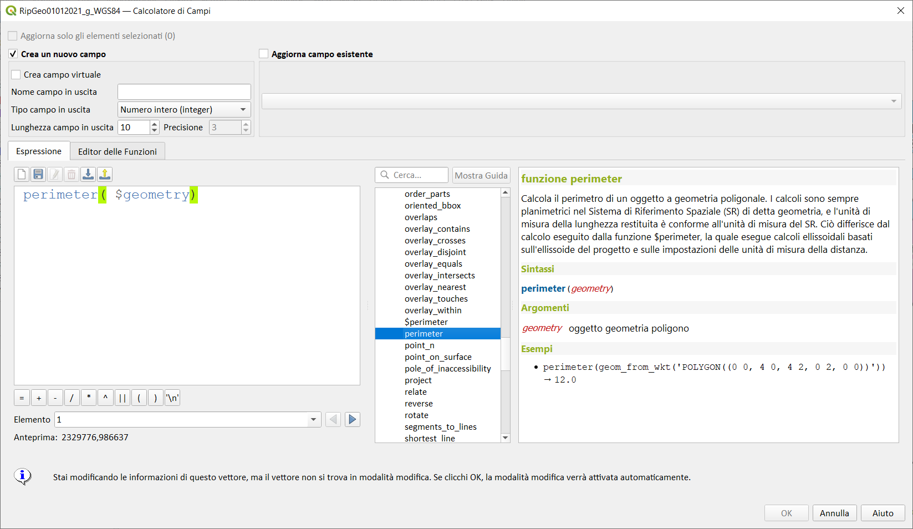

---

## point_n

!!! Note "Definizione"
	**Restituisce un nodo specifico da una geometria.**

Sintassi:

- point_n(_<span style="color:red;">geometry</span>_, _<span style="color:red;">index</span>_)

Argomenti:

* _<span style="color:red;">geometry</span>_ oggetto geometria
* _<span style="color:red;">index</span>_ indice del nodo da restituire, dove 1 è il primo nodo; se il valore è negativo, l'indice del vertice selezionato sarà il suo conteggio totale meno il valore assoluto

!!! Example "Esempi"
	```
	* geom_to_wkt(point_n(geom_from_wkt('POLYGON((0 0, 4 0, 4 2, 0 2, 0 0))'),2)) → 'Point (4 0)'
	```

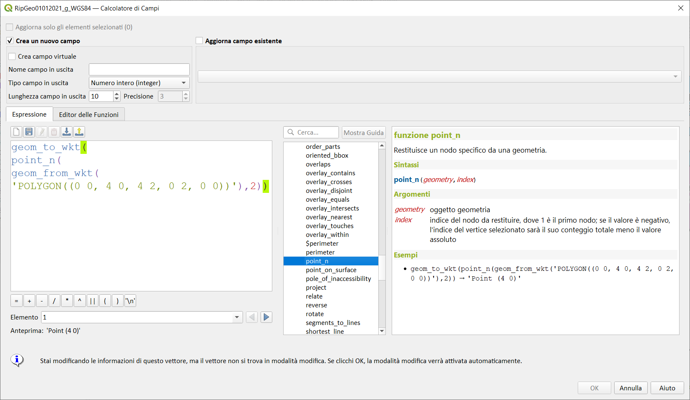

--


---

Esempi correlati:

[esempio nro 4](/esempi/add_col_z.md) - Come aggiungere la quota Z alla tabella attributi

---

## point_on_surface

!!! Note "Definizione"
	**Restituisce un punto garantendo che sia giacente sulla superficie della geometria.**

Sintassi:

- point_on_surface(_<span style="color:red;">geometry</span>_)

Argomenti:

* _<span style="color:red;">geometry</span>_ una geometria

!!! Example "Esempi"
	```
	* point_on_surface($geometry) → una geometria punto
	```

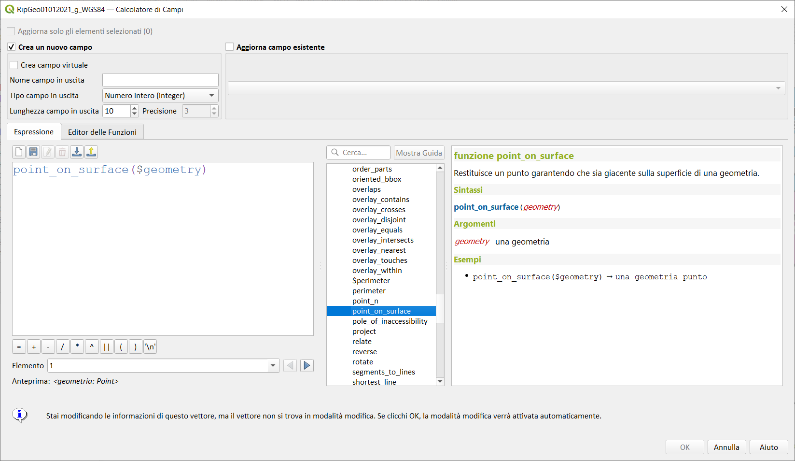

--


---

## pole_of_inaccessibility

!!! Note "Definizione"
	**Calcola il polo dell'inaccessibilità approssimato per una superficie, che è il punto interno più distante dal contorno della superficie. Questa funzione usa l'algoritmo 'polylabel' (Vladimir Agafonkin, 2016), che è un approccio iterativo garantito per trovare il vero polo dell'inaccessibilità all'interno di una tolleranza specificata. Tolleranze più precise richiedono più iterazioni e sarà necessario più tempo per il calcolo.**

Sintassi:

- pole_of_inaccessibility(_<span style="color:red;">geometry</span>_, _<span style="color:red;">tolerance</span>_)

Argomenti:

* _<span style="color:red;">geometry</span>_ una geometria
* _<span style="color:red;">tolerance</span>_ distanza massima tra il punto restituito e la vera posizione del polo

!!! Example "Esempi"
	```
	* geom_to_wkt(pole_of_inaccessibility( geom_from_wkt('POLYGON((0 1,0 9,3 10,3 3, 10 3, 10 1, 0 1))'), 0.1)) → 'Point(1.55, 1.55)'
	```

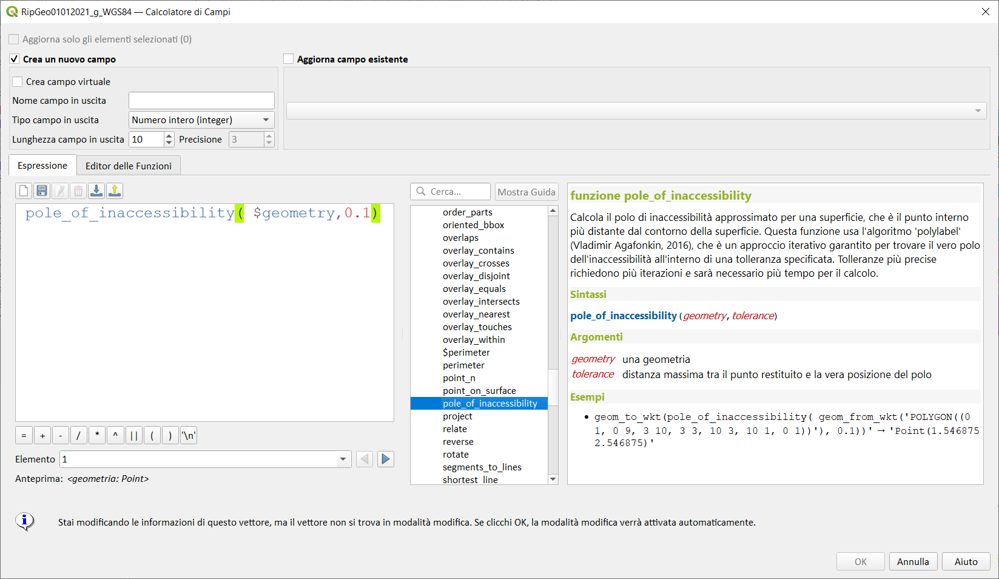

--


---

## project

!!! Note "Definizione"
	**Restituisce un punto proiettato da un punto di partenza usando una distanza e una direzione di immersione (azimut) in radianti.**

Sintassi:

- project(_<span style="color:red;">point</span>_, _<span style="color:red;">distance</span>_, _<span style="color:red;">azimuth</span>_[,_<span style="color:red;">elevation</span>_])

[ ] indica componenti opzionali

Argomenti:

* _<span style="color:red;">point</span>_ punto di partenza
* _<span style="color:red;">point</span>_ distanza da proiettare
* _<span style="color:red;">azimuth</span>_ azimuth in radianti in senso orario, dove 0 corrisponde a nord
* _<span style="color:red;">elevation</span>_ angolo di inclinazione in radianti

!!! Example "Esempi"
	```
	* project(make_point(1, 2), 3, radians(270)) → Point(-2, 2)
	```


--


---

## relate

!!! Note "Definizione"
	**Testa la rappresentazione Dimensional Extended 9 Intersection [Model (DE-9IM)](https://en.wikipedia.org/wiki/DE-9IM) della relazione tra due geometrie.**

### Variabile di relazione

Restituisce la rappresentazione Dimensional Extended 9 Intersection Model (DE-9IM) della relazione tra due geometrie.

Sintassi:

* relate(_<span style="color:red;">geometry</span>_, _<span style="color:red;">geometry</span>_)
)

Argomenti:

* _<span style="color:red;">geometry</span>_ una geometria
* _<span style="color:red;">geometry</span>_ una geometria

!!! Example "Esempi"
	```
	* relate( geom_from_wkt( 'LINESTRING(40 40,120 120)' ), geom_from_wkt( 'LINESTRING(40 40,60 120)' ) ) → 'FF1F00102'
	```


### Variabile di corrispondenza del modello

Testa se la relazione DE-9IM tra due geometrie corrisponde a un pattern specificato: restituisc true Vero, false Falso.

Sintassi:

- relate( _<span style="color:red;">geometry</span>_,  _<span style="color:red;">geometry</span>_,  _<span style="color:red;">pattern</span>_)

Argomenti:

*  _<span style="color:red;">geometry</span>_ una geometria
*  _<span style="color:red;">geometry</span>_ una geometria
*  _<span style="color:red;">pattern</span>_ Tratteggio DE-9IM da far corrispondere

!!! Example "Esempi"
	```
	* relate( geom_from_wkt( 'LINESTRING(40 40,120 120)' ), geom_from_wkt( 'LINESTRING(40 40,60 120)' ), '**1F001**' ) → Vero
	```


Link utili:

* [Wikipedia](https://en.wikipedia.org/wiki/DE-9IM)
* [OpenGeo](https://connect.boundlessgeo.com/docs/suite/4.6/dataadmin/pgAdvanced/de9im.html)

---

## reverse

!!! Note "Definizione"
	**Inverte il verso di una linestring invertendo l'ordine dei sui vertici.**

Sintassi:

- reverse(_<span style="color:red;">geometry</span>_)

Argomenti:

* _<span style="color:red;">geometry</span>_ una geometria

!!! Example "Esempi"
	```
	* geom_to_wkt(reverse(geom_from_wkt('LINESTRING(0 0, 1 1, 2 2)'))) → 'LINESTRING(2 2, 1 1, 0 0)'
	```


--


---

## rotate

!!! Note "Definizione"
	**Restituisce una versione ruotata di una geometria. I calcoli si trovano nel sistema di riferimento spaziale di questa geometria.**

Sintassi:

- rotate( _<span style="color:red;">geometry</span>_, _<span style="color:red;">rotation</span>_[, _<span style="color:red;">center</span>_])

[ ] indica componenti opzionali

Argomenti:

*  _<span style="color:red;">geometry</span>_ una geometria
*  _<span style="color:red;">rotation</span>_ rotazione oraria in gradi
*  _<span style="color:red;">center</span>_ punto centrale di rotazione. Se non specificato, viene utilizzato il centro del perimetro di delimitazione della geometria.

!!! Example "Esempi"
	```
	* rotate($geometry, 45, make_point(4, 5)) → la geometria ruotava di 45 gradi in senso orario attorno al punto (4, 5)
	* rotate($geometry, 45) → la geometria ruotava di 45 gradi in senso orario attorno al centro del riquadro di delimitazione
	```

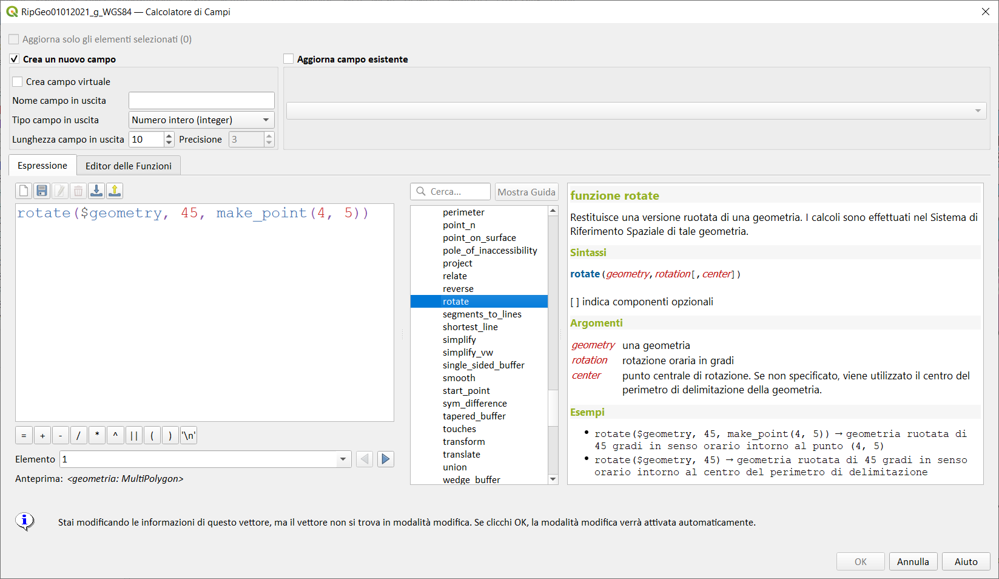


---

## segments_to_lines

!!! Note "Definizione"
	**Restituisce una geometria multi linea consistente in una linea per ogni segmento nella geometria in ingresso.**

Sintassi:

- segments_to_lines( _<span style="color:red;">geometry</span>_)

Argomenti:

*  _<span style="color:red;">geometry</span>_ oggetto geometria

!!! Example "Esempi"
	```
	* geom_to_wkt(segments_to_lines(geom_from_wkt('LINESTRING(0 0, 1 1, 2 2)'))) → 'MultiLineString ((0 0, 1 1),(1 1, 2 2))'
	```


---

## shortest_line

!!! Note "Definizione"
	**Restituisce la linea più corta che unisce la geometria 1 alla geometria 2. La linea risultante partirà dalla geometria 1 e finirà nella geometria 2.**

Sintassi:

- shortest_line( _<span style="color:red;">geometry1</span>_,  _<span style="color:red;">geometry2</span>_)

Argomenti:

* _<span style="color:red;">geometry1</span>_ geometria _dalla_ quale cercare la linea più corta
* _<span style="color:red;">geometry2</span>_ geometria _verso_ la quale cercare la linea più corta

!!! Example "Esempi"
	```
	* geom_to_wkt(shortest_line(geom_from_wkt('LINESTRING (20 80, 98 190, 110 180, 50 75 )'),geom_from_wkt('POINT(100 100)'))) → LineString(73.0769 115.384, 100 100)
	```

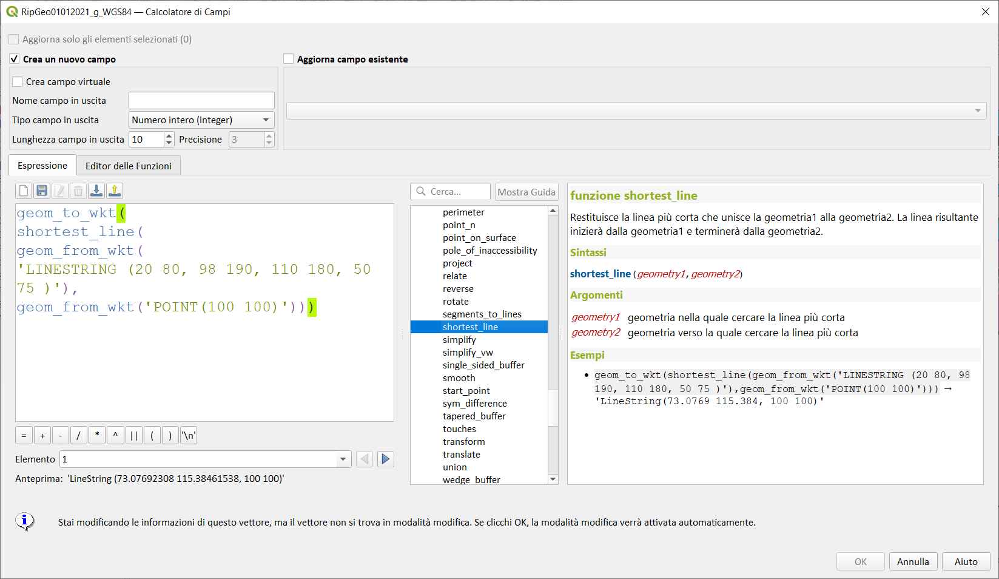

--


[](https://www.youtube.com/watch?v=m2AqZjMZVvQ&list=PLqDFjeQq7NBjz5PWb66PNUqMgN1fce4cu "shortest_line")

---

## simplify

!!! Note "Definizione"
	**Semplifica una geometria rimuovendo nodi usando una soglia basata sulla distanza (cioè, l'algoritmo Douglas Peucker). L'algoritmo mantiene grandi deviazioni nelle geometrie e riduce il numero di vertici in segmenti quasi rettilinei.**

Sintassi:

- simplify(simplify_vw(_<span style="color:red;">geometry</span>, <span style="color:red;">tolerance</span>_)

Argomenti:

* _<span style="color:red;">geometry</span>_ una geometria
* _<span style="color:red;">tolerance</span>_ deviazione massima dai segmenti rettilinei per i punti da rimuovere

!!! Example "Esempi"
	```
	* geom_to_wkt(simplify(geometry:=geom_from_wkt('LineString(0 0, 5 0.1, 10 0)'),tolerance:=5)) → 'LineString(0 0, 10 0)'
	```

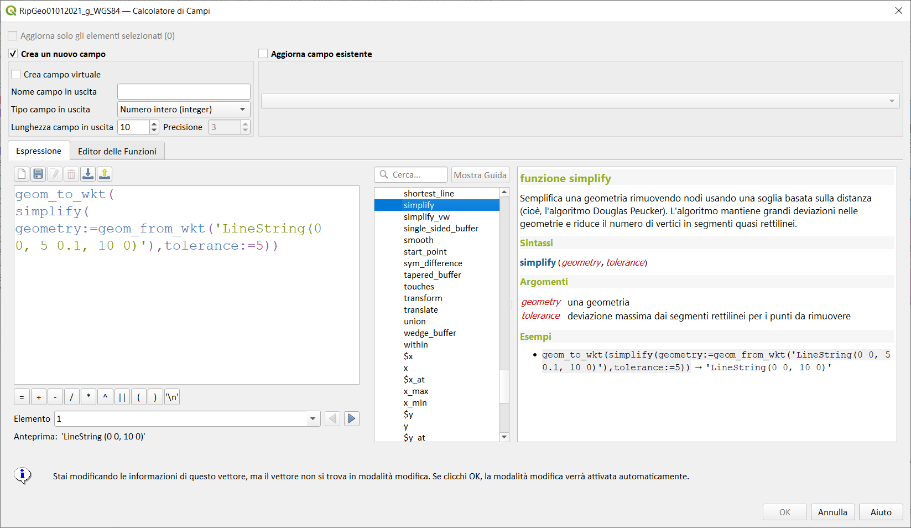

---

## simplify_vw

!!! Note "Definizione"
	**Semplifica una geometria rimuovendo nodi usando una soglia basata sull'area (cioè, l'algoritmo Visvalingam-Whyatt ). L'algoritmo rimuove i vertici che creano piccole aree nelle geometrie, ad esempio picchi stretti o segmenti quasi rettilinei.**

Sintassi:

- simplify_vw(_<span style="color:red;">geometry</span>, <span style="color:red;">tolerance</span>_)

Argomenti:

* _<span style="color:red;">geometry</span>_ una geometria
* _<span style="color:red;">tolerance</span>_ una misura dell'area massima creata da un nodo per il nodo da rimuovere

!!! Example "Esempi"
	```
	* geom_from_wkt('LineString(0 0, 5 0, 5.01 10, 5.02 0, 10 0)'),tolerance:=5)) → 'LineString(0 0, 10 0)'
	```


--


---

## single_sided_buffer

!!! Note "Definizione"
	**Restituisce una geometria formata facendo un buffer solo da un lato di una geometria di tipo linestring. Le distanze sono espresse nel SR di tale geometria.**

Sintassi:

- single_sided_buffer( _<span style="color:red;">geometry</span>_,  _<span style="color:red;">distance</span>_[,  _<span style="color:red;">segments=8</span>_][,  _<span style="color:red;">join=1</span>_][,  _<span style="color:red;">miter_limit=2.0</span>_])

[ ] indica componenti opzionali

Argomenti:

*  _<span style="color:red;">geometry</span>_ una geometria (multi)linestring
*  _<span style="color:red;">distance</span>_ distanza di buffer. Valori positivi saranno bufferizzati a sinistra delle linee, valori negativi a destra
*  _<span style="color:red;">segments</span>_ numero di segmenti da usare per rappresentare un quarto di cerchio quando è utilizzato uno stile di unione arrotondato. Un numero grande risulta in un buffer più morbido, con più nodi.
*  _<span style="color:red;">join</span>_ stile di unione per gli angoli, dove 1 = arrotondato, 2 = seghettato e 3 = smussato
*  _<span style="color:red;">miter_limit</span>_ limite sul rapporto di seghettatura usato per angoli molto appuntiti (solamente quando si usano le unioni seghettate)

!!! Example "Esempi"
	```
	* single_sided_buffer($geometry, 10.5) → linea bufferizzata a sinistra di 10.5 unità
	* single_sided_buffer($geometry, -10.5) → linea bufferizzata a destra di 10.5 unità
	* single_sided_buffer($geometry, 10.5, segments:=16, join:=1) → linea bufferizzata a sinistra di 10.5 unità, usando più segmenti per risultare in un buffer più morbido
	* single_sided_buffer($geometry, 10.5, join:=3) → linea bufferizzata a sinistra di 10.5 unità, usando un'unione smussata
	```

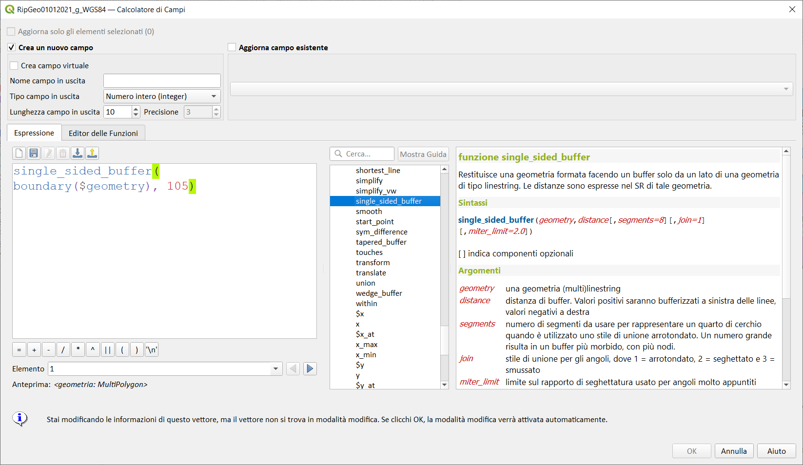

--


---

## smooth

!!! Note "Definizione"
	**Smussa una geometria con l'aggiunta di ulteriori nodi che arrotondano gli angoli nella geometria.**

Sintassi:

- smooth( _<span style="color:red;">geometry</span>_,  _<span style="color:red;">iterations=1</span>_,  _<span style="color:red;">offset=0.25</span>_,  _<span style="color:red;">min_length=1</span>_,  _<span style="color:red;">max_angle=180</span>_)

Argomenti:

*  _<span style="color:red;">geometry</span>_ una geometria
*  _<span style="color:red;">iterations</span>_ Numero di iterazioni di smussatura da applicare. Valori più alti fanno risultare geometria più morbide, ma più complesse.
*  _<span style="color:red;">offset</span>_ valore tra 0 e 0.5 che controlla quanto la geometria smussata segua strettamente la geometria originale. Valori più piccoli risultano in una lisciatura più stretta, valori più grandi risultano in una lisciatura più larga.
*  _<span style="color:red;">min_length</span>_ lunghezza minima dei segmenti ai quali applicare la smussatura. Questo parametro può essere usato per evitare di posizionare nodi aggiuntivi eccessivi nei segmenti più corti della geometria.
*  _<span style="color:red;">max_angle</span>_ angolo massimo (0-180) da applicare al nodo per la smussatura. Abbassando intenzionalmente l'angolo massimo si abbassa l'arrotondamento sugli angoli della geometria. Per esempio, un valore di 80 gradi preserverà l'angolo nella geometria.

!!! Example "Esempi"
	```
	- geom_to_wkt(smooth(geometry:=geom_from_wkt('LineString(0 0, 5 0, 5 5)'),iterations:=1,offset:=0.2,min_length:=-1,max_angle:=180)) → 'LineString (0 0, 4 0, 5 1, 5 5)'
	```

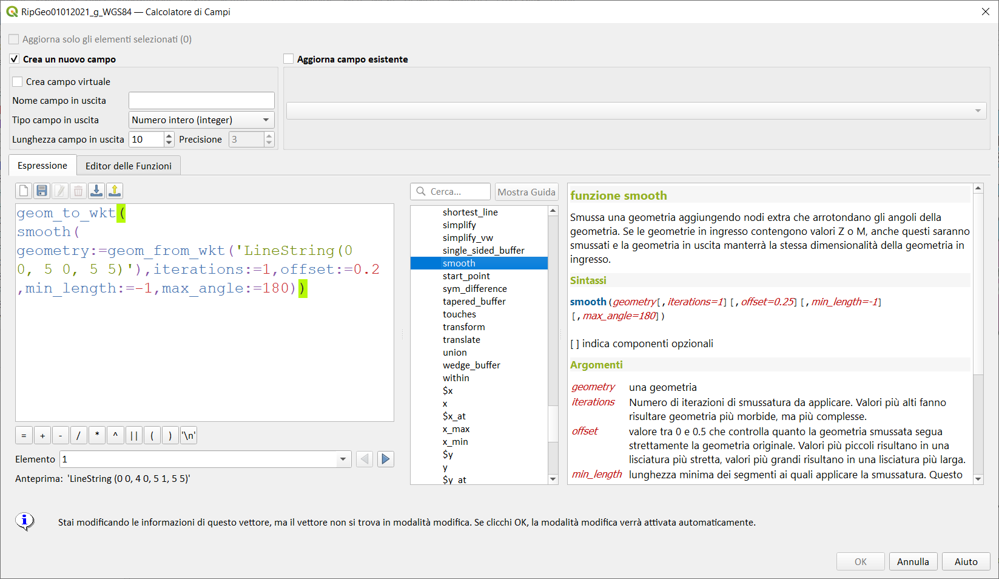

---

## start_point

!!! Note "Definizione"
	**Restituisce il primo nodo di una geometria.**

Sintassi:

- start_point( _<span style="color:red;">geometry</span>_)

Argomenti:

*  _<span style="color:red;">geometry</span>_ oggetto geometria

!!! Example "Esempi"
	```
	* geom_to_wkt(start_point(geom_from_wkt('LINESTRING(4 0, 4 2, 0 2)'))) → 'Point (4 0)'
	```


Start_point di geometria poligonale:


Start_point di geometria lineare:


---

## sym_difference

!!! Note "Definizione"
	**Restituisce una geometria che rappresenta la porzione di due geometrie che non si interseca.**

Sintassi:

- sym_difference( _<span style="color:red;">geometry1</span>_,  _<span style="color:red;">geometry2</span>_)

Argomenti:

*  _<span style="color:red;">geometry1</span>_ una geometria
*  _<span style="color:red;">geometry2</span>_ una geometria

!!! Example "Esempi"
	```
	* geom_to_wkt( sym_difference( geom_from_wkt( 'LINESTRING(3 3, 4 4, 5 5)' ), geom_from_wkt( 'LINESTRING(3 3, 8 8)' ) ) ) → LINESTRING(5 5, 8 8)
	```


!!! Tip "Espressione"
	```
	-- differenza simmetrica tra le due linee
	sym_difference( 
	make_line(  -- linea a
		start_point(geometry(get_feature_by_id('linea_a',0))), 
		start_point($geometry),
		end_point(geometry(get_feature_by_id('linea_a',0)))),
	make_line(  -- linea b
		start_point($geometry), 
		end_point(geometry(get_feature_by_id('linea_a',0))),
		end_point($geometry))
					)
	-- NB: -- l' ordine delle geometrie è indifferente
	```

!!! Question "Prova tu"
	[Dati e progetto qgz](https://github.com/gbvitrano/HfcQGIS/raw/master/prova_tu/DIFFERENCE.zip)

--


---

## tapered_buffer

!!! Note "Definizione"
	**Crea un buffer lungo una geometria della linea in cui il diametro del buffer varia in modo uniforme sulla lunghezza della linea.**

Sintassi:

- tapered_buffer( _<span style="color:red;">geometry</span>_, _<span style="color:red;">start_width</span>_, _<span style="color:red;">end_width</span>_[,_<span style="color:red;">segments=8</span>_]_)

[ ] contrassegna componenti opzionali

Argomenti:

*  _<span style="color:red;">geometry</span>_ input geometry. Deve essere una (multi) geometria della linea.
*  _<span style="color:red;">start_width</span>_ larghezza del buffer all'inizio della linea,
*  _<span style="color:red;">end_width</span>_ larghezza del buffer alla fine della riga.
*  _<span style="color:red;">segments</span>_ numero di segmenti per approssimare le curve del quarto di cerchio nel buffer

!!! Example "Esempi"
	```
	* tapered_buffer(geometry:=geom_from_wkt('LINESTRING(1 2, 4 2)'),start_width:=1,end_width:=2,segments:=8) → Un buffer rastremato che inizia con un diametro di 1 e termina con un diametro di 2 lungo la geometria della linea.
	```

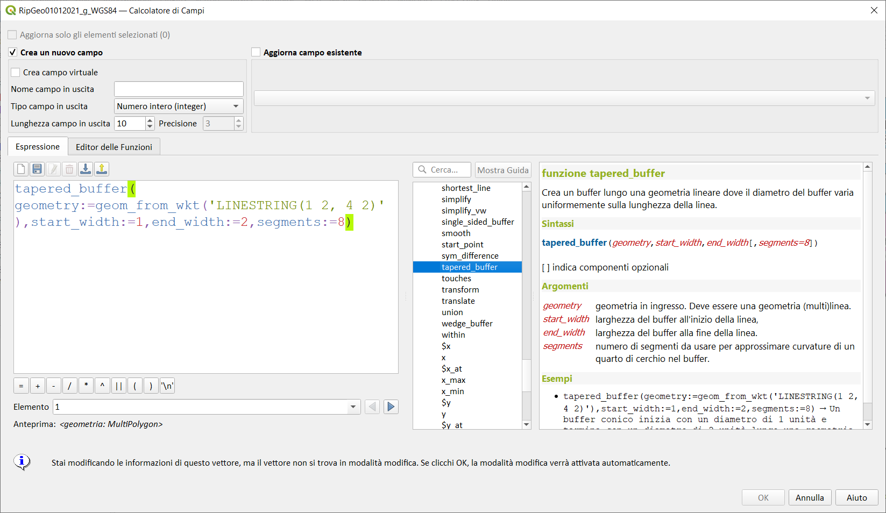

--


[QGIS - feature](https://github.com/qgis/QGIS/pull/6882)

---

## touches

!!! Note "Definizione"
	**Verifica se una geometria tocca un'altra. Restituisce vero (1) se le geometrie hanno almeno un punto in comune, ma i loro interni non si intersecano.**

Sintassi:

- touches( _<span style="color:red;">geometry1</span>_,  _<span style="color:red;">geometry2</span>_)

Argomenti:

* _<span style="color:red;">geometry1</span>_ una geometria
* _<span style="color:red;">geometry2</span>_ una geometria

!!! Example "Esempi"
	```
	* touches( geom_from_wkt( 'LINESTRING(5 3, 4 4)' ), geom_from_wkt( 'LINESTRING(3 3, 4 4, 5 5)' ) ) → 1
	* touches( geom_from_wkt( 'POINT(4 4)' ), geom_from_wkt( 'POINT(5 5)' ) ) → 0
	```


Nota bene:

--

!!! Info "Osservazioni"	
	Usando algoritmo `Seleziona per espressione` presente in strumenti di processing oppure  (Ctrl+F3):
	```
	- touches(geometry(get_feature( 'province_rt_rt','pk_uid','46')),$geometry)
	```

dove:

* _geometry1_ è `geometry(get_feature( 'province_rt_rt','pk_uid','52'))`
* _geometry2_ è `$geometry`


seleziono tutti i comuni `touches` (toccati) dalla provincia con `pk_uid`46 (Siena)

**PS:** potrei anche negare (`NOT`) l'espressione per selezionare il complementare (tutti i comuni tranne quelli toccati dalla provincia di Siena).

`NOT touches(geometry(get_feature( 'province_rt_rt','pk_uid','52')),$geometry)`


---

## transform

!!! Note "Definizione"
	**Restituisce la geometria trasformata da un SR sorgente ad un SR di destinazione.**

Sintassi:

- transform( _<span style="color:red;">geometry</span>_,  _<span style="color:red;">source_auth_id</span>_,  _<span style="color:red;">dest_auth_id</span>_)

Argomenti:

*  _<span style="color:red;">geometry</span>_ una geometria
*  _<span style="color:red;">source_auth_id</span>_ ID del SR sorgente
*  _<span style="color:red;">dest_auth_id</span>_ ID del SR destinazione

!!! Example "Esempi"
	```
	* geom_to_wkt( transform( $geometry, 'EPSG:2154', 'EPSG:4326' ) ) → POINT(0 51)
	```

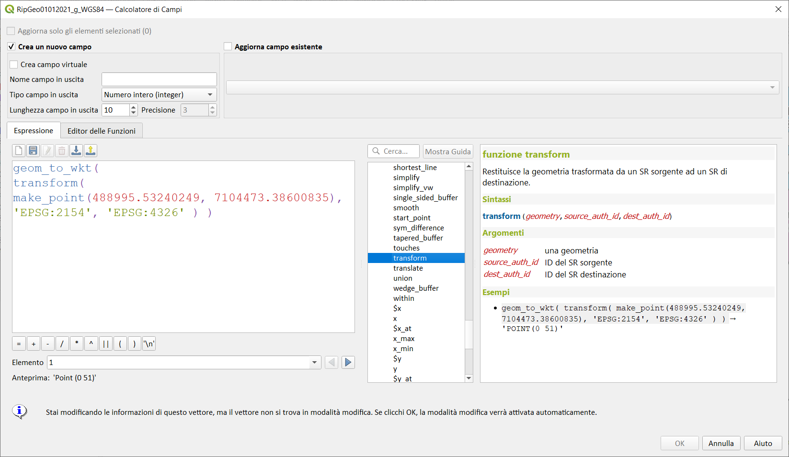

--


---

## translate

!!! Note "Definizione"
	**Restituisce una versione traslata di una geometria. I calcoli sono effettuati nel sistema di riferimento spaziale di tale geometria.**

Sintassi:

- translate( _<span style="color:red;">geometry</span>_,  _<span style="color:red;">dx</span>_,  _<span style="color:red;">dy</span>_)

Argomenti:

* _<span style="color:red;">geometry</span>_ una geometria
* _<span style="color:red;">dx</span>_ delta x
* _<span style="color:red;">geomdyetry</span>_ delta y

!!! Example "Esempi"
	```
	* translate($geometry, 5, 10) → una geometria dello stesso tipo come l'originale
	```

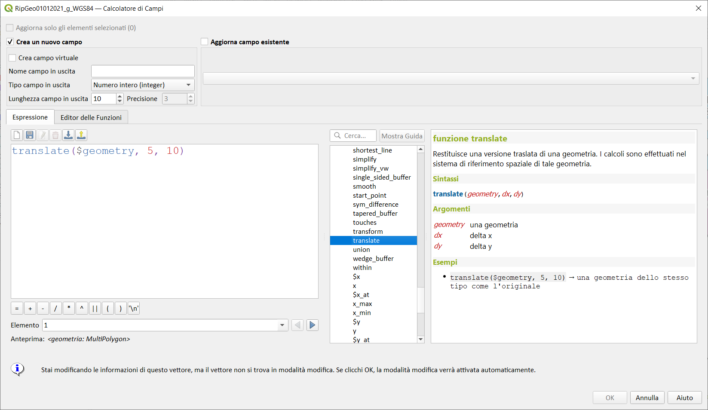

--


---

## union

!!! Note "Definizione"
	**Restituisce una geometria che rappresenta l'insieme dei punti dell'unione delle geometrie.**

Sintassi:

- union( _<span style="color:red;">geometry1</span>_,  _<span style="color:red;">geometry2</span>_)

Argomenti:

*  _<span style="color:red;">geometry1</span>_ una geometria
*  _<span style="color:red;">geometry2</span>_ una geometria

!!! Example "Esempi"
	```
	* geom_to_wkt( union( geom_from_wkt( 'POINT(4 4)' ), geom_from_wkt( 'POINT(5 5)' ) ) ) → MULTIPOINT(4 4, 5 5)
	```

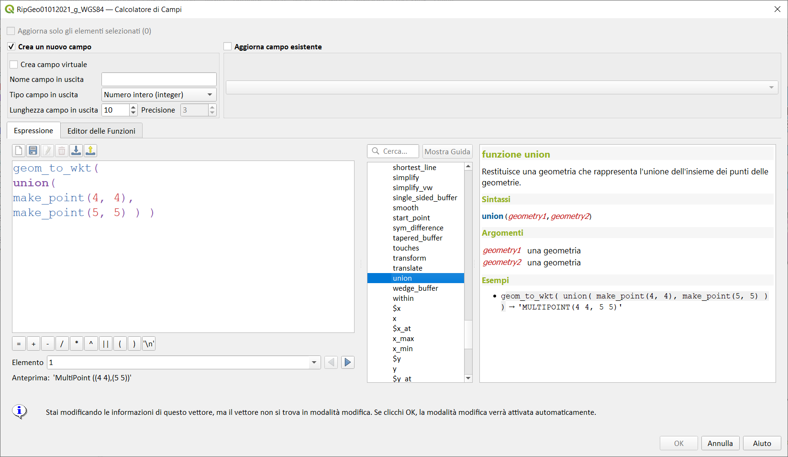


!!! Tip "Espressione"
	```
	-- unione delle due linee
	union( 
	make_line(  -- linea a
		start_point(geometry(get_feature_by_id('linea_a',0))), 
		start_point($geometry),
		end_point(geometry(get_feature_by_id('linea_a',0)))),
	make_line(  -- linea b
		start_point($geometry), 
		end_point(geometry(get_feature_by_id('linea_a',0))),
		end_point($geometry))
					)
	-- NB: -- l' ordine delle geometrie è indifferente
	```

!!! Question "Prova tu"
	[Dati e progetto qgz](https://github.com/gbvitrano/HfcQGIS/raw/master/prova_tu/DIFFERENCE.zip)

--


---

## wedge_buffer

!!! Note "Definizione"
	**Restituisce un buffer a forma di cuneo che origina da una geometria del punto.**

Sintassi:

- wedge_buffer( _<span style="color:red;">geometry</span>_, _<span style="color:red;">azimuth</span>_, _<span style="color:red;">width</span>_, _<span style="color:red;">outer_radius</span>_[,_<span style="color:red;">inner_radius=0.0</span>_])

[ ] contrassegna componenti opzionali

Argomenti:

*  _<span style="color:red;">geometry</span>_ punto centrale (origine) del buffer. Deve essere una geometria puntuale.
*  _<span style="color:red;">azimuth</span>_  (in gradi) per il centro del cuneo da puntare.
*  _<span style="color:red;">width</span>_ buffer w larghezza (in gradi). Si noti che il cuneo si estenderà fino a metà della larghezza angolare su entrambi i lati della direzione dell'azimut.
*  _<span style="color:red;">outer_radius</span>_ raggio esterno per i buffers
*  _<span style="color:red;">inner_radius</span>_ raggio interno opzionale per i buffers

!!! Example "Esempi"
	```
	* wedge_buffer(center:=geom_from_wkt('POINT(1 2)'),azimuth:=90,width:=180,outer_radius:=1) → Un buffer a forma di cuneo centrato sul punto (1,2), rivolto verso est, con una larghezza di 180 gradi e raggio esterno di 1.
	```


--


---

## within

!!! Note "Definizione"
	**Controlla qualora una geometria sia interna ad un'altra. Restituisce  1 (vero) se la _geometria a_ è completamente contenuta nella_ geometria b_.**

Sintassi:

- within( _<span style="color:red;">geometry1</span>_,  _<span style="color:red;">geometry2</span>_)

Argomenti:

* _<span style="color:red;">geometry1</span>_ una geometria
* _<span style="color:red;">geometry2</span>_ una geometria

!!! Example "Esempi"
	```
	* within( geom_from_wkt( 'POINT( 0.5 0.5)' ), geom_from_wkt( 'POLYGON((0 0, 0 1, 1 1, 1 0, 0 0))' ) ) → 1
	* within( geom_from_wkt( 'POINT( 5 5 )' ), geom_from_wkt( 'POLYGON((0 0, 0 1, 1 1, 1 0, 0 0 ))' ) ) → 0
	```


!!! Info "Osservazioni"
	Usando algoritmo `Seleziona per espressione` presente in strumenti di processing oppure  (Ctrl+F3):
	```
	- within($geometry,geometry(get_feature( 'province_rt_rt','pk_uid','53')))
	```
dove:

* _geometry1_ è `$geometry`
* _geometry2_ è `geometry(get_feature( 'province_rt_rt','pk_uid','53'))`


seleziono tutti i comuni `within` (contenuti) nella provincia con `pk_uid`53 (Grosseto)

**PS:** potrei anche negare (`NOT`) l'espressione per selezionare il complementare (tutti i comuni tranne quelli contenuti nella provincia di Grosseto).

`NOT within($geometry,geometry(get_feature( 'province_rt_rt','pk_uid','53')))`

Altro esempio con condizione sulle etichette

!!! Tip "Espressione"
	```
	CASE WHEN within( $geometry,
	geometry(get_feature('poligono','id',1))) = 1
	THEN 'INTERNO'
	ELSE 'NON INTERNO'
	END
	```


---

## x

!!! Note "Definizione"
	**Restituisce la minima coordinata x di una geometria punto, o la coordinata x del centroide di una geometria non puntuale.**

Sintassi:

- x( _<span style="color:red;">geometry</span>_)

Argomenti:

*  _<span style="color:red;">geometry</span>_ una geometria

!!! Example "Esempi"
	```
	* x( geom_from_wkt( 'POINT(2 5)' ) ) → 2
	* x( $geometry ) → coordinata x del centroide dell'elemento corrente
	```


--


---

## x_max

!!! Note "Definizione"
	**Restituisce la coordinata x massima di una geometria. I calcoli sono effettuati nel sistema di riferimento spaziale di tale geometria.**

Sintassi:

- x_max( _<span style="color:red;">geometry</span>_)

Argomenti:

*  _<span style="color:red;">geometry</span>_ una geometria

!!! Example "Esempi"
	```
	* x_max( geom_from_wkt( 'LINESTRING(2 5, 3 6, 4 8)') ) → 4
	```

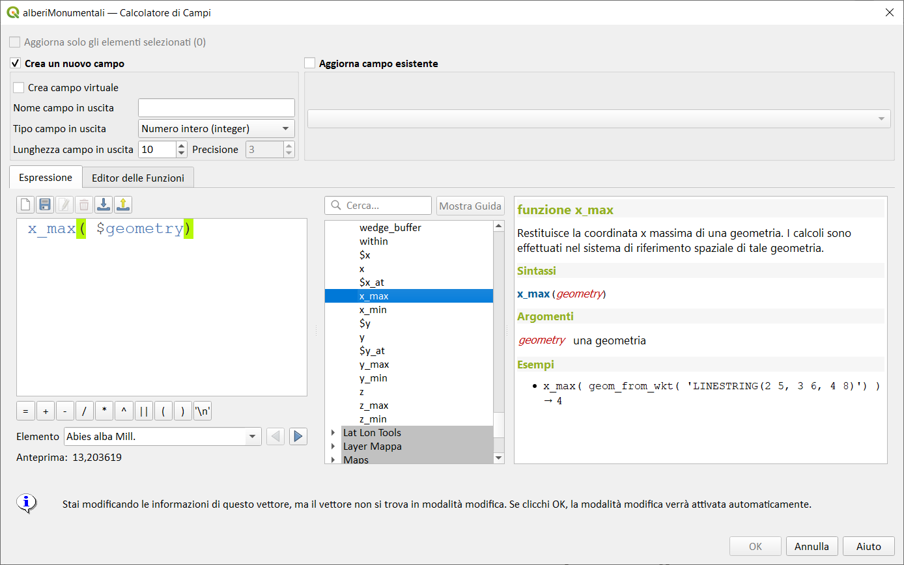

--


---

## x_min

!!! Note "Definizione"
	**Restituisce la coordinata x minima di una geometria. I calcoli sono effettuati nel sistema di riferimento spaziale di tale geometria.**

Sintassi:

- x_min( _<span style="color:red;">geometry</span>_)

Argomenti:

*  _<span style="color:red;">geometry</span>_ una geometria

!!! Example "Esempi"
	```
	* x_min( geom_from_wkt( 'LINESTRING(2 5, 3 6, 4 8)') ) → 2
	```

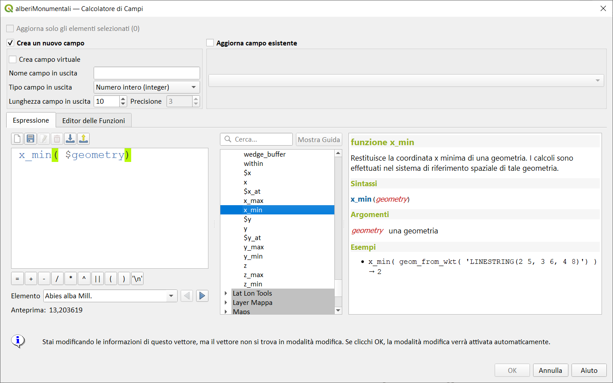

--


---

## y

!!! Note "Definizione"
	**Restituisce la coordinata y minima di una geometria puntuale, o la coordinata y del centroide di una geometria non puntuale.**

Sintassi:

- y( _<span style="color:red;">geometry</span>_)

Argomenti:

*  _<span style="color:red;">geometry</span>_ una geometria

!!! Example "Esempi"
	```
	* y( geom_from_wkt( 'POINT(2 5)' ) ) → 5
	* y( $geometry ) → coordinata y del centroide dell'elemento corrente
	```

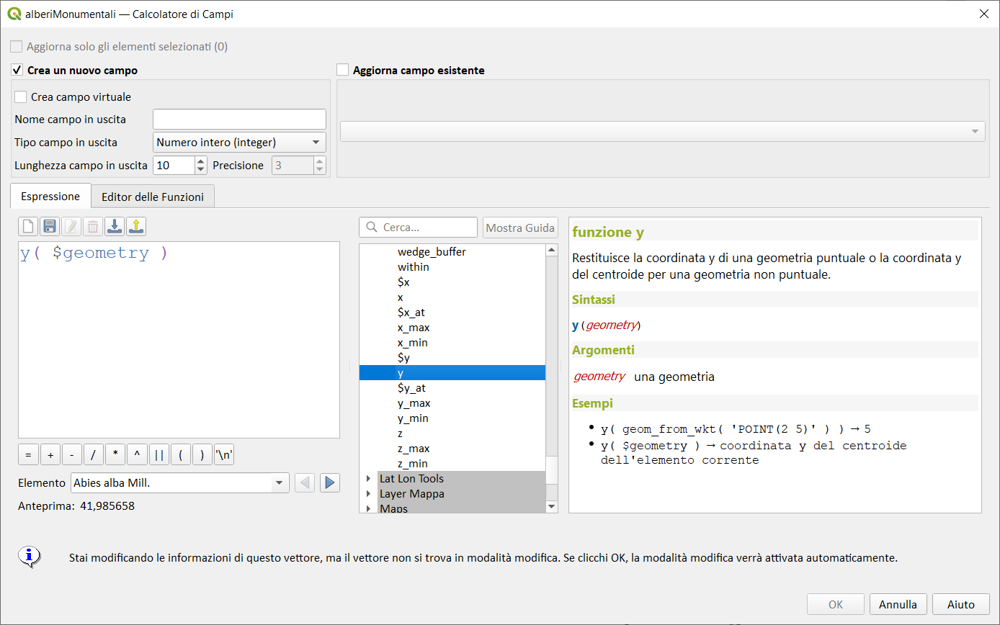

--


---

## y_max

!!! Note "Definizione"
	**Restituisce la coordinata y massima di una geometria. I calcoli sono effettuati nel sistema di riferimento spaziale di tale geometria.**

Sintassi:

- y_max( _<span style="color:red;">geometry</span>_)

Argomenti:

* _<span style="color:red;">geometry</span>_ una geometria

!!! Example "Esempi"
	```
	* y_max( geom_from_wkt( 'LINESTRING(2 5, 3 6, 4 8)') ) → 8
	```


--


---

## y_min

!!! Note "Definizione"
	**Restituisce la coordinata y minima di una geometria. I calcoli sono effettuati nel sistema di riferimento spaziale di tale geometria.**

Sintassi:

- y_min( _<span style="color:red;">geometry</span>_)

Argomenti:

*  _<span style="color:red;">geometry</span>_ una geometria

!!! Example "Esempi"
	```
	* y_min( geom_from_wkt( 'LINESTRING(2 5, 3 6, 4 8)') ) → 5
	```

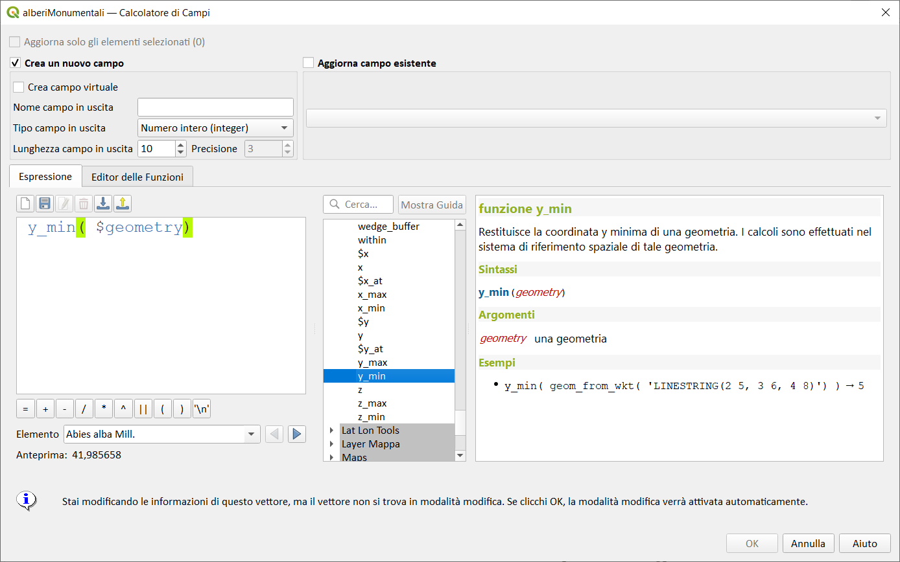

--


---

## z

!!! Note "Definizione"
	**Restituisce la coordinata z di una geometria puntuale.**

Sintassi:

- z( _<span style="color:red;">geometry</span>_)

Argomenti:

*  _<span style="color:red;">geometry</span>_ una geometria punto

!!! Example "Esempi"
	```
	* z( geom_from_wkt( 'POINTZ(2 5 7)' ) ) → 7
	```

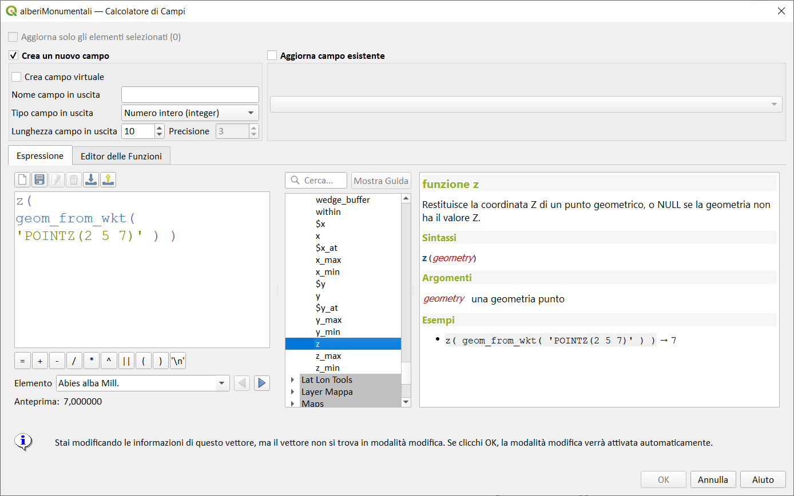

---

## z_max

!!! Note "Definizione"
	**Restituisce la coordinata z massima di una geometria.**

Sintassi:

* z_max( _<span style="color:red;">geometry</span>_)

Argomenti:

*  _<span style="color:red;">geometry</span>_ una geometria con z coordinata

!!! Example "Esempi"
	```
	* z_max( geom_from_wkt( 'POINT ( 0 0 1 )' ) ) → 1
	* z_max( geom_from_wkt( 'MULTIPOINT ( 0 0 1 , 1 1 3 )' ) ) → 3
	* z_max( make_line( make_point( 0,0,0 ), make_point( -1,-1,-2 ) ) ) → 0
	* z_max( geom_from_wkt( 'LINESTRING( 0 0 0, 1 0 2, 1 1 -1 )' ) ) → 2
	* z_max( geom_from_wkt( 'POINT ( 0 0 )' ) ) → NULL
	```


---

## z_min

!!! Note "Definizione"
	**Restituisce la coordinata z minima di una geometria.**

Sintassi:

* z_min( _<span style="color:red;">geometry</span>_)

Argomenti:

*  _<span style="color:red;">geometry</span>_ una geometria con z coordinata

!!! Example "Esempi"
	```
	* z_min( geom_from_wkt( 'POINT ( 0 0 1 )' ) ) → 1
	* z_min( geom_from_wkt( 'MULTIPOINT ( 0 0 1 , 1 1 3 )' ) ) → 1
	* z_min( make_line( make_point( 0,0,0 ), make_point( -1,-1,-2 ) ) ) → -2
	* z_min( geom_from_wkt( 'LINESTRING( 0 0 0, 1 0 2, 1 1 -1 )' ) ) → -1
	* z_min( geom_from_wkt( 'POINT ( 0 0 )' ) ) → NULL
	```

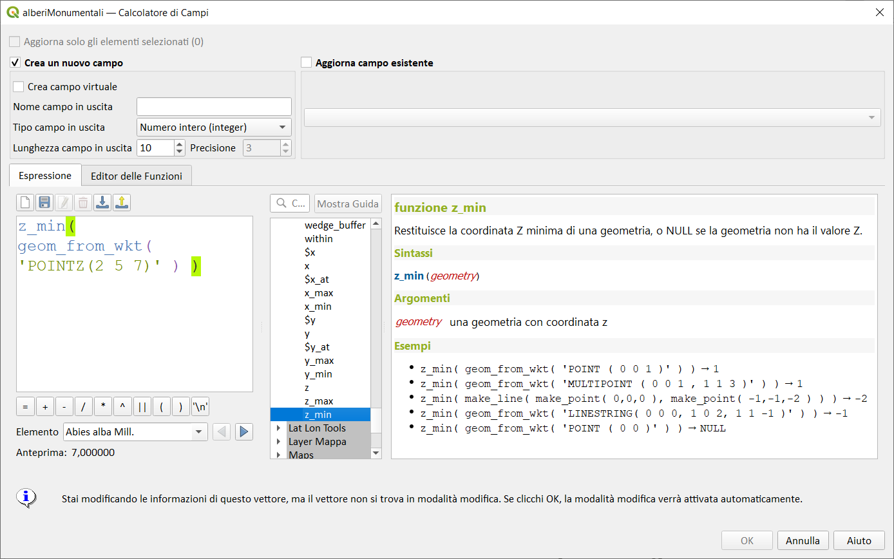
