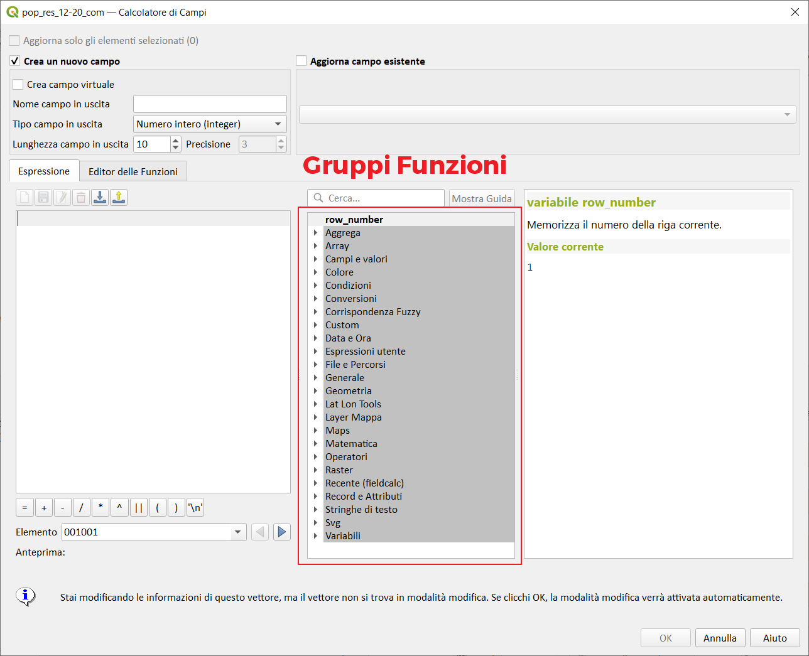

# Gruppi funzioni

Nell'Interfaccia del **Field Calc** (e nel costruttore di espressione) è presente, nella parte centrale, una sezione che raccoglie i Gruppi delle Funzioni elencate sotto:

Gruppo funzioni|nro funzioni*|Descrizione   | info
---------------|:-----------:|--------------|-----
[**Aggrega**](./aggrega/aggrega_unico.md) |(23/23)|Contiene funzioni che aggregano valori nei livelli e campi.| >= **QGIS 2.16** 
[**Array**](./array/array_unico.md)| (35/35) |Questo gruppo contiene funzioni espressione per la creazione e la manipolazione di array (noti anche come strutture dati ad elenco). L'ordine dei valori all'interno dell'array è importante, al contrario della struttura dati 'a mappa', in cui l'ordine delle coppie chiave-valore è irrilevante e i valori vengono identificati dalle loro chiavi.|aggiornate a  **QGIS 3.20**
[**Campi e valori**](./campi_e_valori/campi_e_valori_unico.md)| (1/1)|Contiene un elenco di campi del layer. Si possono ottenere valori campione con il click del tasto destro del mouse. Seleziona il nome del campo dall'elenco e fai click con il tasto destro per aprire il menù con le opzioni per caricare un campione di valori dal campo selezionato. | Elenco dei campi del layer selezionato
[**Colore**](./colore/colore_unico.md)| (17/17)|Questo gruppo contiene funzioni per manipolare i colori| Per manipolare i colori
[**Condizioni**](./condizioni/condizioni_unico.md)| (6/6)|Questo gruppo contiene funzioni per gestire controlli condizionali nelle espressioni.|aggiornate a  **QGIS 3.6**
[**Conversioni**](./conversioni/conversioni_unico.md)| (15/15)|Questo gruppo contiene funzioni per convertire i dati da un tipo ad un altro, es. da stringa a intero, da intero a stringa.|aggiornate a  **QGIS 3.16**
[**Corrispondenza Fuzzy**](./corrispondenza_fuzzy/corrispondenza_fuzzy_unico.md)| (4/4)| Questo gruppo contiene funzioni per confronti fuzzy fra valori.|funzioni per confronti fuzzy fra valori
[**Custom**](./custom/custom_unico.md)| (12/12)| Questo gruppo contiene funzioni Python create in modo personalizzato dall'utente.|funzioni personalizzate
[**Data ora**](./data_ora/data_ora_unico.md) |(21/21)|Questo gruppo contiene funzioni per gestire dati con date e ore.|aggiornate a  **QGIS 3.14**
[**Espressioni utente**](./espressione_utente/espressione_utente_unico.md)| (?)|Questo gruppo contiene espressioni memorizzate nel profilo utente.|aggiornate a  **QGIS 3.12**
[**File e percorsi**](./file_e_percorsi/file_e_percorsi_unico.md)| (9/9)|Contiene funzioni che manipolano nomi di file e di percorsi. manipolano nomi di file e di percorsi | aggiornate a  **QGIS 3.22**
[**Generale**](./generale/generale_unico.md)| (7/7)|Questo gruppo contiene funzioni generali assortite.| assortimento di funzioni generiche
[**Geometria**](./geometria/geometria_unico.md) |(131/129)|Questo gruppo contiene funzioni che operano sugli oggetti geometrici es. lunghezza, area.| aggiornate a  **QGIS 3.22**
[**Layer mappa**](./layer_mappa/layer_mappa_unico.md)| (2/2)|Contiene due funzioni e la lista dei layer della mappa che sono disponibili nel progetto corrente con possibilità di leggere[^1] i nomi e valori degli attributi.| aggiornate a  **QGIS 3.6**
[**Layout**](./layout/layout_unico.md)| (2/2)|  Visibile solo nel layout di stampa
[**Maps**](./maps/maps_unico.md)| (12/12) |Questo gruppo contiene funzioni per la creazione e la manipolazione di strutture di dati 'a mappa' (noti anche come oggetti dizionario, coppie chiave-valore o array associative). Si possono assegnare valori a determinate chiavi. L'ordine delle coppie chiave-valore nell'oggetto mappa non è rilevante.|>= **QGIS 3.0** aggiornate a  **QGIS 3.6**
[**Matematica**](./matematica/matematica_unico.md)| (28/28)|Questo gruppo contiene funzioni matematiche es. radice quadrata, seno e coseno|aggiornate a  **QGIS 3.12**
[**Operatori**](./operatori/operatori_unico.md)| (23/23)|Questo gruppo contiene operatori es. + - *|aggiornate a  **QGIS 3.20**
[**Raster**](./rasters/rasters_unico.md)|(2/2)|Contiene funzioni che calcolano statistiche e valori raster.|>= **QGIS 3.4** 
[**Recente**](./recente/recente.md) |(1/1)| Elenca le ultime 20 espressioni utilizzate
[**Record e attributi**](./record_e_attributi/record_e_attributi_unico.md)| (13/13)|Questo gruppo contiene funzioni che operano sugli identificativi dei record.|aggiornate a  **QGIS 3.18**
[**Relazioni**](./relazioni/relazioni_unico.md)| (?)| Visibile solo se ci sono relazioni di progetto
[**Stringhe di testo**](./stringhe_di_testo/stringhe_di_testo_unico.md)|(23/23)| Questo gruppo contiene le funzioni che operano sulle stringhe es. sostituzione, conversione in maiuscolo.|aggiornate a  **QGIS 3.14**
[**Variabili**](./variabili/variabili.md) |(4/65+) |Questo gruppo contiene variabili dinamiche che possono essere inserite nelle tue espressioni.|>= **QGIS 2.12** - variano in funzione del contesto

\* i numeri tra parentesi rappresentano: `(numero funzioni documentate / numero funzioni nel gruppo)`

[^1]: >= QGIS 3.24