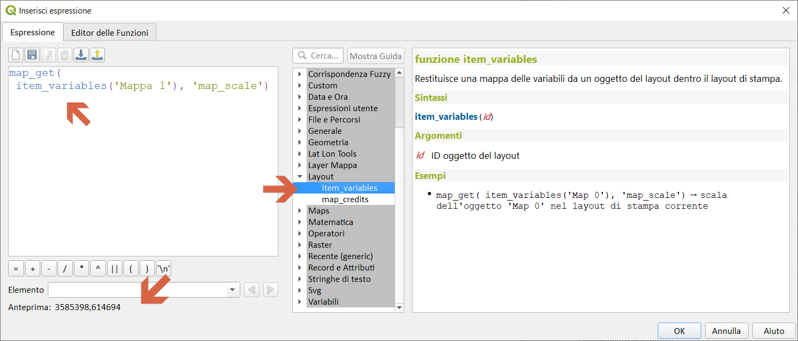

# Gruppo layout

!!! Abstract
    **Questo gruppo contiene funzioni per manipolare le proprietà degli _<span style="color:red;">oggetti del layout di stampa</span>_.**

---

## item_variables

Restituisce una mappa delle variabili da un oggetto del layout dentro il layout di stampa.

Sintassi:

- item_variables(_<span style="color:red;">id</span>_)

Argomenti:

- _<span style="color:red;">id</span>_ ID oggetto del layout

Esempi:

```
map_get( item_variables('Map 0'), 'map_scale') → scala dell'oggetto 'Map 0' nel layout di stampa corrente
```

[](../../img/layout/item_variables.png)

---

## map_credits

Restituisce un elenco di stringhe di credito (diritti di utilizzo) per i layer visualizzati in un oggetto della mappa di layout.

Sintassi:

- map_credits_<span style="color:red;">_id</span>_[,_<span style="color:red;">include_layer_names=false</span>_][,_<span style="color:red;">layer_name_separator=': '</span>_])

[ ] indica componenti opzionali

Argomenti:

- _<span style="color:red;">id</span>_ ID oggetto mappa
- _<span style="color:red;">include_layer_names</span>_ Imposta su vero per includere i nomi dei layer prima delle rispettive stringhe di credito
- _<span style="color:red;">layer_name_separator</span>_ Stringa da inserire tra i nomi dei layer e le rispettive stringhe di credito, se include_layer_names è vero

Esempi:

```
array_to_string( map_credits( 'Main Map' ) ) → lista separata da virgola di crediti layer per i layer mostrati nell'oggetto di layout 'Mappa principale', ad esempio 'CC-BY-NC, CC-BY-SA'

array_to_string( map_credits( 'Main Map', include_layer_names := true, layer_name_separator := ': ' ) ) → lista separata da virgola di nomi di layer e relativi crediti per i layer mostrati nell'oggetto di layout 'Mappa principale', ad es 'Linee ferroviarie: CC-BY-NC, mappa di base: CC-BY-SA'
```

[](../../img/layout/map_credits1.png)
