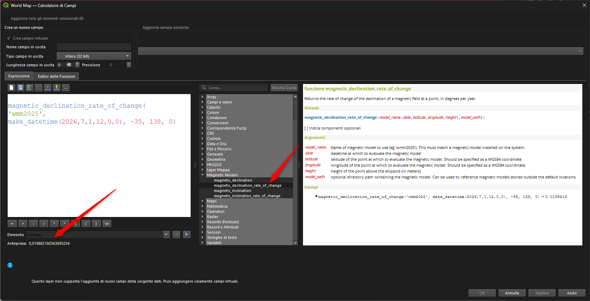
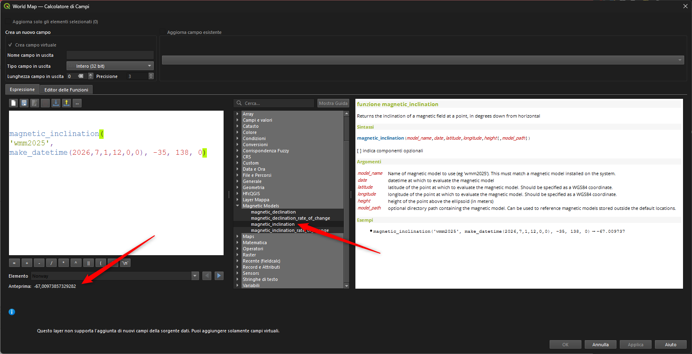
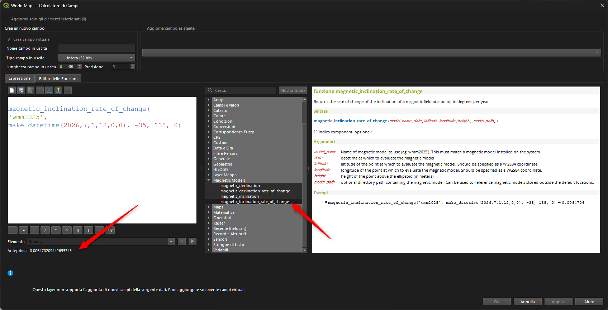

# Gruppo Magnetico

!!! Abstract
    **Questo gruppo contiene funzioni per lavorare con i modelli di campo magnetico terrestre.**

[NB:](https://github.com/qgis/QGIS/issues/65033#issuecomment-3940603146) I modelli non sono inclusi nel pacchetto QGIS: è necessario scaricarli manualmente (e quindi utilizzare il percorso completo del modello nella funzione di espressione o installarlo in C:/ProgramData/GeographicLib/magnetic).

---

## magnetic_declination

Restituisce la declinazione del campo magnetico in un punto, in gradi a est del nord.

Sintassi:

- magnetic_declination(_<span style="color:red;">model_name</span>_, _<span style="color:red;">date</span>_, _<span style="color:red;">latitude</span>_, _<span style="color:red;">longitude</span>_, _<span style="color:red;">height</span>_[,_<span style="color:red;">model_path</span>_])

[ ] indica componenti opzionali

Argomenti:

- _<span style="color:red;">model_name</span>_ nome del modello magnetico da utilizzare (es. `'wmm2025'`). Deve corrispondere a un modello magnetico installato nel sistema.
- _<span style="color:red;">date</span>_ data e ora in cui valutare il modello magnetico
- _<span style="color:red;">latitude</span>_ latitudine del punto in cui valutare il modello magnetico. Deve essere specificata come coordinata WGS84.
- _<span style="color:red;">longitude</span>_ longitudine del punto in cui valutare il modello magnetico. Deve essere specificata come coordinata WGS84.
- _<span style="color:red;">height</span>_ altezza del punto sopra l'ellissoide (in metri)
- _<span style="color:red;">model_path</span>_ percorso di directory opzionale contenente il modello magnetico. Può essere utilizzato per fare riferimento a modelli magnetici memorizzati al di fuori delle posizioni predefinite.

Esempi:

```
magnetic_declination('wmm2025', make_datetime(2026,7,1,12,0,0), -35, 138, 0) → 7.873899
```

[](../../img/magnetic_models/magnetic_declination.png)

Feature introdotta a partire da **QGIS 4.0**

---

## magnetic_declination_rate_of_change

Restituisce la velocità di variazione della declinazione del campo magnetico in un punto, in gradi per anno.

Sintassi:

- magnetic_declination_rate_of_change(_<span style="color:red;">model_name</span>_, _<span style="color:red;">date</span>_, _<span style="color:red;">latitude</span>_, _<span style="color:red;">longitude</span>_, _<span style="color:red;">height</span>_[,_<span style="color:red;">model_path</span>_])

[ ] indica componenti opzionali

Argomenti:

- _<span style="color:red;">model_name</span>_ nome del modello magnetico da utilizzare (es. `'wmm2025'`). Deve corrispondere a un modello magnetico installato nel sistema.
- _<span style="color:red;">date</span>_ data e ora in cui valutare il modello magnetico
- _<span style="color:red;">latitude</span>_ latitudine del punto in cui valutare il modello magnetico. Deve essere specificata come coordinata WGS84.
- _<span style="color:red;">longitude</span>_ longitudine del punto in cui valutare il modello magnetico. Deve essere specificata come coordinata WGS84.
- _<span style="color:red;">height</span>_ altezza del punto sopra l'ellissoide (in metri)
- _<span style="color:red;">model_path</span>_ percorso di directory opzionale contenente il modello magnetico. Può essere utilizzato per fare riferimento a modelli magnetici memorizzati al di fuori delle posizioni predefinite.

Esempi:

```
magnetic_declination_rate_of_change('wmm2025', make_datetime(2026,7,1,12,0,0), -35, 138, 0) → 0.0198816
```

[](../../img/magnetic_models/magnetic_declination_rate_of_change.png)

Feature introdotta a partire da **QGIS 4.0**

---

## magnetic_inclination

Restituisce l'inclinazione del campo magnetico in un punto, in gradi verso il basso rispetto all'orizzontale.

Sintassi:

- magnetic_inclination(_<span style="color:red;">model_name</span>_, _<span style="color:red;">date</span>_, _<span style="color:red;">latitude</span>_, _<span style="color:red;">longitude</span>_, _<span style="color:red;">height</span>_[,_<span style="color:red;">model_path</span>_])

[ ] indica componenti opzionali

Argomenti:

- _<span style="color:red;">model_name</span>_ nome del modello magnetico da utilizzare (es. `'wmm2025'`). Deve corrispondere a un modello magnetico installato nel sistema.
- _<span style="color:red;">date</span>_ data e ora in cui valutare il modello magnetico
- _<span style="color:red;">latitude</span>_ latitudine del punto in cui valutare il modello magnetico. Deve essere specificata come coordinata WGS84.
- _<span style="color:red;">longitude</span>_ longitudine del punto in cui valutare il modello magnetico. Deve essere specificata come coordinata WGS84.
- _<span style="color:red;">height</span>_ altezza del punto sopra l'ellissoide (in metri)
- _<span style="color:red;">model_path</span>_ percorso di directory opzionale contenente il modello magnetico. Può essere utilizzato per fare riferimento a modelli magnetici memorizzati al di fuori delle posizioni predefinite.

Esempi:

```
magnetic_inclination('wmm2025', make_datetime(2026,7,1,12,0,0), -35, 138, 0) → -67.009737
```

[](../../img/magnetic_models/magnetic_inclination.png)

Feature introdotta a partire da **QGIS 4.0**

---

## magnetic_inclination_rate_of_change

Restituisce la velocità di variazione dell'inclinazione del campo magnetico in un punto, in gradi per anno.

Sintassi:

- magnetic_inclination_rate_of_change(_<span style="color:red;">model_name</span>_, _<span style="color:red;">date</span>_, _<span style="color:red;">latitude</span>_, _<span style="color:red;">longitude</span>_, _<span style="color:red;">height</span>_[,_<span style="color:red;">model_path</span>_])

[ ] indica componenti opzionali

Argomenti:

- _<span style="color:red;">model_name</span>_ nome del modello magnetico da utilizzare (es. `'wmm2025'`). Deve corrispondere a un modello magnetico installato nel sistema.
- _<span style="color:red;">date</span>_ data e ora in cui valutare il modello magnetico
- _<span style="color:red;">latitude</span>_ latitudine del punto in cui valutare il modello magnetico. Deve essere specificata come coordinata WGS84.
- _<span style="color:red;">longitude</span>_ longitudine del punto in cui valutare il modello magnetico. Deve essere specificata come coordinata WGS84.
- _<span style="color:red;">height</span>_ altezza del punto sopra l'ellissoide (in metri)
- _<span style="color:red;">model_path</span>_ percorso di directory opzionale contenente il modello magnetico. Può essere utilizzato per fare riferimento a modelli magnetici memorizzati al di fuori delle posizioni predefinite.

Esempi:

```
magnetic_inclination_rate_of_change('wmm2025', make_datetime(2026,7,1,12,0,0), -35, 138, 0) → 0.0064706
```

[](../../img/magnetic_models/magnetic_inclination_rate_of_change.png)

Feature introdotta a partire da **QGIS 4.0**

---
