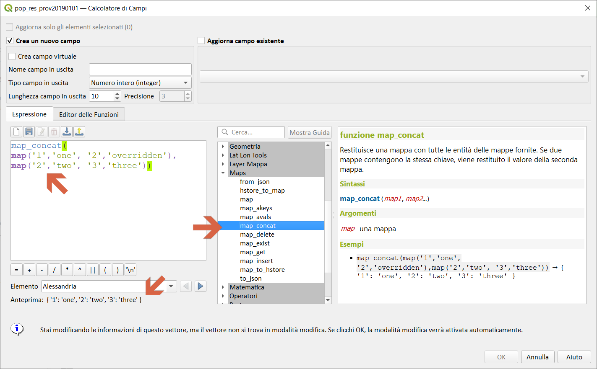
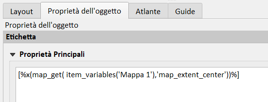

# Gruppo Maps

!!! Abstract
    **Questo gruppo contiene funzioni per la creazione e la manipolazione di strutture di dati 'a mappa' (noti anche come oggetti dizionario, coppie chiave-valore o array associative). Si possono assegnare valori a determinate chiavi. L'ordine delle coppie chiave-valore nell'oggetto mappa non è rilevante.**

---

## from_json

Carica una stringa formattata JSON

Sintassi:

from_json(_<span style="color:red;">string</span>_)

Argomenti:

* _<span style="color:red;">string</span>_ stringa json

Esempi:

```
from_json('{"qgis":"rocks"}') → { "qgis" : "rocks" }
from_json('[1,2,3]') → [1,2,3]
```


---

## hstore_to_map

Crea una mappa da una stringa formattata in hstore

Sintassi:

- hstore_to_map(_<span style="color:red;">string</span>_)

Argomenti:

* _<span style="color:red;">string</span>_ una stringa

Esempi:

```
hstore_to_map('qgis=>rocks') → { "qgis" : "rocks" }
```


---

## json_to_map

Crea una mappa da una stringa formattata con json

Sintassi:

- json_to_map(_<span style="color:red;">string</span>_)

Argomenti:

* _<span style="color:red;">string</span>_ una stringa json

Esempi:

```
json_to_map('{"qgis":"rocks"}') → { "qgis" : "rocks" }`
```


nota bene:

Funzione eliminata a partire da QGIS 3.18

<https://github.com/qgis/QGIS/pull/42179>

---

## map

Restituisce una mappa con tutte le chiavi ed i valori passati come coppie di parametri.

Sintassi:

map(_<span style="color:red;">key1</span>_, _<span style="color:red;">value1</span>_, _<span style="color:red;">key2</span>_, _<span style="color:red;">value2</span>_ , …_)

Argomenti:

* _<span style="color:red;">key</span>_ una chiave (stringa)
* _<span style="color:red;">value</span>_ un valore

Esempi:

```
map('1','one','2', 'two') → map: 1: 'one', 2: 'two'
```


--

Altri esempi:

Definisco una _map_ con:

* chiave **Area_Ha**  -- Area in Ettari
* valore **$area/10000**
* chiave **Perimetro_km**  -- Perimetro in km
* valore **$perimeter/1000**


---

## map_akeys

Restituisce tutte le chiavi di una mappa come un array.

Sintassi:

- map_akeys(_<span style="color:red;">map</span>_)

Argomenti:

* _<span style="color:red;">map</span>_ una mappa

Esempi:

```
map_akeys(map('1','one','2','two')) → array: '1', '2'
```


Altri esempi:


```
 map_akeys( 
 map('Area_Ha',$area/10000,'Perimetro_km',$perimeter/1000)) → ['Area_Ha','Perimetro_km']
```

### Compositore di stampe

`akeys` utilizzabile in ambito compositore stampe per conoscere tutte le variabili disponibili per ogni `Mappa` inserita:


```
wordwrap( array_to_string(  map_akeys(  item_variables( 'Mappa 1') ) ),1,',')
```

risultato della espressione:

```
_project_transform_context
item_id
item_uuid
layer_ids
layers
layout_dpi
layout_name
layout_numpages
layout_page
layout_pageheight
layout_pageoffsets
layout_pagewidth
logo_osgeo4w
map_crs
map_crs_acronym
map_crs_definition
map_crs_description
map_crs_ellipsoid
map_crs_proj4
map_crs_projection
map_crs_wkt
map_end_time
map_extent
map_extent_center
map_extent_height
map_extent_width
map_id
map_interval
map_layer_ids
map_layers
map_rotation
map_scale
map_start_time
map_units
project_abstract
project_area_units
project_author
project_basename
project_creation_date
project_crs
project_crs_acronym
project_crs_definition
project_crs_description
project_crs_ellipsoid
project_crs_proj4
project_crs_wkt
project_distance_units
project_ellipsoid
project_filename
project_folder
project_home
project_identifier
project_keywords
project_last_saved
project_path
project_title
project_units
qgis_locale
qgis_os_name
qgis_platform
qgis_release_name
qgis_short_version
qgis_version
qgis_version_no
user_account_name
user_full_name
```

---

## map_avals

Restituisce tutti valori di una mappa come un array.

Sintassi:

- map_avals(_<span style="color:red;">map</span>_)

Argomenti:

- _<span style="color:red;">map</span>_ una mappa

Esempi:

```
map_avals(map('1','one','2','two')) → array: 'one', 'two'
```


--


---

## map_concat

Restituisce una mappa con tutte le entità della mappe fornite. Se due mappe contengono la stessa chiave, viene restituito il valore della seconda mappa.

Sintassi:

map_concat(_map1, map2, …_)

Argomenti:

* _map_ una mappa

Esempi:

```
map_concat(map('1','one', '2','overridden'),map('2','two', '3','three')) → map: 1: 'one, 2: 'two', 3: 'three'
```



--


---

## map_delete

Restituisce una mappa con il valore della corrispondente chiave passata rimosso.

Sintassi:

map_delete(_<span style="color:red;">map</span>_, _<span style="color:red;">key</span>_)

Argomenti:

* _<span style="color:red;">map</span>_ una mappa
* _<span style="color:red;">key</span>_ la chiave da rimuovere

Esempi:

```
map_delete(map('1','one','2','two'),'2') → map: 1: 'one'
```


---

## map_exist

Restituisce vero se la chiave passata esiste in mappa.

Sintassi:

map_exist(_<span style="color:red;">map_<span style="color:red;">, _<span style="color:red;">key</span>_)

Argomenti:

* _<span style="color:red;">map</span>_ una mappa
* _<span style="color:red;">key</span>_ chiave da cercare

Esempi:

```
map_exist(map('1','one','2','two'),'3') → falso
```


---

## map_get

Restituisce il valore di una mappa, passando la sua chiave.

Sintassi:

map_get(_<span style="color:red;">map</span>_, _<span style="color:red;">key</span>_)

Argomenti:

* _<span style="color:red;">map</span>_ una mappa
* _<span style="color:red;">key</span>_ chiave da cercare

Esempi:
```
map_get(map('1','one','2','two'),'2') → 'two'
```


Altri esempi:


```
map_get(
map_concat(map('Area_Ha',$area/10000,'Perimetro_km',$perimeter/1000)),
map(Proprietario','Pippo','CF','FNDCCCDDDEEEFFF'),'CF') → 'FNDCCCDDDEEEFFF'
```

### Compositore di stampe


Nuova funzione `item_variables` presente, nel gruppo Layout, solo se utilizzate all'interno di un contesto di composizione.

La funzione accetta un singolo argomento, l'id per un elemento all'interno della composizione e restituisce una mappa del nome della variabile sul valore per quell'elemento. 
Questo ti permette di fare cose come inserire il testo in un'etichetta che recuperi le proprietà di un altro elemento nella composizione, ad es:

Inserisci la scala della mappa (`Mappa 1`) in un'etichetta:

```
map_get( item_variables('Mappa 1'),'map_scale')
```


Inserisci la coordinata x del centro della mappa (`Mappa 1`) in un'etichetta:

```
x(map_get( item_variables('Mappa 1'),'map_extent_center'))
```



[Changelog QGIS 3.0](https://plugins.qgis.org/plugins/mysqlimport/)

---

## map_insert

Restituisce una mappa con una chiave/valore aggiunto. Se la chiave esiste già, il suo valore verrà sovrascritto.

Sintassi:

- map_insert(_<span style="color:red;">map</span>_, _<span style="color:red;">key</span>_, _<span style="color:red;">value</span>_)

Argomenti:

* _<span style="color:red;">map</span>_ una mappa
* _<span style="color:red;">key</span>_ la chiave da aggiungere
* _<span style="color:red;">value</span>_ il valore da aggiungere

Esempi:

```
map_insert(map('1','one'),'3','three') → map: 1: 'one', 3: 'three'
```


---

## map_to_hstore

Unisci gli elementi della mappa in una stringa formattata in hstore.

Sintassi:

- map_to_hstore(_<span style="color:red;">map</span>_)

Argomenti:

* _<span style="color:red;">map</span>_ una mappa

Esempi:

```
map_to_hstore(map('qgis','rocks')) → "qgis"=>"rocks"}
```


---

## map_to_json

Unisci gli elementi della mappa in una stringa formattata con json.

Sintassi:

- map_to_json(_<span style="color:red;">map</span>_)

Argomenti:

* _<span style="color:red;">map</span>_ una mappa

Esempi:
```
map_to_json(map('qgis','rocks')) → {"qgis":"rocks"}
```


nota bene:

Funzione eliminata a partire da QGIS 3.18

<https://github.com/qgis/QGIS/pull/42179>

---

## to_json

Creare una stringa in formato JSON da una mappa, array o altro valore.

Sintassi:

- to_json(_<span style="color:red;">value</span>_)

Argomenti:

* _value_ valore di input

Esempi:

```
to_json(map('qgis','rocks')) → {"qgis":"rocks"}
to_json(array(1,2,3)) → [1,2,3]
```


